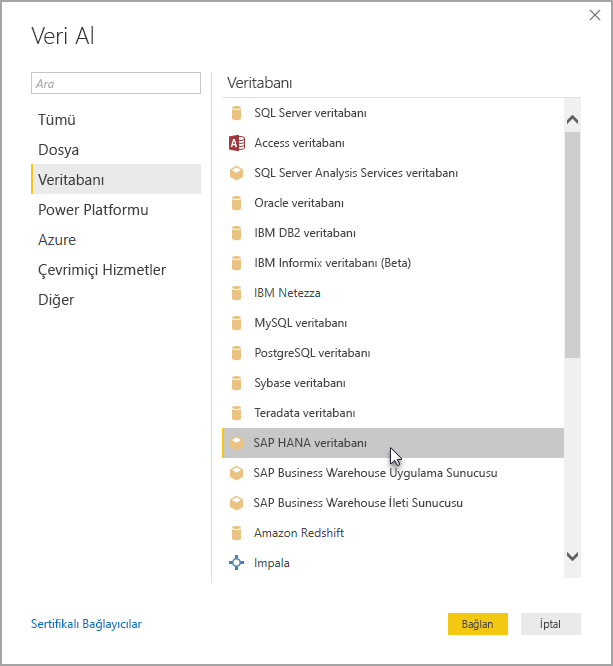

# Power BI Desktop'ta SAP HANA'yı kullanma
Power BI Desktop'ta artık **SAP HANA** veritabanlarına erişebilirsiniz. **SAP HANA**'yı kullanabilmek için Power BI Desktop **SAP HANA** veri bağlantısının düzgün çalışabilmesi amacıyla yerel istemci bilgisayara SAP HANA ODBC sürücüsünün yüklenmesi gerekir. SAP HANA ODBC sürücüsünü [SAP Software Download Center](https://support.sap.com/swdc) sayfasından indirebilirsiniz. Bu sayfada Windows bilgisayarlar için SAP HANA CLIENT uygulamasını arayın. **SAP Software Download Center** sayfasının yapısı sıklıkla değiştiğinden sitede gezinmeyle ilgili ayrıntılı bilgi veremiyoruz.

Bir **SAP HANA** veritabanına bağlanmak için aşağıdaki görüntüde gösterildiği gibi **Veri Al > Veritabanı > SAP HANA Veritabanı** yolunu izleyin:

SAP HANA veritabanına bağlanırken sunucu adını ve bağlantı noktasını *sunucu adı:bağlantı noktası* biçiminde belirtin. Aşağıdaki resimde *ServerXYZ* adlı ve *30015* numaralı bağlantı noktasını kullanan bir örnek gösterilmiştir.

Bu sürümde Power BI Desktop ve Power BI hizmetinde **SAP HANA**, [DirectQuery](desktop-directquery-sap-hana.md) modunda desteklenmektedir ve **SAP HANA** kullanan raporları DirectQuery modunda Power BI hizmetine yükleyip orada yayımlayabilirsiniz. Ayrıca, **SAP HANA**'yı DirectQuery modunda kullanmadığınızda da raporları Power BI hizmetine yükleyip orada yayımlayabilirsiniz.

## SAP HANA için desteklenen özellikler
Bu sürümde aşağıdaki listede görebileceğiniz gibi birçok **SAP HANA** özelliği desteklenmektedir:

* **SAP HANA** için Power BI bağlayıcısı, en iyi kullanıcı deneyimini sunmak için SAP ODBC sürücüsünü kullanır
* **SAP HANA**, hem DirectQuery hem de İçeri Aktarma seçeneklerini destekler
* Power BI, HANA bilgi modellerini (Analiz ve Hesaplama görünümleri gibi) destekler ve en iyi duruma getirilmiş gezinti özelliklerine sahiptir
* **SAP HANA** ile doğrudan SQL özelliğini kullanarak Satır ve Sütun Tablolarına bağlanabilirsiniz
* HANA Modelleri için En İyi Duruma Getirilmiş Gezinti özelliklerine sahiptir
* Power BI, **SAP HANA** Değişkenlerini ve giriş parametrelerini destekler

## SAP HANA ile ilgili sınırlamalar
**SAP HANA** ile ilgili sınırlamalar aşağıda gösterilmiştir:

* NVARCHAR dizeleri 4000 Unicode karakter olan maksimum uzunluğa göre kısaltılır
* SMALLDECIMAL desteklenmez
* VARBINARY desteklenmez
* Geçerli Tarihler 1899/12/30 ile 9999/12/31 arasıdır

## Sonraki adımlar
DirectQuery hakkında daha fazla bilgi için aşağıdaki kaynaklara bakın:

* [DirectQuery ve SAP HANA](desktop-directquery-sap-hana.md)
* [Power BI'da DirectQuery](desktop-directquery-about.md)
* [DirectQuery tarafından desteklenen Veri Kaynakları](desktop-directquery-data-sources.md)

