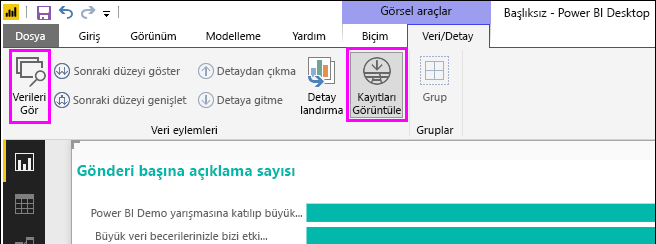
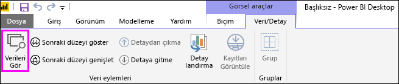
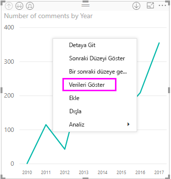
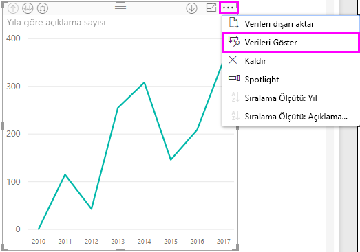
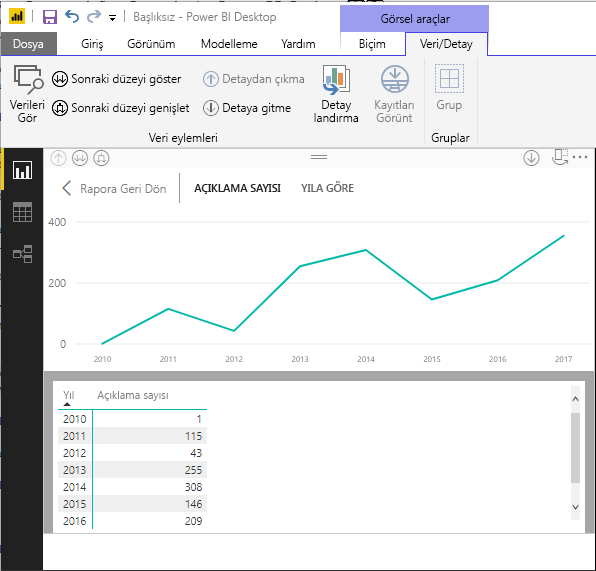
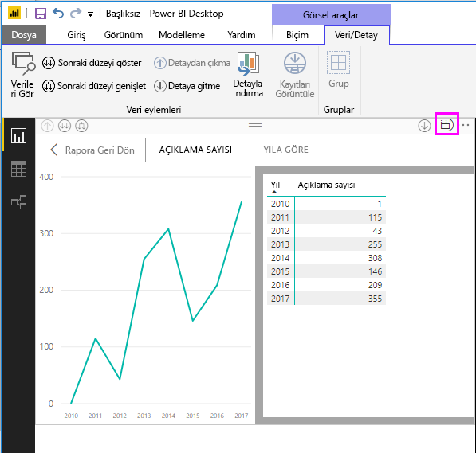
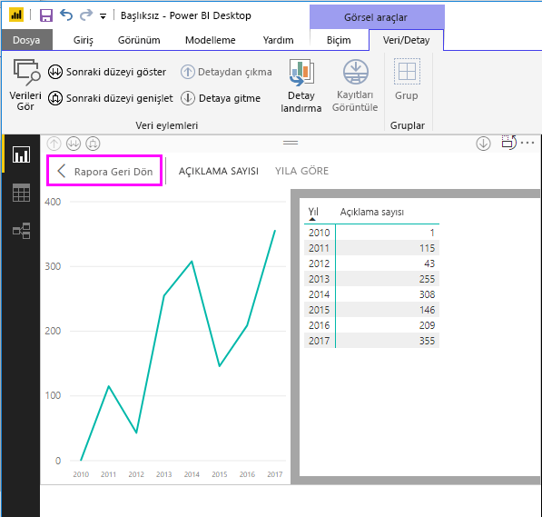
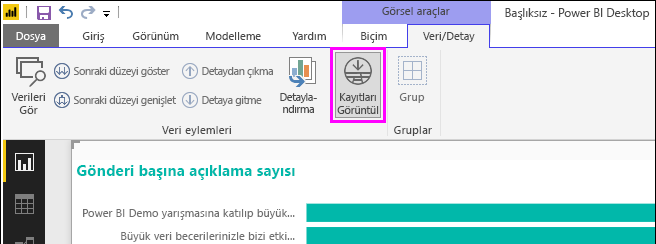
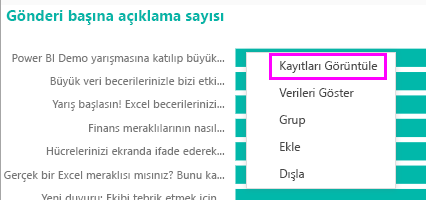
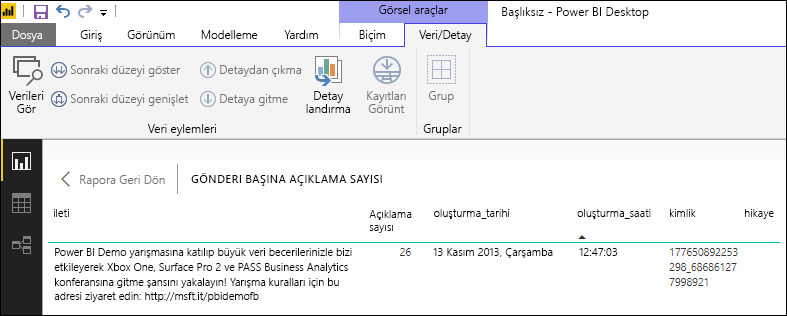

# Power BI Desktop görsellerinde Verileri Görüntüle ve Kayıtları Görüntüle özelliklerini kullanma
**Power BI Desktop**'ta bir görselleştirmenin detayına gidebilir ve seçilen görsel için temel alınan verilerin metinsel temsilini veya tek tek veri öğelerini görebilirsiniz. Bu özellikler bazen *geçişli tıklama*, *detaylandırma* veya *ayrıntıları görüntüleme* olarak adlandırılır.

Seçili görselleştirmeler tarafından kullanılan değerlerin metinsel bir sürümünü görüntülemek için **Verileri Görüntüle** ya da seçili bir kayıt veya veri noktasına ait tüm verileri görüntülemek için **Kayıtları Görüntüle** seçeneklerini kullanabilirsiniz. 

>[!IMPORTANT]
>**Verileri Görüntüle** ve **Kayıtları Görüntüle** seçenekleri yalnızca aşağıdaki görselleştirme türlerini destekler:
>  - Çubuk Grafik
>  - Sütun grafiği
>  - Halka grafik
>  - Kartogram
>  - Huni
>  - Harita
>  - Pasta grafiği
>  - Treemap

## Power BI Desktop'ta Verileri Görüntüle özelliğini kullanma

**Verileri Görüntüle**, bir görselleştirmede temel alınan verileri gösterir. **Verileri Görüntüle** seçeneği, bir görselleştirme seçildiğinde şeridin **Görsel Araçlar** bölümündeki **Veri/Detay** sekmesinde görünür.

Bir görselleştirmeye sağ tıkladıktan sonra görüntülenen menüden **Verileri Göster**’i seçerek veya bir görselleştirmenin sağ üst köşesindeki **Diğer seçenekler** üç noktasını (...) ve sonra **Verileri Göster**’i seçerek de verileri görebilirsiniz.

&nbsp;&nbsp;

> [!NOTE]
> Sağ tıklama menüsünün kullanılabilmesi için görseldeki bir veri noktasının üzerine gelmeniz gerekir.

**Verileri Görüntüle** veya **Verileri Göster**’i seçtiğinizde Power BI Desktop tuvalinde verilerin hem görsel hem de metinsel gösterimi görüntülenir. *Yatay görünümde* görsel öğe tuvalin üst yarısında, veriler ise tuvalin alt yarısında görüntülenir. 

Tuvalin sağ üst köşesindeki simgeyi seçerek yatay görünüm ile *dikey görünüm* arasında geçiş yapabilirsiniz.

Rapora geri dönmek için tuvalin sol üst köşesindeki **< Rapora Geri Dön** öğesini seçin.

## Power BI Desktop'ta Kayıtları Görüntüle özelliğini kullanma

Ayrıca bir görselleştirmedeki tek bir veri kaydına odaklanıp bu öğenin temel aldığı verilerin de detayına gidebilirsiniz. **Kayıtları Görüntüle** özelliğini kullanmak için bir görselleştirme seçin, ardından şeridin **Görsel Araçlar** bölümündeki **Veri/Detay** sekmesinde bulunan **Kayıtları Görüntüle**’yi seçin ve ardından görselleştirme üzerinde bir veri noktası ya da satır seçin. 

> [!NOTE]
> Şeritteki **Kayıtları Görüntüle** düğmesi devre dışı ve gri renkteyse, seçili görselleştirmenin **Kayıtları Görüntüle** özelliğini desteklemediği anlamına gelir.

Ayrıca bir veri öğesine sağ tıklayarak görüntülenen menüden **Kayıtları Görüntüle**’yi seçebilirsiniz.

Bir veri öğesi için **Kayıtları Görüntüle**’yi seçtiğinizde Power BI Desktop tuvali seçili öğeyle ilişkili tüm verileri gösterir. 

Rapora geri dönmek için tuvalin sol üst köşesindeki **< Rapora Geri Dön** öğesini seçin.

> [!NOTE]
>**Kayıtları Görüntüle** özelliği aşağıdaki sınırlamalara sahiptir:
> - **Kayıtları Görüntüle** görünümünde verileri değiştiremez ve rapora geri kaydedemezsiniz.
> - Görselinizde hesaplanmış ölçü kullanılıyorsa **Kayıtları Görüntüle** özelliğinden yararlanamazsınız.
> - Canlı bir çok boyutlu (MD) modele bağlıyken **Kayıtları Görüntüle** özelliğini kullanamazsınız.

## Sonraki adımlar
**Power BI Desktop**'ta çok çeşitli rapor biçimlendirme ve veri yönetim özellikleri bulunur. Bazı örnekler için aşağıdaki kaynaklara bakın:

* [Power BI Desktop'ta gruplandırmayı ve gruplamayı kullanma](desktop-grouping-and-binning.md)
* [Power BI Desktop raporlarında kılavuz çizgilerini, kılavuza yaslama işlevini, z düzenini, hizalamayı ve dağıtımı kullanma](desktop-gridlines-snap-to-grid.md)

