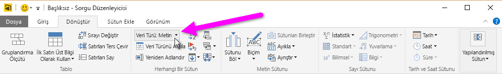
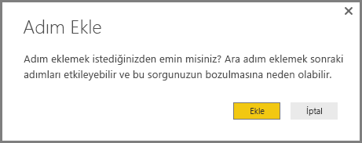
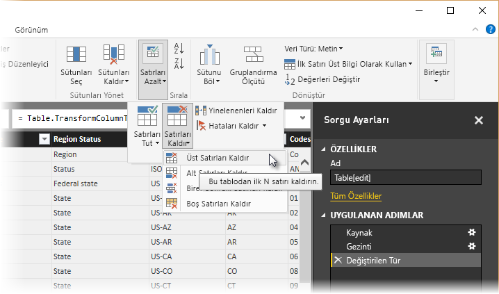
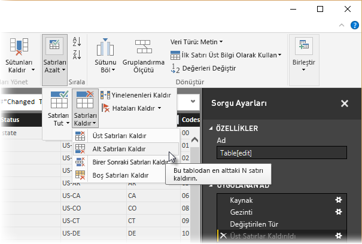
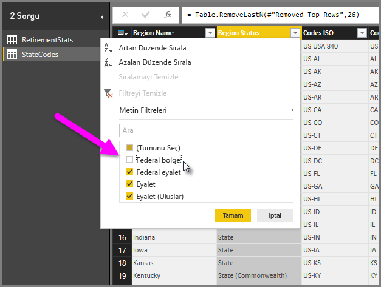
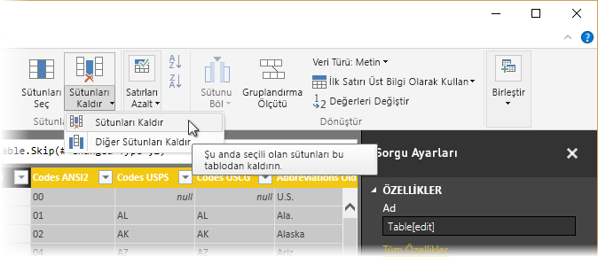
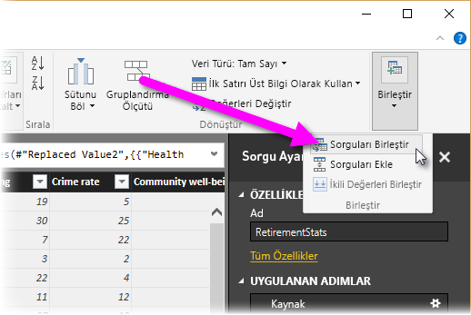
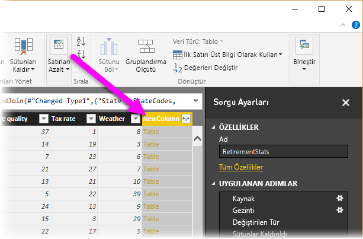
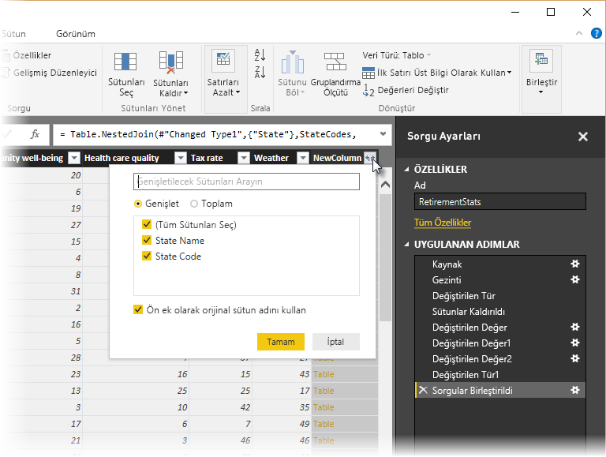
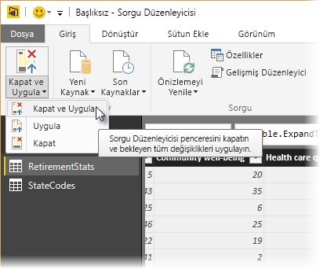

-- title: Power BI Desktop'ta verileri şekillendirme ve birleştirme description: Power BI Desktop'ta verileri şekillendirme ve birleştirme services: powerbi documentationcenter: '' author: davidiseminger manager: kfile backup: '' editor: '' tags: '' qualityfocus: no qualitydate: ''

ms.service: powerbi ms.devlang: NA ms.topic: article ms.tgt_pltfrm: NA ms.workload: powerbi ms.date: 01/30/2018 ms.author: davidi

---
# Power BI Desktop'ta verileri şekillendirme ve birleştirme
**Power BI Desktop** ile çok çeşitli veri kaynaklarına bağlanabilir ve ardından verileri ihtiyaçlarınızı karşılayacak şekilde şekillendirebilirsiniz. Verileri *şekillendirme* verileri dönüştürme anlamına gelir. Sütunları veya tabloları yeniden adlandırma, metinleri sayı olarak değiştirme, satırları kaldırma, ilk satırı başlık olarak ayarlama ve benzeri değişiklikler yapma bu işlemlere örnek olarak verilebilir. Verileri *birleştirme*, iki veya daha fazla veri kaynağını bağlama, gerektiği şekilde şekillendirme ve ardından bunları kullanışlı tek bir sorguda birleştirme anlamına gelir.

Bu belgede, Power BI Desktop'ı kullanarak bir sorgunun nasıl şekillendirileceği gösterilmiş ve sık kullanılan görevlerin bazılarının üzerinde durulmuştur. Burada kullanılan sorgu, sıfırdan nasıl oluşturulacağı da dahil olmak üzere [Power BI Desktop ile çalışmaya başlama](desktop-getting-started.md) başlıklı makalede daha ayrıntılı bir şekilde açıklanmıştır.

Power BI Desktop'taki **Sorgu Düzenleyicisi**'nde, şeridin yanı sıra, sağ tıklama menülerinin de bolca kullanıldığını bilmekte yarar vardır. **Dönüştürme** şeridinde seçebileceklerinizin çoğunu, bir öğeye (sütun gibi) sağ tıklayıp görüntülenen menüden seçim yaparak da kullanabilirsiniz.

## Verileri şekillendirme
Sorgu Düzenleyicisi'nde verileri şekillendirdiğinizde, Sorgu Düzenleyicisi'nin yüklediği ve sunduğu verilerin ayarlanması için adım adım yönergeler (Sorgu Düzenleyicisi'nin sizin için uyguladığı) sağlamış olursunuz. Özgün veri kaynağı etkilenmez. Yalnızca söz konusu belirli veri görünümü ayarlanır veya *şekillendirilir*.

Belirttiğiniz adımlar (bir tabloyu yeniden adlandırma, bir veri türünü dönüştürme veya sütunları silme gibi) Sorgu Düzenleyicisi tarafından kaydedilir ve bu sorgu veri kaynağına her bağlandığında söz konusu adımlar uygulanır. Böylece veriler her zaman sizin belirttiğiniz biçimde şekillendirilir. Bu işlem, Sorgu Düzenleyicisi özelliğini Power BI Desktop'ta her kullanışınızda veya **Power BI** hizmetinde olduğu gibi, paylaşılan sorgunuzu kullanan herkes için gerçekleştirilir. Bu adımlar, **Uygulanan Adımlar** bölmesinin altındaki **Sorgu Ayarları**'nda sırasıyla kaydedilir.

Aşağıdaki görüntüde, şekillendirilmiş bir sorguya ilişkin **Sorgu Ayarları** bölmesi gösterilmiştir. Sonraki birkaç paragrafta bu adımların her birini inceleyeceğiz.

[Power BI Desktop ile çalışmaya başlama](https://powerbi.uservoice.com/knowledgebase/articles/471664) başlıklı makalede bir Web veri kaynağına bağlanarak edindiğimiz emeklilik verilerini kullanarak, bu verileri ihtiyaçlarımız doğrultusunda şekillendirelim.

Yeni başlayanlar için hatırlatmak gerekirse, Sorgu Düzenleyicisi tabloyu yüklediğinde sütunlardan birindeki puanlar otomatik olarak metinden sayılara dönüştürülmemişti. Bizim ise sayılara ihtiyacımız var. Sorun değil. Bunları değiştirmek için sütun başlığına sağ tıklayıp **Türü Değiştir \> Tam Sayı**'yı seçmeniz yeterlidir. Birden fazla sütun seçmek için, öncelikle bir sütun seçip **SHIFT** tuşunu basılı tutarak bitişik daha fazla sütun belirleyin ve ardından bir sütun başlığına sağ tıklayarak seçili tüm sütunları değiştirin. Bitişik olmayan sütunları seçmek için **CTRL** tuşunu da kullanabilirsiniz.

**Dönüştür** şeridini kullanarak bu sütunları metin yerine başlık olacak şekilde de *dönüştürebilirsiniz*. Burada **Dönüştür** şeridi, geçerli veri türünü bir başka veri türüne dönüştürmenizi sağlayan **Veri Türü** düğmesine işaret eden bir ok ile gösterilmiştir.

**Sorgu Ayarları**'ndaki **Uygulanan Adımlar**'ın, verilere uygulanan tüm şekillendirme adımlarını gösterdiğine dikkat edin. Herhangi bir adımı şekillendirme işleminden kaldırmak istersem bunu adımın solundaki **X**'i seçerek kolayca gerçekleştirebilirim. Aşağıdaki görüntüde, **Uygulanan Adımlar** o ana kadar uygulanmış adımları göstermektedir: web sitesine bağlanma (**Kaynak**) ve tabloyu seçme (**Gezinme**). Ayrıca Sorgu Düzenleyicisi, tabloyu yüklerken metin tabanlı sayı sütunlarının *Metin* olan veri türünü *Tam Sayı* olarak değiştirmiştir (**Değiştirilen Tür**). Derecelendirmeden oluşan bir sütunun veri türü otomatik olarak sayı tabanlı bir türle değiştirilmedi. Bunun nedenini sonraki birkaç paragrafta öğreneceğiz.

Bu sorguyla çalışabilmek için, ilgili verileri istediğimiz hale getirmek üzere birkaç değişiklik yapmamız gerekiyor:

* *Birinci sütunu kaldırma*: "Check out how your state ranks for retirement" ifadesinin (veri kaynağının Web tabanlı bir tablo olmasından kaynaklanan bir yapıt) bulunduğu gereksiz satırlar içerdiğinden bu sütuna ihtiyacımız yoktur
* *Birkaç hatayı düzeltme*: Sütunlardan birinde (**Health care quality**) yer alan eyalet derecelendirmelerinde, web sitesinde sayıların yanına eklenen *(tie)* metniyle belirtilen birkaç eşitlik bulunuyor. Bu, web sitesi için uygun olsa da sütunun metin olan türünü elle veri olarak dönüştürmemizi gerekli hale getiriyor. Power BI Desktop'ı kullanarak bu sorunu kolayca giderebilirsiniz ve böylece Sorgu Düzenleyicisi'ndeki **Uygulanan Adımlar**'ın etkili bir özelliğiyle tanışmış olursunuz
* *Tablo adını değiştirme*: **Tablo 0** kullanışlı bir tanımlayıcı olmasa da bunu değiştirmek kolaydır

İlk sütunu kaldırmak için, söz konusu sütunu ve şeritteki **Giriş** sekmesini seçip aşağıdaki şekilde gösterildiği gibi **Sütunları Kaldır** seçeneğini belirlemeniz yeterlidir.

Şimdi de metin sütununu ele alıp bu sütunu sayılara dönüştürmemiz gerekiyor. **Health care quality** sütununun metin olan veri türünü sayı olarak ( *Tam Sayı* veya *Ondalık Sayı* gibi) değiştirebileceğimiz düşünüldüğünde, bu işlemi gerçekleştirmek ilk bakışta kolay gibi gelebilir. Ancak **Metin** olan veri türünü **Tam Sayı** olarak değiştirdikten sonra söz konusu sütundaki değerleri incelediğimizde, Sorgu Düzenleyicisi'nin birkaç hata bildirdiğini görüyoruz.

Her bir hata ile ilgili daha fazla bilgi edinmek için birkaç farklı yol izlenebilir. Hücreyi seçebilir (**Hata** sözcüğüne tıklamadan) veya doğrudan **Hata** sözcüğüne tıklayabilirsiniz. Doğrudan **Hata** sözcüğüne *tıklamadan* hücreyi seçerseniz Sorgu Düzenleyicisi, hata bilgilerini pencerenin alt kısmında görüntüler.

Doğrudan *Hata* sözcüğüne tıklarsanız Sorgu Düzenleyicisi, **Sorgu Ayarları** bölmesinde bir **Uygulanan Adım** oluşturur ve hata hakkındaki bilgileri görüntüler.

Sorgu Düzenleyicisi'ne geri dönmek için, ilgili adımı, yanındaki **X** işaretini seçerek kaldırmanız gerekir.

En son **Uygulanan Adım**'ı seçtiğimizde, aşağıdaki görüntüde gösterildiği gibi, açıklanmış olan hatayı görürüz.

Adımlar Sorgu Düzenleyicisi tarafından sırasıyla kaydedildiğinden, **Uygulanan Adımlar** bölümünde bulunan, türü değiştirme adımından önceki adımı seçebilir ve aşağıdaki görüntüde gösterildiği gibi, söz konusu hücrenin dönüştürmeden önceki değerini görebiliriz.

Artık bu değerleri düzeltebilir ve *ardından* türü değiştirebiliriz. Adımlar Sorgu Düzenleyicisi tarafından sırasıyla, ancak birbirinden bağımsız olarak kaydedildiğinden her bir **Uygulanan Adım**'ı sıranın yukarısına veya aşağısına taşıyabilirsiniz. Sorgu Düzenleyicisi'nin şu seçenekleri belirlemenize olanak sağlayan menüyü sunması için herhangi bir adıma sağ tıklamanız yeterlidir: **Yeniden Adlandır**, **Sil**, **Sona** **Kadar Sil** (geçerli adımla birlikte sonraki tüm adımları kaldırma), **Yukarı Taşı** veya **Aşağı Taşı**.

Ek olarak, listenin herhangi bir yerinde bulunan bir **Uygulanan Adım**'ı seçebilir ve verileri, sıradaki ilgili noktada şekillendirmeye devam edebilirsiniz. Sorgu Düzenleyicisi, yeni adımları otomatik olarak, seçili olan **Uygulanan Adım**'ın arkasına yerleştirir. Denemeye ne dersiniz?

İlk olarak, **Health care quality** sütununun türünü değiştirme adımından önce **Uygulanan Adım**'ı seçelim. Ardından, hücrede yanında "(tie)"metni bulunan değerleri yalnızca sayı kalacak şekilde değiştirelim. "35 (tie)" değerini içeren hücreye sağ tıklayın ve görünen menüden *Değerleri Değiştir...* seçeneğini belirleyelim. Geçerli olarak hangi **Uygulanan Adım**'ın (türü değiştirmeden önceki adım) seçili olduğuna dikkat edin.

Bir adım eklemeye çalıştığımız için Sorgu Düzenleyicisi bizi bu işlemin taşıdığı risk konusunda uyarır: Birbirini izleyen adımlar sorgunun bozulmasına neden olabilir. Bu işlemi gerçekleştirirken dikkatli ve mantıklı hareket etmemiz gerekir. Bunun bir eğitim olduğunu ve adımları nasıl oluşturacağınızı, sileceğinizi, ekleyeceğinizi ve yeniden sıralayacağınızı göstermek için Sorgu Düzenleyicisi'nin oldukça etkili bir özelliğinin üzerinde durduğumuzu düşündüğümüzde, devam edip **Ekle**'yi seçmememiz için önümüzde hiçbir engel yok.

Mevcut üç eşitlikten her birinin değerlerini değiştirelim. Yeni bir Uygulanan Adım oluşturduğunuzda, Sorgu Düzenleyicisi bu adımı, gerçekleştirilen eyleme göre (bu örnekte, **Değiştirilen Değer**) adlandırır. Sorgunuzda aynı adlı birden fazla adım olduğunda, Sorgu Düzenleyicisi bunları ayırt etmek için, birbirini izleyen her bir **Uygulanan Adım**'a bir sayı (sırasıyla) ekler.

Aşağıdaki ekranda, **Sorgu Ayarları**'ndaki **Değiştirilen Değer** adımlarının yanı sıra çok daha ilgi çekici bir şey daha gösterilmektedir: **Health care quality** sütunundaki tüm "(tie)" oluşumlarını sildiğimiz için **Değiştirilen Tür** adımı artık *hatasız bir şekilde* tamamlanmıştır.

> [!NOTE]
> Ayrıca hata içeren tüm satırların kaldırılmasını sağlayan **Hataları Kaldır** seçeneğini de belirleyebilirsiniz (şeridi veya sağ tıklama menüsünü kullanarak). Bu örnekte söz konusu seçeneği belirlemiş olsaydık verilerimizdeki "*(tie)*" içeren tüm eyaletler kaldırılırdı. Tüm eyaletler hakkında bilgi edinmek ve bunları tablomuzda tutmak istediğimizden bunu gerçekleştirmek istemedik.

Yukarıdakilerin biraz karmaşık olduğunu kabul etmek gerekse de Sorgu Düzenleyicisi'nin ne kadar etkili ve çok yönlü olduğuna yönelik iyi bir örnek olduğunu görmezden gelemeyiz.

Son olarak, söz konusu tablonun adını daha açıklayıcı bir adla değiştirmek istiyoruz. Rapor oluştururken, özellikle de birden çok veri kaynağına bağlandığımızda, açıklayıcı tablo adları kullanmakta yarar vardır. Bu tablo adları **Rapor** görünümünün **Alanlar** bölmesinde yer alır.

Tablo adı kolayca değiştirilebilir: **Sorgu Ayarları** bölmesindeki **Özellikler** bölümünü altında, tablonun yeni adını aşağıdaki görüntüde gösterildiği gibi yazmak ve **Enter** tuşuna basmak yeterlidir. Bu tabloya *RetirementStats* adını verelim.

Verileri gerektiği ölçüde şekillendirdik. Şimdi de başka bir veri kaynağına bağlanalım ve verileri birleştirelim.

## Verileri birleştirme
Eyaletlerin çeşitli durumları hakkındaki bu veriler ilgi çekici; ek çözümleme çalışmaları ve sorgular oluşturmak için faydalı olacaktır. Ancak, bu noktada bir sorun var: Gösterilen verilerin çoğunda eyalet kodları için eyaletin tam adı yerine iki harfli kısaltmalar kullanılmıştır. Eyalet adlarını kısaltmalarıyla ilişkilendirmek için bir yönteme ihtiyacımız var.

Şanslı günümüzdeyiz! Tam da bunu yapan başka bir genel veri kaynağı var, ancak emeklilik tablomuza bağlamadan önce bazı şekillendirme işlemleri yapmamız gerekiyor. Aşağıda eyalet kısaltmalarına yönelik web kaynağına ulaşabilirsiniz:

<http://en.wikipedia.org/wiki/List_of_U.S._state_abbreviations>

Sorgu Düzenleyicisi'ndeki **Giriş** şeridinde, **Yeni Kaynak \> Web** seçeneğini belirledikten sonra adresi girip Tamam'ı seçtiğimizde Gezgin, bu Web sayfasında neler bulduğunu gösterir.

 

İstediğimiz verileri içerdiğinden **Table[edit]** tablosunu seçiyoruz ancak söz konusu tablonun verilerini istediğimiz ölçüde küçültmek için biraz şekillendirme yapmamız gerekir.

> [!TIP]
> Aşağıdaki adımları daha hızlı veya kolay bir şekilde gerçekleştirmenin bir yolu var mı? Evet, iki tablo arasında *ilişki* oluşturabilir ve verileri bu ilişkiye göre şekillendirebiliriz. Aşağıdaki adımlar tablolarla çalışma konusunda öğrenilmesi gereken adımlardır ancak ilişkilerin birden fazla tablodaki verileri hızlı bir şekilde kullanmanıza yardımcı olduğunu bilmenizde yarar vardır.
> 
> 

Bu verileri şekillendirmek için aşağıdaki adımları uygularız:

* Üstteki iki satırı kaldırma: Web sayfasındaki tablonun oluşturulma şeklinden kaynaklanan bu satırlara ihtiyacımız yoktur. **Giriş** şeridinde, **Satırları Azalt \> Satırları Kaldır \> Üst Satırları Kaldır** seçeneğini belirleyin.

Kaldırmak istediğiniz sütun sayısını belirtmenizi sağlayan **Üst Satırları Kaldır** penceresi görünür.

* Alttaki 26 satırı kaldırma: Bölgeleri belirten bu satırlara ihtiyacımız yoktur. **Giriş** şeridinde, **Satırları Azalt \> Satırları Kaldır \> Alt Satırları Kaldır** seçeneğini belirleyin.

* RetirementStats tablosunda Washington DC için bilgi bulunmadığından bunu listemizde filtrelememiz gerekir. Region Status sütununun yanındaki açılan menü okunu seçin ve ardından **Federal district** seçeneğinin yanındaki onay kutusunu temizleyin.

* Birkaç gereksiz sütunu kaldırma: Yalnızca eyaletleri iki harfli resmi kısaltmalarıyla eşlememiz gerekiyor, bu nedenle şu sütunları kaldırabiliriz: **Sütun2** ve **Sütun3** sütunlarının yanı sıra **Sütun5** ila **Sütun10** arasındaki satırlar. İlk olarak Sütun2'yi seçin ve ardından **CTRL** tuşunu basılı tutarak (bitişik olmayan birden çok sütunu seçmenizi sağlar), kaldırılacak diğer sütunları seçin. Şeritteki Giriş sekmesinde, **Sütunları Kaldır \> Sütunları Kaldır** seçeneğini belirleyin.

* Birinci satırı başlık olarak kullanma: İlk üç satırı kaldırdığımızdan, istediğimiz başlık geçerli olan en üst satırdır. Şeritte bulunan **Giriş** veya **Dönüştür** sekmesinden **İlk Satırı Üst Bilgi Olarak Kullan** seçeneğini belirleyebilirsiniz.

>[!NOTE]
>Sorgu Düzenleyicisi'nde uygulanan adımların *sırasının* önemli olduğuna ve verilerin nasıl şekilleneceğini etkileyebildiğine değinmenin zamanı geldi. Bir adımın sonraki bir adımı nasıl etkileyebileceği üzerinde düşünmekte de yarar vardır. Uygulanan Adımlar'daki bir adımı kaldırmanız durumunda, sorgunun adım sıralamasına etkisi nedeniyle sonraki adımlar başta planlandığı gibi davranış göstermeyebilir.

>[!NOTE]
>Sorgu Düzenleyicisi penceresini genişlik azalacak şekilde yeniden boyutlandırdığınızda, bazı şerit öğeleri, görünür alandan en iyi şekilde yararlanılmasını sağlayacak şekilde daraltılır. Sorgu Düzenleyicisi penceresinin genişliğini artırdığınızda ise şerit öğeleri, artırılmış şerit alanından en iyi şekilde yararlanılması için genişletilir.

* Sütunları ve tabloyu daha önce de yaptığımız gibi yeniden adlandırın. Bir sütunu birkaç şekilde yeniden adlandırabilirsiniz: İlk olarak sütunu seçin ve ardından şeritteki **Dönüştür** sekmesinde bulunan **Yeniden Adlandır**'ı seçin veya sütuna sağ tıklayıp **Yeniden Adlandır…** seçeneğini (görünen menüden) belirleyin. Söz konusu iki seçenek aşağıdaki görüntüde oklarla gösterilmiştir; bunlardan birini seçmeniz yeterlidir.

Sütunları *State Name* ve *State Code* olarak yeniden adlandıralım. Tabloyu yeniden adlandırmak için, adı **Sorgu Ayarları** bölmesindeki **Ad** kutusuna yazmanız yeterlidir. Bu tabloya *StateCodes* adını verelim.

StateCodes tablosunu istediğimiz biçimde şekillendirdiğimize göre, bu iki tabloyu veya sorguyu bir tane olacak şekilde birleştirebiliriz. Şu anda sahip olduğumuz tablolar verilere uyguladığımız sorgular sonucunda elde edildiğinden, bunlar genellikle *sorgu* olarak adlandırılır.

Sorguları birleştirmek için izlenebilecek, *birleştirme* ve *ekleme* olmak üzere iki temel yol bulunur.

Bir veya daha fazla sütunu başka bir sorguya eklemek istediğinizde sorguları **birleştirirsiniz**. Var olan bir sorguya eklemek istediğiniz ek veri satırları olduğunda sorguyu **eklersiniz**.

Bu örnekte sorguları birleştirmek istiyoruz. Başlamak için, Sorgu Düzenleyicisi'nin sol bölmesinde, diğer sorguyu *hangi* sorguyla birleştirmek istediğimizi (bu örnekte *RetirementStats*) seçeriz. Ardından, şeritte **Giriş** sekmesinde bulunan **Birleştir \> Sorguları Birleştir** seçeneğini belirleriz.

Verilerin, aktarılmasını istemediğiniz veriler dahil edilmeden veya aktarılmadan birleştirildiğinden emin olmak için gizlilik düzeyleri belirlemeniz istenebilir.

Seçilen tablo ile hangi tabloyu birleştirmek istediğimizi belirleyeceğimiz ve ardından birleştirme için kullanılacak eşleşen sütunları seçeceğimiz **Birleştir** penceresi görüntülenir. *RetirementStats* tablosunda (sorgu) State seçeneğini belirleyin ve ardından *StateCodes* sorgusunu seçin. (Yalnızca iki sorgu bulunduğundan bu örnekte seçim yapmak kolaydır. Birçok veri kaynağına bağlandığınızda arasından seçim yapmanız gereken birçok sorguyla karşılaşırsınız.) Eşleşen doğru sütunları seçtiğimizde (*RetirementStats* tablosundaki **State** sütunu ve *StateCodes* tablosundaki **State Name** sütunu), **Birleştir** penceresi aşağıdaki gibi görünür ve **Tamam** düğmesi etkin hale gelir.

Sorgunun sonunda, var olan sorguyla birleştirilen tablonun (sorgunun) içeriği olan **NewColumn** oluşturulur. Birleştirilen sorgunun tüm sütunları **NewColumn**'da yer alacak şekilde daraltılır, ancak **Genişlet** seçeneğini belirleyerek tabloyu genişletebilir ve istediğiniz sütunları dahil edebilirsiniz.

Birleştirilen tabloyu Genişletmek ve hangi sütunların ekleneceğini belirlemek için genişlet simgesini () seçin. **Genişlet** penceresi görünür.

Bu örnekte yalnızca **State Code** sütununu istediğimizden, yalnızca bu sütunu seçer ve ardından **Tamam** seçeneğini belirleriz. Ön ek olarak orijinal sütun adını kullan ayarına ihtiyacımız olmadığından veya bunu istemediğimizden ilgili onay kutusunu temizleriz. Bu onay kutusunu seçili bırakırsak, birleştirilen sütun **NewColumn.State Code** (sırasıyla orijinal sütun adı veya **NewColumn**, bir nokta ve sorguya aktarılan sütunun adı) şeklinde adlandırılır.

>[!NOTE]
>Söz konusu **NewColumn** tablosunu elde etme konusunda birkaç deneme yapmak ister misiniz? Biraz deneme yapabilirsiniz ve sonuçları beğenmezseniz **Sorgu Düzenleyicisi** bölmesindeki **Uygulanan Adımlar**'dan bu adımı silmeniz yeterlidir. Sorgunuz, bu **Genişlet** adımı uygulanmadan önceki haline geri döner. Bu işlem, genişletme işlemi istediğiniz gibi görünene dek dilediğiniz kadar tekrarlayabileceğiniz bir serbest tekrarlama gibidir.

Her biri ihtiyaçlarımıza göre şekillendirilmiş iki veri kaynağının birleştirildiği tek bir sorgu (tablo) elde etmiş olduk. Bu sorgu, herhangi bir eyaletteki konut maliyeti istatistikleri, demografik bilgiler veya iş fırsatları gibi ilgi çekici diğer birçok veri bağlantısı için temel oluşturabilir.

Değişiklikleri uygulamak ve Sorgu Düzenleyicisi'ni kapatmak için, şeritteki **Giriş** sekmesinde Kapat & Uygula seçeneğini belirleyin. Dönüştürülmüş veri kümesi, rapor oluşturmak için kullanılmaya hazır bir şekilde Power BI Desktop'ta görüntülenir.

## Sonraki adımlar
Power BI Desktop ile yapabileceğiniz çok şey var. Özellikler hakkında daha fazla bilgi edinmek için aşağıdaki kaynaklara bakın:

* [Power BI Desktop ile Çalışmaya Başlama](desktop-getting-started.md)
* [Power BI Desktop ile Sorgulara Genel Bakış](desktop-query-overview.md)
* [Power BI Desktop'ta Veri Kaynakları](desktop-data-sources.md)
* [Power BI Desktop'taki Verilere Bağlanma](desktop-connect-to-data.md)
* [Power BI Desktop'taki Genel Sorgu Görevleri](desktop-common-query-tasks.md)   

