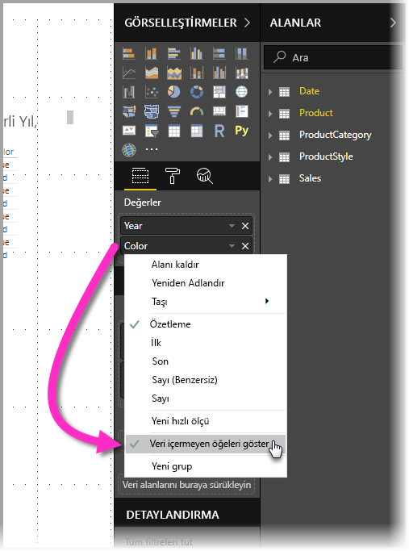
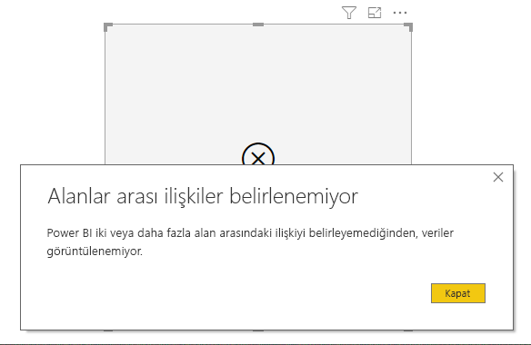

# Power BI'da öğeleri veri olmadan gösterme

Power BI, çeşitli kaynaklardan gelen her türlü veriyi görselleştirmenize olanak tanır. Görsel oluştururken, Power BI verilerin nasıl sunulacağını ve görüntüleneceğini düzgün yönetebilmek için yalnızca uygun verileri gösterir. Power BI, görselin yapılandırmasına ve temel veri modeline dayanarak hangi verilerin uygun olduğunu saptar. Bu makalede, Power BI'ın uygun verileri saptarken nasıl davrandığı açıklanır ve saptamaların nasıl yapıldığını gösteren örnekler verilir.

## İlgili verileri saptama

Power BI'ın uygun verileri nasıl saptadığını anlamaya başlamak için, basit bir örnek olarak bir tabloyu ele alalım. Bu makalenin sonundaki örnekler bölümünde tanıtılan modeli kullanarak, aşağıdaki ayarlarla bir tablo oluşturulduğunu düşünelim:

**1. Aynı tablodan gruplar:** *Product[Color] - Product[Size]*

|*Product[Color]*  |*Product[Size]*  |
|---------|---------|
|Mavi     |Büyük         |
|Mavi     |Orta         |
|Mavi     |Küçük         |
|Red     |Büyük         |

Bu örnekte Power BI, *[Product]* tablosunda yer alan *[Color-Size]* bileşimlerini görüntüler. 

Şimdi farklı bir bileşime göz atalım:

**2. Farklı ama birbiriyle doğrudan ilişkili tablolardan gruplar ve bir ölçü:** *ProductStyle[Finish] - Product[Color] - Sum(Sales[Quantity])*

|*ProductStyle[Finish]*  |*Product[Color]*  |*[SumQuantity]*  |
|---------|---------|---------|
|Parlak     |Mavi         |10         |
|Mat     |Mavi         |15         |

Bu örnekte Power BI, yalnızca var olan bileşimleri görüntüler. Örneğin, ("Yok" + "Mavi") veya ("Mat" + "Kırmızı") bileşimlerini görüntülemez çünkü bunlar modelde yoktur. Hangi bileşimlerin var olduğu belirleyen koşul, *Sum(Sales[Quantity])* değerinin boş olmamasıdır.

Şimdi farklı bir duruma bakalım: 

**3. Farklı ama birbiriyle ilişkili tablolardan gruplar ve ölçü yok:** *ProductStyle[Finish] - Product[Color]*

|*ProductStyle[Finish]*  |*Product[Color]*  |
|---------|---------|
|Parlak     |Mavi         |
|Parlak     |Red         |
|Mat     |Mavi         |

Açık bir ölçü olmadığı ve iki tablo birbiriyle doğrudan ilişkili olduğu için, Power BI sonuçta elde edilecek bileşimleri sınırlamak üzere bir ölçü ekleme girişiminde bulunur. Bu durumda Power BI *CALCULATE(COUNTROWS('Product'))* ölçüsünü ekler. *Product* her iki tabloda da ortak olan tablo olduğundan, bu ölçü boş olmaz.

Böylelikle Power BI Product tablosunda girdileri olan bileşimleri görüntüler ve bu durumda *("Yok" + "Mavi")* ve *("Mat" + "Kırmızı")* bileşimleri dışlanır.

**4. Farklı ve birbiriyle ilişkisiz tablolardaki gruplar**

Örnek modelde bu bileşim yoktur, ancak farklı ve birbiriyle ilişkisiz tablolardan gruplar olsaydı Power BI iki sütunu ilişkilendiremeyecek ve sonuç her sütundaki tüm değerlerin çapraz birleşimi olacaktı. Böyle bir durumda veritabanında bu tür çapraz birleşimlerin hesaplanması pahalıya geleceğinden ve kullanıcıya pek fazla bilgi sağlanmayacağından Power BI *sınırlanmamış birleşim* türünde bir hata verir. 

## Öğeleri veri olmadan gösterme

Önceki bölümde Power BI'ın görüntülemeye uygun verileri nasıl saptadığı açıklandı. Ancak bazı durumlarda öğeleri veri olmadan göstermek *isteyebilirsiniz*. 

**Öğeleri veri olmadan göster** özelliği tam olarak bunu yapmanızı, yani ölçü verileri içermeyen (boş ölçü değerleri) veri satırlarını ve sütunlarını eklemenizi sağlar.

**Öğeleri veri olmadan göster** özelliğini etkinleştirmek için bir görsel seçin, sonra da **Alanlar**'da alana sağ tıklayın ve aşağıdaki görüntüde gösterildiği gibi, açılan menüde **Öğeleri veri olmadan göster**'i seçin.

Aşağıdaki durumlarda **Öğeleri veri olmadan göster** özelliğinin *hiçbir* etkisi olmaz:

* Görsele hiç ölçü eklenmemiştir ve gruplandırma sütunları aynı tablodan gelir
* Gruplar birbiriyle ilgisizdir; Power BI ilgisiz grupları olan görseller için sorgu çalıştırmaz
* Ölçü grupların hiçbiriyle ilgili değildir; bunun nedeni ölçünün hiçbir zaman yalnızca bazı grup bileşimlerinde boş kalmayacak olmasıdır
* Boş ölçüleri dışlayan kullanıcı tanımlı bir ölçü filtresi vardır. Örneğin: *SalesAmount > 0*

### Öğeleri veri olmadan göster özelliği nasıl çalışır?

**Öğeleri veri olmadan göster** özelliğinin en ilginç kullanım örnekleri, ölçülerin var olduğu durumlardır. Şimdi grupların aynı tablodan geldiği veya modelde bir yolla ilişkili hale getirilebileceği duruma bir bakalım. Örneğin *ProductStyle*, *Product* ile doğrudan ilişkilidir ve *Sales* ile dolaylı olarak ilişkilidir. *ProductStyle* ile *ProductCategory*, *Product* tablosu aracılığıyla ilişkili hale getirilebilir.

Şimdi bazı ilginç örneklere bakalım ve **Öğeleri veri olmadan göster** özelliğinin açık olduğu durumlarla kapalı olduğu durumları karşılaştıralım. 

**1. Aynı tablodan sütunları gruplandırma:** *Product[Color] - Product[Size] - Sum(Sales[Quantity])*

**Öğeleri veri olmadan göster** özelliği kapalı olduğunda şöyle görünür:

|*Product[Color]*  |*Product[Size]*  |*[SumQuantity]*  |
|---------|---------|---------|
|Mavi     |Orta         |15         |
|Mavi     |Küçük         |10         |

**Öğeleri veri olmadan göster** özelliği açık olduğunda şöyle görünür:

|*Product[Color]*  |*Product[Size]*  |*[SumQuantity]*  |
|---------|---------|---------|
|Mavi     |Büyük         |         |
|Mavi     |Orta         |15         |
|Mavi     |Küçük         |10         |
|Red     |Büyük         |         |

Özellik açıldığında iki yeni bileşimin nasıl gösterildiğine dikkat edin: *Mavi - Büyük* ve *Kırmızı - Büyük*. *Sales* tablosunda bu girdilerden hiçbirinin kendisine karşılık gelen *Quantity* değeri yoktur. Bununla birlikte *Product* tablosunda gösterilirler.

**2. İlişkili tablolardan sütunları gruplandırma:** *ProductStyle[Finish] - Product[Color] - Sum(Sales[Quantity])*

**Öğeleri veri olmadan göster** özelliği kapalı olduğunda şöyle görünür:

|*ProductStyle[Finish]*  |*Product[Color]*  |*[SumQuantity]*  |
|---------|---------|---------|
|Parlak     |Mavi         |10         |
|Mat     |Mavi         |15         |

**Öğeleri veri olmadan göster** özelliği açık olduğunda şöyle görünür:

|*ProductStyle[Finish]*  |*Product[Color]*  |*[SumQuantity]*  |
|---------|---------|---------|
|Parlak     |Mavi         |10         |
|Parlak     |Red         |         |
|Mat     |Mavi         |15         |
|Yok     |         |         |

*(Parlak-Kırmızı)* ile *(Yok,boş)* öğelerinin nasıl bileşim olarak gösterildiğine dikkat edin. Bunların gösterilmesinin nedeni:
* Power BI ilk önce ProductStyle[Finish] girdisini değerlendirir ve görüntülemek üzere tüm değerleri seçer: Parlak, Mat, Yok.
* Power BI bu değerlerden her birini kullanarak, ilgili tüm *Product[Color]* girdilerini seçer 
* *Yok* değeri hiçbir *Product[Color]* girdisine karşılık gelmediğinden, bu değer için boşluk gösterilir

Sütunlar için değerleri seçme mekanizmasının sıraya bağımlı olduğuna da dikkat etmek gerekir. Bunu tablolar arasında bir *Sol dış birleştirme* olarak düşünebilirsiniz. Sütunların sırası değiştirilirse sonuçlar da değişir.

Şimdi sıranın değiştirildiği bir örneğe bakalım ve bunun sonuçları nasıl etkilediğini görelim. Bu örnek, bu bölümün**2.** örneğiyle aynıdır, yalnızca sıralama değiştirilmiştir.

**Product[Color] - ProductStyle[Finish] - Sum(Sales[Quantity])**

**Öğeleri veri olmadan göster** özelliği açık olduğunda şöyle görünür:

|*Product[Color]* |*ProductStyle[Finish]*  |*[SumQuantity]*  |
|---------|---------|---------|
|Mavi     |Parlak         |10         |
|Mavi     |Mat         |15         |
|Red     |Parlak         |         |

Bu örnekte, *ProductStyle[Finish]=None* girdisinin tabloda gösterilmediğine dikkat edin. Bunun nedeni, bu örnekte Power BI'ın önce *Product* tablosundaki tüm *Color* değerlerini seçmiş olmasıdır. Ardından Power BI, her renk için veri içeren ilgili *Finish* değerlerini seçer. *Color* değerinin hiçbir bileşiminde *None* gösterilmediğinden, bu değer seçilmez.

## Örnek veri modeli

Bu bölümde, bu makaledeki örneklerde kullanılan örnek veri modeli gösterilir.

**Model**: 

**Veri**:

|Product[ProductId]|    Product[ProductName]|   Product[Color]| Product[Size]|  Product[CategoryId]|    Product[StyleId]|
|---------|---------|---------|---------|---------|---------|
|1  |Ürün1  |Mavi   |Küçük  |1  |1 |
|2  |Ürün2  |Mavi   |Orta |2  |2 |
|3  |Ürün3  |Red    |Büyük  |1  |1 |
|4  |Ürün4  |Mavi   |Büyük  |2  |2 |

|ProductCategory[CategoryId]|   ProductCategory[CategoryName]|
|---------|---------|
|1  |Telefon   |
|2  |Kamera |
|3  |TV |

|ProductStyle[StyleId]| ProductStyle[Finish]|   ProductStyle[Polished]|
|---------|---------|---------|
|1  |Parlak  |Evet |
|2  |Mat  |Hayır |
|3  |Yok   |Hayır |

|Sales[SaleId]| Sales[ProductId]|   Sales[Date]|    Sales[Quantity]|
|---------|---------|---------|---------|
|1  |1  |1/1/2012 0:00| 10 |
|2  |2  |1/1/2013 0:00| 15 |

## Sonraki adımlar

Bu makalede, Power BI'da **Öğeleri veri olmadan göster** özelliğini nasıl etkinleştirebileceğiniz açıklanmıştır. Aşağıdaki makaleler de ilginizi çekebilir. 

* [Power BI Desktop'ta veri kaynakları](desktop-data-sources.md)
