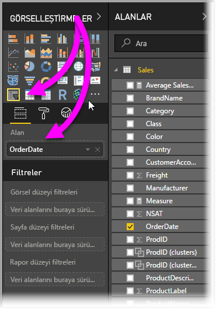
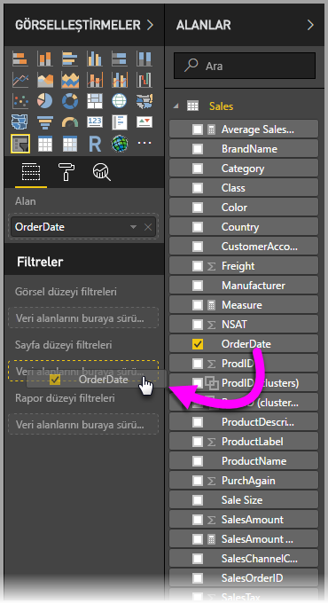

# Power BI Desktop'ta göreli tarih dilimleyici ve filtre kullanma
**Göreli tarih dilimleyici** veya **göreli tarih filtresi** ile veri modelinizdeki tarih sütunlarına zamana bağlı filtre uygulayabilirsiniz. Örneğin, **göreli tarih dilimleyiciyi** kullanarak yalnızca son otuz gün içinde (veya ay, takvim ayları ve benzeri) gerçekleşen satışlara ait verileri gösterebilirsiniz. Verileri yenilediğinizde de göreli zaman dönemi otomatik olarak ilgili göreli tarih kısıtlamasını uygular.

## Göreli tarih aralığı dilimleyiciyi kullanma
Göreli tarih dilimleyiciyi diğer dilimleyiciler gibi kullanabilirsiniz. Tek yapmanız gereken raporunuz için bir **dilimleyici** görseli oluşturup **Alan** değeri olarak bir tarih değeri seçmektir. Aşağıdaki resimde *OrderDate* alanı seçilmiştir.

**Göreli tarih dilimleyicinin** sağ üst köşesindeki simgeyi seçtiğinizde bir menü açılır.

Göreli tarih dilimleyici için *Göreli*'yi seçin.

Ardından ayarları seçebilirsiniz. *Göreli tarih dilimleyicideki* ilk açılan menü için aşağıdaki seçimleri yapabilirsiniz:

* Son
* Sonraki
* Bu

Bu seçimler aşağıdaki görüntüde gösterilmiştir.

*Göreli tarih dilimleyicideki* sonraki (ortadaki) ayarı, göreli tarih aralığını tanımlamak üzere bir sayı girmenizi sağlar.

Üçüncü ayar, tarih ölçümünü seçmenize olanak tanır. Aşağıdaki seçimleri yapabilirsiniz:

* Gün
* Hafta
* Hafta (Takvim)
* Ay
* Ay (Takvim)
* Yıl
* Yıl (Takvim)

Bu seçimler aşağıdaki görüntüde gösterilmiştir.

Bu listeden *Aylar*’ı ve ortadaki ayarda giriş 2’yi seçerseniz şunlar olur: Bugünün 20 Temmuz olduğunu kabul edersek görsellerde bulunan ve dilimleyici tarafından kısıtlanan veriler, 20 Mayıs-20 Temmuz (bugün) olmak üzere son iki aya ait verileri gösterir.

Buna karşılık *Ay (Takvim)* seçeneğini belirlerseniz kısıtlanan görseller 1 Mayıs-30 Haziran arasındaki (son iki tam takvim ayı) verileri gösterir.

## Göreli tarih aralığı filtresini kullanma
Raporunuzun bir sayfası veya tamamı için göreli tarih aralığı filtresi de oluşturabilirsiniz. Bunun için aşağıdaki görüntüde verilen şekilde **Alan** bölmesindeki **Sayfa düzeyi filtreleri** veya **Rapor düzeyi filtreleri** alanlarına bir tarih alanı sürüklemeniz yeterlidir.

Bu işlemin ardından göreli tarih aralığı filtresini **göreli tarih dilimleyici** gibi özelleştirebilirsiniz. **Filtre Türü** açılan menüsünden **Göreli tarih filtresi**'ni seçin.

**Göreli tarih filtresi**'ni seçtikten sonra dilimleyicide olduğu gibi değiştirebileceğiniz ve ortada bir sayısal kutusu bulunan üç bölüm açılır.

Bu göreli tarih kısıtlamalarını raporlarınızda kullanmak için yapmanız gerekenler bu kadardır.

## Sınırlamalar ve önemli noktalar
**Göreli tarih aralığı dilimleyici** ve filtresi için geçerli sınırlamalar ve önemli noktalar aşağıda belirtilmiştir.

* **Power BI**'daki veri modellerinde saat dilimi bilgisi yoktur. Modeller saat bilgisi depolayabilir ancak bulundukları saat dilimiyle ilgili bir belirtim mevcut değildir.
* Dilimleyici ve filtre her zaman UTC saatini kullanır. Bu nedenle bir raporda filtre yapılandırıp farklı bir saat dilimindeki iş arkadaşınıza göndermeniz halinde sizinle aynı verileri görecektir. Ancak UTC saat diliminde değilseniz beklediğinizden farklı bir saat dilimine ait verileri görebilirsiniz.
* Yerel saat diliminizde toplanan verileri UTC'ye dönüştürmek için **Sorgu Düzenleyicisi**'ni kullanabilirsiniz.

