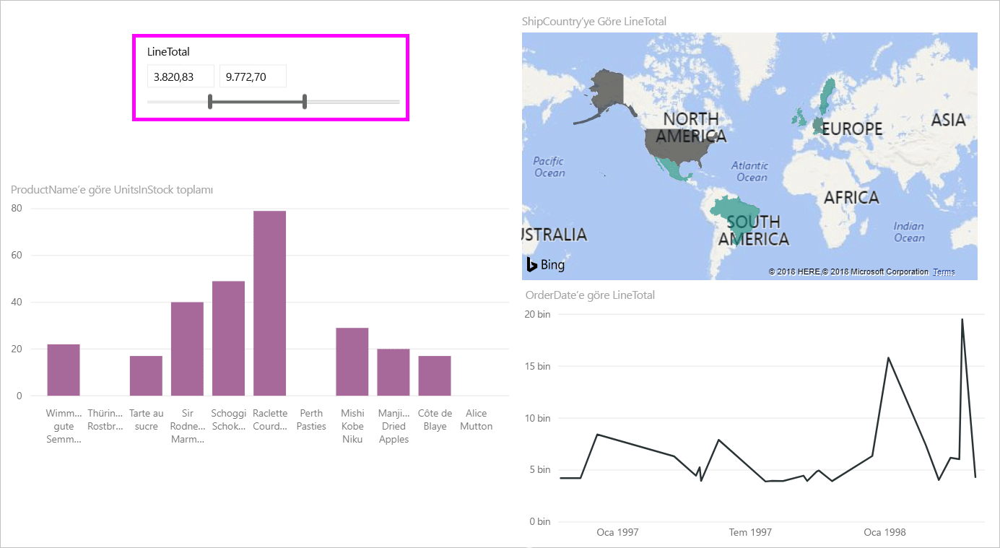
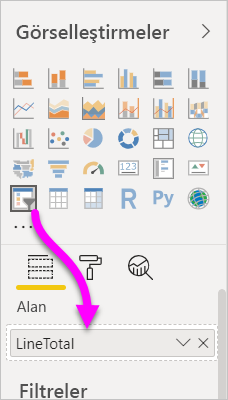
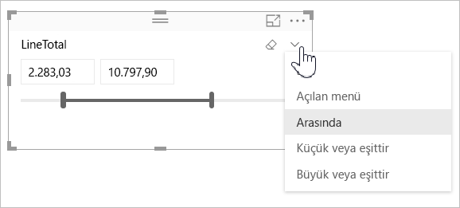
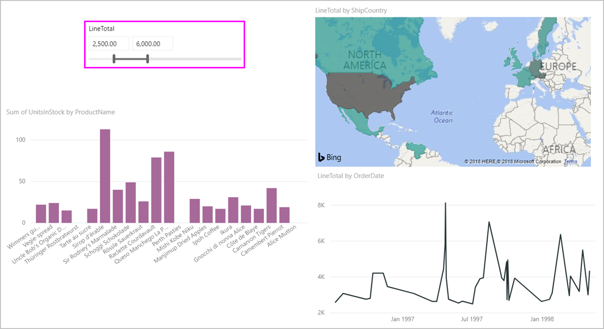
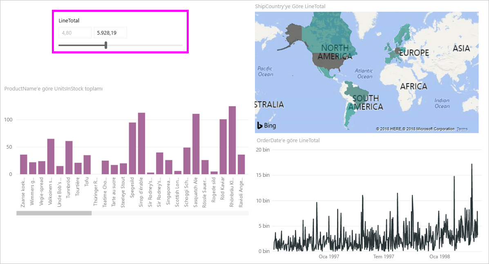
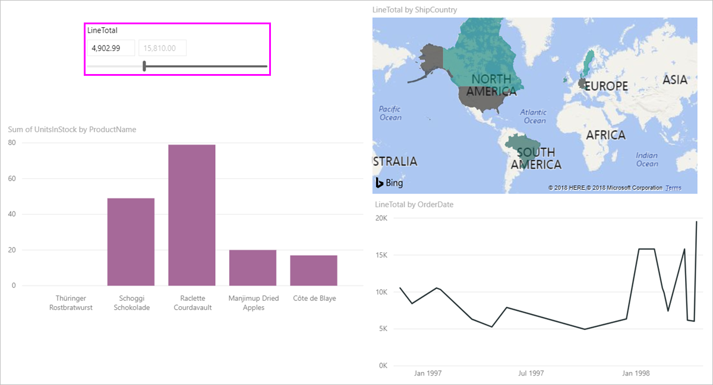

# Power BI Desktop uygulamasındaki sayısal aralık dilimleyiciyi kullanma
**Sayısal aralık dilimleyici** ile veri modelinizdeki sayısal sütunlara her türlü filtreyi uygulayabilirsiniz. Belirli sayılar **arasında**, belirli bir sayıdan **küçük veya ona eşit** ya da belirli bir sayıdan **büyük veya ona eşit** filtrelerini kullanabilirsiniz. Bu işlemler kulağa basit gelse de verilerinizi filtrelemek için kullanabileceğiniz önemli yöntemlerdir.

## Sayısal aralık dilimleyiciyi kullanma
Sayısal aralık dilimleyiciyi diğer dilimleyiciler gibi kullanabilirsiniz. Tek yapmanız gereken raporunuz için bir **dilimleyici** görseli oluşturup **Alan** değeri olarak bir sayısal değer seçmektir. Aşağıdaki görüntüde *LineTotal* alanı seçilmiştir.

**Sayısal aralık dilimleyicinin** sağ üst köşesindeki aşağı ok bağlantısını seçtiğinizde bir menü açılır.

Sayısal aralık için aşağıdaki üç seçimi yapabilirsiniz:

* Arasında
* Küçük veya eşittir
* Büyük veya eşittir

Menüden **Arasında**'yı seçtiğinizde bir kaydırıcı görüntülenir ve iki sayı arasında kalan sayısal değerleri filtreleyebilirsiniz. Kaydırma çubuğunu kullanmaya ek olarak kutulardan birine tıklayıp değer girebilirsiniz. Bu işlev, özellikle belirli sayılar girmek istediğiniz ancak kaydırıcı çubuğu ile tam olarak istediğiniz sayıya gelemediğiniz durumlar için faydalıdır.

Aşağıdaki resimde rapor sayfası 2500,00 ile 6000,00 arasındaki *LineTotal* değerlerini gösterecek şekilde filtrelenmiştir.

**Küçük veya eşittir**'i seçtiğinizde kaydırıcı çubuğun sol tarafındaki tutamaç (düşük değer) kaybolur ve kaydırıcı çubuğun yalnızca üst sınırı ayarlanabilir. Aşağıdaki görüntüde kaydırıcı çubuğun en yüksek değerini 5928,19 değerine ayarladık.

Son olarak **Büyük veya eşittir**'iş seçtiğinizde aşağıdaki görüntüde görebileceğiniz gibi kaydırıcı çubuğun sağ tarafındaki tutamaç (yüksek değer) kaybolur ve yalnızca düşük değer ayarlanabilir. Bu durumda yalnızca *LineTotal* değeri 4902,99 değerine eşit veya ondan büyük olan öğeler rapor sayfasındaki görsellerde görüntülenir.

## Sayısal aralık dilimleyicide tam sayılara yaslama

Ondalık bir aralık söz konusu olmadığı sürece sayısal aralık dilimleyici tam sayılara yaslanır. Bu, dilimleyicinizin tam sayılara düzgün bir şekilde hizalanmasına olanak tanır. 

## Sınırlamalar ve önemli noktalar
**Sayısal aralık dilimleyici** için geçerli sınırlamalar ve önemli noktalar aşağıda belirtilmiştir:

* **Sayısal aralık dilimleyici** şu an için verilerdeki temel alınan satırları filtreler, toplanmış değerlere filtre uygulamaz. Örneğin, *Sales Amount* alanı kullanıldığında *Sales Amount* tabanlı işlemlere filtre uygulanır, görseldeki her veri noktasına ait olan *Sales Amount* toplamı filtrelenmez.
* Bu özellik şu an için Ölçülerle birlikte çalışmamaktadır.
