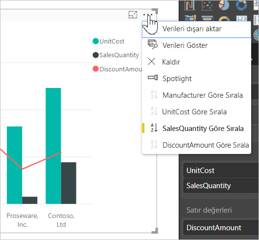
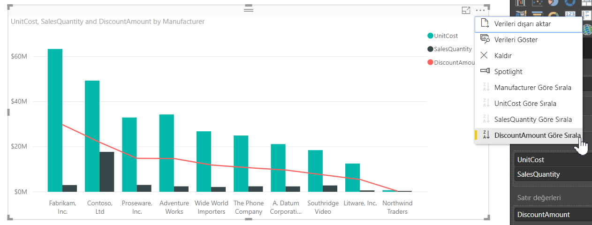
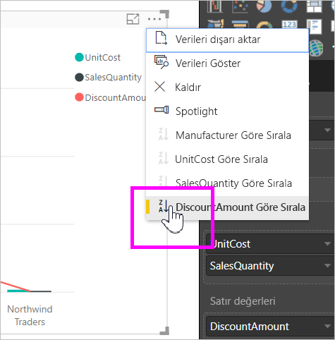
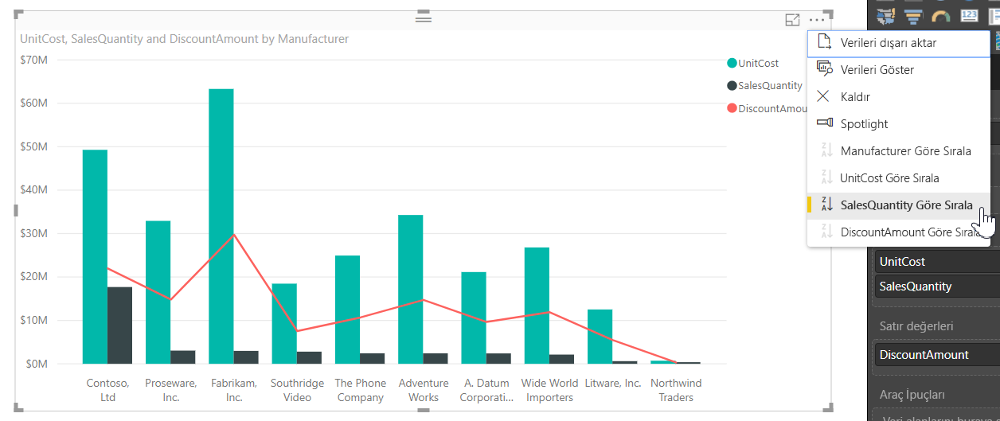
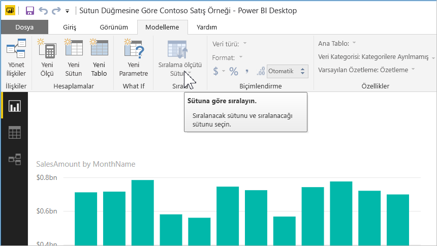
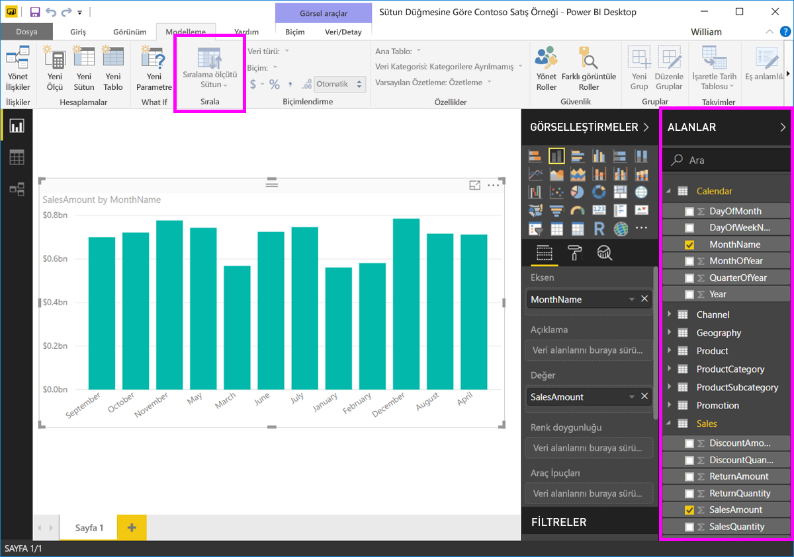
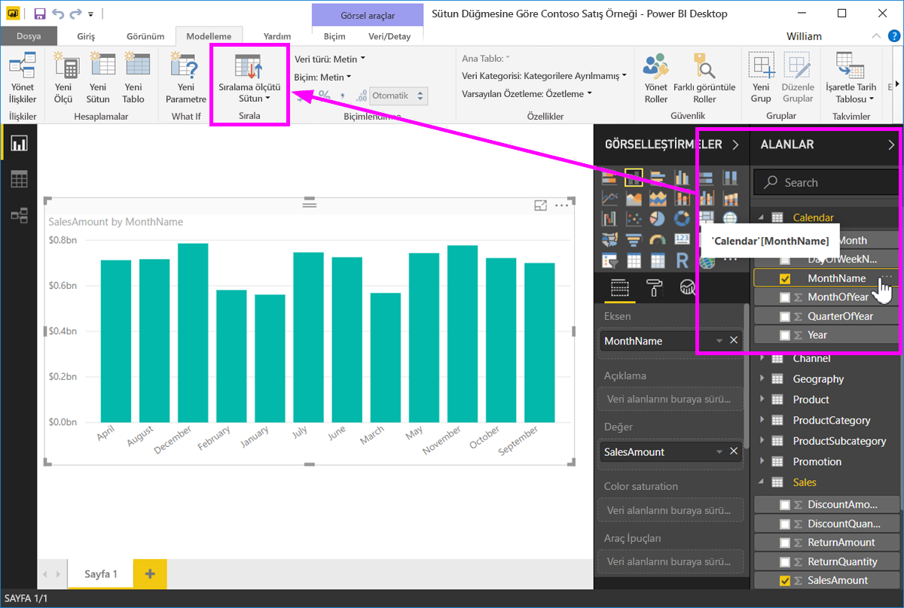
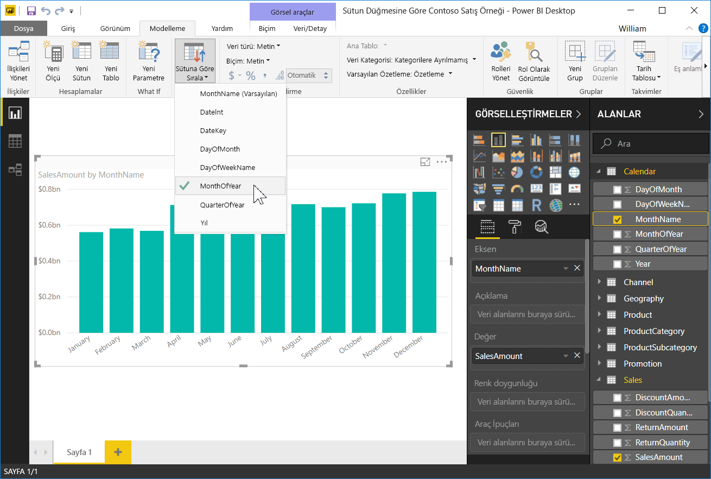
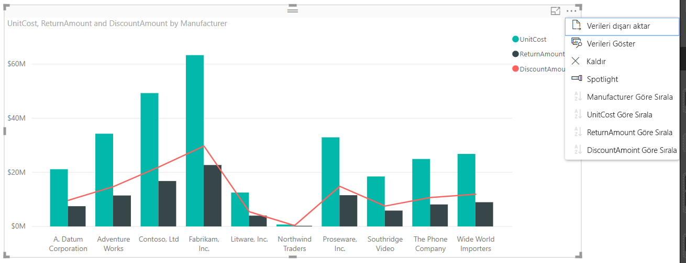

# Power BI Desktop'ta sütuna göre sıralama
**Power BI Desktop** uygulamasında ve **Power BI hizmetinde** farklı veri alanlarına göre sıralayarak bir görselin görüntülenme şeklini değiştirebilirsiniz. Görseli sıralama ölçütünü değiştirerek iletmek istediğiniz bilgileri vurgulayabilir ve görselin bu eğilimi yansıtmasını (veya vurgulamasını) sağlayabilirsiniz.

İster sayısal veriler (satış rakamları gibi) ister metin verileri (eyalet adları gibi) kullanıyor olun, görselleştirmelerinizi istediğiniz şekilde sıralayabilir ve istediğiniz gibi görünmelerini sağlayabilirsiniz.  **Power BI** sıralama için kullanabileceğiniz birçok seçenek ve hızlı menüler sunmaktadır. Aşağıdaki görüntüde verilen şekilde istediğiniz görselde üç nokta menüsünü (...) seçip sıralama için kullanmak istediğiniz alanı seçebilirsiniz.

## Daha ayrıntılı bir örnek
Şimdi daha ayrıntılı bir örneği ele alalım ve **Power BI Desktop**'ta nasıl çalıştığına bakalım.

Aşağıdaki görselleştirmede üretici adına göre maliyetler, miktarlar ve tutarlar gösterilmiştir. Daha ayrıntılı sıralama yapmadan önce görselleştirme aşağıdaki şekilde görünür.

Görsel şu anda **SalesQuantity** ölçütüne göre sıralanmış ve bunu artan çubukların rengine açıklamadan bakarak anlayabiliyoruz. Ancak, geçerli sıralama sütununu belirlemenin daha kolay bir yöntemi var, o da görselin sağ üst köşesindeki üç nokta menüsü (...). Üç noktayı seçtiğimizde aşağıdaki seçenekleri görüyoruz:

* Geçerli sıralama alanı **SalesQuantity**’dir ve **SalesQuantity’ye Göre Sırala** alanının kalın yazı tipinde olması ve sarı bir çubuk içermesi ile gösterilir. 

* Geçerli sıralama yönü, küçük simge **A/Z** (A, Z’den önce) ve aşağı ok ile gösterildiği gibi en küçükten en büyüğe şeklindedir.

Sonraki iki bölümde sıralama alanına ve yönüne birbirinden bağımsız olarak bakacağız.

## Sıralama için kullanılacak sütunu seçme
**Diğer Seçenekler** menüsündeki **Sort By SalesQuantity** seçeneğinin yanında bulunan ve görselin **SalesQuantity** sütunu tarafından sıralandığını gösteren sarı çubuğu fark ettiniz. Başka bir sütuna göre sıralama yapmak oldukça kolaydır. Tek yapmanız gereken üç noktayı seçerek üç nokta menüsünü açmak ve ardından başka bir sütun seçmektir.

Aşağıdaki görüntüde sıralama sütunu olarak *DiscountAmount* sütununu seçtik. Bu sütun, görseldeki çubuklardan değil, çizgilerden biri. **Sort By DiscountAmount** sütununu seçtikten sonra görsel aşağıdaki şekilde görüntülenir.

Görselin nasıl değiştiğine dikkat edin. Değerler artık bu görsel Fabrikam Inc. şirketindeki en yüksek DiscountAmount değerinden en düşük değere sahip Northwind Traders şirketine doğru sıralanır. 

Peki azalan yerine artan düzende sıralamak istiyorsak ne yapmamız gerekir? Bunun ne kadar kolay olduğunu bir sonraki bölümde görebilirsiniz.

## Sıralama düzenini seçme: en küçükten en büyüğe, en büyükten en küçüğe
Önceki görüntüde bulunan **Seçenekler** menüsüne yakından baktığımızda **Sort by DiscountAmount** menüsünün yanındaki simgede **Z/A** (Z, A'nın üzerinde) simgesinin olduğunu görebiliriz. Göz atın:

**Z/A** görüntülendiğinde görsel seçilen sütundaki en büyük değerden en küçük değere göre sıralama gerçekleştirir. Bunu değiştirmek mi istiyorsunuz? Hiç sorun değil. Tek yapmanız gereken **Z/A** simgesine dokunmak veya tıklamaktır. Bunu yaptığınızda görselin sıralaması **A/Z** olarak değişir (seçilen sütuna göre) ve en küçükten en büyük değere doğru sıralama yapılır.

Burada aynı görselin **Sort By DiscountAmount** menüsündeki **Z/A** simgesine dokunularak sıralamasının değiştirilmiş halini görüyorsunuz. Northwind Traders şirketinin şu anda listedeki ilk üretici, Fabrikam Inc. şirketinin ise son üretici (önceki sıralamanın tersi) olduğuna dikkat edin.

Görselde yer alan herhangi bir sütuna göre sıralama yapabilirsiniz. Sıralama sütunu olarak, SalesQuantity sıralama ölçütünü **Sort By SalesQuantity** ile birlikte kolayca seçerek en çok satışı yapan üreticileri ilk önce gösterebilir ve ilgili üreticiye nasıl uygulandıklarına bakılmaksızın görseldeki diğer sütunları tutabilirsiniz. Bu ayarların uygulandığı görseli aşağıda görebilirsiniz.

## Sütuna Göre Sırala düğmesiyle sıralama
Verilerinizi sıralamak için kullanabileceğiniz bir diğer yöntem de **Modelleme** şeridindeki **Sütuna Göre Sırala** düğmesidir.

Bu işlevi kullanmak için **Alanlar** bölmesinden bir sütun seçmeniz ve ardından görselin nasıl (hangi sütuna göre) sıralanacağını belirlemek için **Sütuna Göre Sırala** düğmesini seçmeniz gerekir. **Sütuna Göre Sırala** düğmesini etkinleştirmek için sıralamada kullanmak istediğiniz sütunu (alanı) **Alanlar** bölmesinden seçmeniz gerekir. Aksi halde düğme devre dışı olacaktır.

Sık kullanılan örneklerden birine göz atalım: Yılın aylarına ait verileriniz var ve bunları kronolojik olarak sıralamak istiyorsunuz. Aşağıdaki adımlarda bunu nasıl yapacağınız gösterilmektedir.

1. Öncelikle görselin seçili olduğuna ancak **Alanlar** bölmesinde bir sütun seçimi yapılmadığı için **Sütuna Göre Sırala** düğmesinin devre dışı (gri renkte) olduğuna dikkat edin.
   
   

2. Sıralamada kullanmak istediğimiz sütunu **Alanlar** bölmesinden seçtikten sonra **Sütuna Göre Sırala** düğmesi etkin hale gelir.
   
   
3. Şimdi görsel seçili durumdayken *MonthOfYear* sütununu (varsayılan *MonthName* sütunu yerine) seçtiğimizde görsel istediğimiz şekilde yılın aylarına göre sıralanır.
   
   

İşte bu kadar. **Alanlar** bölmesinden bir sütun seçmezseniz **Sütuna Göre Sırala** düğmesinin etkin hale gelmeyeceğini unutmayın.

## Varsayılan sıralama sütununa dönme
Sıralama için istediğiniz sütunu kullanabilirsiniz ancak bazen görselin varsayılan sıralama sütununa dönmesini isteyebilirsiniz. Hiç sorun değil. Sıralama sütunu seçilmiş bir görselde (önceki bölümlerde öğrendiğimiz gibi üç nokta menüsünde sıralama sütununun yanında sarı çubuk bulunur) **Diğer Seçenekler** menüsünü açıp varsayılan sütunu tekrar seçerek görselleştirmenin varsayılan sıralama sütununa dönmesini sağlayabilirsiniz.

Örneğin, önceki grafiğimiz şu şekilde görünür:

Menüye gidip **SalesQuantity** sütununu yeniden seçtiğimizde görsel aşağıdaki görüntüde olduğu gibi **Manufacturer** sütununa göre alfabetik şekilde sıralanır.

Görsellerinizi sıralamak için kullanabileceğiniz seçenekler sayesinde istediğiniz grafiği veya görüntüyü oluşturmak oldukça kolaydır.

