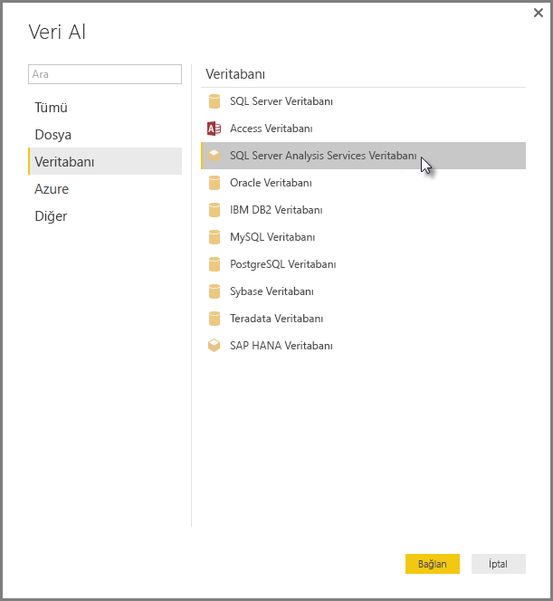

# Power BI Desktop'ta SSAS Çok Boyutlu Modellerine bağlanma
Power BI Desktop ile genelde **SSAS MD** olarak adlandırılan **SSAS Çok Boyutlu modellerine** erişebilirsiniz.

Bir **SSAS MD** veritabanına bağlanmak için aşağıdaki resimde gösterildiği gibi **Veri Al &gt; Veritabanı &gt; SQL Server Analysis Services Veritabanı** yolunu izleyin:

Canlı bağlantı modunda **SSAS Çok Boyutlu modelleri** hem Power BI hizmetinde hem de Power BI Desktop uygulamasında desteklenir. Ayrıca **SSAS Çok boyutlu modellerini** Canlı modda kullanan raporları Power BI hizmetinde yayımlayabilir ve yükleyebilirsiniz.

## SSAS MD özellikleri
Aşağıdaki bölümlerde Power BI ve SSAS MD bağlantılarının özellikleri anlatılmaktadır.

### Çok boyutlu modellerin tablo meta verileri
Aşağıdaki tabloda çok boyutlu nesnelerle Power BI Desktop uygulamasına döndürülen tablo meta verileri gösterilmektedir. Power BI, modele tablo meta verileri için sorgu gönderir ve döndürülen meta verilere göre tablo, matris, grafik veya dilimleyici gibi bir görselleştirme oluşturduğunuzda Analysis Services hedefinde uygun DAX sorgularını çalıştırır.

| BISM-Çok boyutlu nesne | Tablo Meta Verileri |
| --- | --- |
| Küp |Model |
| Küp boyutu |Tablo |
| Boyut öznitelikleri (Anahtarlar), Ad |Sütunlar |
| Ölçü grubu |Tablo |
| Ölçü |Ölçü |
| Ölçüler, ilgili Ölçü Grubu olmadan |*Ölçüler* adlı tablonun içinde |
| Ölçü grubu -> Küp boyutu ilişkisi |İlişki |
| Perspektif |Perspektif |
| KPI |KPI |
| Kullanıcı/Üst-Alt Öğe hiyerarşileri |Hiyerarşiler |

### Ölçüler, ölçü grupları ve KPI'ler
Çok boyutlu küpteki ölçü grupları Power BI'da **Alanlar** bölmesinde yanında ∑ işareti olan tablolar şeklinde gösterilir. İlgili ölçü grubu olmayan hesaplanan ölçüler, tablo meta verilerinde *Ölçüler* adındaki özel bir tabloda gruplanır.

Çok boyutlu modelde bir ölçü veya KPI kümesi tanımlayarak *Görüntüleme klasörü* içine yerleştirebilir, karmaşık modellerin basitleştirmesine yardımcı olabilirsiniz. Power BI tablo meta verilerindeki Görüntüleme klasörlerini tanır ve Görüntüleme klasörleri içindeki ölçülerle KPI'leri gösterir. Çok boyutlu veritabanlarındaki KPI'ler *Value*, *Goal*, *Status Graphic* ve *Trend Graphic* öğelerini destekler.

### Boyut özniteliği türü
Çok boyutlu modeller ayrıca boyut özniteliklerini belirli boyut öznitelik türleriyle ilişkilendirmeyi de destekler. Örneğin *City*, *State-Province*, *Country* ve *Postal Code* boyut özniteliklerinin ilişkilendirilmiş uygun coğrafya türlerine sahip olduğu bir **Geography** boyutu tablo meta verilerinde gösterilir. Power BI meta verileri tanıyarak harita görselleştirmeleri oluşturmanızı sağlar. Bu ilişkilendirmeleri Power BI'daki **Alan** bölmesinde öğenin yanında bulunan *harita* simgesinden anlayabilirsiniz.

Power BI ayrıca görüntülerin URL'lerini (Tekdüzen Kaynak Konum Belirleyicisi) içeren bir alan belirttiğinizde görüntüleri oluşturabilir. Bu alanları SQL Server Veri Araçları (veya sonrasında Power BI) içinde *ImageURL* türü olarak belirtebilirsiniz. Bunu yaptığınızda tür bilgisi tablo meta verilerinde Power BI hizmetine iletilir. Power BI da bu görüntüleri URL'den alarak görsellerde görüntüleyebilir.

### Üst-alt öğe hiyerarşileri
Çok boyutlu modeller Üst-alt öğe hiyerarşilerini destekler ve bunlar tablo meta verilerinde *hiyerarşi* olarak gösterilir. Üst-alt öğe hiyerarşisinin her seviyesi tablo meta verilerinde gizli bir sütun olarak gösterilir. Üst-alt öğe boyutunun anahtar özniteliği tablo meta verilerinde gösterilmez.

### Boyut hesaplanan üyeleri
Çok boyutlu modeller çeşitli *hesaplanan üye* türlerinin oluşturulmasını destekler. En çok kullanılan iki hesaplanan üye türü şunlardır:

* Öznitelik hiyerarşilerinde bulunan ve *Tümü* öğesinin alt öğeleri olmayan hesaplanan üyeler
* Kullanıcı hiyerarşilerindeki hesaplanan üyeler

Çok boyutlu modelde *öznitelik hiyerarşilerindeki hesaplanan üyeler* sütun değeri olarak gösterilir. Bu hesaplanan üye türü görüntülenirken kullanılan birkaç ek seçenek ve sınırlama vardır:

* Boyut özniteliği isteğe bağlı *UnknownMember* parametresine sahip olabilir
* Hesaplanan üyeleri içeren bir öznitelik, boyutun tek özniteliği olmadığı sürece boyutun anahtar özniteliği olamaz
* Hesaplanan üyeleri içeren bir öznitelik, üst-alt öğe özniteliği olamaz

Kullanıcı hiyerarşilerinin hesaplanan üyeleri Power BI'da gösterilmez. Bunun yerine kullanıcı hiyerarşilerinin hesaplanan üyelerini içeren bir küpe bağlanabilirsiniz ancak önceki madde listesinde belirtilen kısıtlamaları karşılamayan hesaplanan üyeleri göremezsiniz.

### Güvenlik
Çok boyutlu modeller *Roller* aracılığıyla boyut ve hücre düzeyi güvenlik desteği sunar. Power BI ile bir küpe bağlandığınızda kimlik doğrulamasından geçersiniz ve ilgili izinlere sahip olup olmadığınız kontrol edilir. Bir kullanıcıya *boyut güvenliği* uygulandığında ilgili boyut üyeleri Power BI'da bu kullanıcı tarafından görünmez. Ancak bir kullanıcıya *hücre güvenliği* izni tanımlandığında belirli hücrelere erişim kısıtlanır ve bu kullanıcı Power BI kullanarak küpe bağlanamaz.

## Önemli Noktalar ve Sınırlamalar
**SSAS MD** kullanımıyla ilgili belirli sınırlamalar mevcuttur:

* Power BI Desktop SSAS MD bağlayıcısının düzgün çalışması için sunucuların SQL Server 2012 SP1 CU4 veya üzeri Analysis Services sürümüne sahip olması gerekir
* *Eylemler* ve *Adlandırılmış Kümeler* Power BI için açık değildir ancak *Eylemleri* veya *Adlandırılmış kümeleri* de içeren küplere yine de bağlanabilir, görseller ve raporlar oluşturabilirsiniz.
* Power BI’ın bir SSAS modeline ait meta verileri gösterdiği ancak modelden veri alamadığınız bir sorunla karşılaşabilirsiniz. Sisteminiz MSOLAP sağlayıcısının 32 bit sürümü yüklü olduğunda ve 64 bit sürümü mevcut olmadığında bu sorun oluşabilir. 64 bit sürümün yüklenmesi sorunu çözebilir.
* SSAS çok boyutlu modeline canlı bağlantısı olan bir rapor yazarken 'rapro düzeyi' ölçümleri oluşturamazsınız. Sağlanan ölçüler yalnızca MD modelinde tanımlanmış olanlardır.

## Power BI Desktop Uygulamasında Desteklenen SSAS MD Özellikleri
Aşağıdaki SSAS MD özellikleri Power BI Desktop uygulamasında desteklenmektedir:

* Bu **SSAS MD** sürümünde aşağıdaki öğelerin kullanılması desteklenmektedir (bu özellikler hakkında [daha fazla bilgi](https://msdn.microsoft.com/library/jj969574.aspx) edinebilirsiniz):
  * Görüntüleme klasörleri
  * KPI Eğilimleri
  * Varsayılan Üyeler
  * Boyut Öznitelikleri
  * Boyut Hesaplanan Üyeleri (boyut birden fazla özniteliğe sahip olduğunda tek bir gerçek üye olmalıdır, tek öznitelik olmadığı sürece boyutun anahtar özniteliği olamaz ve üst-alt öğe öznitelik olamaz)
  * Boyut Özniteliği türleri
  * Hiyerarşiler
  * Ölçüler (Ölçü gruplarıyla veya onlar olmadan)
  * Değişken Olarak Ölçüler
  * KPI'ler
  * ImageUrls
  * Boyut güvenliği

## Sorun giderme 
Aşağıdaki listede SQL Server Analysis Services’a (SSAS) bağlanma sırasında yaşandığı bilinen tüm sorunlar açıklanmıştır. 

* **Hata: Model şeması yüklenemedi** - Bu hata genellikle Analysis Services’a bağlanan kullanıcının veritabanına/küpe erişimi olmadığında gerçekleşir.
