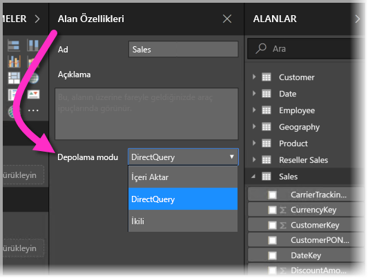
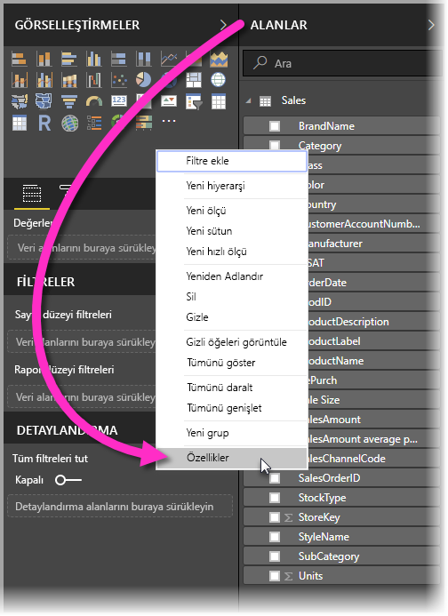
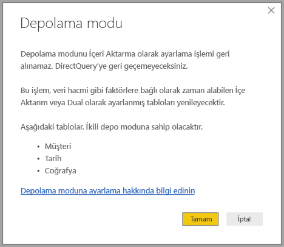

# Power BI Desktop’ta depolama modu (Önizleme)

**Power BI Desktop**'ta tablolar için **depolama modunu** belirtebilir ve bu sayede raporlar için tablo verilerinin bellek içinde önbelleğe alınıp alınmayacağını denetleyebilirsiniz. 

**Depolama modunun** ayarlanması birçok avantaj getirir. **Depolama modunu** modelinizdeki her tablo için tek tek ayarlayabilir, böylelikle tek bir veri kümesinin aşağıdaki avantajlardan birine veya birden çoğuna sahip olmasını sağlayabilirsiniz:

* **Sorgu performansı** - kullanıcılar Power BI raporlarındaki görsellerle etkileşimli çalışırken, veri kümesine DAX sorguları gönderilir. **Depolama modunu** düzgün ayarlayarak verileri önbelleğe almak sorgu performansını ve raporlarınızın etkileşimini artırabilir.
* **Büyük veri kümeleri** - önbelleğe alınmamış tablolar, önbelleğe alma amacıyla bellek kullanmaz. Tümüyle önbelleğe alınamayacak kadar büyük olan veya bunu çok pahalıya çıkacağı büyük veri kümelerinde etkileşimli analizi etkinleştirebilirsiniz. Hangi tabloların önbelleğe alınmaya değeceğini, hangilerinin değmeyeceğini seçebilirsiniz.
* **Veri yenileme optimizasyonu** - önbelleğe alınmayan tabloların yenilenmesi gerekmez. Hizmet düzeyi anlaşmalarınıza ve iş gereksinimlerinize uygun olarak, yalnızca gerekli verileri önbelleğe alıp yenileme sürelerini kısaltabilirsiniz.
* **Gerçek zamanlıya yakın olma gereksinimleri** - gerçek zamanlıya yakın olma gereksinimleri olan tablolar, veri gecikme sürelerini kısaltmak için önbelleğe almama yönteminden yararlanabilir.
* **Geri yazma** - Geri yazma, işletme kullanıcılarının hücre değerlerini değiştirerek durum değerlendirmesi senaryolarını incelemesine olanak tanır. Özel uygulamalar, veri kaynağına değişiklikleri uygulayabilir. Önbelleğe alınmayan tablolar değişiklikleri hemen yansıttığından, etkilerin anlık analizleri yapılabilir.

**Power BI Desktop**'taki **depolama modu** ayarı, birbiriyle ilişkili üç özellikten biridir:

* **Bileşik modeller** - raporda DirectQuery bağlantıları ve içeri aktarma da dahil olmak üzere herhangi bir birleşimde birden çok veri bağlantısına izin verir.
* **Çoka çok ilişkiler** - **bileşik modellerle** tablolar arasında **çoka çok ilişkiler** kurabilir, tablolarda benzersiz değer gereksinimlerini kaldırabilir ve yalnızca ilişkileri kurmak için yeni tablolar ekleme gibi önceden yapılacak geçici düzeltmelerden kurtulabilirsiniz. 
* **Depolama modu** - DirectQuery temelinde olsa bile arka uç veri kaynaklarını sorgulama gerektiren ve gerektirmeyen hangi görsellerin içeri aktarılacağını belirtebilir, böylelikle performansı geliştirir ve arka uç yükünü azaltırsınız. Daha önce, sorguları başlatan dilimleyiciler gibi basit görseller bile arka uç kaynaklara gönderiliyordu. 

**Bileşik modeller** için birbiriyle ilgili bu özellik koleksiyonundaki üç özelliğin her biri ayrı makalelerde ele alınıyor:

* **Bileşik modeller**, [Power BI Desktop’ta bileşik modeller (Önizleme)](desktop-composite-models.md) adlı kendi makalesinde ayrıntılarıyla açıklanır.
* **Çoka çok ilişkiler** kendi makalesinde ([Power BI Desktop'ta çoka çok ilişkiler (Önizleme)](desktop-many-to-many-relationships.md)) açıklanıyor.
* **Depolama modu** bu makalede ayrıntılı olarak açıklanır.

## Depolama modu önizleme özelliğini etkinleştirme

**Depolama modu** özelliği Önizleme aşamasındadır ve **Power BI Desktop**'ta etkinleştirilmesi gerekir. **Depolama modu** özelliğini etkinleştirmek için, **Dosya > Seçenekler ve Ayarlar > Seçenekler > Önizleme Özellikleri**’ni seçin ve ardından **bileşik modeller** onay kutusunu işaretleyin. 

Özelliğin etkinleştirilmesi için **Power BI Desktop**'ı yeniden başlatmanız gerekir.

## Depolama modu özelliğini kullanma

**Depolama modu**, modelinizdeki her tablo için ayarlayabileceğiniz bir özelliktir. **Depolama modunu** ayarlamak için, **Alanlar** bölmesinde tabloyu seçin ve ardından sağ tıklayarak bağlam menüsünü açın. Bağlam menüsünde **Özellikler**'i seçin.

**Depolama modu** seçimi, tablonun **Alan özellikleri** bölmesinde gösterilir. Burada geçerli **depolama modunu** görüntüleyebilir veya değiştirebilirsiniz.

**Depolama modu** üç değerden biri olabilir:

* **İçeri Aktarma** - **İçeri Aktarma** olarak ayarlandığında, içeri aktarılan tablolar önbelleğe alınır. Power BI veri kümesine gönderilen ve İçeri Aktarma tablolarından veri döndüren sorgular, yalnızca önbelleğe alınmış verilerle yanıtlanır.
* **DirectQuery** - Bu ayarla, DirectQuery tabloları önbelleğe alınmaz. Power BI veri kümesine gönderilen ve DirectQuery tablolarından veri döndüren sorgular (örneğin, DAX sorguları), yalnızca veri kaynağında isteğe bağlı sorgular yürütülerek yanıtlanır. Veri kaynağına gönderilen sorgular, o veri kaynağına ilişkin sorgu dilini (örneğin, SQL) kullanır.
* **İkili** - İkili tablolar, Power BI veri kümesine gönderilen sorguların bağlamına göre önbelleğe alınmış veya alınmamış gibi davranabilir. Bazı durumlarda, sorgular önbelleğe alınmış verilerle yanıtlanır; diğer durumlarda ise, sorgular veri kaynağında isteğe bağlı sorgu yürütme yoluyla yanıtlanır.

Tabloyu İçeri Aktarma depolama moduna dönüştürmek *geri alınamaz* bir işlemdir; DirectQuery'ye veya İkili'ye geri döndürülemez.

## DirectQuery ve İkili tabloların kısıtlamaları

İkili tablolar, DirectQuery tablolarıyla aynı kısıtlamalara tabidir. Bunlar, sınırlı M dönüştürmeleri ve hesaplanan sütunlarda kısıtlanmış DAX işlevleridir. Daha fazla bilgi için bkz. [DirectQuery kullanmanın etkileri](desktop-directquery-about.md#implications-of-using-directquery).

## Farklı depolama modlarına sahip tablolarda ilişki kuralları

İlişkiler, ilgili tabloların **depolama modu** temelinde belirlenen kurallara uymalıdır. Bu bölümde, geçerli birleşim örnekleri sağlanır. Eksiksiz bilgiler için bkz. [Power BI Desktop’ta çoka çok ilişkiler (Önizleme)](desktop-many-to-many-relationships.md).

Tek bir veri kaynağı olan bir veri kümesinde, aşağıdaki **Bire Çok** ilişki birleşimleri geçerlidir:

| **Çok** tarafındaki tablo | **Bir** tarafındaki tablo |
| ------------- |----------------------| 
| İkili          | İkili                 | 
| İçeri Aktar        | İçeri Aktarma veya İkili       | 
| DirectQuery   | DirectQuery veya İkili  | 

## İkili'nin Yayılması
Bir örneğe göz atalım. Tüm tabloların İçeri Aktar ve DirectQuery desteği olan tek kaynaktan geldiği aşağıdaki basit modeli düşünün.

Başlangıç olarak bu modeldeki tüm tabloların DirectQuery olduğunu varsayalım. **SurveyResponse** tablosunun *depolama modunu* İçeri Aktarma olarak değiştirirsek, aşağıdaki istem görüntülenir:

Daha önce açıklanan ilişki kurallarına uyması için, boyut tablolarının (*Customer*, *Date* ve *Geography*) **İkili** olarak ayarlanması gerekir. Bu tabloların önceden **İkili** olarak ayarlanmış olmasını gerektirmek yerine, bunlar tek bir işlemle ayarlanabilir.

Yayma mantığı, birçok tablo içeren modellerde yardımcı olmak için tasarlanmıştır. 50 tablo içeren bir modeliniz olduğunu ve yalnızca bazı olgu (işlem) tablolarının önbelleğe alınması gerektiğini varsayalım. **Power BI Desktop**'ın mantığı **İkili** olarak ayarlanması gereken en küçük boyut tablosu kümesini belirleyebildiğinden, bunu sizin yapmanız gerekmez.

Yayma mantığı **Bire Çok** ilişkilerinin yalnızca bir tarafından geçer.

* *Sales* ve *SurveyResponse* DirectQuery tablolarıyla ilişkileri nedeniyle *Customer* tablosunun **İçeri Aktarma**'ya dönüştürülmesine (*SurveyResponse* tablosunu değiştirmek yerine) izin verilmez.
* *Customer* tablosunun **İkili**'ye dönüştürülmesine (*SurveyResponse* tablosunu değiştirmek yerine) izin verilir. Yayma mantığı *Geography* tablosunu da **İkili** olarak ayarlar.

## Depolama modu kullanım örneği
Şimdi önceki bölümde verilen örnekle devam edelim ve aşağıdaki **depolama modu** özellik ayarlarını uyguladığımızı varsayalım:

| Tablo                   | Depolama modu         |
| ----------------------- |----------------------| 
| *Sales*                 | DirectQuery          | 
| *SurveyResponse*        | İçeri Aktar               | 
| *Date*                  | İkili                 | 
| *Customer*              | İkili                 | 
| *Geography*             | İkili                 | 

*Sales* tablosunda önemli bir veri hacmi bulunduğu varsayıldığında, bu depolama modu özellik ayarlarının yapılması şu davranışlara neden olur.
* Boyut tabloları (*Date*, *Customer* ve *Geography*) önbelleğe alınır, böylelikle görüntülemek üzere dilimleyici değerleri alınırken ilk raporun yükleme süreleri kısa olur.
* *Sales* tablosu önbelleğe alınmadığında şu sonuçlar ortaya çıkar:
    * Veri yenileme süreleri geliştirilir ve bellek kullanımı azaltılır
    * *Sales* tablosunu temel alan rapor sorguları DirectQuery modunda çalıştırılır. Bu daha uzun sürebilir ama gerçek zamana yakındır çünkü önbellek gecikmesi söz konusu olmaz

* *SurveyResponse* tablosunu temel alan rapor sorguları bellek içi önbellekten döndürülür ve bu nedenler bunları görece hızlı çalışması beklenir.

## Önbelleğe isabet eden veya etmeyen sorgular

**Power BI Desktop** için **SQL Profiler**'ı tanılama bağlantı noktasına bağlayarak, aşağıdaki olaylar temelinde bir izleme gerçekleştirip hangi sorguların bellek içi önbelleğe isabet ettiği veya etmediğini görebilirsiniz:

* Sorgu Olayları\Query Begin
* Sorgu İşlemesi\Vertipaq SE Query Begin
* Sorgu İşlemesi\DirectQuery Begin

Her *Query Begin* olayı için, aynı *ActivityID* değerine sahip diğer olayları denetleyin. Örneğin, *DirectQuery Begin* olayı yoksa ama *Vertipaq SE Query Begin* olayı varsa, sorgu önbellekten yanıtlanmış demektir.

**İkili** mod tablolarına başvuran sorgular mümkünse önbellekten veri döndürür, değilse DirectQuery'ye geri döner.

Önceki örnekten devam edersek, aşağıdaki sorgu *Date* tablosundan tek bir sütuna başvurur ve bu sütun da **İkili** modundadır. Dolayısıyla, bunun önbelleği isabet etmesi gerekir.

Aşağıdaki sorgu *Sales* tablosundan tek bir sütuna başvurur ve bu sütun da **DirectQuery** modundadır. Dolayısıyla, bunun önbelleği isabet *etmemesi* gerekir.

Aşağıdaki sorgu ilginçtir çünkü her iki sütunu da birleştirir. Bu sorgu önbelleğe isabet etmeyecektir. Başlangıçta *CalendarYear* değerlerini önbellekten ve *SalesAmount* değerlerini de kaynaktan alıp sonuçları birleştirmesini bekleyebilirsiniz, ama bu yöntem kaynak sisteme SUM/GROUP BY işlemi göndermekten daha az verimli olabilir. İşlem kaynağa doğru gönderilirse, döndürülen satır sayısı çok daha az olabilir. 

> [!NOTE]
> Bu davranış, önbelleğe alınmış ve alınmamış tabloların birleştirildiği [Power BI Desktop'ta çoka çok ilişkilerinden (Önizleme)](desktop-many-to-many-relationships.md) farklıdır.

## Önbellekler eşitlenmiş durumda tutulmalıdır

Önceki bölümde gösterilen sorgular **İkili** tabloların bazen önbelleğe isabet ettiğini ve bazen de isabet etmediğini gösterir. Bu nedenle, önbellek güncel değilse farklı değerler döndürülebilir. Sorgu yürütme, örneğin DirectQuery sonuçlarını önbelleğe alınmış değerlerle eşleşecek şekilde filtreleyerek veri sorunlarını maskeleme girişiminde bulunmaz. Veri akışlarınızı bilmek sizin sorumluluğunuzdadır ve buna uygun bir tasarım yapmanız gerekir. Gerekirse, kaynakta bu tür durumlarla başa çıkmak için yerleşik teknikler vardır.

**İkili** depolama modu bir performans optimizasyonudur. Yalnızca iş gereksinimlerini karşılama becerisine zarar vermeyecek yollarla kullanılmalıdır. Alternatif bir davranış için, lütfen [Power BI Desktop’ta çoka çok ilişkileri (Önizleme)](desktop-many-to-many-relationships.md) makalesinde açıklanan teknikleri kullanmayı göz önünde bulundurun.

## Veri görünümü
Veri kümesindeki tablolardan en az birinin **depolama modu** İçeri Aktarma veya İkili olarak ayarlandıysa, **Veri görünümü** sekmesi görüntülenir.

*Veri görünümü** içinden seçildiğinde, **İkili** ve **İçeri Aktarma** tablolarında önbelleğe alınmış veriler gösterilir. DirectQuery tablolarında veri gösterilmez ve DirectQuery tablolarının gösterilemediğini belirten bir ileti görüntülenir.

## Sınırlamalar ve önemli noktalar

**Depolama modu**'nun bu sürümünde ve bunun **bileşik modellerle** bağıntısında birkaç sınırlama vardır.

Aşağıdaki Live Connect (çok boyutlu) kaynaklar **bileşik modellerle** kullanılamaz:

* SAP HANA
* SAP Business Warehouse
* SQL Server Analysis Services
* Power BI veri kümeleri
* Azure Analysis Services

Söz konusu çok boyutlu kaynaklara DirectQuery kullanarak bağlandığınızda, başka bir DirectQuery kaynağına bağlanamaz veya içeri aktarılan verilerle birleştiremezsiniz.

DirectQuery kullanımının mevcut sınırlamaları **bileşik modelleri** kullanırken de geçerlidir. Bu sınırlamaların birçoğu şimdi tablonun **depolama moduna** bağlı olarak tablo başına uygulanır. Örneğin, içeri aktarılan tablodaki hesaplanan sütun başka tablolara başvurabilir ama DirectQuery tablosundaki hesaplanan sütunun başvurabileceği sütunlar yine aynı tablodaki sütunlarla sınırlıdır. Model içindeki tablolardan herhangi biri DirectQuery ise, diğer sınırlamalar modelin tamamına uygulanır. Örneğin, modelin içindeki tablolardan herhangi birinin **depolama modu** DirectQuery olduğunda, modelde **QuickInsights** ve **Soru ve Yanıt** özellikleri kullanılamaz. 

## Sonraki adımlar

Aşağıdaki makalelerde bileşik modellerle ilgili daha fazla açıklama ve DirectQuery'nin ayrıntılı açıklaması bulunabilir.

* [Power BI Desktop’ta bileşik modeller (Önizleme)](desktop-composite-models.md)
* [Power BI Desktop’ta çoka çok ilişkiler (Önizleme)](desktop-many-to-many-relationships.md)

DirectQuery makaleleri:

* [Power BI'da DirectQuery kullanma](desktop-directquery-about.md)
* [Power BI'da DirectQuery tarafından desteklenen veri kaynakları](desktop-directquery-data-sources.md)

