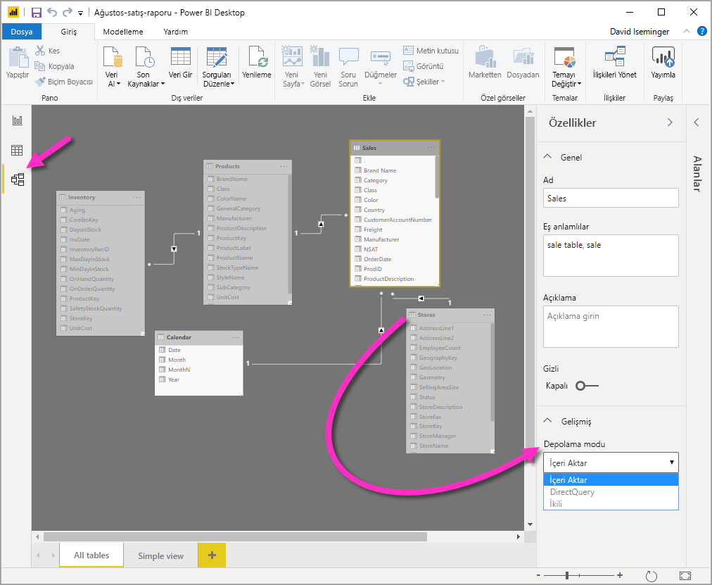
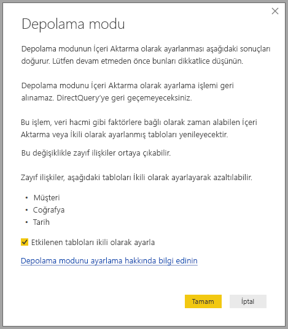

# Power BI Desktop’ta depolama modunu yönetme

Microsoft Power BI Desktop'ta tabloların depolama modunu belirtebilirsiniz. Depolama modu, Power BI Desktop'ta raporlara ilişkin tablo verilerinin bellek içinde önbelleğe alınıp alınmadığını denetlemenizi sağlar. 

Depolama modunun ayarlanması birçok avantaj sağlar. Modelinizdeki her tablonun depolama modunu ayrı ayrı ayarlayabilirsiniz. Bu eylem aşağıdaki avantajları sunan tek bir veri kümesine sahip olmanızı sağlar:

* **Sorgu performansı**: Kullanıcılar Power BI raporlarındaki görsellerle etkileşimli çalışırken, veri kümesine Veri Çözümleme İfadeleri (DAX) sorguları gönderilir. Depolama modunu düzgün ayarlayarak verileri önbelleğe almak sorgu performansını ve raporlarınızın etkileşimini artırabilir.

* **Büyük veri kümeleri**: Önbelleğe alınmamış tablolar, önbelleğe alma amacıyla bellek kullanmaz. Tümüyle önbelleğe alınamayacak kadar büyük olan veya bunu çok pahalıya çıkacağı büyük veri kümelerinde etkileşimli analizi etkinleştirebilirsiniz. Hangi tabloların önbelleğe alınmaya değeceğini, hangilerinin değmeyeceğini seçebilirsiniz.

* **Veri yenilemeyi en iyi duruma getirme**: Önbelleğe alınmayan tabloların yenilenmesi gerekmez. Hizmet düzeyi anlaşmalarınıza ve iş gereksinimlerinize uygun olarak, yalnızca gerekli olan verileri önbelleğe alıp yenileme sürelerini kısaltabilirsiniz.

* **Neredeyse gerçek zamanlı olma gereksinimleri**: Neredeyse gerçek zamanlı olma gereksinimleri olan tablolar, veri gecikme sürelerini kısaltmak için önbelleğe almama yönteminden yararlanabilir.

* **Geri yazma**: Geri yazma, işletme kullanıcılarının hücre değerlerini değiştirerek durum değerlendirmesi senaryolarını incelemesine olanak tanır. Özel uygulamalar, veri kaynağına değişiklikleri uygulayabilir. Önbelleğe alınmayan tablolar değişiklikleri hemen görüntülediğinden etkilerin anlık analizleri yapılabilir.

Power BI Desktop'taki depolama modu ayarı, birbiriyle ilişkili üç özellikten biridir:

* **Bileşik modeller**: Raporda DirectQuery bağlantıları ve içeri aktarma da dahil olmak üzere herhangi bir birleşimde iki veya daha fazla veri bağlantısına izin verir. Daha fazla bilgi için bkz. [Power BI Desktop’ta bileşik modelleri kullanma](desktop-composite-models.md).

* **Çoka çok ilişkiler**: Bileşik modeller sayesinde tablolar arasında *çoka-çok ilişkiler* kurabilirsiniz. Çoka çok ilişkilerde tablolardaki benzersiz değer gereksinimleri ortadan kaldırılır. Ayrıca yalnızca ilişki kurmak için yeni tablo eklenmesi gibi eski geçici çözümleri de devre dışı bırakır. Daha fazla bilgi için bkz. [Power BI Desktop’ta çok-çok ilişkiler](desktop-many-to-many-relationships.md).

* **Depolama modu**: Depolama modu ile artık arka uç veri kaynaklarını sorgulaması gereken görselleri belirtebilirsiniz. Sorgu gerektirmeye görseller DirectQuery tabanlı olsa dahi içeri aktarılmaz. Bu özellik, performansı artırmanıza ve arka uç yükünü azaltmanıza yardımcı olur. Daha önce, sorguları başlatan dilimleyiciler gibi basit görseller bile arka uç kaynaklara gönderiliyordu. 

## Depolama modu özelliğini kullanma

**Depolama modu** özelliği, modelinizdeki her bir tablo için ayrıca ayarlayabileceğiniz ve Power BI'ın tablo verilerini önbelleğe alma şeklini denetleyen bir özelliktir.

**Depolama modu** özelliğini ayarlamak veya geçerli ayarını görüntülemek için: 

1. **Model** görünümünde özelliklerini görüntülemek veya ayarlamak istediğiniz tabloyu seçin. 
2. **Özellikler** bölmesinde **Gelişmiş** bölümünü ve ardından **Depolama modu** açılan menüsünü genişletin.

   

**Depolama modu** özelliği için üç farklı değer belirleyebilirsiniz:

* **İçeri Aktarma**: Bu ayara sahip olan içeri aktarılan tablolar önbelleğe alınır. Power BI veri kümesine gönderilen ve İçeri Aktarma tablolarından veri döndüren sorgular, yalnızca önbelleğe alınmış verilerle yanıtlanır.

* **DirectQuery**: Bu ayara sahip olan tablolar önbelleğe alınmaz. DAX sorguları gibi Power BI veri kümesine gönderdiğiniz ve DirectQuery tablolarından veri döndüren sorgular yalnızca veri kaynağında isteğe bağlı sorgular yürütülerek yanıtlanır. Veri kaynağına gönderdiğiniz sorgular, o veri kaynağına ilişkin sorgu dilini (örneğin, SQL) kullanır.

* **İkili**: Bu ayara sahip olan tablolar, Power BI veri kümesine gönderilen sorguların bağlamına göre önbelleğe alınmış veya alınmamış gibi davranabilir. Bazı durumlarda sorguları önbelleğe alınmış verilerden yanıtlarsınız. Diğer durumlarda sorguları veri kaynağında isteğe bağlı sorgu yürüterek yanıtlarsınız.

Bir tablonun **Depolama modu** ayarını **İçeri Aktarma** olarak değiştirme işlemi *geri alınamaz*. Bu özellik ayarlandıktan sonra **DirectQuery** veya **İkili** olarak değiştirilemez.

> [!NOTE]
> Power BI Desktop'ta ve Power BI hizmetinde **İkili** depolama modunu kullanabilirsiniz.

## DirectQuery ve İkili tabloların kısıtlamaları

İkili tablolar, DirectQuery tablolarıyla aynı işlevsel kısıtlamalara sahiptir. Bu kısıtlamalar, sınırlı M dönüştürmeleri ve hesaplanan sütunlarda kısıtlanmış DAX işlevleridir. Daha fazla bilgi için bkz. [DirectQuery kullanmanın etkileri](desktop-directquery-about.md#implications-of-using-directquery).

## İkili ayarının yayılması
Tüm tabloların İçeri Aktar ve DirectQuery desteği olan tek kaynaktan geldiği aşağıdaki basit modeli düşünün.

Bu modeldeki tüm tabloların başlangıç ayarının **DirectQuery** olduğunu düşünelim. **SurveyResponse** tablosunun **Depolama modu** ayarını **İçeri Aktarma** olarak değiştirdiğinizde aşağıdaki uyarı penceresi görüntülenir:

Boyut tablolarını (**Customer**, **Geography** ve **Date**), veri kümesindeki zayıf ilişki sayısını azaltmak ve performansı artırmak için **İkili** olarak ayarlayabilirsiniz. Zayıf ilişkiler normalde kaynak sistemlere birleştirme mantığının gönderilemediği en az bir DirectQuery tablosu içerir. İkili tablolar, DirectQuery veya İçeri Aktarma tabloları olarak kullanılabildiğinden bu durumdan kaçınmış olursunuz.

Yayma mantığı, birçok tablo içeren modellerde yardımcı olmak için tasarlanmıştır. 50 tablo içeren bir modeliniz olduğunu ve yalnızca bazı olgu (işlem) tablolarının önbelleğe alınması gerektiğini varsayalım. Power BI Desktop'ın mantığı **İkili** olarak ayarlanması gereken en küçük boyut tablosu kümesini hesaplayabildiğinden, bunu sizin yapmanız gerekmez.

Yayma mantığı bire çok ilişkilerinin yalnızca bir tarafından geçer.

## Depolama modu kullanım örneği
Şimdi önceki bölümde verilen örnekle devam edelim ve aşağıdaki depolama modu özellik ayarlarını uyguladığınızı varsayalım:

| Tablo                   | Depolama modu         |
| ----------------------- |----------------------| 
| Satışlar                 | DirectQuery          | 
| SurveyResponse        | İçeri Aktar               | 
| Tarih                  | İkili                 | 
| Müşteri              | İkili                 | 
| Coğrafya             | İkili                 | 

**Sales** tablosunda önemli bir veri hacmi bulunduğu varsayıldığında, bu depolama modu özelliklerinin ayarlanması aşağıdaki davranışlara neden olur:
* Power BI Desktop boyut tablolarını (**Date**, **Customer** ve **Geography**) önbelleğe alır. Böylelikle görüntülemek üzere dilimleyici değerleri alınırken ilk raporun yükleme süreleri kısa olur.
* Power BI Desktop, **Sales** tablosunu önbelleğe almaz. Power BI Desktop, bu tabloyu önbelleğe almadığı için şu sonuçlar ortaya çıkar:
    * Veri yenileme süreleri geliştirilir ve bellek kullanımı azaltılır.
    * **Sales** tablosunu temel alan rapor sorguları **DirectQuery** modunda çalışır. Bu sorgular daha uzun sürebilir ancak önbellek kaynaklı gecikme süresi olmadığından gerçek zamana daha yakın olur.

* **SurveyResponse** tablosunu temel alan rapor sorguları bellek içi önbellekten döndürülür ve bu nedenle bunlar görece hızlı çalışır.

## Önbelleğe isabet eden veya etmeyen sorgular

Power BI Desktop için SQL Profiler'ı tanılama bağlantı noktasına bağlarsanız, aşağıdaki olaylar temelinde bir izleme gerçekleştirip hangi sorguların bellek içi önbelleğe isabet ettiği veya etmediğini görebilirsiniz:

* Sorgu Olayları\Query Begin
* Sorgu İşlemesi\Vertipaq SE Query Begin
* Sorgu İşlemesi\DirectQuery Begin

Her *Query Begin* olayı için, aynı *ActivityID* değerine sahip diğer olayları denetleyin. Örneğin, *DirectQuery Begin* olayı yoksa ama *Vertipaq SE Query Begin* olayı varsa, sorgu önbellekten yanıtlanmış demektir.

İkili tablolara başvuran sorgular mümkünse önbellekten veri döndürür, değilse DirectQuery'ye geri döner.

Önceki örnekten devam edersek, aşağıdaki sorgu **Date** tablosundan tek bir sütuna başvurur ve bu sütun da **İkili** modundadır. Dolayısıyla sorgunun önbelleğe isabet etmesi gerekir:

Aşağıdaki sorgu **Sales** tablosundan tek bir sütuna başvurur ve bu sütun da **DirectQuery** modundadır. Dolayısıyla, bunun önbelleği isabet *etmemesi* gerekir:

Aşağıdaki sorgu ilginçtir çünkü her iki sütunu da birleştirir. Bu sorgu önbelleğe isabet etmez. Başlangıçta **CalendarYear** değerlerini önbellekten ve **SalesAmount** değerlerini de kaynaktan alıp sonuçları birleştirmesini bekleyebilirsiniz ama bu yaklaşım kaynak sisteme SUM/GROUP BY işlemi göndermekten daha az verimli olabilir. İşlem kaynağa doğru gönderilirse, döndürülen satır sayısı çok daha az olabilir: 

> [!NOTE]
> Bu davranış, önbelleğe alınmış ve alınmamış tabloların birleştirildiği [Power BI Desktop'ta çok-çok ilişkilerinden](desktop-many-to-many-relationships.md) farklıdır.

## Önbellekler eşitlenmiş durumda tutulmalıdır

Önceki bölümde gösterilen sorgular İkili tabloların bazen önbelleğe isabet ettiğini ve bazen de etmediğini gösterir. Sonuç olarak önbellek güncel değilse farklı değerler döndürülebilir. Sorgu yürütme, örneğin DirectQuery sonuçlarını önbelleğe alınmış değerlerle eşleşecek şekilde filtreleyerek veri sorunlarını maskeleme girişiminde bulunmaz. Veri akışlarınızı bilmek sizin sorumluluğunuzdadır ve buna uygun bir tasarım yapmanız gerekir. Gerekirse, kaynakta bu tür durumlarla başa çıkmak için yerleşik teknikler vardır.

**İkili** depolama modu bir performans optimizasyonudur. Yalnızca iş gereksinimlerini karşılama becerisine zarar vermeyecek yollarla kullanılmalıdır. Alternatif bir davranış için [Power BI Desktop’ta çok-çok ilişkileri](desktop-many-to-many-relationships.md) sayfasında açıklanan teknikleri kullanmayı göz önünde bulundurun.

## Veri görünümü
Veri kümesindeki tablolardan en az birinin depolama modu **İçeri Aktarma** veya **İkili** olarak ayarlandıysa, **Veri görünümü** sekmesi görüntülenir.

**Veri** görünümünde İkili ve İçeri Aktarma tablolarını seçtiğinizde önbelleğe alınmış veriler gösterilir. DirectQuery tablolarında veri gösterilmez ve DirectQuery tablolarının gösterilemediğini belirten bir ileti görüntülenir.

## Sınırlamalar ve önemli noktalar

Depolama modu'nun bu sürümünde ve bunun bileşik modellerle bağıntısında birkaç sınırlama vardır.

Aşağıdaki canlı bağlantı (çok boyutlu) kaynakları bileşik modellerle kullanılamaz:

* SAP HANA
* SAP Business Warehouse
* SQL Server Analysis Services
* Power BI veri kümeleri
* Azure Analysis Services

Söz konusu çok boyutlu kaynaklara DirectQuery kullanarak bağlandığınızda, başka bir DirectQuery kaynağına bağlanamaz veya içeri aktarılan verilerle birleştiremezsiniz.

DirectQuery kullanımının mevcut sınırlamaları bileşik modelleri kullanırken de geçerlidir. Bu sınırlamaların birçoğu şimdi tablonun depolama moduna bağlı olarak tablo başına uygulanır. Örneğin, içeri aktarılan tablodaki hesaplanan sütun başka tablolara başvurabilir ama DirectQuery tablosundaki hesaplanan sütunun başvurabileceği sütunlar yine aynı tablodaki sütunlarla sınırlıdır. Model içindeki tablolardan herhangi biri DirectQuery ise, diğer sınırlamalar modelin tamamına uygulanır. Örneğin, modelin içindeki tablolardan herhangi birinin depolama modu DirectQuery olduğunda, modelde QuickInsights ve Soru ve Yanıt özellikleri kullanılamaz. 

## Sonraki adımlar

Bileşik modeller ve DirectQuery hakkında daha fazla bilgi için aşağıdaki makalelere bakın:
* [Power BI Desktop’taki bileşik modeller](desktop-composite-models.md)
* [Power BI Desktop’ta çok-çok ilişkiler](desktop-many-to-many-relationships.md)
* [Power BI'da DirectQuery'yi kullanma](desktop-directquery-about.md)
* [Power BI'da DirectQuery tarafından desteklenen veri kaynakları](desktop-directquery-data-sources.md)
