# Power BI Desktop’ta rapor sayfalarına dayalı olarak araç ipuçları oluşturma
**Power BI Desktop**’ta oluşturduğunuz rapor sayfalarına bağlı olarak, görsellerin üzerine geldiğinizde görünen, görsel olarak zengin **rapor araç ipuçları** oluşturabilirsiniz. Araç ipucunuz olarak kullanılan bir rapor sayfası oluşturduğunuzda özel araç ipuçlarınız görselleri, resimleri ve rapor sayfasında oluşturduğunuz diğer öğe koleksiyonlarından herhangi birini içerebilir. 

İstediğiniz sayıda araç ipucu sayfası oluşturabilirsiniz. Her araç ipucu sayfası, raporunuzdaki bir veya birden çok alan ile ilişkilendirilebilir. Böylece, seçili alanı içeren bir görselin üzerine geldiğinizde, araç ipucu sayfanızda oluşturduğunuz araç ipucu farenizle üzerine geldiğiniz veri noktasına göre filtrelenmiş bir şekilde görünür. 

Rapor araç ipuçları ile pek çok ilgi çekici işlem yapabilirsiniz. Araç ipuçlarının nasıl oluşturulduğuna ve bunları yapılandırmak için yapmanız gerekenlere bir göz atalım.

### Araç ipuçları önizlemesini etkinleştirme 
**Power BI Desktop** uygulamasının Eylül 2018 sürümüyle araç ipuçları kullanıma açılmıştır ve etkinleştirilmesi gerekmez. 

**Power BI Desktop** uygulamasının eski sürümlerinden birini kullanıyorsanız Power BI Desktop'ta **Dosya > Seçenekler ve Ayarlar > Seçenekler > Önizleme Özellikleri** yolunu izleyip **Rapor sayfası ipuçları**'nın yanındaki onay kutusunu seçerek bu önizleme özelliğini etkinleştirebilirsiniz. 

Rapor araç ipuçlarının önizleme sürümünü etkinleştirmeyi seçtikten sonra **Power BI Desktop**’ı yeniden başlatmanız gerekir.

Her zaman **Power BI Desktop** uygulamasının en son sürümünü kullanmanızı öneririz. Son sürüme [Power BI Desktop'ı edinin](desktop-get-the-desktop.md) bağlantısından ulaşabilirsiniz. 

## Bir rapor araç ipucu sayfası oluşturma
Başlamak için, sayfa sekmeleri alanında **Power BI Desktop** tuvalinin alt taraflarındaki **+** düğmesine tıklayarak yeni bir rapor sayfası oluşturun. Düğme, raporun son sayfasının yanında bulunur. 

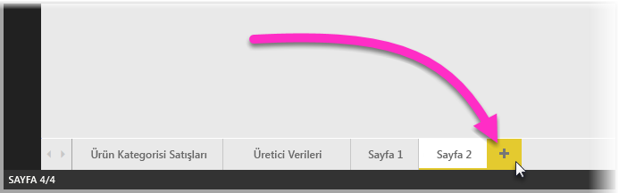

Araç ipucunuz herhangi bir boyutta olabilir, ancak araç ipuçlarının rapor tuvali üzerine geldiğini ve bu nedenle bunları makul ölçüde kısa tutmanız gerekebileceğini unutmayın. **Sayfa Boyutu** kartındaki **Biçim** bölmesinde *Araç İpucu* adında yeni bir sayfa boyutu şablonu görebilirsiniz. Bu, araç ipucunuz için hazır bir rapor sayfası tuvali sağlar.

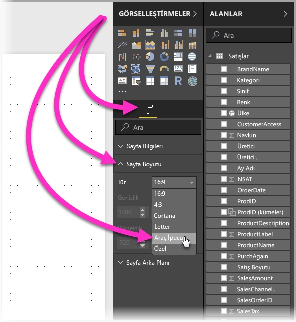

Varsayılan olarak **Power BI Desktop**, rapor tuvalinizi sayfadaki kullanılabilir alana sığdırır. Bu, genellikle faydalıdır ancak araç ipuçları söz konusu olduğunda kullanışlı değildir. İşlemi tamamladığınızda araç ipucunuzun nasıl görüneceğine ilişkin daha net bir fikir edinmek için **Sayfa Görünümü**’nü gerçek boyuta değiştirebilirsiniz. 

Bunu yapmak için şeritten **Görünüm** sekmesini seçin. Buradan, aşağıdaki resimde gösterildiği gibi **Sayfa Görünümü > Gerçek Boyut** seçeneğini belirleyin.

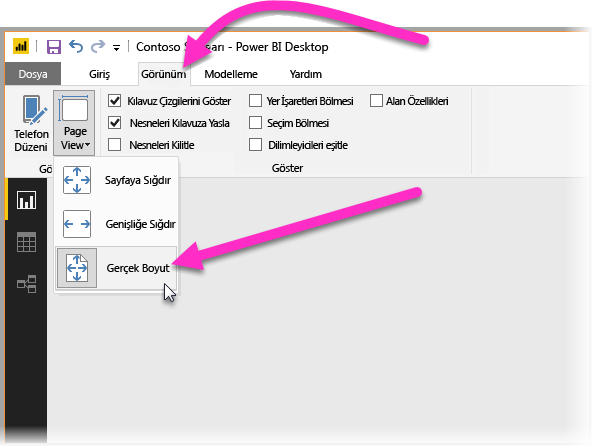

Ayrıca rapor sayfasını, amacı belirgin olacak şekilde de adlandırabilirsiniz. **Biçim** bölmesindeki **Sayfa Bilgileri** kartını seçip buradaki **Ad** alanına adı yazmanız yeterlidir. Aşağıdaki resimde araç ipucu rapor adı *Tooltip 1*’dir ancak siz daha ilgi çekici bir ad verebilirsiniz.

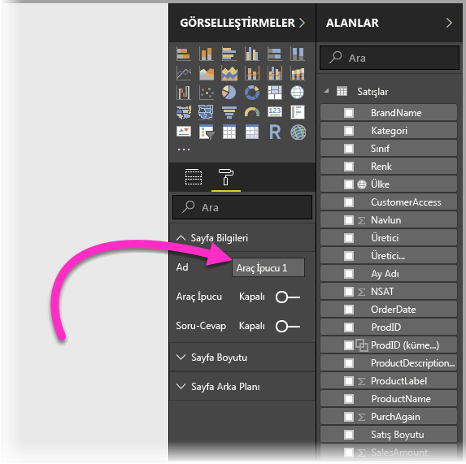

Buradan, araç ipucunuzda görünmesini istediğiniz görseli oluşturabilirsiniz. Aşağıdaki resimde, araç ipucu sayfasında iki kart ve bir kümelenmiş çubuk grafiğin yanı sıra sayfaya istediğimiz görünümü kazandırabilmemiz için sayfanın kendisine yönelik bir arka plan rengi ve görsellerin her birine yönelik arka planlar bulunur.

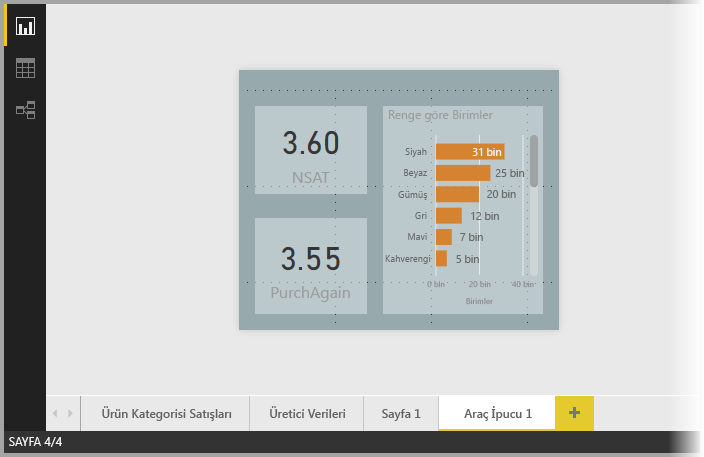

Araç ipucu rapor sayfanız bir araç ipucu olarak çalışmaya hazır hale gelmeden önce tamamlanması gereken başka adımlar vardır. Sonraki bölümde açıklandığı gibi araç ipucu sayfasını birkaç şekilde yapılandırmanız gerekir. 

## Araç ipucu rapor sayfanızı yapılandırma

Araç ipucu rapor sayfasını oluşturduktan sonra **Power BI Desktop**’ın bunu araç ipucu olarak kaydetmesi için ve doğru görsellerin üzerinde görünmesini sağlamak için sayfayı yapılandırmanız gerekir.

İlk olarak, sayfayı bir araç ipucu haline getirmek için **Sayfa Bilgileri** kartındaki **Araç ipucu** kaydırıcısını **Açık** duruma getirmeniz gerekir. 

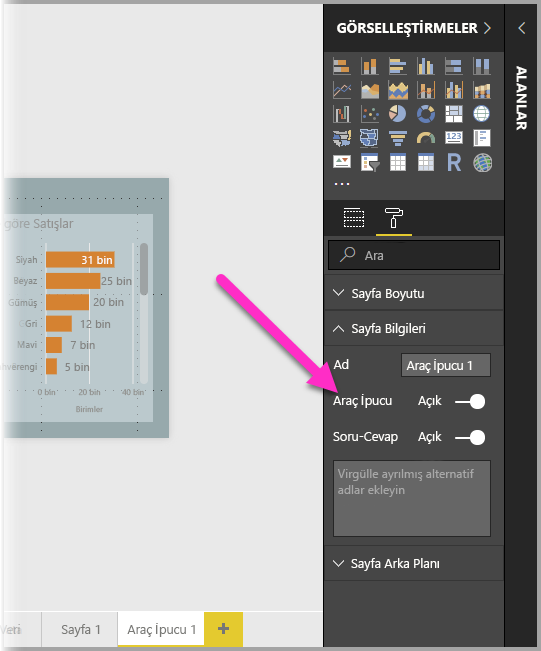

Kaydırıcı, açık duruma getirildikten sonra rapor araç ipucunun görünmesini istediğiniz alanları belirtirsiniz. Raporda, belirttiğiniz alanı içeren görseller için araç ipucu görünür. Alan veya alanları **Görselleştirmeler** bölmesindeki **Alanlar** bölümünde bulunan **Araç ipucu alanları** demetine sürükleyerek hangi alanın ya da alanların geçerli olacağını belirtirsiniz. Aşağıdaki resimde *SalesAmount* alanı **Tooltip fields** (Araç ipucu alanları) demetine sürüklenmiştir.

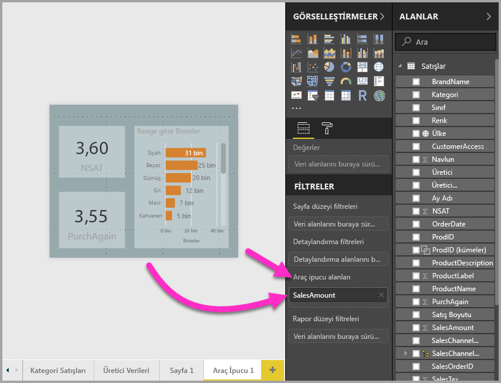
 
Ölçüler de dahil olmak üzere hem kategorik hem de sayısal alanları **Araç ipuçları alanları** demetine ekleyebilirsiniz.

Tamamlandığında, oluşturduğunuz araç ipucu rapor sayfası, raporda **Araç ipucu alanları** demetine yerleştirdiğiniz herhangi bir alanı kullanan görsellerde bir araç ipucu olarak kullanılarak varsayılan Power BI araç ipucunun yerine geçer.

## Bir rapor araç ipucunu el ile ayarlama

Belirtilen alanı içeren bir görselin üzerine gelindiğinde otomatik olarak görünen bir araç ipucu oluşturmanın yanı sıra bir araç ipucunu el ile ayarlayabilirsiniz. 

Rapor araç ipuçlarını destekleyen herhangi bir görsel artık kendi **Biçimlendirme** bölmesinde bir **Araç ipucu** kartına sahiptir. 

Bir araç ipucunu el ile ayarlamak için el ile araç ipucunu belirtmek istediğiniz görseli seçin ve sonra **Görselleştirmeler** bölmesinde, **Biçim** bölümünü seçin ve **Araç ipucu** kartını genişletin.

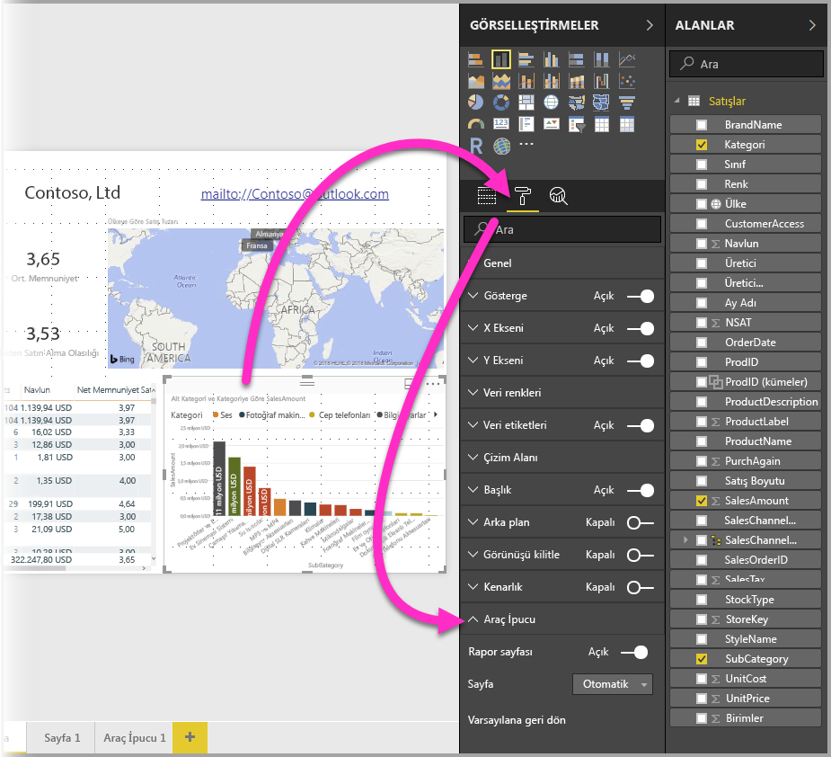

Daha sonra **Sayfa** açılan menüsünde, seçilen görsel için kullanmak istediğiniz araç ipucu sayfasını seçin. Yalnızca **Araç ipucu** sayfaları olarak belirtilen rapor sayfalarının iletişim kutusunda göründüğünü unutmayın.

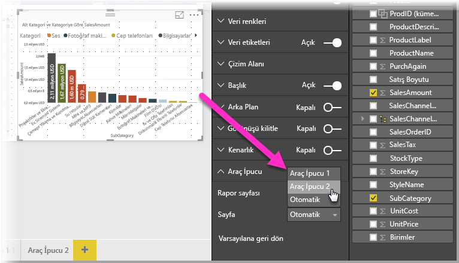

El ile araç ipucu ayarlayabilme işlevinin birçok kullanımı vardır. Bir araç ipucu için boş bir sayfa ayarlayabilir, böylece varsayılan Power BI araç ipucu seçimini geçersiz kılabilirsiniz. Power BI tarafından otomatik olarak seçilen araç ipucunun, araç ipucu olmasını istememeniz durumunda da bu işlevden yararlanabilirsiniz. Örneğin, iki alan içeren bir görseliniz varsa ve bu alanların her ikisinde de ilişkili bir araç ipucu bulunuyorsa Power BI, gösterilmesi için yalnızca birini seçer. Bunun olmasını istemediğiniz durumlarda, görüntülenmesi gereken araç ipucunu el ile seçebilirsiniz.

## Varsayılan araç ipuçlarına geri alma

Bir görsel için el ile bir araç ipucu oluşturduktan sonra bunun yerine varsayılan araç ipucunu istediğinize karar verirseniz, Power BI’ın sunduğu varsayılan araç ipucuna dilediğiniz zaman geri dönebilirsiniz. Varsayılana geri dönmek için, bir görsel seçildiğinde ve **Araç ipucu** kartı genişletilmiş durumdayken **Sayfa** açılan menüsünden *Otomatik*’i seçmeniz yeterlidir.

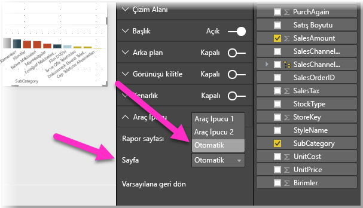

## Özel rapor araç ipuçları ve çizgi grafikler

Rapor araç ipuçlarınız, çizgi grafik görselleriyle ve çapraz vurgulama sırasındaki görsellerle etkileşim kurarken göz önünde bulundurmanız gereken birkaç nokta vardır.

### Rapor araç ipuçları ve çizgi grafikler

Bir çizgi grafik için rapor araç ipucu görüntülendiğinde grafikteki tüm çizgiler için yalnızca bir araç ipucu görüntülenir. Bu, çizgi grafikler için yalnızca bir araç ipucu görüntüleyen varsayılan araç ipucu davranışına benzer. 

Bunun nedeni, göstergedeki alanın araç ipucu için bir filtre olarak geçirilmemesidir. Aşağıdaki resimde görüntülenen araç ipucu, rapor araç ipucunda görüntülenen üç sınıfta (bu örnekte Deluxe, Economy ve Regular) o gün satışı yapılan tüm birimleri gösterir. 

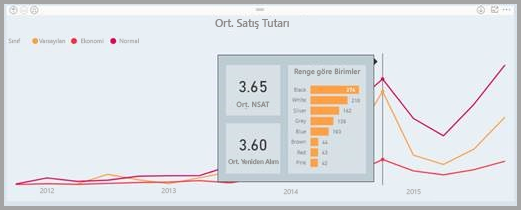

### Rapor araç ipuçları ve çapraz vurgulama

Raporda bir görsel çapraz vurgulandığında, veri noktasının soluk bölümü üzerine gelseniz bile rapor araç ipuçları her zaman çapraz vurgulu verileri gösterir. Aşağıdaki resimde fare, çubuk grafiğin soluk bölümü (vurgulanmayan bölüm) üzerine geliyor ancak rapor ipucu yine de söz konusu veri noktasının vurgulanan kısmına ilişkin verileri (vurgulanan veriler) gösteriyor.

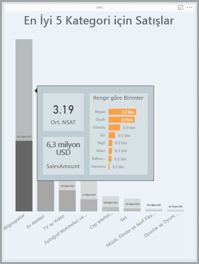

## Sınırlamalar ve önemli noktalar
**Araç ipuçları** için dikkat etmeniz gereken bazı sınırlamalar ve önemli noktalar vardır.

* **Power BI Desktop**'ın araç ipuçlarının genel kullanıma sunulduğu Eylül 2018 sürümünden itibaren Kart görselleri de araç ipuçları için destek sunmaktadır.
* Temmuz 2018 tarihli **Power BI Desktop** sürümünde, Tablo ve Matris görsellerinde araç ipuçları desteklenir. 
* Rapor araç ipuçları, mobil uygulamalarda raporlar görüntülenirken desteklenmez. 
* Rapor araç ipuçları, özel görseller için desteklenmemektedir. 
* Kümeler şu an için rapor ipuçlarında gösterilebilen alanlar olarak desteklenmemektedir. 
* Bir alan-kategori karşılaştırması kullanılırken, rapor araç ipuçları için bir alanın gösterilmesi seçildiğinde söz konusu alanı içeren görseller yalnızca özetleme, seçili alanla eşleştiğinde belirtilen araç ipucunu gösterir. 

## Sonraki adımlar
Rapor araç ipuçlarına benzeyen veya bunlarla etkileşim kuran özellikler hakkında daha fazla bilgi için aşağıdaki makalelere göz atın:

* [Power BI Desktop'ta detaylandırma özelliğini kullanma](desktop-drillthrough.md)
* [Bir pano kutucuğunu veya rapor görselini Odak modunda görüntüleme](consumer/end-user-focus.md)

