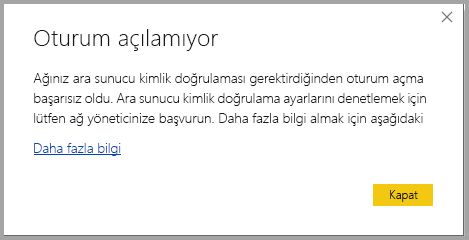
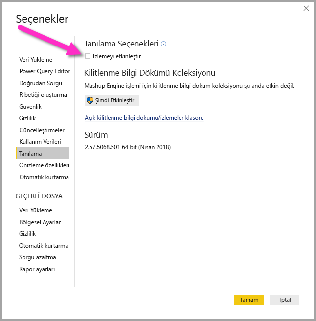
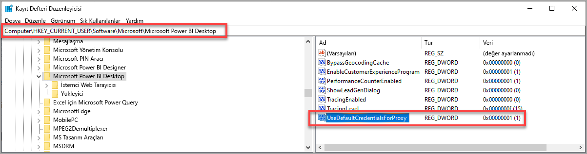

# Power BI Desktop'ta oturum açma sorunlarını giderme
Bazı durumlarda **Power BI Desktop**’ta oturum açmaya çalıştığınızda hatalarla karşılaşabilirsiniz. Oturum açma sorununun iki birincil nedeni vardır: **Ara Sunucu Kimlik Doğrulaması hataları** ve **HTTPS olmayan URL yeniden yönlendirme hataları**. 

Oturum açma sorununuza hangisinin neden olduğunu belirlemek adına, ilk adım yöneticinize başvurmak ve sorunun nedenini belirleyebilmesi için tanılama bilgilerini sağlamaktır. Yöneticiler, oturum açarken yaşadığınız sorunları izleyerek aşağıdaki hatalardan hangisinin sizin için geçerli olduğunu belirleyebilir. 

Sırayla bu sorunların hepsine bir göz atalım. Bu makalenin sonunda, Power BI Desktop’ta bir *izlemenin* nasıl yakalanacağı açıklanır. Bu bilgiler sorunlarınızı bulmanıza yardımcı olabilir.

## Ara Sunucu Kimlik Doğrulaması Gerekiyor hatası

Aşağıdaki ekranda *Ara Sunucu Kimlik Doğrulaması Gerekiyor* hatasının bir örneği gösterilir.

*Power BI Desktop* izleme dosyalarında bulunan aşağıdaki özel durumlar şu hatayla ilişkilidir:

* *Microsoft.PowerBI.Client.Windows.Services.PowerBIWebException*
* *HttpStatusCode: ProxyAuthenticationRequired*

Bu hata oluştuğunda, bunun en olası nedeni, ağınızdaki bir ara sunucu kimlik doğrulaması sunucusunun **Power BI Desktop** tarafından sağlanan web isteklerini engellemesidir. 

Ağınız bir ara sunucu kimlik doğrulaması sunucusu kullanıyorsa, yöneticiniz aşağıdaki etki alanlarını ara sunucu kimlik doğrulaması sunucusunda izin verilenler listesine ekleyerek bu sorunu giderebilir:

* app.powerbi.com
* api.powerbi.com
* *.analysis.windows.net ad alanında bulunan etki alanları

Kamu bulutuna dahil müşteriler için, aşağıdaki etki alanları ara sunucu kimlik doğrulaması sunucusunda izin verilenler listesine eklenerek bu sorun giderilebilir:

* app.powerbigov.us
* api.powerbigov.us
* *.analysis.usgovcloudapi.net ad alanındaki etki alanları

## HTTPS olmayan URL yeniden yönlendirmesi desteklenmiyor hatası

**Power BI Desktop**’ın geçerli sürümleri, Active Directory Kimlik Doğrulaması Kitaplığı’nın (ADAL) güvenli olmayan (HTTPS olmayan) URL'lere yeniden yönlendirmeye izin vermeyen geçerli sürümünü kullanıyor. 

*Power BI Desktop* izleme dosyalarında bulunan aşağıdaki özel durumlar şu hatayla ilişkilidir:

* *Microsoft.IdentityModel.Clients.ActiveDirectory.AdalServiceException: HTTPS olmayan URL yeniden yönlendirmesi web görünümünde desteklenmiyor*
* *ErrorCode: non_https_redirect_failed*

*ErrorCode: non_https_redirect_failed* hatası oluşursa, bunun nedeni, yeniden yönlendirme zincirindeki en az bir yeniden yönlendirme sayfası ya da sağlayıcısının HTTPS korumalı bir uç noktası olmaması veya en az bir yeniden yönlendirmeye ait sertifika verenin cihazın güvenilen kökleri arasında bulunmamasıdır. Oturum açma yeniden yönlendirme zincirindeki tüm sağlayıcıların bir HTTPS URL'si kullanması gerekir. Bu sorunu gidermek için, yöneticinize başvurun ve kimlik doğrulama siteleri için güvenli URL’lerin kullanılmasını isteyin. 

## Power BI Desktop’ta izleme toplama

**Power BI Desktop**’ta bir izleme toplamak için şu adımları izleyin:

1. **Power BI Desktop**’ta izlemeyi etkinleştirmek için **Dosya > Seçenekler ve ayarlar > Seçenekler**’e gidin ve sol bölmedeki seçeneklerden **Tanılama**’yı seçin. Görünen bölmede, aşağıdaki resimde gösterildiği gibi **İzlemeyi etkinleştir**’in yanında bulunan kutuyu işaretleyin. **Power BI Desktop**’ı yeniden başlatmanız gerekebilir.
   
   

2. Ardından hatayı yeniden oluşturan adımları izleyin. Bu gerçekleşirse, **Power BI Desktop** yerel bilgisayarda tutulan izleme günlüğüne olaylar ekler.

3. Yerel bilgisayarınızdaki İzlemeler klasörüne gidin. Önceki resimde **Kilitlenme bilgi dökümü/izlemeler klasörü** olarak gösterilen bu klasörü, izlemeyi etkinleştirdiğiniz *Tanılama* seçeneğindeki bağlantıyı seçerek bulabilirsiniz. Genellikle bu yerel bilgisayarda şu konumda bulunur:

    `C:\Users/<user name>/AppData/Local/Microsoft/Power BI Desktop/Traces`

Bu klasörde birçok izleme dosyası olabilir. Hatanın tanımlanmasını kolaylaştırmak için yöneticinize yalnızca son kullanılan dosyaları gönderdiğinizden emin olun. 

## Web proxy için varsayılan sistem kimlik bilgilerini kullanma

Power BI Desktop tarafından yapılan web istekleri, web proxy kimlik bilgilerini kullanmaz. Proxy sunucusunu kullanan ağlarda Power BI Desktop başarıyla web istekleri yapamayabilir. 

2020 Mart tarihli Power BI Desktop sürümünden itibaren sistem veya ağ yöneticileri, web proxy kimlik doğrulaması için varsayılan sistem kimlik bilgilerinin kullanılmasına izin verebilir. Yöneticiler, web proxy kimlik doğrulaması için varsayılan sistem kimlik bilgilerinin kullanılmasına olanak sağlamak amacıyla **UseDefaultCredentialsForProxy** adlı bir kayıt defteri girişi oluşturabilir ve değeri bir (1) olarak ayarlayabilir.

Kayıt defteri girişi aşağıdaki konumlardan birine yerleştirilebilir:

`[HKEY_LOCAL_MACHINE\SOFTWARE\WOW6432Node\Microsoft\Microsoft Power BI Desktop]`
`[HKEY_LOCAL_MACHINE\SOFTWARE\Microsoft\Microsoft Power BI Desktop]`

Her iki konumda da kayıt defteri girişi olması gerekmez.

Kayıt defteri girişi oluşturulduktan sonra (yeniden başlatma gerekebilir), Power BI Desktop web istekleri yaptığında Internet Explorer’da tanımlanan proxy ayarları kullanılır. 

Proxy veya kimlik bilgisi ayarlarında yapılan değişikliklerde olduğu gibi, bu kayıt defteri girişinin oluşturulması üzerinde de güvenlik etkileri vardır, bu nedenle yöneticilerin bu özelliği etkinleştirmeden önce Internet Explorer proxy’lerini doğru şekilde yapılandırdığından emin olması gerekir.         

### Varsayılan sistem kimlik bilgilerini kullanmaya yönelik sınırlamalar ve dikkat edilecek hususlar

Yöneticilerin bu özelliği etkinleştirmeden önce göz önünde bulundurması gereken bir dizi güvenlik etkisi vardır. 

İstemciler için bu özellik her etkinleştirildiğinde aşağıdaki önerilere uyulması gerekir:

* Yalnızca Active Directory ağına katılan proxy sunucuların istemci tarafından kullanıldığından emin olmak için, proxy sunucuda kimlik doğrulaması şeması olarak yalnızca **Anlaşma** seçeneğini kullanın. 
* Bu özelliği kullanan istemcilerde **NTLM geri dönüşü**’nü kullanmayın.
* Bu özellik etkinleştirildiğinde ve bu bölümde önerildiği şekilde yapılandırıldığında kullanıcılar proxy içeren bir ağ üzerinde değilse, proxy sunucuyla iletişim kurmaya çalışıp varsayılan sistem kimlik bilgilerini kullanma süreci kullanılmaz.

[Web proxy için varsayılan sistem kimlik bilgilerini kullanma](#using-default-system-credentials-for-web-proxy)

