# Öğretici: Power BI Desktop'ta kendi ölçülerinizi oluşturma
Ölçüleri kullanarak Power BI Desktop’taki en güçlü veri analizi çözümlerinden bazılarını oluşturabilirsiniz. Ölçüler, raporlarınızla etkileşim kurarken verileriniz üzerinde hesaplamalar gerçekleştirerek size yardımcı olur. Bu öğretici, Power BI Desktop’ta temel ölçüleri anlama ve kendi ölçülerinizin bazılarını oluşturma konusunda size yol gösterir.

## Önkoşullar

- Bu öğretici, Power BI Desktop’ı daha gelişmiş modeller oluşturmak için kullanmaya alışmış Power BI kullanıcılarına yöneliktir. Verileri içeri aktarmak, birden çok ilişkili tabloyla çalışmak ve rapor tuvaline alan eklemek için Veri Al ve Sorgu Düzenleyicisi özelliklerini kullanmaya alışmış olmanız gerekir. Power BI Desktop'a yeni başladıysanız [Power BI Desktop ile çalışmaya başlama](desktop-getting-started.md) makalesine mutlaka göz atın.
  
- Bu öğreticide, kurgusal Contoso şirketinin çevrimiçi satış verilerini içeren [Contoso Sales Sample for Power BI Desktop](https://download.microsoft.com/download/4/6/A/46AB5E74-50F6-4761-8EDB-5AE077FD603C/Contoso%20Sales%20Sample%20for%20Power%20BI%20Desktop.zip) dosyası kullanılır. Bu veriler veritabanından içeri aktarıldığından veri kaynağına bağlanamaz veya bunu Sorgu Düzenleyicisi'nde görüntüleyemezsiniz. Dosyayı bilgisayarınıza indirip ayıklayın.

## Otomatik ölçüler

Power BI Desktop bir ölçü oluşturduğunda bu çoğunlukla sizin için otomatik olarak oluşturulur. Power BI Desktop’ın nasıl ölçü oluşturduğunu görmek için şu adımları izleyin:

1. Power BI Desktop’ta **Dosya** > **Aç**’ı seçin, *Contoso Sales Sample for Power BI Desktop.pbix* dosyasına gidin ve **Aç**’ı seçin.

2. **Alanlar** bölmesindeki **Satış** tablosunu genişletin. Sonra **SalesAmount** alanının yanındaki onay kutusunu işaretleyin veya **SalesAmount** alanını rapor tuvaline sürükleyin.

    **Satış** tablosunun **SalesAmount** sütununda yer alan tüm değerlerin toplamını gösteren yeni bir sütun grafiği görselleştirmesi görüntülenir.

    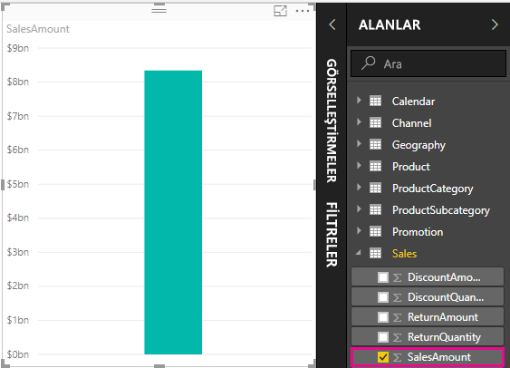

**Alanlar** bölmesinde sigma simgesi  olan her alan (sütun) sayısaldır ve değerleri toplanabilir. Power BI Desktop, çok fazla değer içeren (iki milyon **SalesAmount** satırı) bir tablo görüntülemek yerine, bir sayısal veri türü algıladığında verileri toplamak için otomatik olarak bir ölçü oluşturup hesaplar. Toplam, bir sayısal veri türü için varsayılan toplamadır, ancak ortalama veya sayım gibi farklı toplamaları kolayca uygulayabilirsiniz. Her ölçü bir tür toplama işlemi gerçekleştirdiğinden, toplama işlemlerini anlamak ölçüleri anlamaktan geçer. 

Grafik toplamayı değiştirmek için şu adımları izleyin:

1. Rapor tuvalinde **SalesAmount** görselleştirmesini seçin.  

1. **Görselleştirmeler** bölmesinin **Değer** alanında **SalesAmount** öğesinin yanındaki aşağı oku seçin. 

1. Görüntülenen menüden **Ortalama**’yı seçin. 

    Görselleştirme, **SalesAmount** alanındaki tüm satış değerlerinin ortalamasını gösterecek şekilde değişir.

    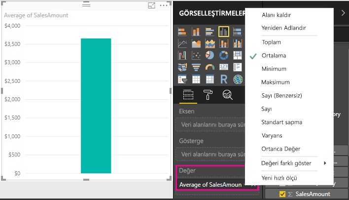

İstediğiniz sonuca bağlı olarak toplama türünü değiştirebilirsiniz. Ancak her toplama türü her sayısal veri türüne uygulanamaz. Örneğin **SalesAmount** alanı için Toplam ve Ortalama işlemleri kullanışlıdır ve Minimum ve Maksimum da kullanılabilir. Ancak **SalesAmount** alanının değerleri sayısal olmasına rağmen bunlar aslında para birimi olduğundan Sayım işlemi bu alan için pek anlamlı olmaz.

Ölçülerden hesaplanan değerler, raporla etkileşimlerinize bağlı olarak değişiklik gösterir. Örneğin **Coğrafya** tablosundan **RegionCountryName** alanını mevcut **SalesAmount** grafiğinize sürüklediğinizde grafik her ülkenin ortalama satış tutarını gösterecek şekilde değişir.

Raporunuzla bir etkileşim nedeniyle bir ölçünün sonucu değiştiğinde, ölçünüzün *bağlamını* etkilemiş olursunuz. Rapor görselleştirmelerinizle her etkileşime geçtiğinizde, bir ölçünün hesaplama yaptığı ve bu hesaplamanın sonuçlarını görüntülediği bağlamı değiştirmiş olursunuz.

## Kendi ölçülerinizi oluşturma ve kullanma

Çoğu durumda seçtiğiniz türde alanlara ve toplamalara göre Power BI Desktop otomatik olarak değerleri hesaplar ve döndürür. Ama bazı durumlarda daha karmaşık, benzersiz hesaplamalar gerçekleştirmek için kendi ölçülerinizi oluşturmak isteyebilirsiniz. Power BI Desktop ile kendi ölçülerinizi oluştururken Veri Çözümleme İfadeleri (DAX) formül dilini kullanabilirsiniz. 

DAX formülleri, Excel formüllerinde de bulunan birçok işlevi, işleci ve söz dizimini kullanır. Ancak DAX işlevleri, ilişkisel verilerle çalışacak ve raporlarınızla etkileşime geçtiğimiz sırada daha dinamik hesaplamalar gerçekleştirecek şekilde tasarlanmıştır. Toplam ve Ortalama gibi basit toplama işlemlerinden daha karmaşık istatistik ve filtreleme işlevlerine kadar her şeyi yapan 200’ün üzerinde DAX işlevi vardır. DAX hakkında daha fazla bilgi edinmenize yardımcı olacak birçok kaynak vardır. Bu öğreticiyi tamamladıktan sonra [Power BI Desktop’ta DAX kullanımıyla ilgili temel bilgiler](desktop-quickstart-learn-dax-basics.md) makalesine bakın.

Kendi ölçünüzü oluşturduğunuzda bu ölçüye *model* ölçüsü denir ve seçtiğiniz tablonun **Alanlar** listesine eklenir. Model ölçülerinin avantajlarından bazıları, bunlara istediğiniz adı vererek daha kolay tanımlanabilmesini sağlayabilmeniz; diğer DAX ifadelerinde bunları bağımsız değişken olarak kullanabilmeniz ve karmaşık hesaplamaları hızla gerçekleştirmelerini sağlayabilmenizdir.

### Hızlı ölçümler

Power BI Desktop’ın Şubat 2018 sürümünden itibaren birçok genel hesaplama, *hızlı ölçüler* olarak kullanılabilir ve bir penceredeki girdilerinize dayanarak sizin için DAX formüllerini yazabilir. Bu hızlı ve güçlü hesaplamalar, DAX’ı öğrenmek ve kendi özelleştirilmiş ölçülerinizin çekirdeğini oluşturmak için de mükemmeldir. 

Bu yöntemlerden birini kullanarak hızlı ölçü oluşturun: 
 - **Alanlar** bölmesindeki bir tabloda **Daha fazla seçenek** ( **...** ) öğesine sağ tıklayın veya bu öğeyi seçin ve listeden **Yeni hızlı ölçü**’yü seçin.

 - Power BI Desktop şeridinin **Giriş** sekmesindeki **Hesaplamalar**’ın altından **Yeni Hızlı Ölçü**’yü seçin.

Hızlı ölçüleri oluşturma ve kullanma hakkında daha fazla bilgi için [Hızlı ölçüleri kullanma](desktop-quick-measures.md) bölümüne bakın.

### Ölçü oluşturma

Toplam satış miktarından indirimleri ve iadeleri çıkararak net satışınızı analiz etmek istediğinizi varsayalım. Görselleştirmenizde var olan bağlam için, SalesAmount toplamından DiscountAmount ve ReturnAmount toplamını çıkaran bir ölçü gerekir. **Alanlar** listesinde Net Satış için bir alan yoktur, ancak net satışı hesaplamak için kendi ölçünüzü oluşturmak üzere yapı taşlarınız vardır. 

Ölçü oluşturmak için şu adımları izleyin:

1. **Alanlar** bölmesinde **Satış** tablosuna sağ tıklayın veya imleci tablonun üzerine getirip **Daha fazla seçenek** ( **...** ) öğesini seçin. 

1. Görüntülenen menüde **Yeni ölçü**’yü seçin. 

    Bu eylem yeni ölçünüzü **Satış** tablosuna kaydeder ve buradan kolayca bulabilirsiniz.
    
    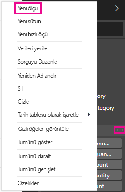
    
    Power BI Desktop şeridindeki **Giriş** sekmesinin **Hesaplamalar** grubunda **Yeni Ölçü**’yü seçerek de yeni bir ölçü oluşturabilirsiniz.
    
    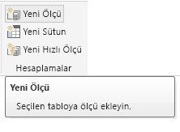
    
    >[!TIP]
    >Şeritten bir ölçü oluşturduğunuzda bu ölçüyü tablolarınızdan herhangi birinde oluşturabilirsiniz ancak kullanmayı planladığınız yerde oluşturursanız bulmanız da kolaylaşır. Bu durumda, ilk olarak **Satış** tablosunu seçerek etkinleştirin ve sonra **Yeni ölçüyü** seçin. 
    
    Formül çubuğu, rapor tuvalinin üst kısmında görüntülenir. Burada, ölçünüzü yeniden adlandırabilir ve bir DAX formülü girebilirsiniz.
    
    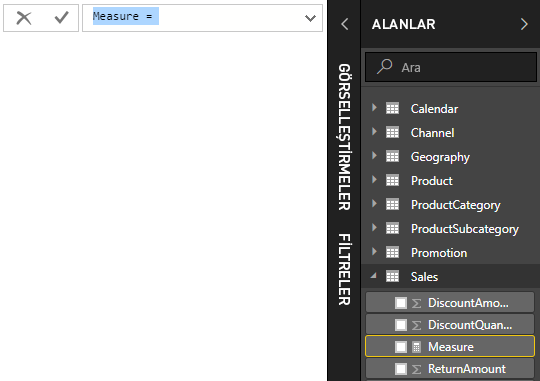
    
1. Yeni ölçülere varsayılan olarak *Ölçü* adı verilir. Yeniden adlandırmazsanız, sonraki yeni ölçüler *Ölçü 2*, *Ölçü 3* olarak adlandırılır ve bu şekilde devam eder. Ölçülerinizin daha kolay tanımlanabilmesini istediğimiz için formül çubuğundaki *Ölçü*’yü vurgulayın ve *Net Satış* olarak değiştirin.
    
1. Formülünüzü girmeye başlayın. Eşittir işaretinden sonra *Toplam* yazmaya başlayın. Siz yazarken, yazdığınız harflerle başlayan tüm DAX işlevlerini gösteren bir açılan öneri listesi görüntülenir. Gerekirse, sayfayı aşağı kaydırarak listeden **SUM**’ı seçin ve **Enter** tuşuna basın.
    
    
    
    Bir açma ayracı ve SUM işlevine geçirebileceğimiz, kullanılabilir sütunların bulunduğu bir açılır öneri listesi görünür.
    
    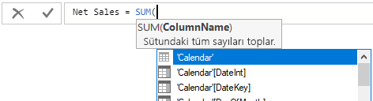
    
1. İfadeler her zaman bir açma ayracı ve kapatma ayracı arasında görüntülenir. Bu örnekte ifadeniz, SUM işlevine geçirilecek tek bir bağımsız değişken içerir: **SalesAmount** sütunu. Listede yalnızca **Sales(SalesAmount)** değeri kalıncaya kadar *SalesAmount* yazmaya başlayın. 

    Başında tablo adı bulunan sütun adına, sütunun tam adı denir. Tam sütun adları, formüllerinizin okunmasını kolaylaştırır.
    
    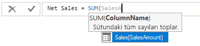
    
1. Listeden **Sales[SalesAmount]** seçeneğini belirleyin ve bir kapatma ayracı girin.
    
    > [!TIP]
    > Söz dizimi hatalarının sebebi genellikle eksik veya yanlış yerleştirilmiş bir kapanış parantezidir.
    
    
    
1. Formülün içinde diğer iki sütunu çıkarmak için:

    a. İlk ifadedeki kapatma ayracından sonra bir boşluk girin, ardından eksi işleci (-) ve başka bir boşluk girin. 

    b. Başka bir SUM işlevi girin ve bağımsız değişken olarak **Sales[DiscountAmount]** sütununu seçebilene kadar *DiscountAmount* yazmaya başlayın. Kapatma ayracı ekleyin. 

    c. Bir boşluk, eksi işleci, boşluk, bağımsız değişken olarak **Sales[ReturnAmount]** içeren başka bir SUM işlevi ve bir kapatma ayracı girin.
    
    
    
1. Formülü tamamlamak ve doğrulamak için **Enter** tuşuna basın veya formül çubuğundaki **Yürüt**’ü (onay işareti simgesi) seçin. 

    Doğrulanan **Net Satış** ölçüsü artık **Alanlar** bölmesindeki **Satış** tablosunda kullanıma hazırdır.
    
    
    
1. Formül girecek yeriniz kalmazsa veya formülün ayrı satırlarda olmasını istiyorsanız, daha fazla yer açmak için formül çubuğunun sağ tarafındaki aşağı oku seçin. 

    Aşağı ok, yukarı okuna dönüşür ve büyük bir kutu görüntülenir.

    

1. Formülünüzü **Alt** + **Enter** tuşlarına basarak ayrı satırlara bölün veya **Sekme** tuşuna basarak sekme boşluğu ekleyin.

   

### Raporda ölçünüzü kullanma
Yeni **Net Satış** ölçünüzü rapor tuvaline ekleyin ve rapora eklediğiniz diğer tüm alanlar için net satışı hesaplayın. 

Ülkeye göre net satışı görmek için:

1. **Satış** tablosundan **Net Satış** ölçüsünü seçip rapor tuvaline sürükleyin.
    
1. **Coğrafya** tablosundan **RegionCountryName** alanını seçin veya **Net Satış** grafiğine sürükleyin.
    
    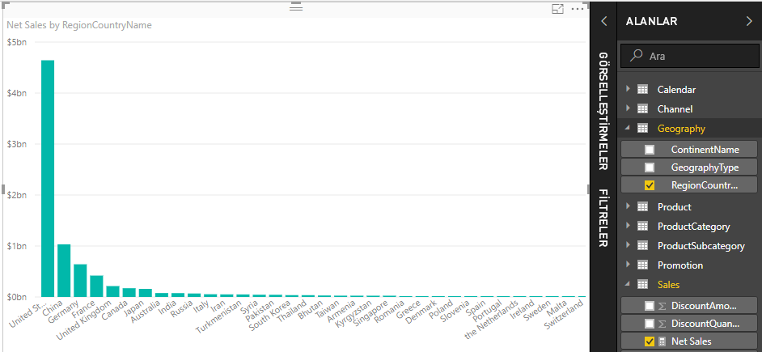
    
1. Ülkeye göre toplam satış ile net satış arasındaki farkı görmek için, **SalesAmount** alanını seçin veya grafiğe sürükleyin. 

    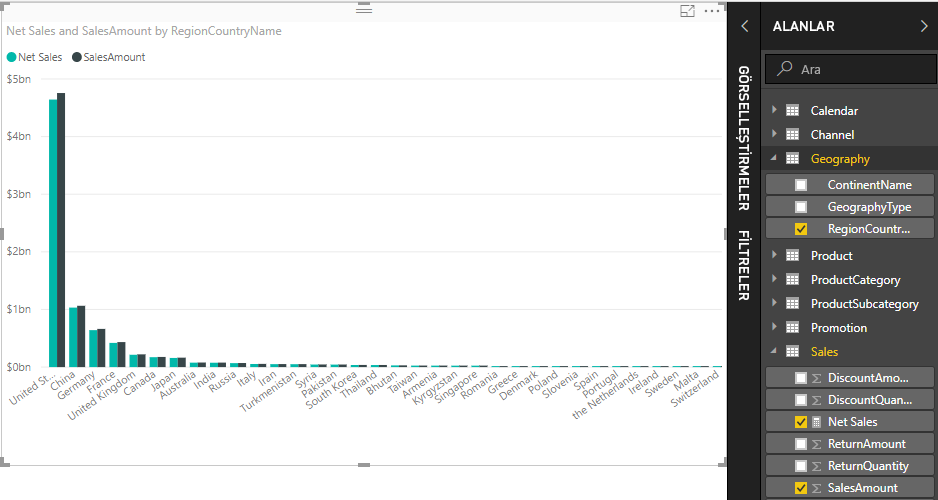

    Grafik şimdi iki ölçü kullanır: Power BI tarafından otomatik olarak toplanmış olan **SalesAmount** ölçüsü ve el ile sizin oluşturduğunuz **Net Sales** (Net Satış) ölçüsü. Her ölçü, başka bir alan (**RegionCountryName**) bağlamında hesaplanmıştır.
    
### Dilimleyici ile ölçünüzü kullanma

Net satışı ve satış tutarlarını takvim yılına göre filtrelemek için bir dilimleyici ekleyin:
    
1. Grafiğin yanındaki boş alanı seçin. **Görselleştirmeler** bölmesinde **Tablo** görselleştirmesini seçin. 

    Bu eylem rapor tuvalinde boş bir tablo görselleştirmesi oluşturur.
    
    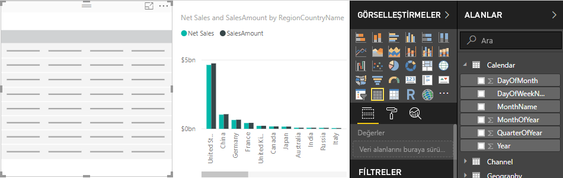
    
1. **Takvim** tablosundaki **Yıl** alanını yeni boş tablo görselleştirmesine sürükleyin. 
    
    **Yıl** sayısal bir alan olduğundan Power BI Desktop bu alanın değerlerini toplar. Bu toplam, toplama işlemi kadar iyi çalışmaz, bunu bir sonraki adımda ele alacağız.

    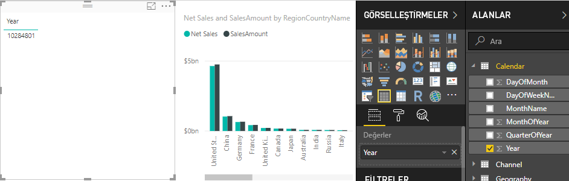
    
3. **Görsel Öğeler** bölmesindeki **Değerler** kutusunda **Yıl**’ın yanındaki aşağı oku seçin ve listeden **Özetleme** seçeneğini belirleyin. Tablo şimdi tek tek yılları listeler.
    
    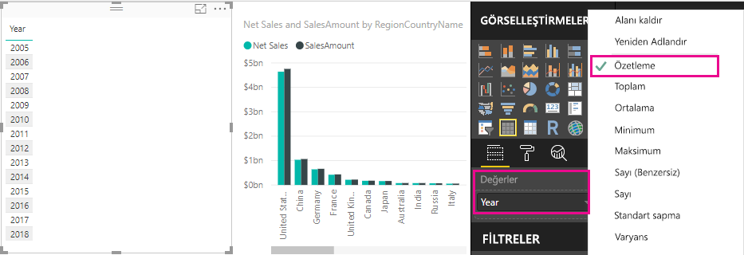
    
4.  Tabloyu dilimleyiciye dönüştürmek için **Görsel Öğeler** bölmesindeki **Dilimleyici** simgesini seçin. Görselleştirmede liste yerine kaydırıcı görüntüleniyorsa, kaydırıcıdaki aşağı oktan **Liste**’yi seçin.

    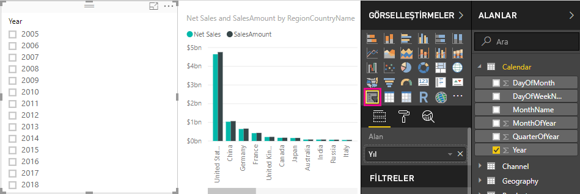
    
5.  **RegionCountryName değerine Göre Net Satış ve Satış Tutarı** grafiğini uygun şekilde filtrelemek için **Yıl** dilimleyicisinde herhangi bir değer seçin. **Net Satış** ve **SalesAmount** ölçüleri, seçilen **Yıl** alanı bağlamında sonuçları yeniden hesaplar ve görüntüler. 
    
    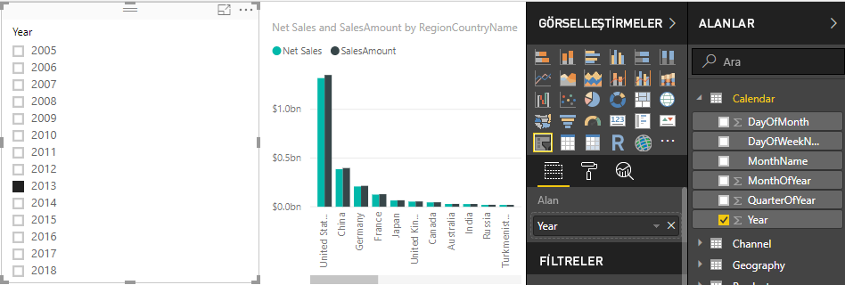

### Ölçünüzü başka bir ölçüde kullanma

Hangi ürünlerin satılan birim başına en yüksek net satış tutarına sahip olduğunu öğrenmek istediğinizi düşünelim. Net satışları satılan birim miktarına bölen bir ölçüye ihtiyacınız vardır. **Net Satış** ölçünüzün sonucunu, **Sales[SalesQuantity]** toplamına bölen yeni bir ölçü oluşturun.

1.  **Alanlar** bölmesindeki **Satış** tablosunda **Birim Başına Net Satış** adlı yeni bir ölçü oluşturun.
    
1. Formül çubuğuna *Net Satış* yazmaya başlayın. Öneri listesi, ne ekleyebileceğinizi gösterir. **[Net Sales]** seçeneğini belirleyin.
    
    
    
1. Ayrıca yalnızca bir açma ayracı ( **[** ) yazarak da ölçülere başvurabilirsiniz. Öneri listesi yalnızca formülünüze eklenecek ölçüleri gösterir.
    
    
    
1. Bir boşluk, bölme işleci (/), bir boşluk daha, bir SUM işlevi girin ve sonra *Miktar* yazın. Öneri listesi, adında *Miktar* olan tüm sütunları gösterir. **Sales[SalesQuantity]** öğesini seçin, kapatma ayracını yazın ve **ENTER** tuşuna basın veya formülünüzü doğrulamak için **Yürüt**’ü (onay işareti simgesi) seçin. 

    Sonuçta elde edilen formül şöyle görünmelidir:
    
    `Net Sales per Unit = [Net Sales] / SUM(Sales[SalesQuantity])`
    
1. **Satış** tablosundan **Birim Başına Net Satış** ölçüsünü seçin veya rapor tuvalindeki boş bir alana sürükleyin. 

    Grafik, satılan tüm ürünlerin birim başına net satış tutarını gösterir. Grafik çok bilgilendirici değildir; buna sonraki adımda değineceğiz.
    
    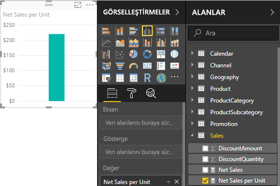
    
1. Farklı bir görünüm için, grafik görselleştirmesi türünü **Ağaç Haritası** olarak değiştirin.
    
    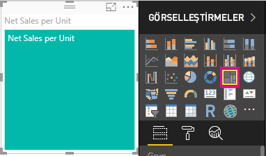
    
1. **Ürün Kategorisi** alanını seçin veya ağaç haritasına ya da **Görsel Öğeler** bölmesinin **Grup** alanına sürükleyin. Şimdi harika bilgilere sahipsiniz!
    
    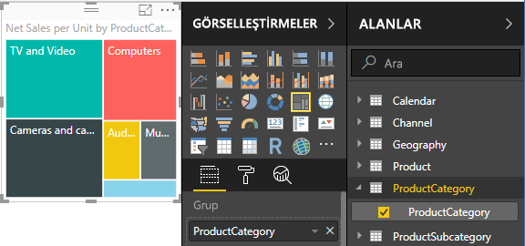
    
7. Bunun yerine **ProductCategory** alanını kaldırmayı ve **ProductName** alanını grafiğe sürüklemeyi deneyin. 
    
    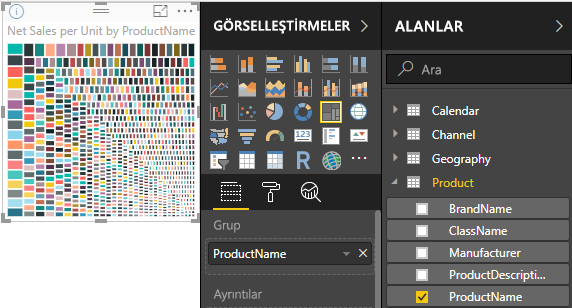
    
   Şu anda dilediğimiz gibi deneme yapıyor olabiliriz ancak kabul etmeniz gerekir ki bu oldukça havalı! Görselleştirmeyi filtrelemenin ve biçimlendirmenin diğer yollarını deneyin.

## Öğrendikleriniz
Ölçüler size verilerinizden istediğiniz içgörüleri elde etme gücü verir. Formül çubuğunu kullanarak ölçüler oluşturmayı, ölçüleri en mantıklı şekilde adlandırmayı ve DAX öneri listelerini kullanarak doğru formül öğelerini bulup seçmeyi öğrendiniz. Ayrıca, ölçülerdeki hesaplamaların sonuçlarının diğer alanlara veya formülünüzdeki başka ifadelere ya da alanlara göre değiştiği bağlam kavramıyla da tanışmış oldunuz.

## Sonraki adımlar
- Sizin için birçok genel ölçü hesaplamaları sağlayan Power BI Desktop hızlı ölçümleri hakkında daha fazla bilgi edinmek için bkz. [Genel ve güçlü hesaplamaları kolayca gerçekleştirmek için hızlı ölçüleri kullanma](desktop-quick-measures.md).
  
- DAX formüllerini daha ayrıntılı bir şekilde incelemek ve daha gelişmiş ölçüler oluşturmak istiyorsanız [Power BI Desktop’ta DAX kullanımıyla ilgili temel bilgiler](desktop-quickstart-learn-dax-basics.md) başlıklı makaleye bakabilirsiniz. Bu makale söz dizimi ve işlevler gibi DAX temel kavramlarını ele alır ve bağlama ilişkin daha kapsamlı bilgi sunar.
  
- Sık kullanılanlar listenize [Veri Çözümleme İfadeleri (DAX) Başvurusu](https://docs.microsoft.com/dax/index)'nu eklediğinizden emin olun. Bu başvuruda DAX söz dizimi, işleçleri ve 200'ü aşkın DAX işleviyle ilgili ayrıntılı bilgi bulabilirsiniz.

