# Öğretici: Power BI Desktop ile Facebook analizi

Bu öğreticide, Facebook’tan verileri içeri aktarmayı ve Power BI Desktop’ta bunları kullanmayı öğreneceksiniz. Bağlanıp Power BI Facebook sayfasından verileri içeri aktaracak, içeri aktarılan verilere dönüştürmeler uygulayacak ve rapor görselleştirmelerinde bu verileri kullanacaksınız.

> [!WARNING]
> Facebook Uygulaması izin kısıtlamaları nedeniyle, bu makalede açıklanan bağlayıcı özellikleri şu anda düzgün çalışmamaktadır. Bu işlevselliği mümkün olan en kısa sürede geri döndürmek için Facebook ile birlikte çalışıyoruz.

## Bir Facebook sayfasına bağlanma

Bu öğreticide, [Microsoft Power BI Facebook sayfasındaki](https://www.facebook.com/microsoftbi) ( *https://www.facebook.com/microsoftbi* ) veriler kullanılmaktadır. Bağlanmak ve bu sayfadan verileri içeri aktarmak için kişisel Facebook hesabı dışında özel bir kimlik bilgisi gerekmez.

1. Power BI Desktop’ı açın ve **Başlarken** iletişim kutusunda **Veri al** seçeneğini belirleyin veya **Giriş** şerit sekmesinde **Veri Al**’ı ve sonra **Diğer...** seçeneğini belirleyin.
   
2. **Veri Al** iletişim kutusunda, **Online Services** grubundan **Facebook**’u seçin ve **Bağlan** seçeneğini belirleyin.
   
   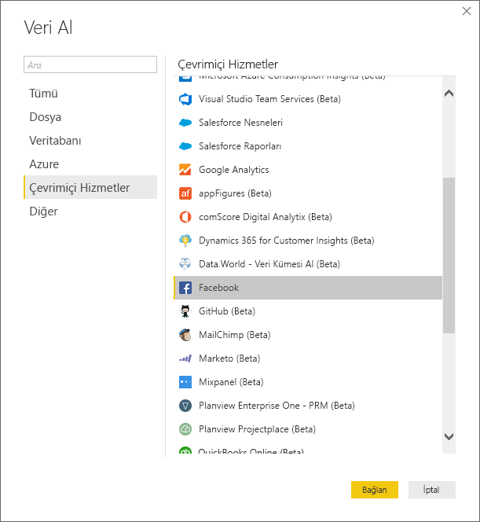
   
   Üçüncü taraf hizmetleri kullanmanın risklerini bildiren bir iletişim kutusu görüntülenir.
   
   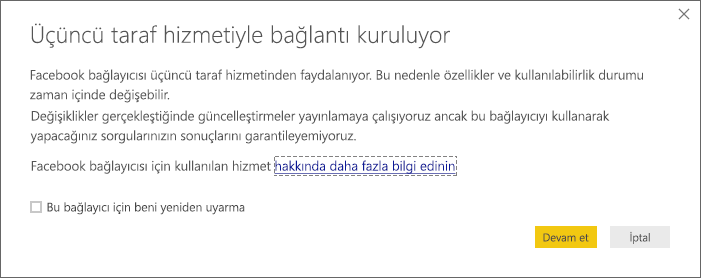
   
3. **Devam**’ı seçin. **Facebook** iletişim kutusu görüntülenir.
   
4. **Kullanıcı Adı** metin kutusuna **microsoftbi** sayfa adını yazın veya yapıştırın, **Bağlantı** açılır kutusundan **Gönderiler**’i seçin ve sonra **Tamam** seçeneğini belirleyin.
   
   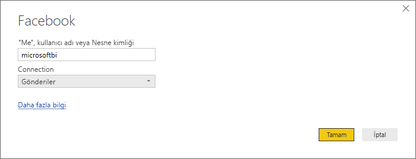
   
5. Kimlik bilgileri istendiğinde kendi Facebook hesabınızda oturum açın ve Power BI’ın hesabınız üzerinden erişim kurmasına izin verin.
   
   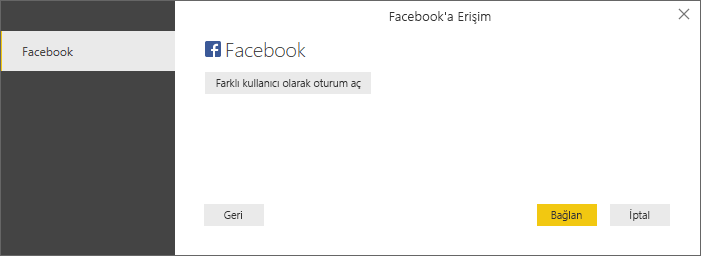

   Power BI Facebook sayfasına bağlandıktan sonra, sayfanın **Gönderiler** verilerinin önizlemesini görürsünüz. 
   
   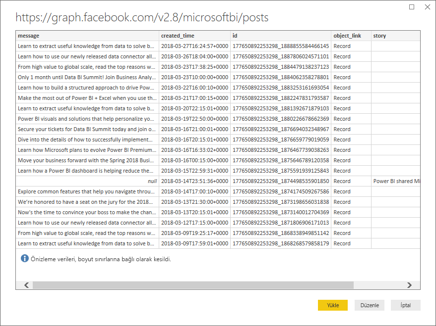
   
## İçeri aktarılan verileri şekillendirme ve dönüştürme

Zaman içinde hangi gönderilerin en çok açıklama içerdiğini görmek ve göstermek istiyorsunuz, ancak **Gönderiler** veri önizlemesinde, **created_time** verilerinin okunmasının ve anlaşılmasının zor olduğunu ve herhangi bir açıklama verisi olmadığını fark ediyorsunuz. En iyi şekilde yararlanmak için veriler üzerinde şekillendirme ve temizleme işlemi gerçekleştirmeniz gerekir. Verileri Power BI Desktop’a içeri aktarmadan önce veya sonra Power BI Desktop **Power Query Editor**’ı kullanarak düzenleyebilirsiniz. 

### Tarih/saat sütununu bölme

İlk olarak, **created_time** sütunundaki tarih ve saat değerlerini daha okunaklı olması için ayırın. 

1. Facebook veri önizlemesinde **Düzenle**’yi seçin. 
   
   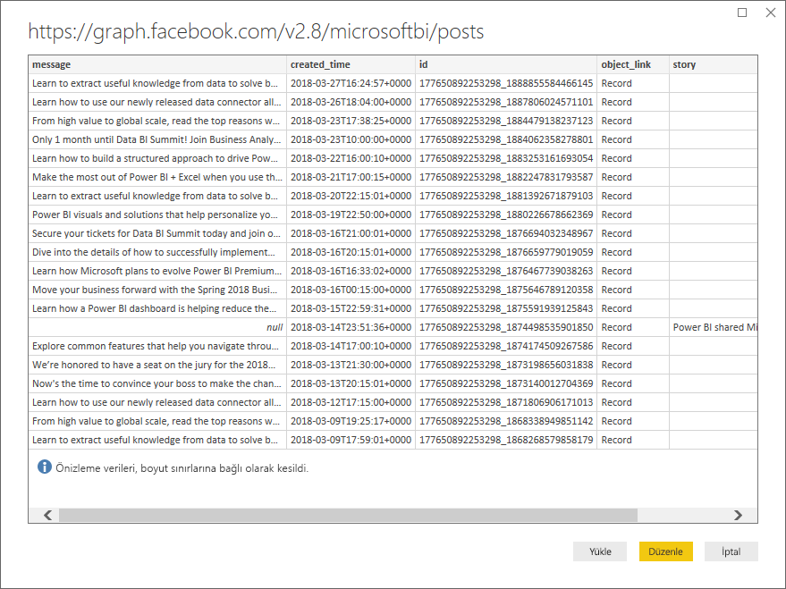
   
   Power BI Desktop **Power Query Editor**, yeni bir pencerede açılır ve Power BI Facebook sayfasından veri önizlemesini görüntüler. 
   
   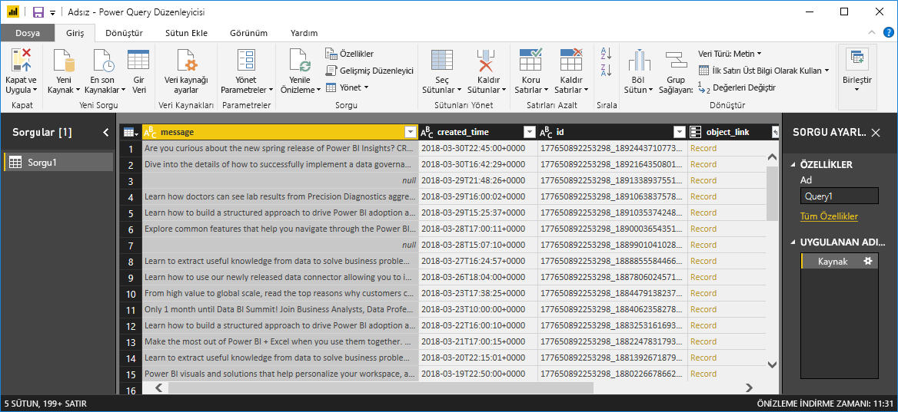
   
2. **created_time** sütununu seçin. Bunun, sütun üst bilgisindeki bir **ABC** simgesiyle gösterilen bir Metin veri türü olduğunu unutmayın. Üst bilgiye sağ tıklayın ve açılır listeden **Sütunu Böl > Sınırlayıcıya Göre** seçeneğini belirleyin veya şeridin Giriş sekmesindeki **Dönüştür** bölümünden **Sütunu Böl > Sınırlayıcıya Göre** seçeneğini belirleyin.  
   
   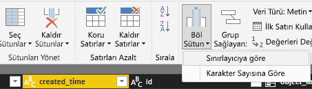
   
3. **Sütunu sınırlayıcıyla böl** iletişim kutusunda, açılır listeden **Özel**’i seçin, girdi alanına **T** (created_time değerlerinin zaman kısmının başındaki karakter) yazın ve **Tamam**’ı seçin. 
   
   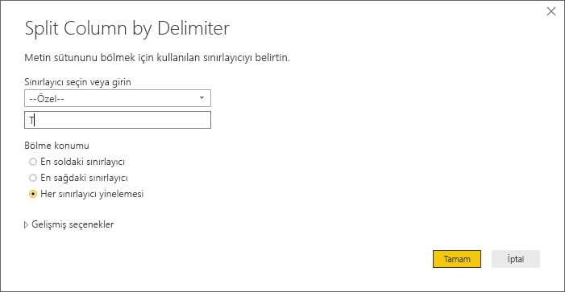
   
   Sütun, **T** sınırlayıcısından önceki ve sonraki dizeleri içeren iki sütuna ayrılır ve sırayla **created_time.1** ve **created_time.2** olarak adlandırılır. Power BI’ın veri türlerini otomatik olarak algıladığını ve bu veri türlerini birinci sütun için **Tarih** olarak, ikinci sütun için **Saat** olarak değiştirdiğini ve tarih ve saat değerlerini daha okunabilir olacak şekilde biçimlendirdiğini unutmayın.
   
4. Her bir sütun üst bilgisine çift tıklayarak veya her bir sütunu seçip sonra şeritteki **Dönüştür** sekmesinin **Herhangi Bir Sütun** Grubunda **Yeniden Adlandır**’ı seçerek, ardından sırayla **created_date** ve **created_time** olarak yeni sütun üst bilgilerini yazarak sütunları yeniden adlandırın.
   
   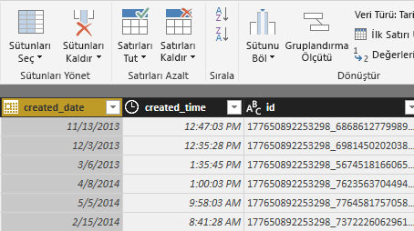
   
### İç içe geçmiş sütunu genişletme

Tarih ve saat verileri, istediğiniz şekilde olduğuna göre şimdi iç içe geçmiş bir sütunu genişleterek açıklama verilerini gösterirsiniz. 

1. **object_link** sütununu ve sonra  simgesini seçip **Genişlet/Toplat** iletişim kutusunu açın. **Bağlantılar**’ı seçin ve sonra **Tamam** seçeneğini belirleyin. 
   
   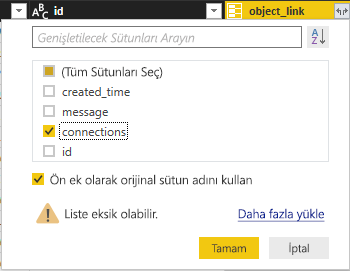
   
   Sütun başlığı, **object_link.connections** olarak değişir.
2. Tekrar **object_link.connections** sütununun üst kısmındaki  simgesini seçin, **açıklamalar**’ı seçin ve sonra **Tamam** seçeneğini belirleyin. Sütun başlığı, **object_link.connections.comments** olarak değişir.
   
3. **object_link.connections.comments** sütununun üst kısmındaki  simgesini seçin ve bu defa iletişim kutusunda Genişlet yerine **Topla** seçeneğini belirleyin. **Kimlik # Sayısı**’nı seçin ve sonra **Tamam** seçeneğini belirleyin. 
   
   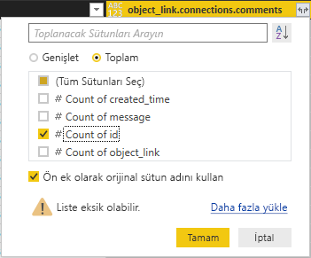
   
   Sütun şimdi her bir ileti için açıklama sayısını görüntüler. 
   
4. **object_link.connections.comments.id sayısı** sütununu **Açıklama sayısı** olarak yeniden adlandırın.
   
5. **Açıklama sayısı** üst bilgisinin yanındaki aşağı oku seçin ve **Azalan Düzende Sırala** seçeneğini belirleyerek Gönderileri en fazla açıklama içerenden en az içerene doğru sıralanmış şekilde görüntüleyin. 
   
   
   
### Sorgu adımlarını gözden geçirme

**Power Query Editor**’daki verileri şekillendirip dönüştürdüğünüzde her bir adım, Güç Sorgu Düzenleyicisi penceresinin sağ tarafındaki **Sorgu Ayarları** bölmesinin **Uygulanan Adımlar** alanına kaydedilmiştir. Tam olarak hangi değişiklikleri yaptığınızı görmek için Uygulanan Adımlar boyunca geri gidebilir ve gerekirse bunları düzenleyebilir, silebilir veya yeniden ayarlayabilirsiniz (ancak önceki adımların değiştirilmesi, sonraki adımları bozabileceğinden bu riskli olabilir). 

Şu ana kadar veri dönüştürmelerini uygulamanızın ardından Uygulanan Adımlarınız şöyle görünmelidir:
   
   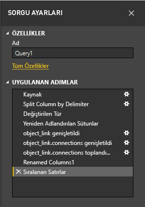
   
   >[!TIP]
   >Uygulanan Adımların temelini, **M** dili olarak da bilinen, **Power Query Editor**’da yazılan formüller oluşturur. Formülleri görmek ve düzenlemek için, şeridin Giriş sekmesinin **Sorgu** grubunda **Gelişmiş Düzenleyici**’yi seçin. 

### Dönüştürülmüş verileri içeri aktarma

Verilerden memnun kaldığınızda, verileri Power BI Desktop’a içeri aktarmak için şeridin Giriş sekmesindeki **Kapat ve Uygula** > **Kapat ve Uygula** seçeneklerini belirleyin. 
   
   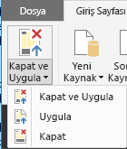
   
   Bir iletişim kutusu, verilerin Power BI Desktop veri modeline yüklenme durumunu görüntüler. 
   
   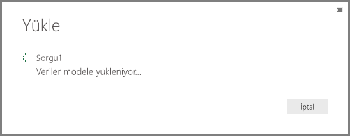
   
   Veriler yüklendikten sonra, Rapor görünümünde Alanlar listesinde yeni bir Sorgu olarak görüntülenir.
   
   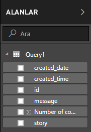
   
## Rapor görselleştirmelerindeki verileri kullanma 

Facebook sayfasındaki verileri içeri aktardığınıza göre şimdi görselleştirmeleri kullanarak hızlı ve kolayca verilerinizle ilgili öngörülere sahip olabilirsiniz. Görselleştirme oluşturmak kolaydır; tek yapmanız gereken bir alanı seçip **Alanlar** listesinden rapor tuvaline sürüklemektir.

### Çubuk grafik oluşturma

1. Power BI Desktop Rapor görünümünde, alan listesinden **ileti** öğesini seçin veya tuvale sürükleyin. Tuvalde, tüm gönderi iletilerini gösteren bir tablo görüntülenir. 
   
   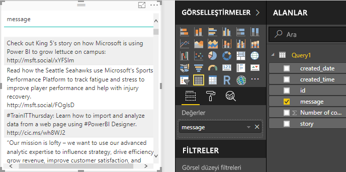
   
2. Bu tablo seçili durumdayken, Alanlar listesinden **Açıklama sayısı**’nı da seçin veya tabloya sürükleyin. 
   
3. Görsel Öğeler bölmesinde **Yığılmış çubuk grafik** simgesini seçin. Tablo, gönderi başına açıklama sayısını gösteren bir çubuk grafiğe dönüşür. 
   
   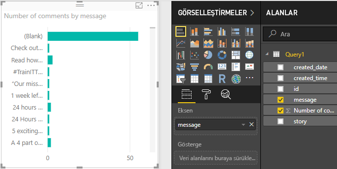
   
4. Görselleştirmenin sağ üst kısmındaki **Diğer seçenekler**’i (...) seçin ve sonra tabloyu açıklama sayısına göre azalan düzende sıralamak için **Açıklama sayısına göre sırala** seçeneğini belirleyin. 
   
   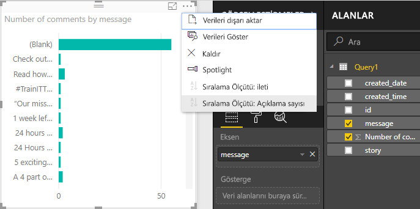
   
5. Çoğu açıklamanın, **Boş** iletilerle ilişkilendirilmiş olduğunu unutmayın (bu gönderiler; hikayeler, bağlantılar, videolar veya metin olmayan başka içerikler olabilir). Boş satırı filtrelemek için, Görsel Öğeler bölmesinin alt kısmındaki **Filtreler** bölümünden **ileti (tümü)** seçeneğini belirleyin, **Tümünü Seç** öğesini seçin ve sonra **Boş**’u seçerek bunun seçimini kaldırın. Filtreler girişi, **ileti (Boş) değil** olarak değişir ve Boş satır, grafik görselleştirmesinden kaybolur. 
   
   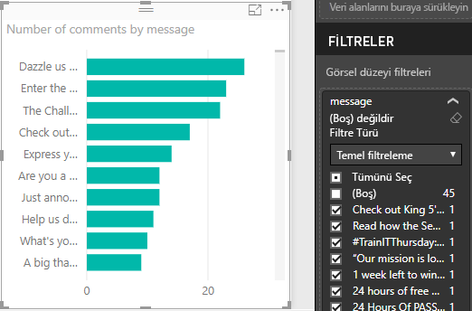
   
### Grafiği biçimlendirme

Görselleştirme daha ilginç hale geliyor, ancak grafikte gönderi metninin büyük kısmını göremiyorsunuz. Gönderi metninin daha fazlasını göstermek için:

1. Grafik görselleştirmesindeki tutamaçları kullanarak grafiği olabildiğince büyük olacak şekilde yeniden boyutlandırın. 
   
2. Grafik seçili durumdayken, Görsel Öğeler bölmesindeki **Biçim simgesi** (boya rulosu) simgesini seçin.
   
3. **Y ekseni**’nin yanındaki aşağı oku seçin ve **En büyük boyut**’un yanındaki kaydırıcıyı tamamen sağa (%50) sürükleyin. 
4. Ayrıca daha fazla metin sığdırmak için **Metin boyutu**’nu **10** değerine de düşürebilirsiniz.
   
   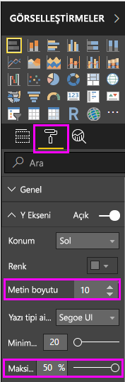
   
   Grafik şimdi daha fazla gönderi içeriği gösterir. 
   
   
   
Grafiğin X ekseni (açıklama sayısı), tam değerleri göstermez ve grafiğin alt kısmında kaybolur. Bunun yerine veri etiketlerini kullanmaya karar verirsiniz. 

1. Biçim simgesini seçin ve ardından **X ekseni**’nin yanındaki kaydırıcıyı seçip **Kapalı** durumuna getirin. 
   
2. **Veri etiketleri**’nin yanındaki kaydırıcıyı seçip **Açık** durumuna getirin. Şimdi grafik, her bir gönderi için tam açıklama sayısını gösterir.
   
   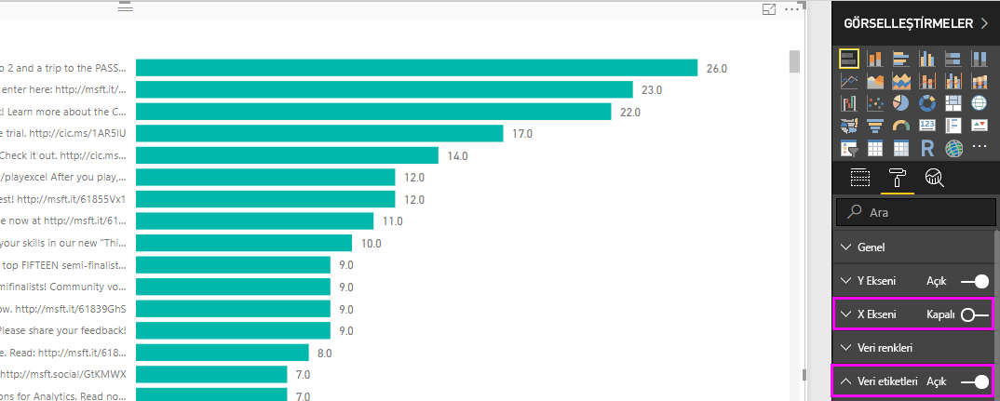
   
### Veri türünü düzenleme

Bu daha iyi, ancak **Gönderi sayısı** değerinin bir tamsayı olması gerektiğinden, tüm veri etiketlerinde dikkat dağıtabilecek ve yanıltabilecek bir **.0** ondalık basamağı vardır. **Gönderi sayısı** sütununun veri türünü Tam Sayı olarak değiştirmeniz gerekir.

1. Veri türünü düzenlemek için, Alanlar listesinde **Sorgu1**’e sağ tıklayın veya imleci üzerine getirip **Diğer seçenekler**’i (...) seçin ve **Sorguyu Düzenle** seçeneğini belirleyin. Şeridin Giriş sekmesinin **Dış veri** alanından **Sorguları Düzenle**’yi de seçebilir ve sonra açılır listeden **Sorguları Düzenle**’yi seçin. Power BI Desktop **Power Query Editor**, ayrı bir pencerede açılır.
   
   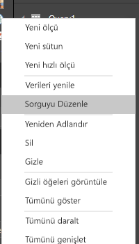     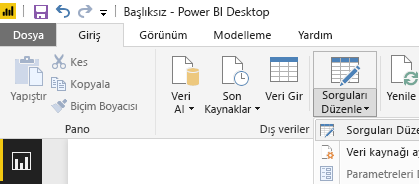
   
2. Power Query Editor’da **Açıklama sayısı** sütununu seçin ve aşağıdakilerden birini yaparak veri türünü **Tam Sayı** olarak değiştirin: 
   - **Açıklama sayısı** sütun üst bilgisinin yanındaki **1.2** simgesini seçip açılır listeden **Tam sayı**’yı seçerek veya
   - Sütun üst bilgisine sağ tıklayıp **Türü değiştir > Tam Sayı** seçeneklerini belirleyerek veya
   - Giriş sekmesinin **Dönüştür**  grubunda veya **Dönüştür** sekmesinin **Herhangi Bir Sütun** grubunda **Veri türü: Ondalık Sayı** ve sonra da **Tam Sayı**'yı seçerek.
   
   Sütun üst bilgisindeki simge, **123**’e dönüşerek Tam Sayı veri türünü belirtir.
   
   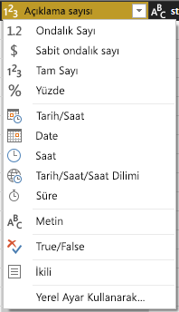
   
3. **Kapat ve Uygula**’yı seçin veya yalnızca **Uygula**’yı seçerek, Power Query Editor penceresini açık tutarken değişiklikleri uygulayın. Değişiklikler yüklendikten sonra grafikteki veri etiketleri tam sayıya dönüşür. 
   
   
   
### Tarih dilimleyici oluşturma

Zaman içinde gönderilerdeki açıklama sayısını görselleştirmek istersiniz. Farklı zaman çerçevelerine yönelik grafik verilerini filtrelemek için dilimleyici görselleştirmesi oluşturabilirsiniz. 

1. Tuvalin boş bir alanına tıklayın ve sonra Görsel Öğeler bölmesindeki **Dilimleyici simgesi** öğesini seçin. Boş bir dilimleyici görselleştirmesi görüntülenir. 
   
   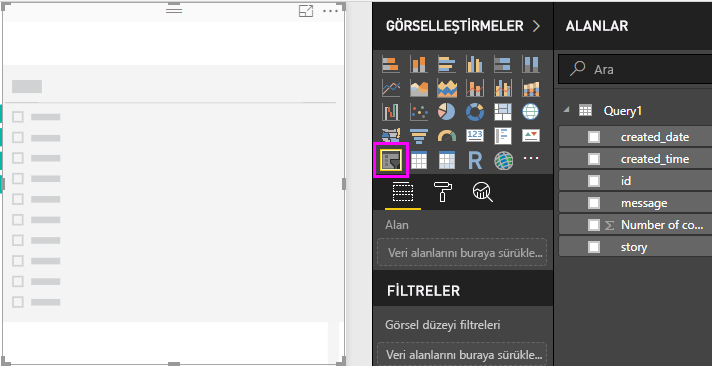
   
2. Alanlar listesinden **created_date** alanını seçin veya yeni dilimleyiciye sürükleyin. Dilimleyici, alanın Tarih veri türüne bağlı olarak bir tarih aralığı kaydırıcısına dönüşür.
   
   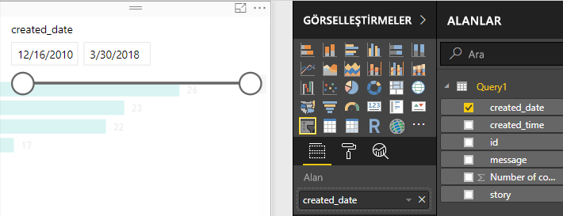
   
3. Farklı tarih aralıkları seçmek için kaydırıcı tutamaçlarını taşıyın ve grafik verilerinin nasıl uygun şekilde filtrelendiğine dikkat edin. Ayrıca, kaydırıcıdaki tarih alanlarını da seçebilir ve belirli tarihleri girebilir veya bir takvim açılır penceresinden bunları seçebilirsiniz.
    
   
   
### Görselleştirmeleri biçimlendirme

Grafiğe daha açıklayıcı ve çekici bir başlık vermeye karar verdiniz. 

1. Grafik seçili durumdayken, **Biçim** simgesini seçin ve açılır oku seçerek **Başlık** seçeneğini genişletin.
2. **Başlık metni**’ni **Gönderi başına açıklama sayısı** olarak değiştirin. 
3. **Yazı tipi rengi**’nin yanındaki açılır oku seçin ve görselleştirmenin yeşil çubuklarıyla eşleşmesi için yeşil renk seçin.
4. **Metin boyutu**’nu **10** değerine artırın ve **Yazı tipi ailesi**’ni **Segoe (Kalın)** değerine geçirin.

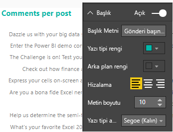

Görselleştirmelerinizin görünümünü değiştirmek için diğer biçimlendirme seçenekleri ve ayarları ile denemeler yapın. 

## Daha fazla görselleştirme oluşturma

Gördüğünüz gibi verileri istediğiniz şekilde sunmak için raporunuzdaki görselleştirmeleri kolayca özelleştirebilirsiniz. Örneğin, zaman içindeki açıklama sayısını gösteren bu çizgi grafiği oluşturmak için içeri aktarılan Facebook verilerini kullanmayı deneyin.

Power BI Desktop, birçok farklı veri kaynağından veri almanın ve çözümleme ihtiyaçlarınızı karşılayacak şekilde biçimlendirmeye ek olarak bu verileri zengin ve etkileşimli bir şekilde görselleştirmeye kadar sorunsuz ve uçtan uca bir deneyim sunar. Raporunuz hazır hale geldikten sonra raporunuzu [Power BI hizmetine yükleyebilir](desktop-upload-desktop-files.md), bunu kullanan panolar oluşturabilir ve diğer Power BI kullanıcılarıyla paylaşabilirsiniz.

## Sonraki adımlar
* [Diğer Power BI Desktop eğitimlerini okuyun](https://go.microsoft.com/fwlink/?LinkID=521937)
* [Power BI Desktop videolarını izleyin](https://go.microsoft.com/fwlink/?LinkID=519322)
* [Power BI Forumu'nu ziyaret edin](https://go.microsoft.com/fwlink/?LinkID=519326)
* [Power BI Blogu'nu okuyun](https://go.microsoft.com/fwlink/?LinkID=519327)

