# Öğretici: Power BI Desktop kullanarak web sayfası verilerini çözümleme

Uzun süreli bir futbol sever olarak, yıllara göre UEFA Avrupa Kupası (Euro Cup) sahipleri ile ilgili rapor oluşturmak istiyorsunuz. Power BI Desktop sayesinde bu verileri bir web sayfasından rapora aktarabilir ve verileri gösteren görselleştirmeler oluşturabilirsiniz. Bu öğreticide, Power BI Desktop kullanarak aşağıdakileri yapmayı öğreneceksiniz:

- Bir web veri kaynağına bağlanma ve tüm kullanılabilir tablolarda gezinme,
- **Power Query Editor**’de verileri şekillendirme ve dönüştürme,
- Bir sorguyu adlandırma ve bir Power BI Desktop raporuna aktarma ve 
- Bir harita ve pasta grafiği görselleştirmesi oluşturma ve özelleştirme.

## Bir web veri kaynağına bağlanma

UEFA kupası sahiplerine ait verileri, http://en.wikipedia.org/wiki/UEFA_European_Football_Championship adresindeki UEFA Avrupa Futbol Şampiyonası Wikipedia sayfasında bulunan Sonuçlar tablosundan alabilirsiniz. 

Web bağlantılarının yalnızca temel kimlik doğrulaması kullanılarak kurulduğunu unutmayın. Kimlik doğrulaması gerektiren web siteleri, Web bağlayıcısı ile düzgün çalışmayabilir.

Verileri içeri aktarmak için:

1. Power BI Desktop **Giriş** şerit sekmesinde, **Veri Al** seçeneğinin yanındaki oku açın ve sonra **Web**’i seçin.
   
   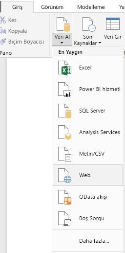 
   
   >[!NOTE]
   >Ayrıca **Veri Al** öğesini seçebilir ya da Power BI **Kullanmaya başlama** iletişim kutusundan **Veri Al**’ı seçtikten sonra **Veri Al** iletişim kutusundaki **Tümü** veya **Diğer** bölümünden **Web**’i ve sonra **Bağlan**’ı seçebilirsiniz.
   
2. **Web’den** iletişim kutusunda, `http://en.wikipedia.org/wiki/UEFA_European_Football_Championship` URL’sini **URL** metin kutusuna yapıştırın ve sonra **Tamam**’ı seçin.
   
    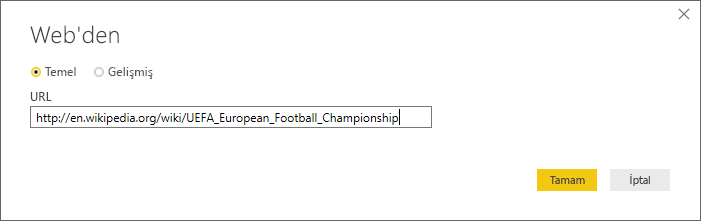
   
   Wikipedia web sayfasına bağlandıktan sonra, Power BI **Gezgin** iletişim kutusunda sayfadaki kullanılabilir tabloların bir listesi gösterilir. Verilerin önizlemesini görmek için tablo adlarından herhangi birini seçebilirsiniz. **Sonuçlar[düzenle]** tablosunda istediğiniz veriler bulunur ancak bu veriler tam olarak istediğiniz şekilde değildir. Verileri raporunuza yüklemeden önce yeniden şekillendirir ve temizlersiniz. 
   
   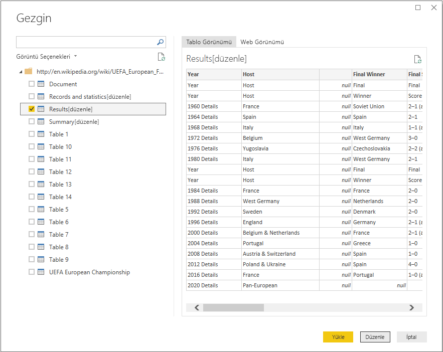
   
   >[!NOTE]
   >**Önizleme** bölmesinde, seçilen en son tablo gösterilir ancak **Düzenle** veya **Yükle**’yi seçtiğinizde tüm seçili tablolar **Power Query Editor**’a yüklenir. 
   
3. **Gezgin** listesinde **Sonuçlar[düzenle]** tablosunu ve ardından **Düzenle**’yi seçin. 
   
   **Power Query Editor**’da tablonun önizlemesi açılır. Burada verileri temizlemek için dönüşümler uygulayabilirsiniz. 
   
   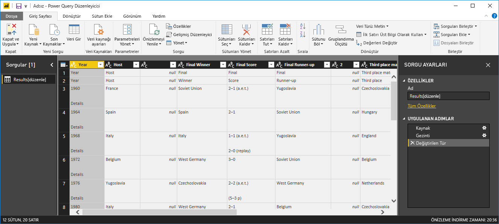
   
## Power Query Editor’da verileri şekillendirme

Yalnızca yılları ve kazanan ülkeleri görüntüleyerek verilerin taranmasını kolaylaştırmak istiyorsunuz. Bu veri şekillendirme ve temizleme adımlarını gerçekleştirmek için **Power Query Editor**’u kullanabilirsiniz.

İlk olarak, tablodan **Year** ve **Final Winners** haricindeki tüm sütunları kaldırın.

1. **Power Query Editor** kılavuzunda **Year** ve **Final Winners** sütunlarını seçin (birden fazla öğe seçmek için **Ctrl** tuşunu basılı tutun).
   
2. Tablodan diğer tüm sütunları kaldırmak için, sağ tıklayıp açılır listeden **Diğer Sütunları Kaldır**’ı veya **Giriş** şerit sekmesindeki **Sütunları Yönet** grubundan **Sütunları Kaldır** > **Diğer Sütunları Kaldır**’ı seçin. 
   
   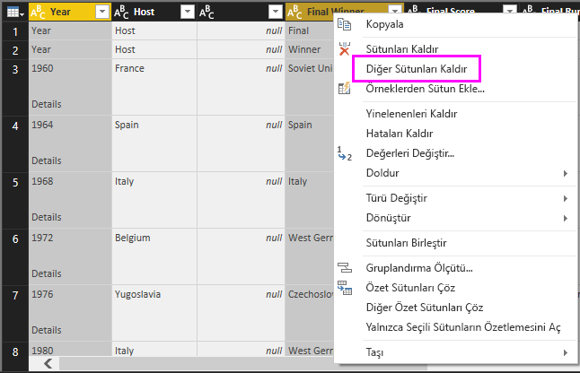 veya 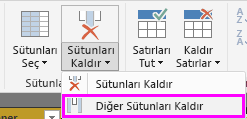

Ardından, **Year** sütun hücrelerinde fazladan **Details** sözcüğünü kaldırın.

1. **Year** sütununu seçin.
   
2. Sağ tıklayıp açılır listeden **Değerleri Değiştir**’i veya şeridin **Giriş** sekmesindeki **Dönüşüm** grubundan **Değerleri Değiştir**’i seçin (aynı zamanda **Dönüşüm** sekmesinin **Herhangi Bir Sütun** grubunda bulunur). 
   
   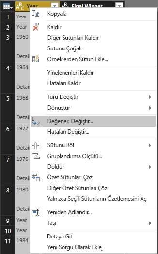 veya 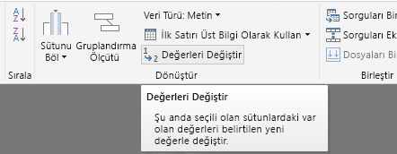
   
3. **Değerleri Değiştir** iletişim kutusunda, **Bulunacak Değer** metin kutusuna **Details** yazın, **Şununla Değiştir** metin kutusunu boş bırakın ve sonra **Tamam**’ı seçerek "Details" sözcüğünü **Year** girişlerinden silin.
   
   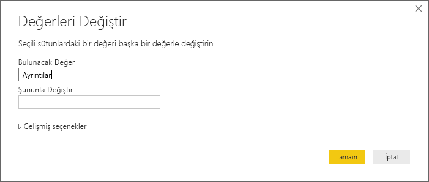

Bazı **Year** hücreleri, yıl değerleri yerine yalnızca "Year" sözcüğünü içerir. **Year** sütununu yalnızca "Year" sözcüğünü içermeyen satırları gösterecek şekilde filtreleyebilirsiniz. 

1. **Year** sütunundaki filtre açılır okunu seçin.
   
2. Açılır listeyi aşağı kaydırın ve **Year** seçeneğinin yanındaki onay kutusunun işaretini kaldırın, ardından **Tamam**’ı seçerek **Year** sütununda yalnızca "Year" sözcüğü olan satırları kaldırın. 

   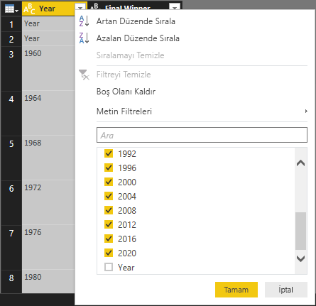

**Year** sütunundaki verileri temizledikten sonra **Final Winner** sütunu üzerinde çalışabilirsiniz. Şu anda yalnızca finali kazananların verilerine baktığınız için bu sütunun adını **Country** olarak değiştirebilirsiniz. Sütunu yeniden adlandırmak için:

1. **Final Winner** sütun başlığına çift tıklayın veya basılı tutun ya da 
   - **Final Winners** sütun başlığına sağ tıklayın ve açılır listeden **Yeniden Adlandır**’ı seçin ya da 
   - **Final Winners** sütununu ve şeridin **Dönüşüm** sekmesindeki **Herhangi Bir Sütun** grubundan **Yeniden Adlandır**’ı seçin. 
   
   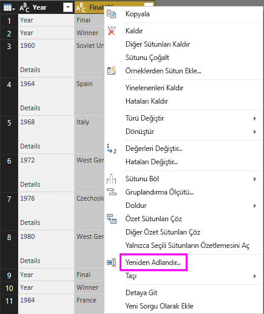 veya 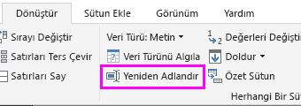
   
2. Sütunu yeniden adlandırmak için üst bilgiye **Country** yazın ve **Enter** tuşuna basın.

Ayrıca, **Country** sütununda null değerleri olan "2020" gibi sütunları filtrelemek istiyorsunuz. **Year** değerlerinde yaptığınız gibi filtre menüsünü kullanabilir veya şunları yapabilirsiniz:

1. Değeri *null* olan **2020** satırında **Country** hücresine sağ tıklayın. 
2. Bağlam menüsünden **Metin Filtreleri** > **Eşit Değil**’i seçerek hücrenin değerini içeren satırları kaldırın.
   
   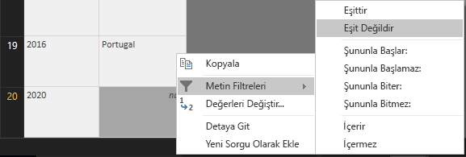
   
## Sorguyu Rapor Görünümüne aktarma

Verileri istediğiniz gibi şekillendirdikten sonra sorgunuzu "Euro Cup Winners" olarak adlandırıp raporunuza aktarabilirsiniz.

1. **Sorgu Ayarları** bölmesinin **Ad** metin kutusuna **Euro Cup Winners** yazın ve sonra **Enter**’a basın.
   
   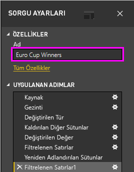

2. Şeridin **Giriş** sekmesinden **Kapat ve Uygula** > **Kapat ve Uygula** öğesini seçin.
   
   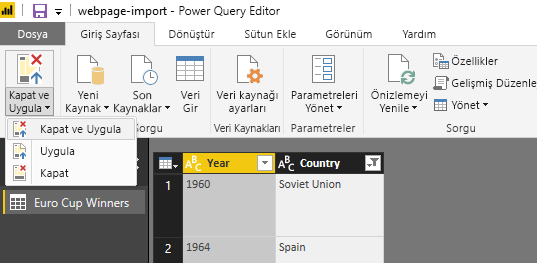
   
Sorgu, Power BI Desktop **Rapor Görünümü**’ne yüklenir ve **Alanlar** bölmesinde görülebilir. 
   
   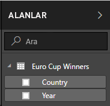
>[!TIP]
>Sorgunuzu düzenlemek ve daraltmak için aşağıdakileri yaparak dilediğiniz zaman **Power Query Editor**’a geri dönebilirsiniz:
>- **Alanlar** bölmesindeki **Euro Cup Winners** öğesinin yanında bulunan **Diğer seçenekler** üç nokta simgesini (**...**) ve açılır listeden **Sorguyu Düzenle**’yi seçin ya da
>- Rapor görünümünde **Giriş** şerit sekmesinin **Harici veriler** grubundaki **Sorguları Düzenle** > **Sorguları Düzenle** öğesini seçin. 

## Görselleştirme oluşturma

Verilerinizi temel alan bir görselleştirme oluşturmak için: 

1. **Alanlar** bölmesinden **Ülke** alanını seçin veya rapor tuvaline sürükleyin. Power BI Desktop, verileri ülke adları olarak tanır ve otomatik olarak bir **Harita** görselleştirmesi oluşturur. 
   
   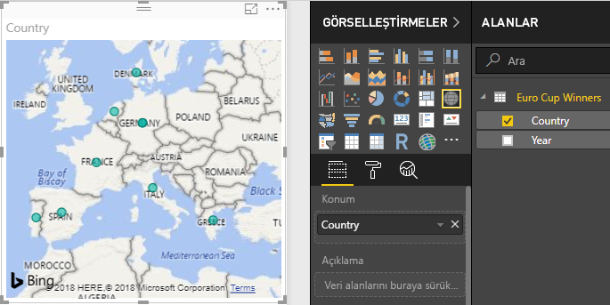
   
2. Köşelerdeki tanıtıcıları tüm kazanan ülke adları görünür olacak şekilde sürükleyerek haritayı genişletin.  

   
   
3. Haritada, bir Avrupa Kupası turnuvasını kazanmış her ülke için türdeş veri noktaları gösterilir. Her bir veri noktasının boyutunu ülkenin ne sıklıkta kazandığını yansıtacak şekilde değiştirmek için, **Yıl** alanını **Görselleştirmeler** bölmesinin alt kısmında bulunan **Boyut** altında **Veri alanlarını buraya sürükleyin** alanına sürükleyin. Alan otomatik olarak **Yıl Sayısı** ölçümüne dönüşür ve harita görselleştirmesinde daha fazla turnuva kazanmış ülkeler için daha büyük veri noktaları gösterilir. 
   
   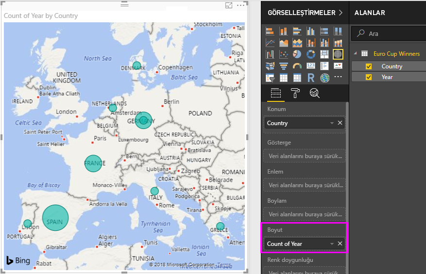
   

## Görselleştirmeyi özelleştirme

Görebildiğiniz gibi, verilerinizi temel alarak görselleştirmeler oluşturmak son derece kolaydır. Ayrıca, görselleştirmelerinizi, verilerinizi istediğiniz yöntemlerle daha iyi şekilde sunmak üzere özelleştirmek de kolaydır. 

### Haritayı biçimlendirme
Görselleştirmeyi ve ardından **Görselleştirmeler** bölmesindeki **Biçim** (boya fırçası) simgesini seçerek görselleştirmenin görünümünü değiştirebilirsiniz. Örneğin, Batı Almanya iki, Almanya ise bir turnuva kazandığı için ve harita iki noktayı ayırmak veya birbirine eklemek yerine üst üste getirdiğinden, görselleştirmenizdeki "Almanya" veri noktaları yanıltıcı olabilir. Bu durumu vurgulamak için bu iki noktayı farklı şekillerde renklendirebilirsiniz. Ayrıca, haritaya daha açıklayıcı ve çekici bir başlık verebilirsiniz. 

1. Görselleştirme seçiliyken, **Biçim** simgesini ve sonra **Veri renkleri**’ni seçerek veri rengi seçeneklerini genişletin. 
   
   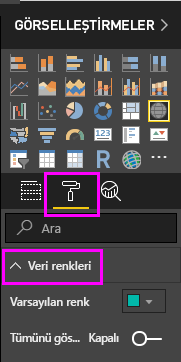
   
2. **Tümünü Göster** seçeneğini **Açık** duruma getirin ve ardından **Batı Almanya**’nın yanındaki açılır listeyi ve sarı rengi seçin. 
   
   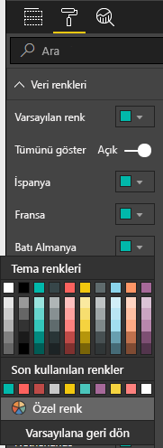
   
3. Başlık seçeneklerini genişletmek için **Başlık** öğesini seçin ve **Başlık metni** alanında mevcut başlığın yerine **Euro Cup Winners** yazın. 
4. **Yazı tipi rengi**’ni kırmızı, **Metin boyutu**’nu **12** ve **Yazı tipi ailesi**’ni **Segoe (Kalın)** olarak değiştirin. 
   
   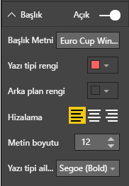
   

Harita görselleştirmeniz şu şekilde görünür:

   
### Görselleştirme türünü değiştirme
Bir görselleştirmeyi ve sonra **Görselleştirme** bölmesinin üst kısmından farklı bir simgeyi seçerek görselleştirme türünü değiştirebilirsiniz. Örneğin, Sovyetler Birliği ve Çekoslovakya ülkeleri dünya haritasında artık mevcut olmadığı için harita görselleştirmenizde bu ülkelerin verileri eksik olabilir. Ağaç haritası veya pasta grafiği gibi başka bir görselleştirme türü tüm değerleri gösterdiği için daha doğru olabilir. 

Haritayı bir pasta grafiği ile değiştirmek için haritayı ve sonra **Görselleştirme** bölmesindeki **Pasta grafiği** öğesini seçin. 
   
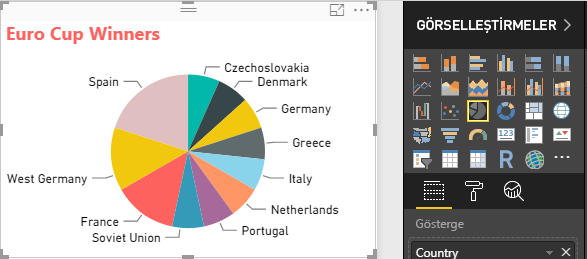

>[!TIP]
>- "Almanya" ve "Batı Almanya"’yı aynı renk yapmak için **Veri renkleri** biçimlendirme seçeneklerini kullanabilirsiniz. 
>- Pasta grafiğinde en fazla kazanan ülkeleri bir arada gruplandırmak için, görselleştirmenin sağ üst kısmındaki üç noktayı (**...**) ve sonra açılır listeden **Yıl Sayısına Göre Sırala**’yı seçin. 

Power BI Desktop, birçok farklı veri kaynağından veri almanın ve çözümleme ihtiyaçlarınızı karşılayacak şekilde biçimlendirmeye ek olarak bu verileri zengin ve etkileşimli bir şekilde görselleştirmeye kadar sorunsuz ve uçtan uca bir deneyim sunar. Rapor hazır hale geldikten sonra [Power BI'a yükleyip](desktop-upload-desktop-files.md) bunu kullanan panolar oluşturabilir ve diğer Power BI kullanıcılarıyla paylaşabilirsiniz.

## Ayrıca bkz.
* [Diğer Power BI Desktop eğitimlerini okuyun](http://go.microsoft.com/fwlink/?LinkID=521937)
* [Power BI Desktop videolarını izleyin](http://go.microsoft.com/fwlink/?LinkID=519322)
* [Power BI Forumu'nu ziyaret edin](http://go.microsoft.com/fwlink/?LinkID=519326)
* [Power BI Blogu'nu okuyun](http://go.microsoft.com/fwlink/?LinkID=519327)

