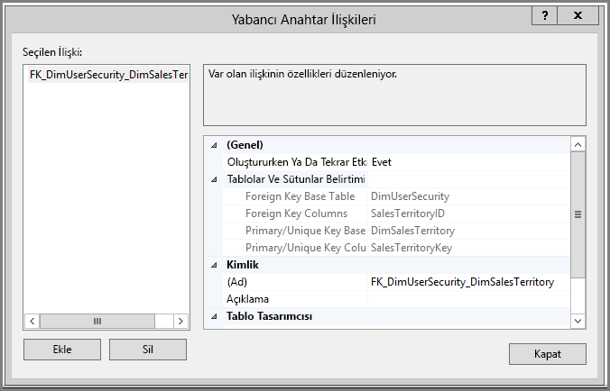
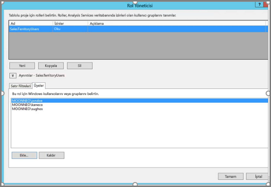
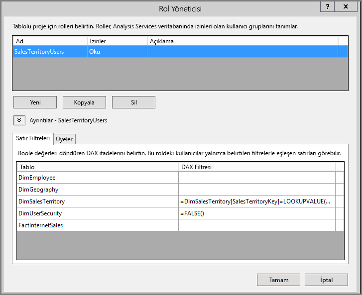
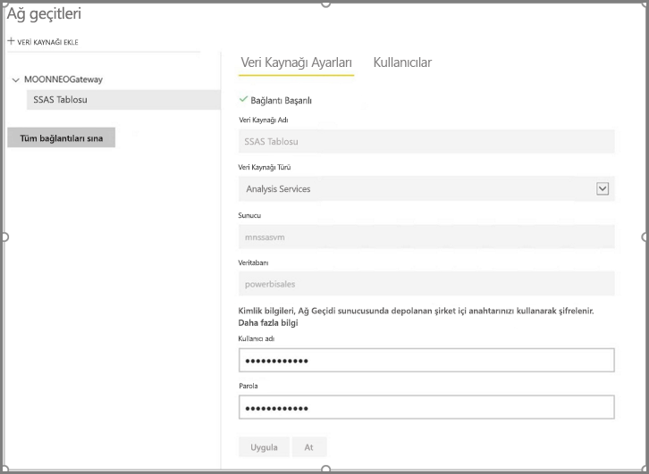
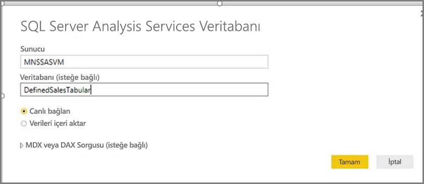
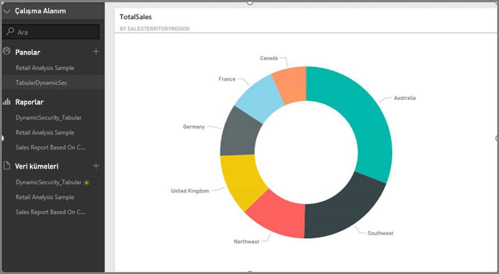
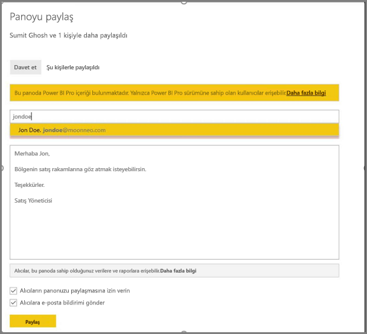

# <a name="dynamic-row-level-security-with-analysis-services-tabular-model"></a>Analysis Services tablolu modeli ile dinamik satır düzeyi güvenlik
Bu eğitimde **Analysis Services Tablolu Modelinizde** **satır düzeyi güvenlik** uygulamak için gerekli olan adımların yanı sıra bunu Power BI raporunda nasıl kullanacağınız gösterilmektedir. Bu eğitimdeki adımlar örnek bir veri kümesini tamamlayarak takip etmenizi ve gerekli adımları öğrenmenizi sağlayacak şekilde tasarlanmıştır.

Bu eğitimde aşağıdaki adımlar ayrıntılı bir şekilde anlatılarak Analysis Services tablolu modelinde dinamik satır düzeyi güvenlik uygulaması yapmak için gerekli olan öğeleri kavramanız amaçlanmaktadır:

* **AdventureworksDW2012** veritabanında yeni bir güvenlik tablosu oluşturma
* Gerekli olgu ve boyut tablolarıyla tablolu modeli oluşturma
* Kullanıcı rollerini ve izinlerini tanımlama
* Modeli **Analysis Services tablolu** örneğine dağıtma
* Rapora erişen kullanıcıya göre veri gösteren bir rapor oluşturmak için Power BI Desktop uygulamasını kullanma
* Raporu **Power BI hizmetinde** yayımlama
* Raporu temel alan yeni bir pano oluşturma ve son olarak,
* Panoyu iş arkadaşlarınızla paylaşma

Bu eğitimdeki adımları takip edebilmek için ihtiyacınız olan **AdventureworksDW2012** veritabanını **[depodan](https://github.com/Microsoft/sql-server-samples/releases/tag/adventureworks)** indirebilirsiniz.

## <a name="task-1-create-the-user-security-table-and-define-data-relationship"></a>1. Görev: Kullanıcı güvenliği tablosunu oluşturma ve veri ilişkisini tanımlama
**SQL Server Analysis Services (SSAS) tablolu** modeliyle satır düzeyi dinamik güvenliğin nasıl tanımlanacağını anlatan birçok makale mevcuttur. Bizim örneğimiz için [Satır Filtrelerini Kullanarak Dinamik Güvenlik Uygulama](https://msdn.microsoft.com/library/hh479759.aspx) makalesini izleyin. Aşağıdaki adımlar bu eğitimin ilk görevini tamamlamanızı sağlar:

1. Bu örnekte **AdventureworksDW2012** ilişkisel veritabanını kullanıyoruz. Bu veritabanında aşağıdaki görüntüde gösterilen şekilde **DimUserSecurity** tablosunu oluşturun. Bu örnekte tabloyu oluşturmak için SQL Server Management Studio (SSMS) uygulamasını kullanıyoruz.
   
   
2. Tabloyu oluşturup kaydettikten sonra aşağıdaki görüntüde gösterildiği gibi **DimUserSecurity** tablosunun **SalesTerritoryID** sütunu ile **DimSalesTerritory** tablosunun **SalesTerritoryKey** sütunu arasında bir ilişki oluşturmamız gerekiyor. Bu işlemi **SSMS** tarafında **DimUserSecurity** tablosuna sağ tıklayıp **Tasarım**'ı seçerek gerçekleştirebiliriz. Ardından menüden **Tablo Tasarımcısı -> İlişkiler...** seçeneğini belirleyin.
   
   
3. Tabloyu kaydettikten sonra **DimUserSecurity** tablosuna sağ tıklayıp **Edit Top 200 Rows** (İlk 200 satırı düzenle) seçeneğini belirleyerek tabloya kullanıcı bilgisi içeren birkaç satır daha ekleyin. Bu kullanıcıları ekledikten sonra **DimUserSecurity** tablosunun satırları aşağıdaki görüntüde olduğu gibi görünecektir:
   
   
   
   Sonraki görevlerde bu kullanıcılara geri döneceğiz.
4. Sonraki adımda kullanıcıyla ilişkilendirilmiş bölgelerin ayrıntılarının yer aldığı **DimSalesTerritory** tablosunda bir *iç birleşim* gerçekleştireceğiz. Aşağıdaki kod *iç birleşim* işlemini gerçekleştirir ve *iç birleşim* başarılı olduğunda tablo altındaki resimde olduğu gibi gösterilir.
   
       select b.SalesTerritoryCountry, b.SalesTerritoryRegion, a.EmployeeID, a.FirstName, a.LastName, a.UserName from [dbo].[DimUserSecurity] as a join  [dbo].[DimSalesTerritory] as b on a.[SalesTerritoryKey] = b.[SalesTerritoryID]
   
   
5. Yukarıdaki görüntüde kullanıcılar ve sorumlu oldukları satış bölgeleri gibi bilgilerin gösterildiğine dikkat edin. Bu verilerin görüntülenme nedeni, **2. Adım**'da oluşturduğumuz ilişkidir. Ayrıca **Jon Doe kullanıcısının Avustralya satış bölgesine dahil olduğuna** dikkat edin. John Doe adlı kullanıcıya sonraki adımlarda ve görevlerde geri döneceğiz.

## <a name="task-2-create-the-tabular-model-with-facts-and-dimension-tables"></a>2. Görev: Olgu ve boyut tablolarıyla tablolu modeli oluşturma
1. İlişkisel veri ambarınızı oluşturduktan sonra sıra tablolu modelinizi tanımlamaya geldi. Modeli **SQL Server Veri Araçları'nı (SSDT)** kullanarak oluşturabilirsiniz. Tablolu model tanımlama hakkında daha fazla bilgi edinmek için lütfen [Yeni Tablosal Model Projesi Oluşturma](https://msdn.microsoft.com/library/hh231689.aspx) makalesine başvurun.
2. Aşağıda gösterilen şekilde gerekli tüm tabloları modele aktarın.
   
    
3. Gerekli tabloları içeri aktardıktan sonra **Okuma** iznine sahip **SalesTerritoryUsers** adlı rolü tanımlamanız gerekir. Bu işlemi gerçekleştirmek için SQL Server Veri Araçları'nda **Model** menüsüne tıklayıp **Roller**'i seçebilirsiniz. **Rol Yöneticisi** iletişim kutusunda **Yeni**'ye tıklayın.
4. **Rol Yöneticisi**'nin **Üyeler** sekmesinde **1. Görev, 3. Adım**'da **DimUserSecurity** tablosunda tanımladığımız kullanıcıları ekleyin.
   
    
5. Ardından **DimSalesTerritory** ve **DimUserSecurity** tabloları için aşağıda görüntülenen işlevleri **Satır Filtreleri** sekmesinden ekleyin.
   
    
6. Bu adımda Windows kullanıcı adının **USERNAME** işlevi tarafından döndürülen kullanıcı adıyla aynı olduğu sütun değerlerini döndürmek için **LOOKUPVALUE** işlevini kullanıyoruz. Sorgular **LOOKUPVALUE** tarafından döndürülen değerlerin aynı veya ilişkili tablodaki değerlerle eşleşeceği şekilde kısıtlanabilir. **DAX Filtresi** sütununa aşağıdaki formülü yazın:
   
       =DimSalesTerritory[SalesTerritoryKey]=LOOKUPVALUE(DimUserSecurity[SalesTerritoryID], DimUserSecurity[UserName], USERNAME(), DimUserSecurity[SalesTerritoryID], DimSalesTerritory[SalesTerritoryKey])
    Bu formülde **LOOKUPVALUE** işlevi **DimUserSecurity[SalesTerritoryID]** sütunu için tüm değerleri döndürür ve burada **DimUserSecurity[UserName]**, oturum açmış olan Windows kullanıcı adıyla, **DimUserSecurity[SalesTerritoryID]** ise **DimSalesTerritory[SalesTerritoryKey]** değeriyle aynıdır.
   
   **DimSalesTerritory** içinde gösterilen satırları kısıtlamak için **LOOKUPVALUE** tarafından döndürülen Sales SalesTerritoryKey değerleri kullanılır. Yalnızca satırın **SalesTerritoryKey** değerinin **LOOKUPVALUE** işlevi tarafından döndürülen kümede bulunduğu satırlar görüntülenir.
8. **DimUserSecurity** tablosu için **DAX Filtresi** sütununa aşağıdaki formülü yazın:
   
       =FALSE()

    Bu formül tüm sütunların false Boole koşulu verdiğini ve bu nedenle **DimUserSecurity** tablosunun sütunlarının sorgulanamayacağını belirtir.
1. Şimdi yapmamız gereken modeli işleyip dağıtmak. Modeli dağıtma konusunda yardım almak için [Dağıtma makalesine](https://msdn.microsoft.com/library/hh231693.aspx) başvurabilirsiniz.

## <a name="task-3-adding-data-sources-within-your-on-premises-data-gateway"></a>3. Görev: Şirket içi veri ağ geçidinizdeki Veri Kaynaklarını ekleme
1. Tablolu modeliniz dağıtıldıktan ve kullanıma hazır hale geldikten sonra Power BI portalınızdan şirket içi Analysis Services tablolu sunucusuna veri kaynağı bağlantısı kurmanız gerekir.
2. **Power BI hizmetinin** şirket içi Analysis Services sunucunuza erişmesini sağlamak için ortamınızda yüklenmiş ve yapılandırılmış bir **[şirket içi veri ağ geçidi](service-gateway-onprem.md)** olması gerekir.
3. Ağ geçidi doğru şekilde yapılandırıldıktan sonra **Analysis Services** tablolu örneğiniz için bir veri kaynağı bağlantısı oluşturmanız gerekir. Bu makale [Power BI portalından veri kaynağı ekleme](service-gateway-enterprise-manage-ssas.md) konusunda size yardımcı olacaktır.
   
   
4. Önceki adımı tamamladığınızda ağ geçidi yapılandırılmış ve şirket içi **Analysis Services** veri kaynağınızla etkileşim kurmaya hazır hale gelmiş olur.

## <a name="task-4-creating-report-based-on-analysis-services-tabular-model-using-power-bi-desktop"></a>4. Görev: Power BI Desktop uygulamasını kullanarak Analysis Services tablolu modeli tabanlı rapor oluşturma
1. **Power BI Desktop** uygulamasını başlatıp **Veri Al > Veritabanı**'nı seçin.
2. Veri kaynakları listesinden **SQL Server Analysis Services Veritabanı**'nı ve ardından **Bağlan**'ı seçin.
   
   
3. **Analysis Services** tablolu örneğinizle ilgili bilgileri girip **Canlı bağlan**'ı seçin. **Tamam**'ı seçin. **Power BI**'da dinamik güvenlik yalnızca **Canlı bağlantı** ile kullanılabilir.
   
   
4. **Analysis Services** örneğinde dağıtılmış olan modeli göreceksiniz. İlgili modeli ve ardından **Tamam**'ı seçin.
   
   
5. **Power BI Desktop** uygulamasında tuvalin sağ tarafındaki **Alanlar** bölmesinde kullanılabilir durumdaki tüm alanlar görüntülenir.
6. Sağ taraftaki **Alanlar** bölmesinde **FactInternetSales** tablosundan **SalesAmount** ölçüsünü, **SalesTerritory** tablosundan da **SalesTerritoryRegion** boyutunu seçin.
7. Basit bir rapor oluşturmak istediğimiz için bu adımda başka sütun eklemeyeceğiz. Verilerin daha anlamlı bir şekilde gösterilmesi için görselleştirme türünü **Halka grafik** olarak değiştireceğiz.
   
   
8. Raporunuz hazır olduğunda doğrudan Power BI portalında yayımlayabilirsiniz. **Power BI Desktop** uygulamasının **Giriş** şeridinden **Yayımla**'yı seçin.

## <a name="task-5-creating-and-sharing-a-dashboard"></a>5. Görev: Pano oluşturma ve paylaşma
1. Raporu oluşturduktan sonra **Power BI Desktop** uygulamasında **Yayımla**'ya tıklayarak **Power BI** hizmetinde yayımladınız. Rapor hizmette olduğuna göre önceki adımlarda oluşturduğumuz örneği kullanarak model güvenlik senaryomuzu inceleyebiliriz.
   
   **Sumit, Sales Manager**  rolünde farklı bölgelerdeki tüm satış verilerini görebilir. Bu kullanıcı, raporu oluşturarak (önceki görev adımlarında oluşturulan rapor) Power BI hizmetinde yayımlar.
   
   Raporu yayımlandıktan sonra Power BI hizmetinde bu raporu temel alan **TabularDynamicSec** adlı bir pano oluşturur. Aşağıdaki resimde Sales Manager (Sumit) rolünün tüm satış bölgelerine ait verileri görebildiğine dikkat edin.
   
   
2. Sumit panoyu Avustralya bölgesinden sorumlu olan Jon Doe ile paylaşıyor.
   
   
   
   
3. **Power BI** hizmetinde oturum açıp Sumit tarafından oluşturulan ve paylaşılan panoyu görüntülediğinde John Doe'nun **yalnızca** sorumlu olduğu bölgeye ait verileri görebilmesi gerekiyor. Jon Doe oturum açıp Sumit'in kendisiyle paylaştığı panoya eriştiğinde **yalnızca** Avustralya bölgesindeki satışları görebiliyor.
   
   
4. Tebrikler! Şirket içi **Analysis Services** tablolu modelinde tanımlanmış olan dinamik satır düzeyi güvenlik **Power BI** hizmetine başarıyla yansıtıldı ve sağlaması yapıldı. Power BI, sorgu oluşturma amacıyla şirket içi veri kaynağına geçerli Power BI kullanıcısının kimlik bilgilerini göndermek için **effectiveusername** özelliğini kullanır.

## <a name="task-6-understanding-what-happens-behind-the-scenes"></a>6. Görev: Arka planda gerçekleşen işlemleri anlama
1. Bu görevde şirket içi SSAS tablolu örneğinizde bir SQL Server Profiler izi yakalamanız gerektiği için SQL Server Profiler hakkında bilgi sahibi olduğunuz kabul edilmektedir.
2. Oturum, kullanıcı (bu örnekte Jon Doe) Power BI hizmetindeki panoya eriştiği anda başlatılır. **salesterritoryusers** rolünün **<EffectiveUserName>jondoe@moonneo.com</EffectiveUserName>** olan geçerli kullanıcı adıyla aynı anda geçerli hale geldiğini görebilirsiniz
   
       <PropertyList><Catalog>DefinedSalesTabular</Catalog><Timeout>600</Timeout><Content>SchemaData</Content><Format>Tabular</Format><AxisFormat>TupleFormat</AxisFormat><BeginRange>-1</BeginRange><EndRange>-1</EndRange><ShowHiddenCubes>false</ShowHiddenCubes><VisualMode>0</VisualMode><DbpropMsmdFlattened2>true</DbpropMsmdFlattened2><SspropInitAppName>PowerBI</SspropInitAppName><SecuredCellValue>0</SecuredCellValue><ImpactAnalysis>false</ImpactAnalysis><SQLQueryMode>Calculated</SQLQueryMode><ClientProcessID>6408</ClientProcessID><Cube>Model</Cube><ReturnCellProperties>true</ReturnCellProperties><CommitTimeout>0</CommitTimeout><ForceCommitTimeout>0</ForceCommitTimeout><ExecutionMode>Execute</ExecutionMode><RealTimeOlap>false</RealTimeOlap><MdxMissingMemberMode>Default</MdxMissingMemberMode><DisablePrefetchFacts>false</DisablePrefetchFacts><UpdateIsolationLevel>2</UpdateIsolationLevel><DbpropMsmdOptimizeResponse>0</DbpropMsmdOptimizeResponse><ResponseEncoding>Default</ResponseEncoding><DirectQueryMode>Default</DirectQueryMode><DbpropMsmdActivityID>4ea2a372-dd2f-4edd-a8ca-1b909b4165b5</DbpropMsmdActivityID><DbpropMsmdRequestID>2313cf77-b881-015d-e6da-eda9846d42db</DbpropMsmdRequestID><LocaleIdentifier>1033</LocaleIdentifier><EffectiveUserName>jondoe@moonneo.com</EffectiveUserName></PropertyList>
3. Analysis Services, geçerli kullanıcı adı isteğine göre yerel Active Directory örneğini sorguladıktan sonra isteği gerçek moonneo\jondoe kimlik bilgisine dönüştürür. **Analysis Services**, Active Directory örneğinden gerçek kimlik bilgilerini aldıktan sonra kullanıcının veri üzerindeki erişimini ve izinlerini değerlendirir ve **Analysis Services** yalnızca kullanıcının erişim iznine sahip olduğu verileri döndürür.
4. Panoda daha fazla etkinlik gerçekleştirilirse, örneğin Jon Doe panodan bağlantılı rapora giderse SQL Profiler içinde Analysis Services tablolu modeline DAX sorgusu olarak gönderilen belirli bir sorgu olduğunu görebilirsiniz.
   
   
5. Ayrıca, rapor verilerini yerleştirmek için aşağıdaki DAX sorgusunun da yürütüldüğünü görebilirsiniz.
   
   ```
   EVALUATE
     ROW(
       "SumEmployeeKey", CALCULATE(SUM(Employee[EmployeeKey]))
     )
   
   <PropertyList xmlns="urn:schemas-microsoft-com:xml-analysis">``
             <Catalog>DefinedSalesTabular</Catalog>
             <Cube>Model</Cube>
             <SspropInitAppName>PowerBI</SspropInitAppName>
             <EffectiveUserName>jondoe@moonneo.com</EffectiveUserName>
             <LocaleIdentifier>1033</LocaleIdentifier>
             <ClientProcessID>6408</ClientProcessID>
             <Format>Tabular</Format>
             <Content>SchemaData</Content>
             <Timeout>600</Timeout>
             <DbpropMsmdRequestID>8510d758-f07b-a025-8fb3-a0540189ff79</DbpropMsmdRequestID>
             <DbPropMsmdActivityID>f2dbe8a3-ef51-4d70-a879-5f02a502b2c3</DbPropMsmdActivityID>
             <ReturnCellProperties>true</ReturnCellProperties>
             <DbpropMsmdFlattened2>true</DbpropMsmdFlattened2>
             <DbpropMsmdActivityID>f2dbe8a3-ef51-4d70-a879-5f02a502b2c3</DbpropMsmdActivityID>
           </PropertyList>
   ```

## <a name="considerations"></a>Önemli noktalar
Satır düzeyinde güvenlik, SSAS ve Power BI ile çalışırken dikkat etmeniz gereken birkaç önemli nokta vardır:

1. Power BI'da şirket içi satır düzeyi güvenlik yalnızca Canlı Bağlantı ile kullanılabilir.
2. Model işlendikten sonra veriler üzerinde yapılan değişiklikler, Power BI hizmetinden **Canlı Bağlantı** aracılığıyla rapora erişen kullanıcılara anında yansıtılır.

