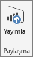
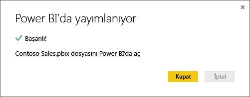

# Power BI Desktop'tan yayımlama
Bir **Power BI Desktop** dosyasını **Power BI hizmetine** yayımladığınızda modeldeki veriler ve **Rapor** görünümünde oluşturduğunuz tüm raporlar Power BI çalışma alanınızda yayımlanır. Çalışma Alanı gezgininizde tüm raporları ve aynı adda yeni bir veri kümesi görürsünüz.

**Power BI Desktop**'tan yayımlayarak bir **Power BI Desktop** dosyasına bağlanmak ve bu dosyayı yüklemek için Power BI'da **Veri Al** seçeneğini kullanmakla aynı etkiyi yaratırsınız.

> [!NOTE]
> Power BI'da rapor üzerinde yaptığınız hiçbir değişiklik (örneğin raporlardaki görselleştirmeleri ekleme, silme veya değiştirme) özgün **Power BI Desktop** dosyasına kaydedilmez.
> 
> 

## Bir Power BI Desktop veri kümesini ve raporları yayımlamak için
1. Power BI Desktop select'te **dosya** \> **Yayımla** \> **Power BI'da Yayımla** veya **Yayımla** üzerinde Şerit.  

   

2. Power BI'da oturum açın.
3. Hedefi seçin.

   

Tamamlandığında, raporunuz için bir bağlantı alırsınız. Raporu Power BI sitenizde açmak için bağlantıya tıklayın.

## Yeniden yayımlama veya Power BI Desktop'tan yayımlanmış bir veri kümesini değiştirme
Bir **Power BI Desktop** dosyası yayımladığınızda **Power BI Desktop**'ta oluşturduğunuz veri kümesi ve tüm raporlar Power BI sitenize yüklenir. **Power BI Desktop** dosyasını yeniden yayımladığınızda Power BI sitenizdeki veri kümesi, **Power BI Desktop** dosyasından güncelleştirilen veri kümesi ile değiştirilir.

Bu tüm oldukça basittir ancak bilmeniz gereken birkaç nokta vardır:

* Power BI'da, **Power BI Desktop** dosyası ile aynı adda iki veya daha fazla veri kümeniz varsa yayımlama işlemi başarısız olabilir. Power BI'da aynı adda yalnızca bir veri kümeniz olduğundan emin olun. Ayrıca, dosyayı yeniden adlandırarak yayımlayabilir ve dosya ile aynı adda yeni bir veri kümesi oluşturabilirsiniz.
* Bir sütunu veya ölçüyü yeniden adlandırırsanız ya da silerseniz Power BI'da bu alanı içeren tüm görselleştirmeler bozulabilir. 
* Power BI mevcut sütunlardaki bazı biçim değişikliklerini yok sayar. Örneğin, bir sütunun biçimini %0,25 yerine %25 olarak değiştirdiğinizde.
* Power BI'da mevcut veri kümeniz için yapılandırılmış bir yenileme zamanlaması varsa ve dosyanıza yeni veri kaynakları ekleyip dosyanızı yeniden yayımlarsanız sonraki zamanlanmış yenilemeden önce *Veri Kaynaklarını Yönet* bölümünde bu veri kaynaklarında oturum açmanız gerekir.

