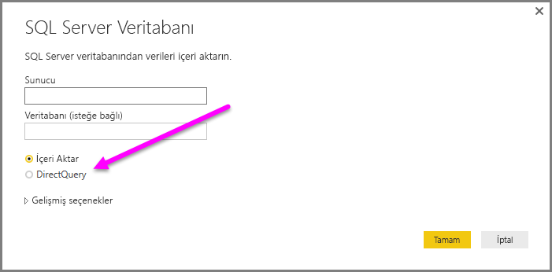
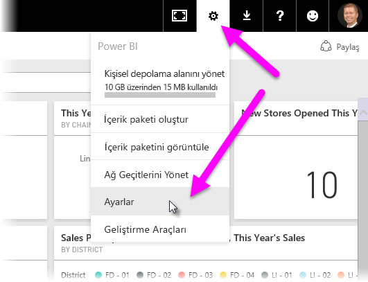
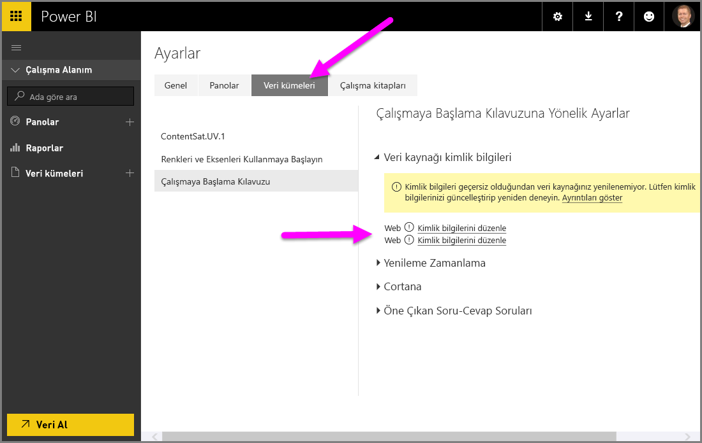

# Power BI Desktop'ta DirectQuery'yi kullanma
**Power BI Desktop** ile veri kaynağınıza bağlandığınızda verilerin bir kopyasını her zaman **Power BI Desktop**'a aktarabilirsiniz. Bazı veri kaynakları için alternatif bir yaklaşım da sunulmaktadır: **DirectQuery**'yi kullanarak veri kaynağına doğrudan bağlanma.

## Desteklenen Veri Kaynakları
**DirectQuery**'yi destekleyen veri kaynaklarının tam listesi için bkz. [DirectQuery tarafından desteklenen veri kaynakları](desktop-directquery-data-sources.md).

## DirectQuery'yi kullanarak bağlanma
**DirectQuery** tarafından desteklenen bir veri kaynağına bağlanmak için **Veri Al** seçeneğini kullandığınızda bağlantı penceresinde, nasıl bağlanmak istediğinizi seçebilirsiniz.  

**İçeri aktar** ve **DirectQuery** seçenekleri arasındaki farklar aşağıda belirtilmiştir:

**İçeri aktar**: Seçilen tablolar ve sütunlar **Power BI Desktop**'a aktarılır. Bir görselleştirme oluşturduğunuzda veya mevcut bir görselleştirme ile etkileşim kurduğunuzda **Power BI Desktop**, içeri aktarılan verileri kullanır. İlk içeri aktarma veya son yenileme işleminden sonra, temel alınan verilerde gerçekleştirilen tüm değişiklikleri görmek için verileri yenilemeniz gerekir. Yenileme işlemi ile veri kümesinin tamamı tekrar içeri aktarılır.

**DirectQuery**: **Power BI Desktop**'a herhangi bir veri aktarılmaz veya kopyalanmaz. İlişkisel kaynaklar için **Alanlar** listesinde, seçilen tablolar ve sütunlar görünür. SAP Business Warehouse gibi çok boyutlu kaynaklar için **Alanlar** listesinde, seçilen küpün boyutları ve ölçüleri görünür. Siz bir görselleştirme oluşturduğunuzda veya mevcut bir görselleştirme ile etkileşim kurduğunuzda **Power BI Desktop**, temel alınan veri kaynağını sorgular. Bu, mevcut verileri her zaman görüntülediğiniz anlamına gelir.

Bazı sınırlamalar olsa da **DirectQuery** ile kullanabileceğiniz çok sayıda veri modelleme ve veri dönüştürme seçeneği mevcuttur. Görselleştirme oluşturulurken veya mevcut görselleştirmelerle etkileşim kurulurken, temel alınan kaynağın sorgulanması gerekir. Görselleştirmenin yenilenmesi için gereken süre, temel alınan veri kaynağının performansına bağlıdır. İsteğin karşılanması için gereken veriler kısa bir süre önce istendiğinde Power BI Desktop, görselleştirmenin görüntülenmesi için gereken süreyi azaltmak üzere en son verileri kullanır. **Giriş** şeridindeki **Yenile** seçeneğini belirleyerek, tüm görselleştirmelerin geçerli verilerle yenilenmesini sağlayabilirsiniz.

[Power BI ve DirectQuery](desktop-directquery-about.md) makalesinde **DirectQuery** ayrıntılı olarak ele alınmıştır. Ayrıca **DirectQuery** kullanımıyla ilgili avantajlar, sınırlamalar ve önemli noktalar hakkında daha fazla bilgi edinmek için aşağıdaki bölümlere göz atabilirsiniz.

## DirectQuery özelliğini kullanmanın avantajları
**DirectQuery** özelliğini kullanmanın bazı avantajları vardır:

* **DirectQuery**, tüm verileri önceden toplayarak içeri aktarmanın mümkün olmayacağı çok büyük veri kümeleri söz konusu olduğunda görselleştirmeler oluşturmanıza olanak sağlar
* Temel alınan verilerde yapılan değişiklikler için verilerin yenilenmesi ve bazı raporlarda, mevcut verilerin görüntülenmesi için büyük veri aktarımları gerekebilir. Bunlar, verilerin yeniden içeri aktarılmasını olanaksız hale getirmektedir. Bunun aksine **DirectQuery** raporları her zaman mevcut verileri kullanır
* Veri kümeleri için uygulanan 1 GB'lık sınırlama **DirectQuery** için geçerli *değildir*

## DirectQuery kullanımıyla ilgili sınırlamalar
Şu anda **DirectQuery** kullanımıyla ilgili bazı sınırlamalar mevcuttur:

* [Bileşik modeller](desktop-composite-models.md) kullanılmadığı sürece tüm tabloların aynı veritabanından gelmesi gerekir
* **Sorgu Düzenleyicisi** sorgusunun çok karmaşık olması halinde hata oluşur. Hatayı gidermek için **Sorgu Düzenleyicisi**'nde soruna yola açan adımı silmeniz veya verilere bağlanmak için **DirectQuery** yerine *İçeri aktar* seçeneğini kullanmanız gerekir. SAP Business Warehouse gibi çok boyutlu kaynaklar için **Sorgu Düzenleyicisi** kullanılmaz
* İlişki filtreleme özelliği iki yön yerine tek bir yön ile sınırlıdır. (**DirectQuery** için her iki yönde çapraz filtrelemeyi etkinleştirebilirsiniz.) SAP Business Warehouse gibi çok boyutlu kaynaklar için modelde tanımlı herhangi bir ilişki yoktur
* **DirectQuery**'de akıllı zaman gösterimi özellikleri kullanılamaz. Örneğin, tarih sütunlarının (yıl, çeyrek yıl, ay, gün vb.) özel olarak değerlendirilmesi, **DirectQuery** modunda desteklenmez.
* Temel alınan veri kaynağına gönderilen sorguların kabul edilebilir düzeyde bir performansa sahip olmasını sağlamak için, ölçümlerde izin verilen DAX ifadelerine sınırlamalar koyulur.
* **DirectQuery** kullanılarak döndürülen veriler için bir milyon satırlık bir sınır söz konusudur. Bu sınır, **DirectQuery** ile döndürülen veri kümesini oluşturmak için kullanılan toplamalar veya hesaplamalar için değil, yalnızca döndürülen sütunlar için geçerlidir. Örneğin, veri kaynağında çalıştırılan sorgunuzla 10 milyon satırı toplayıp **DirectQuery**'yi kullanarak toplama işleminin sonuçlarını Power BI'a doğru şekilde döndürebilirsiniz. Bu işlem için, Power BI'a döndürülen veri sayısının 1 milyon satırdan az olması yeterlidir. **DirectQuery**'den 1 milyondan fazla satır döndürülürse Power BI hata döndürür.

## DirectQuery kullanımında dikkat edilmesi gereken önemli noktalar
**DirectQuery** kullanımında aşağıdaki üç nokta göz önünde bulundurulmalıdır:

* **Performans ve yük**: Tüm **DirectQuery** istekleri kaynak veritabanına gönderilir. Bu nedenle, bir görselin yenilenmesi için gereken süre; söz konusu arka uç kaynağının, sorgu sonuçlarıyla birlikte ne kadar sürede yanıt vereceğine bağlıdır. Görseller için **DirectQuery** kullanıldığında (istenen verilerin döndürülmesi için) önerilen yanıt süresi en fazla beş saniyedir. Sonuçların getirilmesi için önerilen maksimum yanıt süresi ise 30 saniyedir. Bu sınır aşıldığında, kullanıcıların rapor kullanma deneyimi kabul edilemez bir noktaya gelir. Ayrıca bir rapor Power BI hizmetinde yayımlandığında beş dakikadan uzun süren tüm sorgular zaman aşımına uğrar ve kullanıcı bir hatayla karşılaşır.
  
  Yayımlanan raporu kullanacak olan Power BI kullanıcılarının sayısına bağlı olarak, kaynak veritabanı üzerindeki yükün de göz önünde bulundurulması gerekir. *Satır Düzeyi Güvenlik* (RLS) kullanımının da önemli bir etkisi olabilir. Birden fazla kullanıcı tarafından paylaşılan, RLS kullanılmayan bir pano kutucuğu için veritabanına tek bir sorgu gönderilir. RLS kullanılan pano kutucuklarında ise bir kutucuğun yenilenmesi için genellikle *kullanıcı başına* bir sorgu gerekir. Bu da kaynak veritabanının yükünü önemli ölçüde artırır ve performansı etkileyebilir.
  
  Power BI, mümkün olduğunca etkili sorgular oluşturur. Ancak belirli durumlarda, oluşturulan sorgu yeterince etkili olmaz ve yenileme başarısız olur. Oluşturulan bir sorgunun, arka uç veri kaynağından çok yüksek miktarda satır (1 milyondan fazla) alması bu duruma verilebilecek bir örnektir. Böyle bir durumda aşağıdaki hata ile karşılaşılır:
  
      The resultset of a query to external data source has exceeded
      the maximum allowed size of '1000000' rows.
  
  Bu durum, kardinalitenin çok yüksek olduğu bir sütun içeren, toplama seçeneği *Özetleme* olarak ayarlanmış basit bir grafikte ortaya çıkabilir. Görselde yalnızca, kardinalite değeri 1 milyondan az olan sütunlar bulunmalı veya uygun filtreler uygulanmış olmalıdır.
* **Güvenlik**: Yayımlanan bir raporu kullanan tüm kullanıcılar arka uç veri kaynağına, Power BI hizmetinde yayımlama işleminin ardından girilen kimlik bilgilerini kullanarak bağlanır. Bu durum, içeri aktarılan veriler için de geçerlidir: Tüm kullanıcılar, arka uç kaynağında tanımlanan herhangi bir güvenlik kuralından bağımsız olarak aynı verileri görür. Her kullanıcı için DirectQuery kaynaklarıyla ayrı bir güvenlik doğrulaması olmasını isteyen müşteriler RLS'yi kullanmalıdır. [RLS hakkında daha fazla bilgi edinin](service-admin-rls.md).
* **Desteklenen özellikler**: **Power BI Desktop**'taki özelliklerin tümü **DirectQuery** modunda desteklenmez veya bazı sınırlamalar mevcuttur. Buna ek olarak, Power BI hizmetindeki bazı özellikler de (*Hızlı Öngörüler* gibi) **DirectQuery** modunda veri kümeleri için kullanılamaz. Benzer şekilde, **DirectQuery**'yi kullanıp kullanmayacağınıza karar verirken, **DirectQuery** modunda bu özelliklere getirilen sınırlamaları da göz önünde bulundurmanız gerekir.   

## Power BI hizmetinde yayımlama
**DirectQuery** kullanılarak oluşturulan raporlar Power BI hizmetinde yayımlanabilir.

Kullanılan veri kaynağı için **şirket içi veri ağ geçidinin** gerekli olmaması halinde (**Azure SQL Veritabanı**, **Azure SQL Veri Ambarı** veya **Redshift**), yayımlanan raporun Power BI hizmetinde görüntülenebilmesi için kimlik bilgilerinin girilmesi gerekir.

Kimlik bilgilerini girmek için Power BI'da **Ayarlar** dişli simgesini ve ardından **Ayarlar**'ı seçebilirsiniz.

Bu işlemin ardından Power BI'da **Ayarlar** penceresi görüntülenir. Bu pencerede **Veri kümeleri** sekmesini ve ardından **DirectQuery**'yi kullanan veri kümesini seçtikten sonra, **Kimlik bilgilerini düzenle** seçeneğini belirleyin.

Kimlik bilgilerini girene kadar, yayımlanmış bir raporu açmayı veya ilgili veri kaynaklarına bağlanmak için **DirectQuery** bağlantısı kullanılarak oluşturulmuş bir veri kümesini incelemeyi denediğinizde hata ile karşılaşırsınız.

DirectQuery bağlantısı kullanan **Azure SQL Veritabanı**, **Azure SQL Veri Ambarı** ve **Redshift** dışındaki veri kaynakları söz konusu olduğunda bir veri bağlantısı gerçekleştirilebilmesi için **şirket içi veri ağ geçidinin** yüklü olması ve ilgili veri kaynağının kayıtlı olması gerekir. [Şirket içi veri ağ geçidi hakkında daha fazla bilgi](http://go.microsoft.com/fwlink/p/?LinkID=627094) edinebilirsiniz.

## Sonraki adımlar
**DirectQuery** hakkında daha fazla bilgi için aşağıdaki kaynaklara bakın:

* [Power BI'da DirectQuery](desktop-directquery-about.md)
* [DirectQuery tarafından desteklenen veri kaynakları](desktop-directquery-data-sources.md)
* [DirectQuery ve SAP BW](desktop-directquery-sap-bw.md)
* [DirectQuery ve SAP HANA](desktop-directquery-sap-hana.md)
* [Şirket içi veri ağ geçidi](service-gateway-onprem.md)

