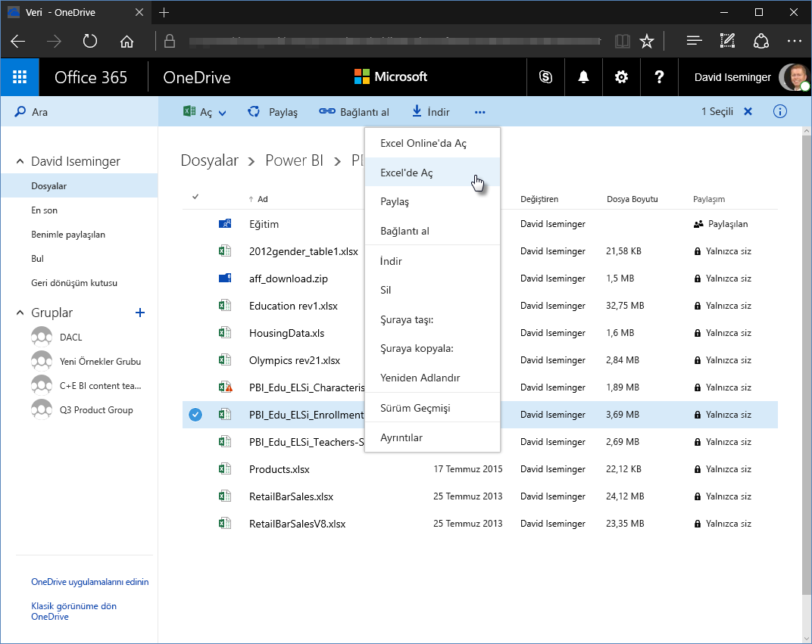
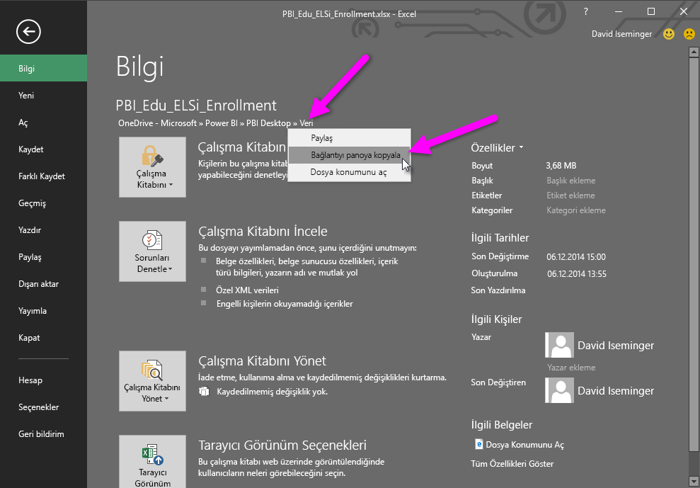
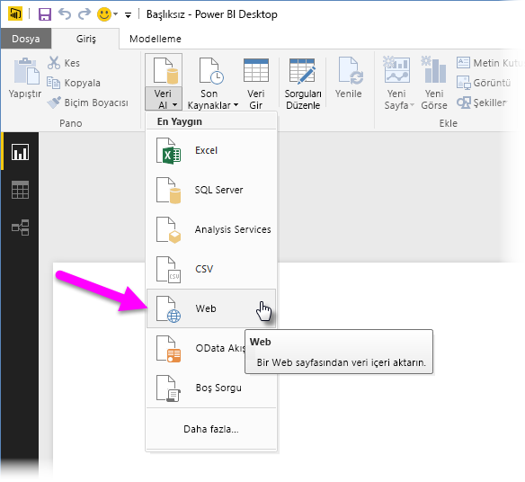
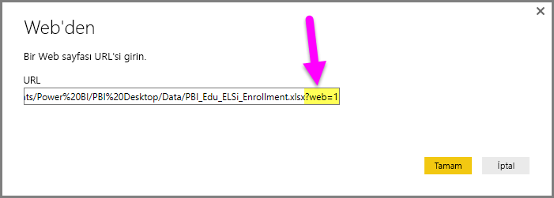
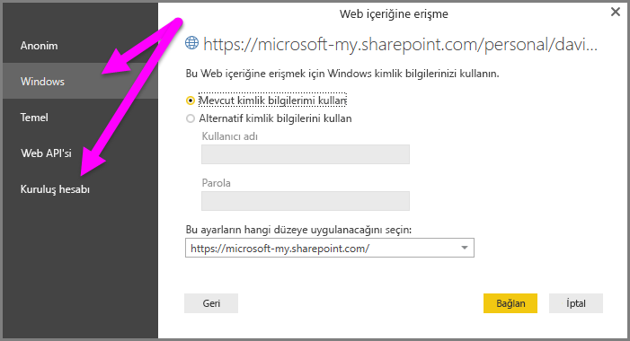

# Power BI Desktop'ta OneDrive İş bağlantılarını kullanma
Pek çok kullanıcının OneDrive İş sürücüsünde Excel çalışma kitapları bulunur, bunlar Power BI Desktop'ta kullanmak için harika bir seçimdir. **Power BI Desktop** ile rapor ve görsel oluşturmak için **OneDrive İş**'te kayıtlı **Excel** dosyalarına ilişkin çevrimiçi bağlantıları kullanabilirsiniz. Bir **OneDrive İş** grup hesabını veya bireysel **OneDrive İş** hesabınızı kullanabilirsiniz.

**OneDrive İş**'ten çevrimiçi bir bağlantı almak için uygulamanız gereken birkaç adım bulunur. Aşağıdaki bölümlerde gruplar arasında, farklı makineler arasında ve iş arkadaşlarınızla dosya bağlantısı paylaşmanıza olanak sağlayan bu adımlar açıklanmaktadır.

## Tarayıcıyı başlatıp Excel'den bağlantı alma
1. Tarayıcıyı kullanarak OneDrive iş konumunuza gidin. Kullanmak istediğiniz dosyaya sağ tıklayıp **Excel'de Aç**'ı seçin.
   
   > [!NOTE]
> Tarayıcı arabiriminiz tamamen aşağıdaki gibi görünmeyebilir. **OneDrive İş** tarayıcı arabiriminizdeki dosyalar için **Excel'de Aç**'ı seçmenin pek çok yolu vardır. Dosyayı Excel'de açmanıza olanak sağlayan tüm seçenekleri kullanabilirsiniz.
   > 
   > 
   
   
2. **Excel**'de **Dosya > Bilgi** öğesini ve **Çalışma Kitabını Koru** düğmesinin üzerindeki bağlantıyı seçin. **Bağlantıyı panoya kopyala**'yı seçin. (Kullandığınız sürümde bunun yerine **Yolu panoya kopyala** seçeneğini görebilirsiniz).
   
   

## Power BI Desktop'ta bağlantıyı kullanma
Power BI Desktop'ta, panoya kopyaladığınız bağlantıyı kullanabilirsiniz. Aşağıdaki adımları uygulayın:

1. Power BI Desktop'ta **Veri Al > Web** öğesini seçin.
   
   
2. Bağlantıyı **Web'den** adlı iletişim kutusuna yapıştırın. (Henüz Tamam'ı **seçmeyin**.)
   
    
3. **Power BI Desktop**'ın dosyanıza sorunsuz bir şekilde erişebilmesi için, **Tamam**'ı seçmeden **önce** *Web URL dizesinin bu bölümünü (bağlantının sonundaki *?web=1* dizesi) kaldırmanız gerektiğine* dikkat edin.
4. **Power BI Desktop** kimlik bilgilerini girmenizi isterse **Windows** (şirket içi SharePoint siteleri için) ya da **Kuruluş Hesabı** (Office 365 veya OneDrive İş siteleri için) seçeneğini belirleyin.
   
   

Excel çalışma kitabında bulunan tablolardan, sayfalardan ve aralıklardan oluşan listeden seçim yapmanıza olanak sağlayan **Gezgin** penceresi görüntülenir. Buradan, OneDrive İş dosyasını diğer tüm Excel dosyaları gibi kullanarak rapor oluşturabilir ve diğer tüm veri kaynaklarında olduğu gibi veri kümelerinde kullanabilirsiniz.

> [!NOTE]
> **OneDrive İş** dosyasını, söz konusu dosya için **Hizmeti Yenileme** özelliği etkinleştirilmiş şekilde Power BI hizmetinde bir veri kaynağı olarak kullanmak için, yenileme ayarlarınızı yapılandırırken **Kimlik doğrulama yöntemi** olarak **OAuth2** seçeneğini belirlediğinizden emin olun. Aksi halde, bağlanma veya yenileme işlemi gerçekleştirmeye çalıştığınızda bir hata (örn. *Veri kaynağı kimlik bilgileri güncelleştirilemedi*) ile karşılaşabilirsiniz. Kimlik doğrulama yöntemi olarak **OAuth2** seçeneği belirlenerek bu kimlik bilgileri hatası önlenebilir.
> 
> 

