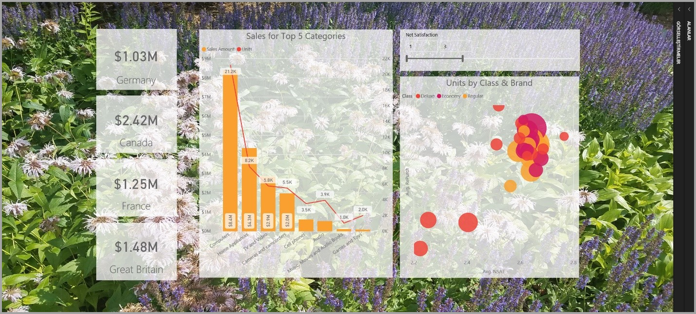
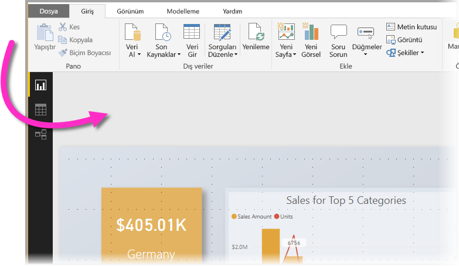
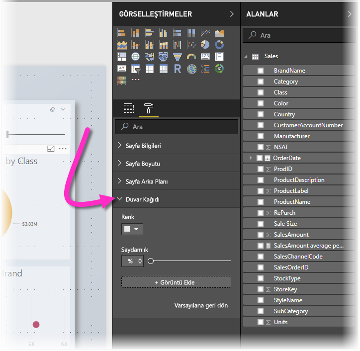
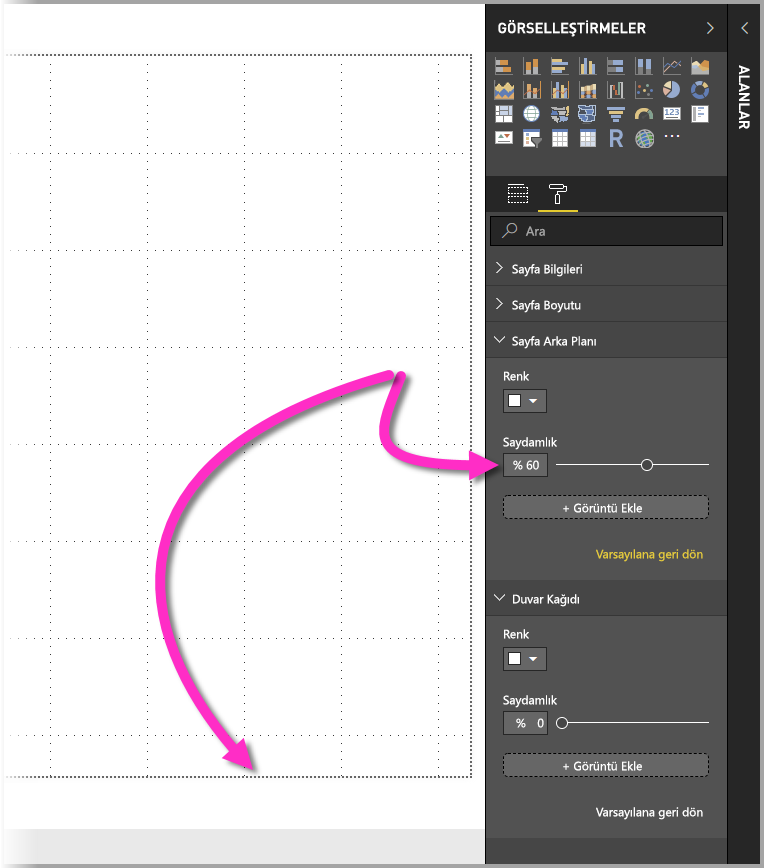
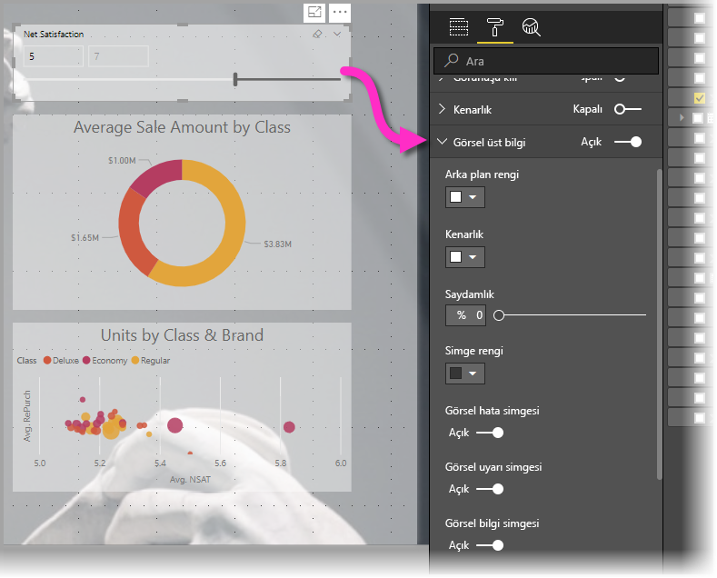
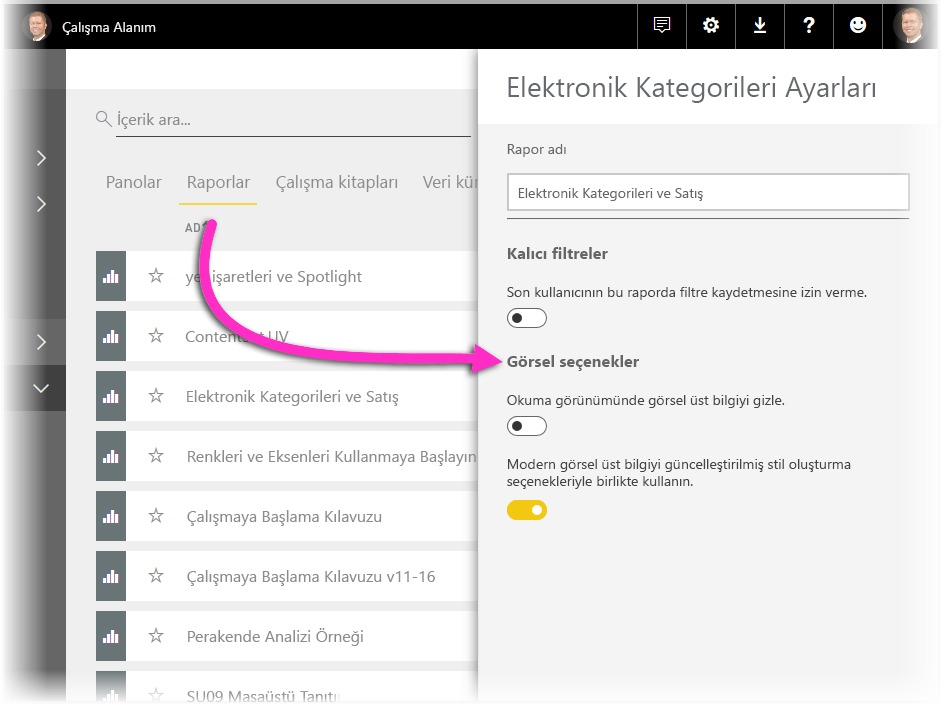
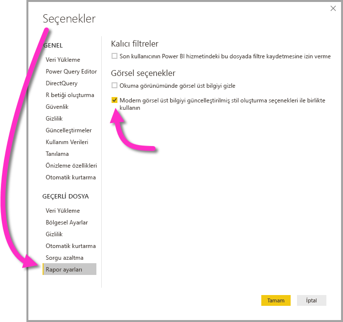

# Görsel öğeler kullanarak Power BI raporlarını geliştirme

**Power BI Desktop** ile, raporlarınızın görünümünü geliştirmek için duvar kağıdı ve görselleştirmelere yönelik geliştirilmiş görsel üst bilgiler gibi görsel öğeler kullanabilirsiniz.

**Power BI Desktop**'ın Temmuz 2018 sürümünden başlayarak, raporlarınızda kullanılacak geliştirmeler yapabilir, analizleriniz ve raporlarınızın eskisinden daha da cazip olmasını sağlayabilirsiniz. Bu makalede açıklanan geliştirmeler şunlardır: 

* Arka planınızın verilerinizle anlatmak istediğiniz hikayeyi geliştirmesi veya öğelerini vurgulaması için raporlarınıza **duvar kağıdı** uygulama
* Rapor tuvalinizde mükemmel hizalanmış görseller oluşturmak için, tek tek görselleştirmeler için geliştirilmiş **görsel üst bilgiler** kullanma. 

Aşağıdaki bölümlerde bu geliştirmelerin nasıl kullanılacağı ve bunların raporlarınıza nasıl uygulanacağı açıklanır.

## Power BI raporlarında duvar kağıdı kullanma

Rapor sayfanızın dışındaki gri alanı **duvar kağıdı** kullanarak biçimlendirebilirsiniz. Aşağıdaki görüntüde, duvar kağıdının nereye uygulandığını netleştiren bir ok vardır. 

Duvar kağıdını her rapor sayfası için ayarlayabileceğiniz gibi, aynı duvar kağıdının raporunuzun her sayfasında kullanılmasını da sağlayabilirsiniz. Duvar kağıdınızı ayarlamak için, raporunuzda hiçbir görsel seçili değilken **Biçimlendirme** simgesine dokunun veya tıklayın; bölmede **Duvar kağıdı** kartı gösterilir.

**Renk** açılan listesini seçerek **duvar kağıdı** olarak uygulanacak bir renk belirtebilir veya **Görüntü Ekle** düğmesini seçerek duvar kağıdı olarak uygulanacak görüntüyü belirtebilirsiniz. Ayrıca duvar kağıdınız ister renk ister görüntü olsun, **Saydamlık** kaydırıcısını kullanarak duvar kağıdı için saydamlık da ayarlayabilirsiniz.

**Duvar kağıdı** için geçerli olan aşağıdaki tanımları da aklınızda bulundurmanız yararlı olur:

* Rapor alanınızın dışındaki gri alan, **duvar kağıdı** alanıdır
* Tuvalde görselleri yerleştirebileceğiniz alan rapor **sayfası** olarak adlandırılır ve **Biçim bölmesinde** **Sayfa arka planı** açılan listesi kullanılarak değiştirilebilir.

Rapor **sayfası** her zaman ön plandadır (duvar kağıdıyla karşılaştırıldığında), **duvar kağıdı** bunun arkasında yer alır ve rapor sayfasının er gerideki öğesidir. Sayfaya saydamlık uyguladığınızda raporunuzdaki görsellere de saydamlık uygulanır; böylelikle arka planınız görsellerinizin arasından görünür durumda olur.

Tüm yeni raporlar için varsayılan ayarlar şöyledir:

* Rapor **sayfası** **beyaz** ve saydamlığı da **%100** olarak ayarlanır
* **Duvar kağıdı** **beyaz** renge ve saydamlığı da **%0**'a ayarlanır

Sayfa arka planınızı %50'den yüksek bir saydamlığa ayarladığınızda, raporunuzu oluşturur veya düzenlerken size rapor tuvalinin sınırındaki kenarlığı göstermek için noktalı bir kenarlık görüntülenir. 

Noktalı kenarlığın *yalnızca* raporunuz düzenlenirken gösterildiğini ve yayımlanan raporunuz kişiler tarafından görüntülenirken, örneğin *Power BI hizmetinde* görüntülenirken bu kenarlığın **gösterilmediğini** anımsamak önemlidir.

> [!NOTE]
> Duvar kağıdı olarak koyu renkli arka planlar kullanıyor ve metin rengini çok açık veya beyaz olarak ayarlıyorsanız **PDF'ye dışarı aktar** özelliği duvar kağıdını dışarı aktarmayacağından beyaz yazı tiplerinin oluşturulan PDF dosyasında görünmeyebileceğini unutmayın. **PDF'ye dışarı aktar** özelliği hakkında daha fazla bilgi için bkz. [PDF'ye dışarı aktarma](desktop-export-to-pdf.md).

## Power BI raporlarında geliştirilmiş görsel üst bilgiler kullanma

**Power BI Desktop**'ın Temmuz 2018 tarihli sürümünden başlayarak, raporlardaki görsellerin üst bilgileri önemli ölçüde geliştirildi. Başlıca geliştirmeler üst bilginin görselden ayrılması, böylelikle konumunun tercih ettiğiniz düzen ve yerleşime göre ayarlanabilmesi ve üst bilginin artık görselin üstünde kaymak yerine içinde gösterilmesidir. 

Varsayılan olarak, üst bilgi başlıkla hizalanmış üst bilginin içinde gösterilir. Aşağıdaki görüntüde, üst bilgiyi (sabitle simgesi, genişlet simgesi ve üç nokta simgesi) görselin içinde, sağa hizalanmış olarak ve görselin başlığıyla aynı yatay konum üzerinde görebilirsiniz.

Görselinizin başlığı yoksa, aşağıdaki görüntüde gösterildiği gibi üst bilgi görselin üst kısmında sağa hizalanmış olarak kaydırılır. 

Görsel raporunuzun en üstüne konumlandırıldıysa, görsel üst bilgisi görselin altına yaslanır. 

Her görselin **Görselleştirmeler** bölmesinin **Biçimlendirme** bölümünde **Görsel üst bilgi** adlı bir de kartı vardır. Bu kartta görsel üst bilginin her türlü özelliğini ayarlayabilirsiniz

> [!NOTE]
> Siz raporu yazar veya düzenlerken, geçişlerin görünürlüğü raporunuzu etkilemez. Raporu yayımlamalı ve etkiyi görmek için rapora okuma modunda bakabilirsiniz. Bu davranış, görsel üst bilgilerde sağlanan birçok seçeneğin, özellikle de düzenlemenin sorunlarını size bildiren uyarı simgelerinin düzenleme sırasında önemli olmasını güvence altına alır.

Yalnızca **Power BI hizmetinde** gösterilen raporlar için, **Çalışma Alanım > Raporlar**'a gidip **Ayarlar** simgesini seçerek görsel üst bilgilerin kullanımını ayarlayabilirsiniz. Orada, **Ayarlar** simgesini seçtiğiniz raporun ayarlarını görür ve aşağıdaki görüntüde gösterildiği gibi ayarları belirleyebilirsiniz.

### Mevcut raporlar için geliştirilmiş görsel üst bilgileri etkinleştirme

Yeni görsel üst bilgi, tüm yeni raporlarda varsayılan davranıştır. Mevcut raporlar için, **Dosya > Seçenekler ve ayarlar > Seçenekler**'e giderek ve ardından **Rapor ayarları** bölümünde **Modern görsel üst bilgiyi güncelleştirilmiş stil oluşturma seçenekleri ile birlikte kullanın** onay kutusunu etkinleştirerek **Power BI Desktop**'ta bu davranışı etkinleştirmeniz gerekir.

## Sonraki adımlar
**Power BI Desktop** ve Power BI Desktop'la çalışmaya başlama hakkında daha fazla bilgi için aşağıdaki makalelere başvurun.

* [Power BI Desktop nedir?](desktop-what-is-desktop.md)
* [Power BI Desktop ile Sorgulara Genel Bakış](desktop-query-overview.md)
* [Power BI Desktop'ta Veri Kaynakları](desktop-data-sources.md)
* [Power BI Desktop'taki Verilere Bağlanma](desktop-connect-to-data.md)
* [Power BI Desktop'ta Verileri Şekillendirme ve Birleştirme](desktop-shape-and-combine-data.md)
* [Power BI Desktop'taki Genel Sorgu Görevleri](desktop-common-query-tasks.md)   

