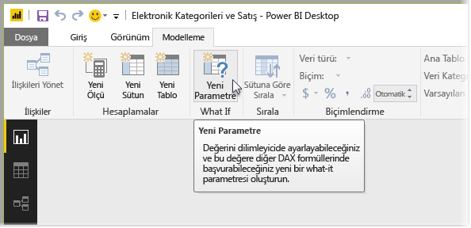
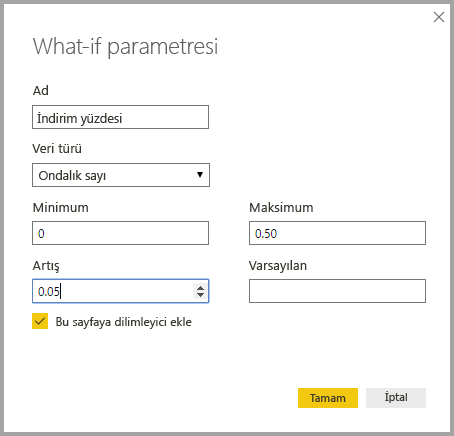
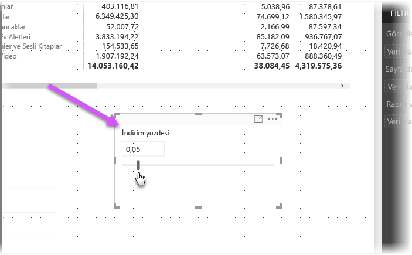
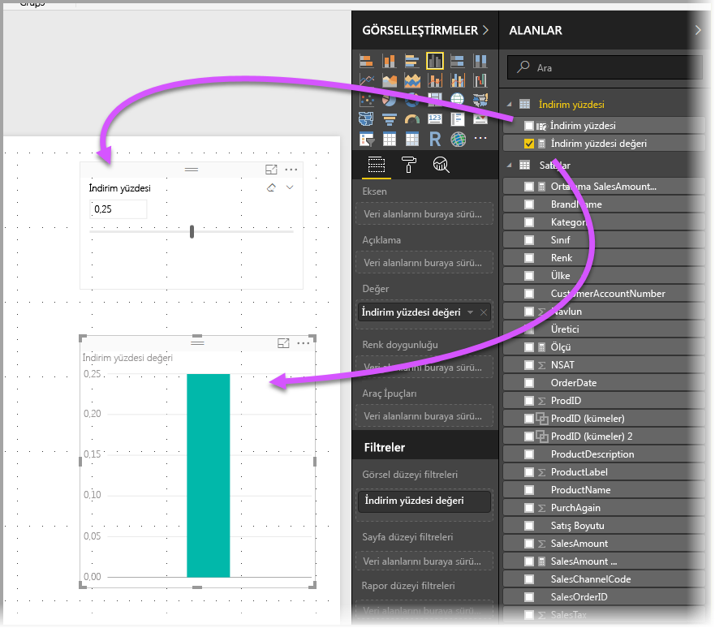
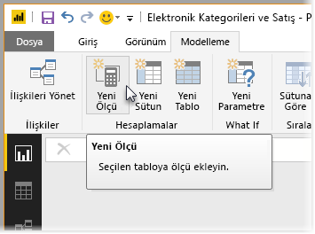
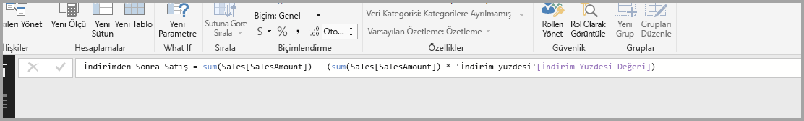
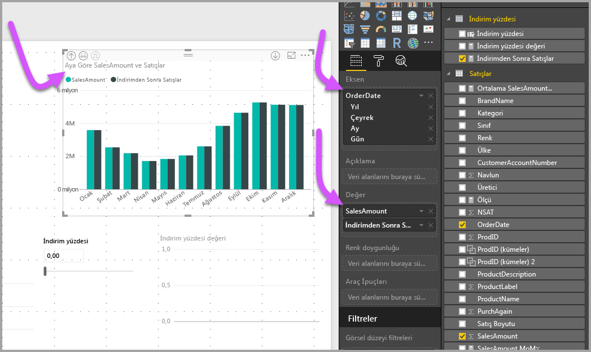
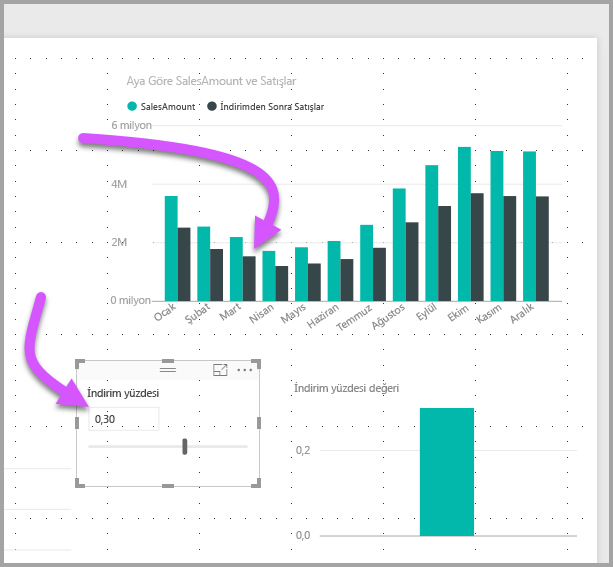

# Power BI Desktop'ta değişkenleri görselleştirmek için Durum parametresi oluşturma ve kullanma
**Power BI Desktop**'ın Ağustos 2017 sürümünden itibaren, raporlarınız için **Durum** değişkenleri oluşturabilir, değişkeni bir dilimleyici olarak kullanabilir ve böylece raporlarınızda farklı anahtar değerlerini görselleştirip ölçebilirsiniz.

**Durum** parametresi, **Power BI Desktop**'taki **Modelleme** sekmesinde bulunur. Bu, sizi parametreyi yapılandırabileceğiniz bir iletişim kutusuna götürür.

## Durum parametresi oluşturma
**Durum** parametresi oluşturmak için, **Power BI Desktop**'taki **Modelleme** sekmesinde bulunan **Durum** düğmesini seçin. Aşağıdaki görüntüde, *Discount percentage* adlı bir parametre oluşturup veri türünü *Ondalık sayı* olarak ayarladık. *Minimum* değer sıfır, *Maksimum* değer ise 0,50'dir (yüzde elli). *Artış* olarak ise 0,05 (yüzde beş) değerini belirledik. Bu, bir raporda etkileşime geçildiğinde parametrenin ne ölçüde artış göstereceğini belirtir.

> [!NOTE]
> Ondalık sayıların önüne sıfır koymayı (kutudaki gibi, yalnızca ,50 yerine 0,50 kullanın) unutmayın. Aksi halde sayı doğrulanmaz ve **Tamam** düğmesi seçilemez.
> 
> 

Size kolaylık sağlamak adına, **Bu sayfaya dilimleyici ekle** onay kutusu otomatik olarak, geçerli rapor sayfanıza **Durum** parametrenizi içeren bir dilimleyici ekler.

**Durum** paremetresi oluşturulduğunda bir ölçü de oluşturulur. Bu ölçüyü **Durum** parametresinin geçerli değerini görselleştirmek için kullanabilirsiniz.

**Durum** parametresi oluşturduğunuzda, hem parametrenin hem de ölçünün modelinizin bir parçası haline geldiğini göz önünde bulundurmanızda yarar vardır. Başka bir deyişle, bunlar raporun tamamında ve diğer rapor sayfalarında kullanılabilir. Ayrıca modelin bir parçası olduklarından, rapor sayfasından dilimleyiciyi silebilir, geri almak istemeniz durumunda ise **Alanlar** listesindeki **Durum** parametresini tuvale sürükleyerek (ardından görseli bir dilimleyici olarak değiştirerek) **Durum** parametresini raporunuzda kolayca tekrar kullanabilirsiniz.

## Durum parametresi kullanma
Şimdi de **Durum** parametresinin kullanımına yönelik bir örnek üzerinden gidelim. **Durum** parametresini bir önceki bölümde oluşturduğumuza göre, şimdi de değeri kaydırıcı ile ayarlanan yeni bir ölçü oluşturarak bu parametreyi kullanalım. Bunu gerçekleştirmek için yeni bir ölçü oluştururuz.

Yeni ölçü, indirim oranının uygulandığı toplam satış tutarı olacak. Elbette raporunuzu kullanan kişilerin **Durum** parametrenize ilişkin değişkeni görselleştirmesine olanak sağlayan daha karmaşık ve ilgi çelici ölçüler oluşturabilirsiniz. Örneğin, satış görevlilerinin, belirli satış hedeflerini veya yüzdelerini yakalamaları halinde alacakları tazminatı ya da daha yüksek indirimlerin satışların artmasına yönelik etkisini görmesini sağlayan bir rapor oluşturabilirsiniz.

Ölçü formülünü formül çubuğuna yazmamızın ve **Sales after Discount** olarak adlandırmamızın ardından formülün sonucunu görürüz:

Ardından, eksende *OrderDate* bulunan ve hem *SalesAmount*'un hem de yeni oluşturulan *Sales after Discount* ölçüsünün değer olarak yer aldığı bir sütun görseli oluştururuz.

Ardından, kaydırıcıyı hareket ettirdikçe *Sales after Discount* sütununun, indirim uygulanmış satış tutarını yansıttığını görürüz.

İşte bu kadar kolay. Rapor kullanıcılarının, raporlarınızda oluşturduğunuz farklı senaryolarla etkileşime geçmesine olanak sağlamak üzere, **Durum** parametrelerinden çok çeşitli durumlarda yararlanabilirsiniz.

