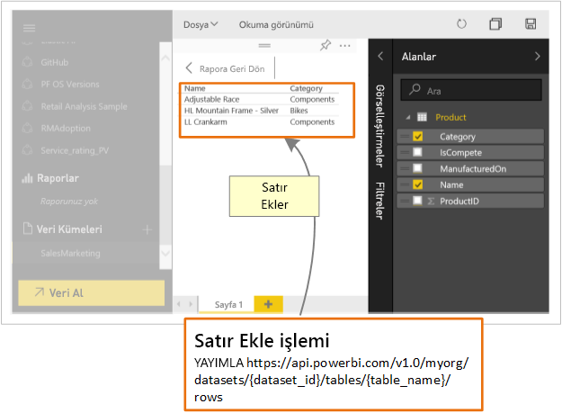

# Geliştiriciler Power BI API ile neler yapabilir?

Power BI REST API kullanarak, Power BI raporlarıyla, panolarla ve kutucuklarla tümleşen uygulamalar oluşturabilirsiniz.

Power BI REST API ile raporlar, veri kümeleri ve çalışma alanları gibi Power BI nesneleri üzerinde yönetim görevleri gerçekleştirebilirsiniz.

Power BI API'lerle yapabileceğiniz bazı işlemler aşağıda verilmiştir.

| **Daha fazla bilgi almak için** | **Bu bilgilere başvurun** |
|----------------------------------------------------------------------------------|------------------------------------------------------------------------------------|
| Power BI kullanıcıları ve Power BI kullanıcısı olmayan kullanıcılar için raporlar, panolar ve kutucuklar ekleyin. | [Power BI panolarınızı, raporlarınızı ve kutucuklarınızı ekleme](../embed-sample-for-customers.md) |
| Power BI nesneleri üzerinde yönetim görevleri gerçekleştirin. | [Power BI Rest API başvurusu](https://docs.microsoft.com/rest/api/power-bi/) |
| Power BI panosuna anahtar veri göndermek için mevcut iş akışını genişletme. | [Bir panoya veri gönderme](walkthrough-push-data.md) |
| Power BI'da kimlik doğrulaması yapma. | [Power BI'da kimlik doğrulaması yapma](../get-azuread-access-token.md) |

> [!NOTE]
> Power BI API'lerde çalışma alanları hâlâ gruplar olarak adlandırılmaktadır. Gruplara yapılan başvurular, çalışma alanlarıyla çalıştığınızı gösterir.

## API Geliştirici araçları

| Araçlar | Açıklama |  |  |
|-------------------------|---------------------------------------------------------------------------------------------------------------------------------------------------|---|---|
| [Deneme alanı aracı](https://microsoft.github.io/PowerBI-JavaScript/demo) | Power BI JavaScript API’lerini kullanmanın tam örneğini deneyin. Bu araç, farklı türde Power BI Embedded örnekleri ile yürütmenin de hızlı bir yoludur. |  |  |
| [Power BI JavaScript wiki](https://github.com/Microsoft/powerbi-javascript/wiki) | Power BI JavaScript API'leri hakkında daha fazla bilgi edinmek için. |  |  |
| [Postman](https://www.getpostman.com/) | İstekler çalıştırın, test edin, hata ayıklayın, izleyin, otomatik testler çalıştırın ve daha fazlasını yapın. |

## Power BI'a veri gönderme

[Veri kümesine veri göndermek için](walkthrough-push-data.md) Power BI API'yi kullanabilirsiniz. Bu özellik, bir veri kümesi içinde bulunan tabloya satır eklemenizi sağlar. Ardından, eklediğiniz yeni veriler panonuzdaki kutucuklara ve raporunuzdaki görsellere yansıtılır.

## GitHub depoları

* [Power BI Geliştirici örnekleri](https://github.com/Microsoft/PowerBI-Developer-Samples)
* [.NET SDK](https://github.com/Microsoft/PowerBI-CSharp)
* [JavaScript API'si](https://github.com/Microsoft/PowerBI-JavaScript)

## Sonraki Adımlar

* [Bir veri kümesine veri gönderme](walkthrough-push-data.md)
* [Power BI görseli geliştirme](../visuals/custom-visual-develop-tutorial.md)
* [Power BI Rest API Başvurusu](rest-api-reference.md)
* [Power BI REST API'leri](https://docs.microsoft.com/rest/api/power-bi/)

Başka bir sorunuz mu var? [Power BI Topluluğu'na sorun](https://community.powerbi.com/)
