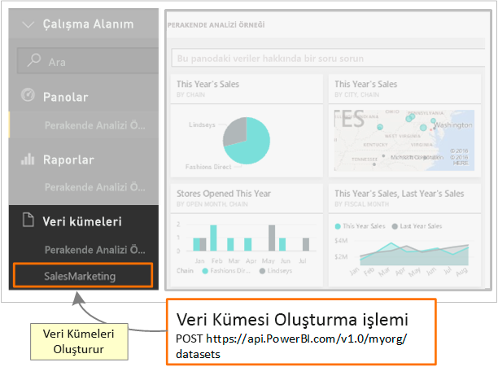

# <a name="step-3-create-a-dataset-in-power-bi"></a>3\. Adım: Power BI'da veri kümesi oluşturma
Bu makale, [bir veri kümesine veri gönderme](walkthrough-push-data.md) ayrıntılı kılavuzunun bir parçasıdır.

Bir veri kümesine veri gönderme kılavuzunun [Kimlik doğrulaması erişim belirteci alma](walkthrough-push-data-get-token.md) başlıklı **2. Adım**'ında, **Azure AD**'de kimlik doğrulaması gerçekleştirmek için bir belirteç alırsınız. Bu adımda, [PostDataset](https://docs.microsoft.com/rest/api/power-bi/pushdatasets) işlemini çağırmak için belirteci kullanırsınız.

Bir REST kaynağına çağrı yapmak için, kaynağın yerini belirleyen bir URL kullanır ve Power BI hizmeti kaynağına, veri kümesini tanımlayan bir JavaScript Nesne Gösterimi (JSON) dizesi gönderirsiniz. Power BI hizmetinin kullanmak istediğiniz bölümü bir REST kaynağı tarafından tanımlanır. Veri kümesine veri gönderme işlemi için hedef kaynak bir **Veri Kümesidir**. Bir veri kümesini tanımlayan URL `https://api.PowerBI.com/v1.0/myorg/datasets`. Bir grup içindeki verileri gönderiyorsanız URL `https://api.PowerBI.com/v1.0/myorg/groups/{group_id}/datasets`.

Bir Power BI REST işleminin kimliğini doğrulamak için, [Kimlik doğrulaması erişim belirteci alma](walkthrough-push-data-get-token.md) bölümünde edindiğiniz belirteci bir istek üst bilgisine eklersiniz:

[PostDataset](https://docs.microsoft.com/rest/api/power-bi/pushdatasets) işlemini çağırdığınızda, yeni bir veri kümesi oluşturulur. 



Power BI'da veri kümesi oluşturma işlemi aşağıda açıklanmıştır.

## <a name="create-a-dataset-in-power-bi"></a>Power BI'da veri kümesi oluşturma
> [!NOTE]
> Başlamadan önce, [bir veri kümesine veri gönderme](walkthrough-push-data.md) kılavuzundaki adımları izlediğinizden emin olun.
> 
> 

1. [2. Adım: Kimlik doğrulaması erişim belirteci alma](walkthrough-push-data-get-token.md) bölümünde oluşturduğunuz Konsol Uygulaması projesinde, Program.cs'ye **using System.Net;** ve **using System.IO;** dizelerini ekleyin.
2. Program.cs'ye aşağıdaki kodu ekleyin.
3. Konsol Uygulaması'nı çalıştırın ve Power BI hesabınızda oturum açın. Konsol Penceresinde **Dataset Created** ifadesini görmeniz gerekir. Ayrıca, yeni veri kümesini görmek için Power BI'da oturum açabilirsiniz.

**Veri kümesine veri gönderme örneği**

Bu kodu Program.cs'ye ekleyin.

* static void Main(string[] args) bölümüne:
  
    ```csharp
    static void Main(string[] args)
    {
        //Get an authentication access token
        token = GetToken();
  
        //Create a dataset in Power BI
        CreateDataset();
    }
    ```
* Bir CreateDataset() yöntemi ekleyin:
  
    ```csharp
    #region Create a dataset in Power BI
    private static void CreateDataset()
    {
        //TODO: Add using System.Net and using System.IO
  
        string powerBIDatasetsApiUrl = "https://api.powerbi.com/v1.0/myorg/datasets";
        //POST web request to create a dataset.
        //To create a Dataset in a group, use the Groups uri: https://api.PowerBI.com/v1.0/myorg/groups/{group_id}/datasets
        HttpWebRequest request = System.Net.WebRequest.Create(powerBIDatasetsApiUrl) as System.Net.HttpWebRequest;
        request.KeepAlive = true;
        request.Method = "POST";
        request.ContentLength = 0;
        request.ContentType = "application/json";
  
        //Add token to the request header
        request.Headers.Add("Authorization", String.Format("Bearer {0}", token));
  
        //Create dataset JSON for POST request
        string datasetJson = "{\"name\": \"SalesMarketing\", \"tables\": " +
            "[{\"name\": \"Product\", \"columns\": " +
            "[{ \"name\": \"ProductID\", \"dataType\": \"Int64\"}, " +
            "{ \"name\": \"Name\", \"dataType\": \"string\"}, " +
            "{ \"name\": \"Category\", \"dataType\": \"string\"}," +
            "{ \"name\": \"IsCompete\", \"dataType\": \"bool\"}," +
            "{ \"name\": \"ManufacturedOn\", \"dataType\": \"DateTime\"}" +
            "]}]}";
  
        //POST web request
        byte[] byteArray = System.Text.Encoding.UTF8.GetBytes(datasetJson);
        request.ContentLength = byteArray.Length;
  
        //Write JSON byte[] into a Stream
        using (Stream writer = request.GetRequestStream())
        {
            writer.Write(byteArray, 0, byteArray.Length);
  
            var response = (HttpWebResponse)request.GetResponse();
  
            Console.WriteLine(string.Format("Dataset {0}", response.StatusCode.ToString()));
  
            Console.ReadLine();
        }
    }
    #endregion
    ```

Sonraki adımda [bir Power BI tablosuna satır eklemek için veri kümesi alma](walkthrough-push-data-get-datasets.md) işlemi gösterilmektedir.

[Tam kod listesi](#code) aşağıdadır.

<a name="code"/>

## <a name="complete-code-listing"></a>Tam kod listesi

```csharp
using System;
using Microsoft.IdentityModel.Clients.ActiveDirectory;
using System.Net;
using System.IO;

namespace walkthrough_push_data
{
    class Program
    {
        private static string token = string.Empty;

        static void Main(string[] args)
        {

            //Get an authentication access token
            token = GetToken();

            //Create a dataset in Power BI
            CreateDataset();

        }

        #region Get an authentication access token
        private static string GetToken()
        {
            // TODO: Install-Package Microsoft.IdentityModel.Clients.ActiveDirectory -Version 2.21.301221612
            // and add using Microsoft.IdentityModel.Clients.ActiveDirectory

            //The client id that Azure AD created when you registered your client app.
            string clientID = "{Client_ID}";

            //RedirectUri you used when you register your app.
            //For a client app, a redirect uri gives Azure AD more details on the application that it will authenticate.
            // You can use this redirect uri for your client app
            string redirectUri = "https://login.live.com/oauth20_desktop.srf";

            //Resource Uri for Power BI API
            string resourceUri = "https://analysis.windows.net/powerbi/api";

            //OAuth2 authority Uri
            string authorityUri = "https://login.microsoftonline.com/common/";

            //Get access token:
            // To call a Power BI REST operation, create an instance of AuthenticationContext and call AcquireToken
            // AuthenticationContext is part of the Active Directory Authentication Library NuGet package
            // To install the Active Directory Authentication Library NuGet package in Visual Studio,
            //  run "Install-Package Microsoft.IdentityModel.Clients.ActiveDirectory" from the nuget Package Manager Console.

            // AcquireToken will acquire an Azure access token
            // Call AcquireToken to get an Azure token from Azure Active Directory token issuance endpoint
            AuthenticationContext authContext = new AuthenticationContext(authorityUri);
            string token = authContext.AcquireToken(resourceUri, clientID, new Uri(redirectUri)).AccessToken;

            Console.WriteLine(token);
            Console.ReadLine();

            return token;
        }

        #endregion


        #region Create a dataset in Power BI
        private static void CreateDataset()
        {
            //TODO: Add using System.Net and using System.IO

            string powerBIDatasetsApiUrl = "https://api.powerbi.com/v1.0/myorg/datasets";
            //POST web request to create a dataset.
            //To create a Dataset in a group, use the Groups uri: https://api.PowerBI.com/v1.0/myorg/groups/{group_id}/datasets
            HttpWebRequest request = System.Net.WebRequest.Create(powerBIDatasetsApiUrl) as System.Net.HttpWebRequest;
            request.KeepAlive = true;
            request.Method = "POST";
            request.ContentLength = 0;
            request.ContentType = "application/json";

            //Add token to the request header
            request.Headers.Add("Authorization", String.Format("Bearer {0}", token));

            //Create dataset JSON for POST request
            string datasetJson = "{\"name\": \"SalesMarketing\", \"tables\": " +
                "[{\"name\": \"Product\", \"columns\": " +
                "[{ \"name\": \"ProductID\", \"dataType\": \"Int64\"}, " +
                "{ \"name\": \"Name\", \"dataType\": \"string\"}, " +
                "{ \"name\": \"Category\", \"dataType\": \"string\"}," +
                "{ \"name\": \"IsCompete\", \"dataType\": \"bool\"}," +
                "{ \"name\": \"ManufacturedOn\", \"dataType\": \"DateTime\"}" +
                "]}]}";

            //POST web request
            byte[] byteArray = System.Text.Encoding.UTF8.GetBytes(datasetJson);
            request.ContentLength = byteArray.Length;

            //Write JSON byte[] into a Stream
            using (Stream writer = request.GetRequestStream())
            {
                writer.Write(byteArray, 0, byteArray.Length);

                var response = (HttpWebResponse)request.GetResponse();

                Console.WriteLine(string.Format("Dataset {0}", response.StatusCode.ToString()));

                Console.ReadLine();
            }
        }
        #endregion
    }
}
```

[Sonraki Adım >](walkthrough-push-data-get-datasets.md)

## <a name="next-steps"></a>Sonraki adımlar
* [Bir Power BI tablosuna satır eklemek için veri kümesi alma](walkthrough-push-data-get-datasets.md)  
* [Kimlik doğrulaması erişim belirteci alma](walkthrough-push-data-get-token.md)  
* [PostDataset](https://docs.microsoft.com/rest/api/power-bi/pushdatasets/datasets_postdataset)  
[PostDatasetInGroup](https://docs.microsoft.com/rest/api/power-bi/pushdatasets/datasets_postdatasetingroup)  
* [Power BI Panolarına veri gönderme](walkthrough-push-data.md)  
* [Overview of Power BI REST API (Power BI REST API'sine Genel Bakış)](overview-of-power-bi-rest-api.md)  
* [Power BI REST API başvurusu](https://docs.microsoft.com/rest/api/power-bi/)  

Başka bir sorunuz mu var? [Power BI Topluluğu'na başvurun](https://community.powerbi.com/)

