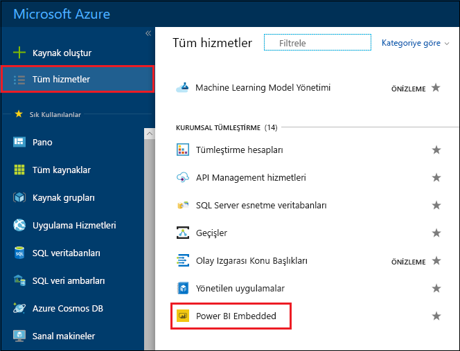
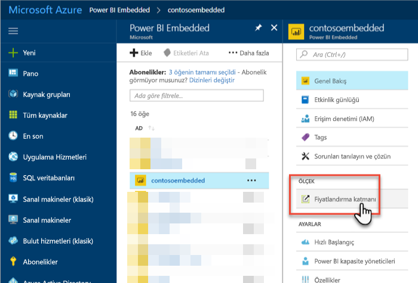
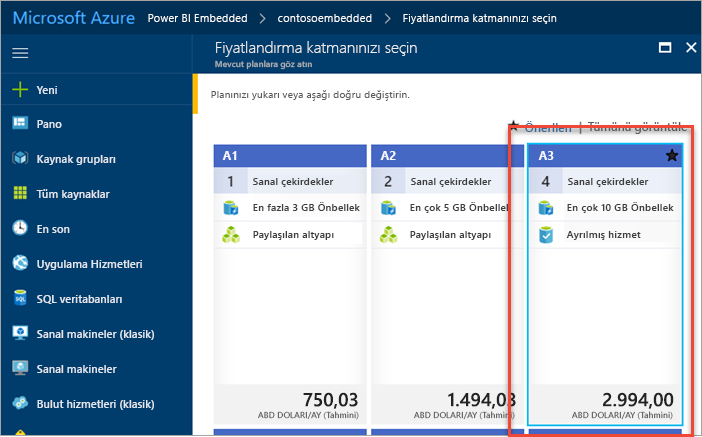
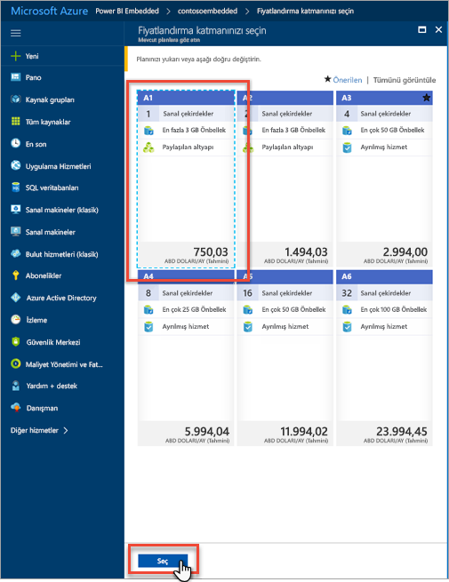
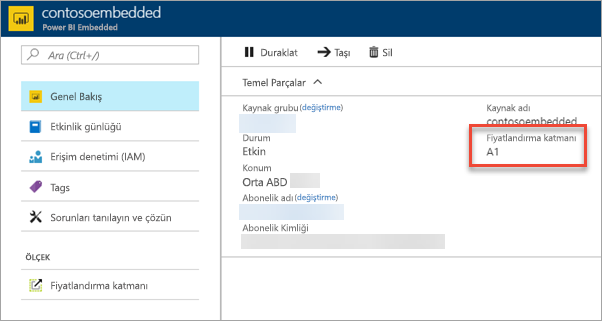

# Azure portalda Power BI Embedded kapasitenizi ölçeklendirme

Bu makalede Microsoft Azure'daki bir Power BI Embedded kapasitesini ölçeklendirme adımları anlatılmaktadır. Ölçeklendirme, kapasitenizin boyutunu artırmanızı veya azaltmanızı sağlar.

Bu makalede önceden bir Power BI Embedded kapasitesi oluşturduğunuz kabul edilmektedir. Henüz oluşturmadıysanız başlamak için bkz. [Azure portalda Power BI Embedded kapasitesi oluşturma](azure-pbie-create-capacity.md).

> [!NOTE]
> Ölçeklendirme işlemi bir dakika kadar sürebilir. Kapasite bu süre boyunca kullanım dışı olacaktır. Eklenmiş içerikler yüklenemeyebilir.

## Bir kapasiteyi ölçeklendirme

1. [Azure portalında](https://portal.azure.com/) oturum açın.

2. Kapasitelerinizi görmek için **Tüm hizmetler** > **Power BI Embedded** yolunu izleyin.

    

3. Ölçeklendirmek istediğiniz kapasiteyi seçin.

    

4. Kapasitenizin içinde **Ölçeklendirme** bölümündeki **Fiyatlandırma katmanı**'nı seçin.

    

    Geçerli fiyatlandırma katmanınızı mavi renkle vurgulanır.

    

5. Ölçeği artırmak veya azaltmak için geçmek istediğiniz yeni katmanı seçin. Seçtiğiniz yeni katmanın etrafında mavi renkli kesik çizgi görüntülenir. Ölçeği yeni katmanla değiştirmek için **Seç**'e tıklayın.

    

    Kapasitenizin ölçeklendirilmesi bir-iki dakika sürebilir.

6. Genel bakış sekmesini görüntüleyerek katmanınızı onaylayın. Geçerli fiyatlandırma katmanı listelenir.

    

## Sonraki adımlar

Kapasitenizi duraklatmak veya başlatmak için bkz. [Azure portalda Power BI Embedded kapasitenizi duraklatma ve başlatma](azure-pbie-pause-start.md).

Uygulamanıza Power BI içeriği eklemeye başlamak için bkz. [Power BI panolarınızı, raporlarınızı ve kutucuklarınızı ekleme](https://powerbi.microsoft.com/documentation/powerbi-developer-embedding-content/).

Başka bir sorunuz mu var? [Power BI Topluluğu'na sorun](http://community.powerbi.com/)
