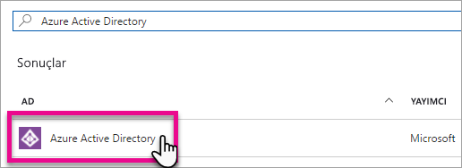
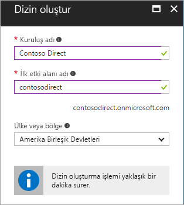
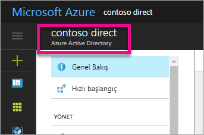
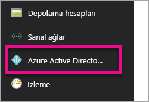
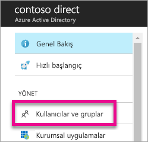
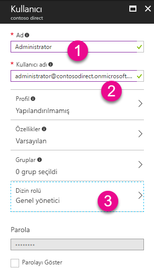
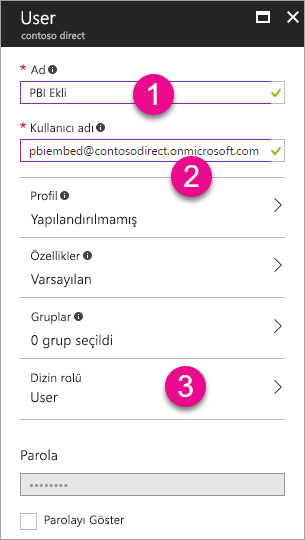
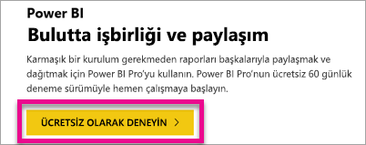

# Power BI ile kullanmak üzere bir Azure Active Directory kiracısı oluşturma
Power BI REST API'lerini kullanan özel uygulamanızla kullanmak üzere yeni bir Azure Active Directory (Azure AD) kiracısı oluşturmayı öğrenin.

Kiracılar, Azure Active Directory içindeki kuruluşları temsil eder. Kuruluşunuzun Azure, Microsoft Intune veya Office 365 gibi bir Microsoft bulut hizmetine kaydolduğunda aldığı ve sahip olduğu adanmış bir Azure AD hizmeti örneğidir. Her Azure AD kiracısı diğer Azure AD kiracılarından ayrıdır.

Azure AD kiracısına sahip olduktan sonra bir uygulama tanımlayıp uygulamanızın Power BI REST API'lerini kullanabilmesi için izin atamanız gerekir.

Kuruluşunuz, uygulamanızla birlikte kullanabileceğiniz bir Azure AD kiracısına sahip olabilir. Uygulamanız için bu kiracıyı kullanabilir veya uygulamanıza özel yeni bir kiracı oluşturabilirsiniz. Bu makalede yeni kiracı oluşturma adımları ele alınmaktadır.

## Azure Active Directory kiracısı oluşturma
Power BI'ı özel uygulamanızla tümleştirmek için Azure AD içinde bir uygulama tanımlamanız gerekir. Bunun için Azure AD içinde bir dizine ihtiyacınız vardır. Bu dizin sizin kiracınızdır. Kuruluşunuz Power BI veya Office 365 kullanmadığı için kiracıya sahip değilse [bir kiracı oluşturmanız gerekir](https://docs.microsoft.com/azure/active-directory/develop/active-directory-howto-tenant). Ayrıca, uygulamanızın kuruluşunuzun kiracısıyla karışmasını istemediğiniz durumlarda da yeni bir kiracı oluşturmanız gerekebilir. Bu sayede kaynakları birbirinden ayırmış olursunuz.

Yalnızca test amacıyla kullanmak üzere de bir kiracı oluşturmak isteyebilirsiniz.

Yeni bir Azure AD kiracısı oluşturmak için aşağıdaki adımları uygulayın.

1. [Azure portalına](https://portal.azure.com) gidip Azure aboneliği olan bir hesapla oturum açın.
2. **Artı simgesini (+)** seçip *Azure Active Directory* terimini aratın.
   
    
3. Arama sonuçlarında **Azure Active Directory** girişini seçin.
   
    
4. **Oluştur**'u seçin.
5. **Kuruluş için bir ad** ve **ilk etki alanı adı** girin. Ardından **Oluştur**'u seçin. Dizininiz oluşturulur.
   
    
   
   > [!NOTE]
   > İlk etki alanınız onmicrosoft.com ile bitecektir. Daha sonra başka etki alanı adları ekleyebilirsiniz. Bir kiracı dizinine birden fazla etki alanı atanabilir.
   > 
   > 
6. Dizin oluşturma işlemini tamamladıktan sonra yeni dizininizi yönetmek için bilgi kutusunu seçin.

Yeni dizininiz oluşturulur. Sonraki adımda kiracıya bir kullanıcı ekleyeceğiz.

## Azure Active Directory kiracınızda kullanıcı oluşturma
Dizini oluşturduğumuza göre bu adımda en az iki kullanıcı oluşturabiliriz. Bir tanesi kiracının Genel Yöneticisi, diğeri de ekleme için kullanacağımız ana hesap olacak. Bunu bir hizmet hesabı olarak düşünün.

1. Azure portalında Azure Active Directory bölmesinde olduğunuzdan emin olun.
   
    
   
    Değilseniz sol taraftaki hizmet çubuğundan Azure Active Directory simgesini seçin.
   
    
2. **Yönet** bölümünde **Kullanıcılar ve gruplar**'ı seçin.
   
    
3. **Tüm kullanıcılar**'ı ve ardından **+ Yeni kullanıcı**'yı seçin.
4. Bu kullanıcı için bir ad ve kullanıcı adı girin. Bu kullanıcı kiracınızın Genel Yöneticisi olacak. **Dizin rolü** değerini de *Genel yönetici* olarak değiştirmeniz gerekir. İsterseniz geçici parolayı da gösterebilirsiniz. İşiniz bittiğinde **Oluştur**'u seçin.
   
    
5. Aynı adımları tekrarlayarak kiracınızda normal bir kullanıcı oluşturun. Bu hesap ana ekleme hesabınız için de kullanılabilir. Bu sefer **Dizin rolü** değerini *Kullanıcı* olarak bırakın. Parolayı not almayı unutmayın. Ardından **Oluştur**'u seçin.
   
    
6. 5. adımda oluşturduğunuz kullanıcı hesabıyla Power BI oturumu açın. Bunu yapmak için [powerbi.com](https://powerbi.microsoft.com/get-started/) adresine gidip *Power BI - Cloud collaboration and sharing* (Power BI - Bulutta işbirliği ve paylaşım) bölümünün altındaki **Try free** (Ücretsiz deneyin) öğesini seçin.
   
    
   
    Kaydolduktan sonra Power BI Pro sürümünü 60 gün boyunca denemek isteyip istemediğiniz sorulur. İsterseniz bu teklifi kabul ederek Pro sürüm kullanıcısı olabilirsiniz. Artık ekli çözüm geliştirmeye de başlayabilirsiniz.
   
   > [!NOTE]
   > Kullanıcı hesabında tanımladığınız e-posta adresiyle kaydolduğunuzdan emin olun.
   > 
   > 

## Sonraki adımlar
Artık bir Azure AD kiracınız var. Bu kiracıyı kullanarak Power BI'daki öğeleri test edebilir ve/veya bir sonraki aşamaya geçerek Power BI panolarını ve raporlarını uygulamanıza ekleyebilirsiniz. Öğe ekleme hakkında bilgi almak için bkz. [Power BI panolarınızı, raporlarınızı ve kutucuklarınızı ekleme](embedding-content.md).

[What is an Azure AD directory? (Azure AD dizini nedir?)](https://docs.microsoft.com/azure/active-directory/active-directory-whatis)  
[Azure Active Directory kiracısı oluşturma](https://docs.microsoft.com/azure/active-directory/develop/active-directory-howto-tenant)  

Başka bir sorunuz mu var? [Power BI Topluluğu'na sorun](http://community.powerbi.com/)

