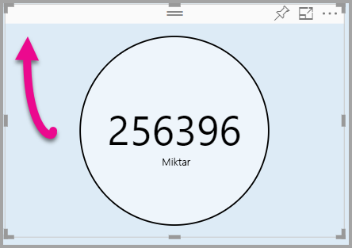

# <a name="tutorial-adding-formatting-options-to-a-power-bi-custom-visual"></a>Öğretici: Power BI özel görsellerine biçimlendirme seçenekleri ekleme

Bu öğreticide görsellere ortak özellikler ekleme adımları açıklanır.

Bu öğreticide aşağıdakilerin nasıl yapılacağını öğreneceksiniz:
> [!div class="checklist"]
> * Görsel özelliklerini ekleme.
> * Görseli paketleme.
> * Özel görseli bir Power BI Desktop raporuna aktarma.

## <a name="adding-formatting-options"></a>Biçimlendirme seçenekleri ekleme

1. **Power BI**’da **Sayfayı biçimlendir**’i seçin.

    *Biçimlendirme seçenekleri bu görsel için mevcut değil* iletisini görmeniz gerekir.

    

2. **Visual Studio Code**’da *capabilities.json* dosyasını açın.

3. **dataViewMappings** dizisinin öncesine **objects** (8. satırdan sonra) ekleyin.

    ```json
    "objects": {},
    ```
    

4. **capabilities.json** dosyasını kaydedin.

5. **Power BI**’da biçimlendirme seçeneklerini yeniden inceleyin.

    > [!Note]
    > Biçimlendirme seçenekleri değişmediyse **Özel Görseli Yeniden Yükle**’yi seçin.

    

6. **Başlık** seçeneğini *Kapalı* olarak ayarlayın. Görselin sol üst köşesinde ölçü adının artık görüntülenmediğini göreceksiniz.

    

    

### <a name="adding-custom-formatting-options"></a>Özel biçimlendirme seçenekleri ekleme

Dairenin rengini ve kenarlık kalınlığını yapılandırmanızı sağlayacak özel özellikler ekleyebilirsiniz.

1. PowerShell’de özel görseli durdurun.

2. Visual Studio Code’da **capabilities.json** dosyasının **objects** etiketli nesnesine aşağıdaki JSON parçasını ekleyin.

    ```json
    "circle": {
     "displayName": "Circle",
     "properties": {
         "circleColor": {
             "displayName": "Color",
             "description": "The fill color of the circle.",
             "type": {
                 "fill": {
                     "solid": {
                         "color": true
                     }
                 }
             }
         },
         "circleThickness": {
             "displayName": "Thickness",
             "description": "The circle thickness.",
             "type": {
                 "numeric": true
                 }
             }
         }
     },
    ```

    JSON parçası circleColor ve circleThickness adlı iki seçenek içeren circle adlı bir grup tanımlar.

   

3. **capabilities.json** dosyasını kaydedin.

4. **Gezgin bölmesinde**, **src** klasörünü açıp **settings.ts** dosyasını seçin. *Bu dosya başlangıç görselinin ayarlarını temsil eder*.

5. **settings.ts** dosyasındaki iki sınıfı aşağıdaki kodla değiştirin.

    ```typescript
    export class CircleSettings {
     public circleColor: string = "white";
     public circleThickness: number = 2;
    }
    export class VisualSettings extends DataViewObjectsParser {
     public circle: CircleSettings = new CircleSettings();
    }
    ```

    

    Bu modül iki sınıf tanımlar. **CircleSettings** sınıfı, adı **capabilities.json** dosyasında tanımlanan nesnelerle (**circleColor** ve **circleThickness**) eşleşen iki özellik tanımlar ve varsayılan değerleri ayarlar. **VisualSettings** sınıfı, **DataViewObjectParser** sınıfını devralır ve **circle** adlı bir özellik ekler. Bu özellik *capabilities.json* dosyasında tanımlanan nesneyle eşleşir ve **CircleSettings** örneği döndürür.

6. **settings.ts** dosyasını kaydedin.

7. **visual.ts** dosyasını açın.

8. **Visual** sınıfına aşağıdaki özelliği ekleyin.

    ```typescript
    private visualSettings: VisualSettings;
    ```
    Bu özellik **VisualSettings** nesnesinde görsel ayarlarını tanımlayan bir başvuru depolar.

    

9. **Visual** sınıfında **update** yönteminin öncesine aşağıdaki yöntemi ekleyin. Bu yöntem, biçimlendirme seçeneklerini doldurmak için kullanılır.

    ```typescript
    public enumerateObjectInstances(options: EnumerateVisualObjectInstancesOptions): VisualObjectInstanceEnumeration {
     const settings: VisualSettings = this.visualSettings ||
    VisualSettings.getDefault() as VisualSettings;
     return VisualSettings.enumerateObjectInstances(settings, options);
    }
    ```
    Bu yöntem, biçimlendirme seçeneklerini doldurmak için kullanılır.

    

10. **update** yönteminde **radius** değişkeni bildiriminin sonrasına aşağıdaki kodu ekleyin.

    ```typescript
    this.visualSettings = VisualSettings.parse<VisualSettings>(dataView);

    this.visualSettings.circle.circleThickness = Math.max(0, this.visualSettings.circle.circleThickness);

    this.visualSettings.circle.circleThickness = Math.min(10, this.visualSettings.circle.circleThickness);
    ```
    Bu kod, biçimlendirme seçeneklerini alır. **circleThickness** özelliğine geçirilen değerleri alır, eksi değerleri 0’a, 10 üzerindeki değerleri de 10’a dönüştürür.

    

11. **circle element** için **fill style** hedefine geçirilen değeri aşağıdaki ifadeyle değiştirin.

    ```typescript
    this.visualSettings.circle.circleColor
    ```

    

12. **circle element** için **stroke-width-style** hedefine geçirilen değeri aşağıdaki ifadeyle değiştirin.

    ```typescript
    this.visualSettings.circle.circleThickness
    ```

    

13. visual.ts dosyasını kaydedin.

14. PowerShell’de görseli başlatın.

    ```powershell
    pbiviz start
    ```

15. **Power BI**’da geliştirici görselinin üzerindeki kayan araç çubuğunda **Otomatik Yeniden Yüklemeyi Aç/Kapat**’ı seçin.

16. **Görsel biçimlendirme** seçeneklerinde **Daire** öğesini genişletin.

    

    **Renk** ve **kalınlık** seçeneklerini değiştirin.

    **Kalınlık** değerini sıfırın altında bir değere ve 10’un üzerinde bir değere ayarlayın. Görselin değerleri mümkün olan minimum ve maksimum değerlere göre ayarladığına dikkat edin.

## <a name="packaging-the-custom-visual"></a>Özel görseli paketleme

Özel görsel projesi için özellik değerlerini girin, simge dosyasını güncelleştirin ve ardından özel görseli paketleyin.

1. **PowerShell**’de özel görseli durdurun.

2. **pbiviz.json** dosyasını **Visual Studio Code**’da açın.

3. **visual** nesnesinde **displayName** özelliğini *Daire Kartı* olarak değiştirin.

    **Görsel Öğeler** bölmesinde simgenin üzerine geldiğinizde görünen ad görüntülenir.

    

4. **description** özelliği için aşağıdaki metni girin.

    *Biçimlendirilmiş ölçüm değerini daire içinde görüntüler*

5. İsterseniz **author** nesnesine kendinizle ilgili bilgiler girebilirsiniz.

6. **pbiviz.json** dosyasını kaydedin.

7. **assets** nesnesinde belgenin bir simge yolu tanımladığını göreceksiniz. Simge, **_Görsel Öğeler_** bölmesinde görüntülenen resimdir. *20x20 piksel* boyutunda bir **PNG** dosyası olmalıdır.

8. Windows Gezgini’nde icon.png dosyasını kopyalayın ve assets klasöründe bulunan varsayılan dosyanın üzerine yapıştırın.

9. Visual Studio Code’un Gezgin bölmesinde assets klasörünü genişletip icon.png dosyasını seçin.

10. Simgeyi gözden geçirin.

    

11. Visual Studio Code’da tüm dosyaların kaydedildiğinden emin olun.

12. Özel görseli paketlemek için PowerShell’e aşağıdaki komutu girin.

    ```powershell
    pbiviz package
    ```

    

Paket, projenin **dist** klasörüne kaydedilir. Pakette özel görseli Power BI hizmetine veya bir Power BI Desktop raporuna aktarmak için gerekli olan her şey bulunur. Özel görseli paketleyip kullanıma hazır hale getirdiniz.

## <a name="importing-the-custom-visual"></a>Özel görseli içeri aktarma

Şimdi Power BI Desktop raporunu açıp Daire Kartı özel görselini içeri aktarabilirsiniz.

1. **Power BI Desktop**’ı açın ve *örnek veri kümelerinden biriyle* yeni bir rapor oluşturun.

2. **_Görsel Öğeler_** bölmesinde **üç noktayı** ve ardından **Dosyadan içeri aktar**’ı seçin.

    

3. **İçeri aktarma penceresinde**, **İçeri Aktar**’ı seçin.

4. Aç penceresinde proje dizininin **dist** klasörüne gidin.

5. **circleCard.pbiviz** dosyasını ve ardından **Aç**’ı seçin.

6. Görsel başarıyla içeri aktarıldıktan sonra **Tamam**’ı seçin.

7. Görselin **_Görsel Öğeler_** bölmesine eklendiğini doğrulayın.

    

8. **Daire Kartı** simgesinin üzerine geldiğinizde açılan araç ipucunu inceleyin.

## <a name="debugging"></a>Hata ayıklama

Özel görseliniz için hata ayıklamaya yönelik ipuçlarına, [hata ayıklama kılavuzuna](https://microsoft.github.io/PowerBI-visuals/docs/how-to-guide/how-to-debug/) giderek göz atabilirsiniz.

## <a name="next-steps"></a>Sonraki adımlar

Yeni geliştirilen görselinizi **AppSource**'a göndererek başka kullanıcıların kullanımına sunmak üzere listeleyebilirsiniz. Bu işlemle ilgili daha fazla bilgi için [AppSource'ta özel görseller yayımlama](office-store.md) konusuna bakın.