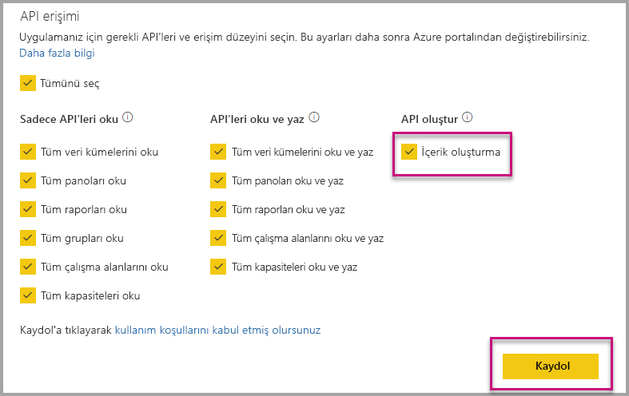

# Kuruluşunuz için ekleme yaparken otomatik yüklenecek Power BI uygulamaları

Bir uygulamadan içerik eklemek için ekleme kullanıcı olmalıdır [uygulamaya erişim](../service-create-distribute-apps.md). Uygulama kullanıcı için yüklenir, ardından ekleme sorunsuz bir şekilde çalışır. Daha fazla bilgi için [raporlar veya panolar uygulamasından](embed-from-apps.md). Tüm uygulamalar olabilecek Powerbı.com'da tanımlamak mümkündür [otomatik olarak yüklenen](https://powerbi.microsoft.com/blog/automatically-install-apps/). Ancak, bu eylem Kiracı düzeyinde gerçekleştirilir ve tüm uygulamalar için geçerlidir.

## Otomatik yüklenecek uygulama ekleme

Bir kullanıcı bir uygulama, ancak uygulama erişimi varsa, ardından başarısız katıştırma yüklü değil. Uygulama eklerken bu hataları önlemek için otomatik uygulamasının yüklenmesi ve ekleme sırasında izin verebilirsiniz. Bu eylem kullanıcı eklemeye çalışırsa uygulama yüklü değilse, bunu otomatik olarak sizin için yüklü olduğu anlamına gelir. Bu nedenle, istediğiniz içeriği hemen kullanıcı için sorunsuz bir deneyim výsledek katıştırılmış.

## Power BI kullanıcıları (verilerin sahibi kullanıcıdır) ekleme

Kullanıcılarınız için uygulamaları otomatik yükleme izin vermek için uygulamanızı 'İçerik oluşturma' izni vermeniz gerekir, [uygulamanızı kaydetmek](register-app.md#register-with-the-power-bi-application-registration-tool), veya uygulamanızı zaten kaydolduysanız ekleyin.

Ardından, ekleme URL'sindeki uygulama Kimliğini sağlamanız gerekir. Uygulama Kimliği sağlamak için uygulama Oluşturucu öncelikle uygulamayı yükledikten sonra desteklenen birini kullanın gerekir [Power BI Rest API'si](https://docs.microsoft.com/rest/api/power-bi/) çağrıları - [Get Reports](https://docs.microsoft.com/rest/api/power-bi/reports/getreports) veya [Get Dashboards](https://docs.microsoft.com/rest/api/power-bi/dashboards/getdashboards). Daha sonra uygulama Oluşturucu REST API yanıtından ekleme URL'si gerekir. İçeriği bir uygulamadan ise uygulama kimliği URL'de görünür.  Ekleme URL'sini aldıktan sonra düzenli olarak eklemek için kullanabilirsiniz.

## Güvenli ekleme

Uygulamaları otomatik yükleme kullanmak için uygulama Oluşturucu öncelikle uygulamayı yükledikten sonra raporu PowerBI.com üzerinde uygulamasına gidin ve normal bir biçimde bağlantısını alın gerekir. Tüm diğer kullanıcılarla bağlantı kullanan uygulamaya rapor ekleyebilir.

## Önemli noktalar ve sınırlamalar

* Yalnızca, raporlar ve panolar bu senaryo için de ekleyebilirsiniz.

* Verilerin sahibinin uygulama ve SharePoint ekleme senaryoları için bu özellik şu anda desteklenmiyor.