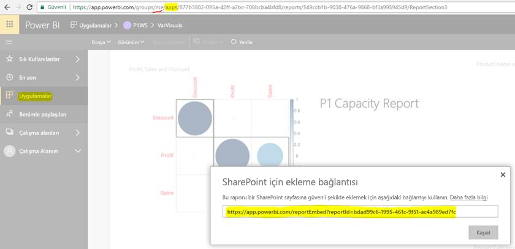

# Uygulamalardan rapor veya pano ekleme

Power BI'da ilişkili panoları ve raporları tek bir yerde bir araya getirmek için uygulama oluşturabilirsiniz. Ardından, uygulamaları kuruluşunuzdaki büyük kullanıcı gruplarına yayımlarsınız. Bu uygulamaların kullanımı, tüm kulanıcılarınız Power BI kullanıcısı olduğunda geçerlidir. Yani Power BI uygulamalarını kullanarak bunlarla içerik paylaşabilirsiniz. Bu makalede, yayımlanmış bir Power BI uygulamasından üçüncü taraf uygulamasına içerik ekleme hakkında birkaç pratik adım yer almaktadır.

## Ekleme için rapor embedURL edinme

1. Bir kullanıcı çalışma alanında (**My Workspace**) uygulamanın örneğini oluşturun. Kendinizle paylaşın veya başka bir kullanıcıya bu süreçte kılavuzluk edin.

2. İstediğiniz raporu Power BI hizmetinde açın.

3. **Dosya** > **SharePoint Online’a Ekle** öğesine gidin ve rapor embedURL’yi alın. Aşağıdaki anlık görüntüde bir embedURL örneği gösterilir. Alternatif olarak, GetReports/GetReport REST API’sini çağırabilir ve ilgili rapor embedURL alanını yanıttan ayıklayabilirsiniz. Uygulamanın örneği kullanıcının çalışma alanında oluşturulduğundan, REST çağrısında URL’nin parçası olarak bir çalışma sayfası tanımlayıcısı olmamalıdır.

    

4. JavaScript SDK'sı ile 3. adımda alınan embedURL’yi kullanın.

## Ekleme için pano embedURL edinme

1. Bir kullanıcı çalışma alanında (**My Workspace**) uygulamanın örneğini oluşturun. Kendinizle paylaşın veya başka bir kullanıcıya bu süreçte kılavuzluk edin.

2. GetDashboards REST API’sine çağrı yapın ve ilgili pano embedURL alanını yanıttan ayıklayın. Uygulamanın örneği kullanıcının çalışma alanında oluşturulduğundan, REST çağrısında URL’nin parçası olarak bir çalışma sayfası tanımlayıcısı olmamalıdır.

3. JavaScript SDK'sı ile 2. adımda alınan embedURL’yi kullanın.

## Sonraki adımlar

Üçüncü taraf müşterileriniz ve kuruluşunuz için çalışma alanlarından içerik ekleme konularına göz atın:

> [!div class="nextstepaction"]
>[Üçüncü taraf müşteriler için ekleme](embed-sample-for-customers.md)

> [!div class="nextstepaction"]
>[Kuruluşunuz için ekleme](embed-sample-for-your-organization.md)
