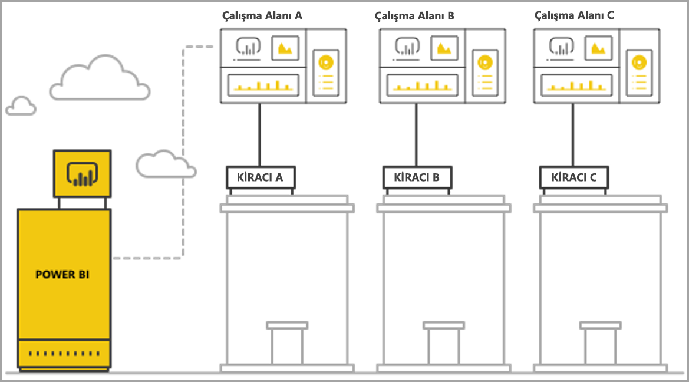
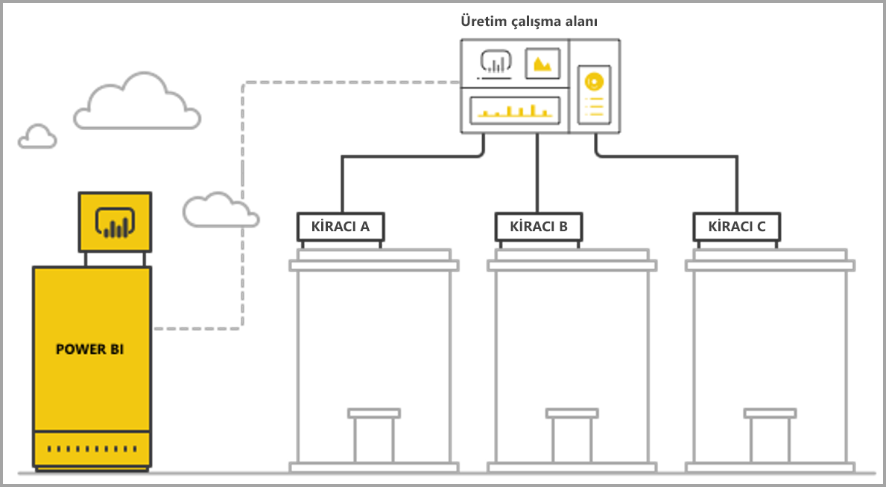

# Power BI tümleşik analiziyle çok kiracılı çalışmayı yönetme

Çok kiracılı bir SaaS uygulaması tasarlarken, SaaS uygulamanızın gereksinimlerine en uygun kiracılık modelini seçmeye özen göstermelisiniz. Bu süreç SaaS uygulamanızın tümleşik analiz bölümü olarak Power BI için de geçerlidir. Kiracı modeli, her kiracıya ait verilerin Power BI ve depolama hesabı içinde nasıl eşlendiğini ve yönetildiğini belirler. Kiracı modeliniz uygulama tasarımını ve yönetimini etkiler. Daha sonra farklı bir modele geçmek masraflı olabilir ve işleri aksatabilir.

Power BI Embedded ile, kiracılar arasındaki ayrımı korumak için iki ana yaklaşım vardır.

   1. **Çalışma alanı tabanlı yalıtım**: kiracı başına ayrı bir Power BI Çalışma Alanı oluşturma.
   2. **Satır düzeyi güvenlik tabanlı yalıtım**: kullanıcı veya grup başına veri erişimini denetlemek ve yönetmek için temel veriler kullanılır.

Bu makalede farklı yaklaşımlar açıklanır ve bu yaklaşımlar çeşitli değerlendirme ölçütlerine göre analiz edilir.

## Kavramlar ve terminoloji

**[AAD](https://docs.microsoft.com/azure/active-directory/fundamentals/active-directory-whatis)** : Azure Active Directory.

**AAD uygulaması**: AAD'de bir uygulama kimliği. Kimlik doğrulaması için bir AAD uygulaması gereklidir.

**SaaS uygulaması (hizmet olarak yazılım)** : Bir kuruluş veya ISV tarafından gerçekleştirilen sistem (genellikle çevrimiçi bir hizmettir). Ayrıca birden çok müşteri kiracısına (organizasyon) hizmet vermeye yönelik ilgili yazılım sistemleri vardır. Bu makalede, **SaaS uygulaması farklı kiracılarına hizmet vermek için Power BI Embedded'i kullanır**. Power BI Embedded, çevrimiçi bağlantısı olan tüm uygulama türleri için de çalışabilir.

**Kiracı**: SaaS uygulamasını ve müşterinin SaaS uygulamasına getirdiği tüm kaynakları veya verileri kullanan tek bir müşteri (organizasyon).

**[Power BI](../fundamentals/power-bi-overview.md)** : Power BI Embedded için platform işlevi gören Power BI bulut hizmeti.

**Power BI kiracısı**: Tek bir AAD kiracısıyla ilişkilendirilmiş bir dizi Power BI kaynağı.

**[Power BI çalışma alanı](../service-create-workspaces.md)** : Power BI'daki içerik için bir kapsayıcı.

**Power BI yapıtları**: Power BI çalışma alanlarında panolar, raporlar, veri kümeleri ve veri akışları gibi çeşitli Power BI yapıtları vardır.

**[Power BI Embedded](azure-pbie-what-is-power-bi-embedded.md)** : Geliştiricilerin Power BI içeriğini yöneten ve Power BI öğelerini ekleyen uygulamalar derlemesine olanak tanıyan bir dizi genel API.

**[Satır düzeyi güvenlik (RLS)](embedded-row-level-security.md)** : Tablodaki tek tek satırlar için verilere kullanıcı erişimini denetleme olanağı verir. Satır düzeyi güvenliği veri kaynağı düzeyinde veya Power BI anlamsal modelinde uygulanabilir.

**Ana kullanıcı**: Power BI'da SaaS uygulamasını temsil eden ve SaaS uygulamasının Power BI API'lerini çağırırken kullandığı kimlik. Power BI Pro lisansına sahip bir AAD kullanıcısı olması gerekir.

**AAD Uygulama kullanıcısı (hizmet sorumlusu)** : Power BI'da SaaS uygulamasını temsil eden ve SaaS uygulamasının Power BI API'lerini çağırırken kullandığı kimlik. Bir AAD web uygulaması olması gerekir. Power BI'da kimlik doğrulaması yapmak için *ana* kullanıcının yerine geçebilir.

**Kapasite**: Power BI hizmetini çalıştırmaya ayrılmış kaynaklar. [Power BI Premium kapasiteleri](../service-premium-what-is.md) Power BI'ı şirket içinde kullanan kurumsal şirketlere yöneliktir. Buna karşılık [Power BI Embedded kapasiteleri](azure-pbie-create-capacity.md), üçüncü taraflar için SaaS uygulamaları geliştiren uygulama geliştiricilere yöneliktir.

**[Power BI Pro lisansı](../service-admin-purchasing-power-bi-pro.md)** : Çalışma alanlarında içerik yayımlama, Premium kapasite olmadan uygulamaları kullanma ve panoları paylaşmanın yanı sıra panolara ve raporlara abone olma hakları veren kullanıcı tabanlı bir lisans.

**[Veri bağlantısı modları](../desktop-directquery-about.md)** : Farklı modlarda yapılabilecek veri kaynaklarını Power BI'a bağlama işlemi:

   * İçeri aktarma: verileri almanın en yaygın yoludur.
   * DirectQuery: verilere doğrudan kendi kaynak depolarında bağlanma.
   * Canlı bağlantı: doğrudan Analysis Services verilerine (hem Azure hem şirket içi) bağlanan başka bir mod.

## Değerlendirme ölçütleri

SaaS uygulamanıza uygun en iyi kiracı modeli seçimi, işle ilgili ve teknik belirli gereksinimlere, veri mimarisine ve başka faktörlere bağlı olarak değişir. Hem bu gereksinimlerin hem de sağlanan kiracı modeli seçenekleriyle bunların dezavantajlarının kapsamlı olarak anlaşılması, SaaS uygulamanız için güçlü, yüksek performanslı, uygun maliyetli ve ölçeklenebilir bir mimari tanımlamanıza yardımcı olur.

Aşağıda farklı kiracı modelleri arasında seçim yaparken dikkate alınacak çeşitli alanları bulabilirsiniz.

### Veri mimarisi

Genellikle, Power BI Embedded ile uygulama derleyen geliştiricilerin zaten tek veya çok kiracılı bir veritabanları vardır. Power BI Embedded için kullanılan kiracı modelinin veritabanı için kullanılan kiracı modeline benzer olması kolaylık sağlar. Veritabanı kiracı modeli henüz tanımlanmadıysa, veri mimarinize karar verirken başka faktörleri göz önüne almak isteyebilirsiniz.

### Veri Yalıtımı

Depolanan veriler ne kadar hassas? Farklı müşteri kiracılarını birbirinden ayırmak için ne düzeyde yalıtıma ihtiyacınız var? Yanıt, farklı sektörler veya özel gereksinimleri olan belirli müşteriler arasında değişiklik gösterebilir.

### Ölçeklenebilirlik

En iyi çözümü bulmak için, öngörülebilir bir gelecekte ulaşacağınız ölçeği tanımlayın. Şu anda uygun olabilecek bir çözümün kullanım ve veri ölçeği arttığında yetmeyebileceğini unutmayın. Ölçeklenebilirliği analiz ederken aşağıdaki listeyi dikkate alın:

   * Kiracı (müşteri) sayısı.
   * Her kiracı için rapor, pano ve veri kümesi sayısı.
   * Her veri kümesindeki verilerin boyutu ve yenileme sıklığı.
   * Kullanıcı sayısı.
   * Yoğun saatlerde eş zamanlı kullanıcı sayısı.

Bazı SaaS uygulamalarında müşteri sayısı ve kullanım oranı düşük olsa da büyük miktarlarda veri bulunabilir. Diğerlerinde ise çok sayıda müşteri ve yüksek kullanım söz konusuyken, her müşterinin veri ve rapor miktarı az olabilir. Bu durumlardan herhangi birindeki yüksek rakamlar, gelecekteki maliyetleri ve operasyonel karmaşıklığı etkileyebilir.

### Otomasyon ve operasyonel karmaşıklık

Sık gerçekleştirilen ve otomasyon gerektiren işlemleri tanımlayın.

   * Yeni kiracı ekleme sıklığı nedir? Her kiracıyı tam olarak eklemek için hangi eylemler gerekiyor?
   * Dağıtılması gereken yeni veya güncelleştirilmiş Power BI içeriği için sürüm temposu nedir?
   * Her kiracı için kaç tane satır düzeyi güvenlik rolü tanımlanıyor?  

Bu işlemleri ve bunları nasıl ele aldığınızı belirlemek, her modelin korunması için gereken operasyonel karmaşıklığı anlamanıza yardımcı olabilir.

### Veri Yerleşimi Gereksinimleri ve birden çok coğrafi konumu destekleme ihtiyacı

Power BI Embedded birden çok coğrafi konumda dağıtımı destekler (önizleme özelliği). [Multi-Geo](embedded-multi-geo.md), belirli bölgelerde durmak üzere atanan içeriğin bulunduğu farklı bölgelere Power BI Embedded kaynaklarının dağıtılabilmesini sağlar. Bu özellik tüm modellerde kullanılabilir ama yönetilecek içerik miktarını ve maliyeti etkileyebilir. Şu anda Multi-Geo veri yerleşimi gereksinimlerini karşılamak için tasarlanmıştır ve verileri müşterilerin yakınına taşıyarak performansı geliştirmez.

### Maliyet

[Power BI Embedded](https://azure.microsoft.com/services/power-bi-embedded/)'in, **Power BI Premium** gibi kaynak tabanlı bir satın alma modelidir. Sabit bir bilgi işlem gücü ve belleğe sahip bir veya birden çok kapasite satın alırsınız. **Power BI Embedded** ile çalışırken ana maliyet kalemi bu kapasitedir. Kapasiteyi kullanan kullanıcı sayısı için bir sınır yoktur. Tek sınır, kapasitenin performansıdır. Her *ana* kullanıcı için veya Power BI portalına erişmesi gereken belirli kullanıcılar için birer [Power BI Pro lisansı](../service-admin-licensing-organization.md) gerekir.

Canlı ortamın ve kullanımın simülasyonunu yaparak ve kapasitede yük testi çalıştırarak kapasitenizde beklenen yükü test etmenizi ve ölçmenizi öneririz. Azure kapasitesinde veya [Premium kapasite ölçüm uygulamasında](../service-admin-premium-monitor-capacity.md) sağlanan çeşitli Ölçümlerle yükü ve performansı ölçebilirsiniz.

### İçerik özelleştirme ve yazma

SaaS uygulamalarında kullanıcılara raporları düzenleme ve oluşturma özelliği getiren veya verileri akışın bir parçası olarak hizmete yükleyen iki yaklaşım vardır:

   * [Eklenmiş bir iFrame'de düzenleme/oluşturma modu](https://github.com/Microsoft/PowerBI-JavaScript/wiki/Create-Report-in-Embed-View) - Kullanıcı, SaaS uygulamasının içinde raporun görünümünü veya yeni bir boş tuval alır. Bu şekilde, Power BI araç çubuğunu kullanarak çalışma alanındaki veri kümesi temelinde içerik oluşturabilir. Tanıdık bir ortamda kullanıcının bağlamında olduğu için bu seçeneği öneririz. Çalışmaya ve düzenlemeye başlamak daha kolay olur ve kullanıcı mevcut veri kümesine iliştirilmiş bir rapor oluşturur.

   * İçerik oluşturmak ve bu içeriği SaaS uygulaması aracılığıyla çalışma alanına yüklemek için Power BI Desktop kullanın. Bu yaklaşımda, kullanıcılar Power BI Desktop'ı kullanarak çalışacak daha fazla araca sahip olur. Öte yandan, bu yaklaşımı önermeyiz çünkü kullanıcının SaaS uygulamasının bağlamı dışında ek bir aracı tanıyor olmasını gerektirir. Bir PBIX dosyasını karşıya yüklemek, kullanıcının bir veri kümesi daha eklediği anlamına gelir ve bu veri kümesi çalışma alanında önceden var olan veri kümelerinin çoğaltması olabilir.

## Power BI çalışma alanı tabanlı yalıtım

Power BI çalışma alanı tabanlı yalıtımla, SaaS uygulaması tek bir Power BI kiracısından birden çok kiracıyı destekler. Çalışma alanı tabanlı yalıtım, farklı kiracıların kullandığı tüm Power BI içeriğini kapsar. Kiracı ayrımı, birden çok çalışma alanı oluşturularak Power BI çalışma alanı düzeyinde yapılır. Her çalışma alanı, o kiracı için uygun veri kümelerini, raporları ve panoları içerir. Ayrıca, her çalışma alanı yalnızca söz konusu kiracının verilerine bağlıdır. Ek yalıtıma ihtiyacınız olursa, her çalışma alanı ve onun içeriği için bir *ana* kullanıcı veya hizmet sorumlusu oluşturabilirsiniz.

### Veri mimarisi

Kiracının verilerini yönetmek için iki ana yaklaşım vardır.

* Her kiracı için ayrı bir veritabanı
* Tek bir çok kiracılı veritabanı

SaaS uygulaması depolama alanında her kiracı için ayrı veritabanı bulunduruluyorsa, doğal seçim Power BI'da tek kiracılı veri kümeleri kullanmak ve her veri kümesi için eşleşen veritabanına işaret eden bir bağlantı dizesi sağlamaktır.

SaaS uygulamasın depolama alanında tüm kiracılar için çok kiracılı bir veritabanı kullanılıyorsa, kiracıları çalışma alanına göre ayırmak kolay olur. Yalnızca ilgili kiracının verilerini alan parametre tabanlı bir veritabanı sorgusuyla, Power BI veri kümesi için veritabanı bağlantısını yapılandırabilirsiniz. Bağlantıyı güncelleştirmek için [Power BI Desktop](../desktop-query-overview.md)'ı veya sorgudaki [parametrelerle](https://docs.microsoft.com/rest/api/power-bi/datasets/updateparametersingroup)[API](https://docs.microsoft.com/rest/api/power-bi/datasets/updatedatasourcesingroup)'yi kullanabilirsiniz.

### Veri yalıtımı

Bu kiracı modelinde veriler çalışma alanı düzeyinde ayrılır. Çalışma alanıyla kiracı arasındaki basit bir eşleme, bir kiracıdaki kullanıcıların diğer kiracıdaki içeriği görmesini önler. Tek bir *ana* kullanıcı kullanmak için tüm farklı çalışma alanlarına erişiminizin olması gerekir. Son kullanıcının hangi verileri görüntüleyeceğini belirleyen yapılandırma, [ekleme belirtecini oluşturma](https://docs.microsoft.com/rest/api/power-bi/embedtoken) sırasında tanımlanır. Bu, son kullanıcının göremediği veya değiştiremediği yalnızca arka uçta çalışan bir işlemdir.

Daha fazla yalıtım eklemek için, uygulama geliştiricisi birden çok çalışma alanına erişimi olan tek bir *ana* kullanıcı veya uygulama yerine, her çalışma alanı için birer *ana* kullanıcı veya uygulama tanımlayabilir. Bu sayede, herhangi bir insan hatasının veya kimlik bilgileri sızıntısının birden çok müşterinin verilerinin ortaya çıkmasına neden olmayacağından emin olabilirsiniz.

### Ölçeklenebilirlik

Bu modelin avantajlarından biri, her kiracı için verileri birden çok veri kümesine ayırarak [tek veri kümesinin boyut sınırlarıyla](https://docs.microsoft.com/power-bi/service-premium-large-datasets) (şu anda kapasitede 10 GB) başa çıkabilmektir. Kapasite aşırı yüklendiğinde, kullanılmayan veri kümelerini çıkararak etkin veri kümeleri için belleği serbest bırakabilir. Tek bir büyük veri kümesinde bu görevi yerine getirmek mümkün değildir. Birden çok veri kümesi kullanıldığında, gerektiğinde kiracıları birden çok Power BI kapasitesine ayırmak da mümkün olur.

Bu avantajlara rağmen, SaaS uygulamasının gelecekte ulaşabileceği ölçek göz önüne alınmalıdır. Örneğin, yönetilebilecek yapıt sayısıyla ilgili sınırlamalara ulaşılabilir. Daha fazla ayrıntı için bu makaledeki dağıtım [sınırlamalarına](#summary-comparison-of-the-different-approaches) bakın. Kullanılan kapasite SKU'su veri kümelerinin içine sığabilmesi gereken bellek boyutuna, aynı anda çalıştırılabilecek yenileme sayısına ve maksimum veri yenileme sıklığına sınır getirir. Yüzlerce veya binlerce veri kümesi yönetilirken, test edilmesi önerilir. Ortalama ve en yüksek kullanım hacimlerinin, ayrıca büyük veri kümeleri veya farklı kullanım desenleri olup diğer kiracılardan farklı yönetilen belirli kiracıların da göz önüne alınması önerilir.

### Otomasyon ve operasyonel karmaşıklık

Power BI çalışma alanı tabanlı yalıtımla, uygulama geliştiricisinin yüzlerce veya binlerce yapıtı yönetmesi gerekebilir. Bu kiracı modelinde uygulamanızın yaşam döngüsü yönetiminde sıklıkla gerçekleşen süreçleri tanımlamak ve bu işlemleri gerçekleştirmek için doğru araç kümesi sahip olduğunuzdan emin olmak çok önemlidir. Bazı örnek işlemler:

   * Yeni kiracı (müşteri) ekleme
   * Kiracıların bir bölümü veya tümü için raporu veya panoya güncelleştirme
   * Kiracıların bir bölümü veya tümü için veri kümesi şemasını güncelleştirme
   * Belirli kiracıların planlanmamış özelleştirmeleri
   * Veri kümesi yenileme sıklığı

Örneğin, yeni kiracı için çalışma alanı oluşturmak yaygın bir görevdir ve otomasyon gerektirir. [Power BI REST API](https://docs.microsoft.com/rest/api/power-bi/) ile [çalışma alanlarını oluştururken tam otomasyon](https://powerbi.microsoft.com/blog/duplicate-workspaces-using-the-power-bi-rest-apis-a-step-by-step-tutorial/) elde edebilirsiniz.

### Multi-Geo gereksinimleri

Multi-Geo istenen bölgelerde kapasite satın almak ve bu kapasiteye çalışma alanı atamaktan oluşur. Farklı bölgelerdeki farklı kiracıları desteklemeniz gerekirse, kiracının çalışma alanına istenen bölgede bir kapasite atamalısınız. Bu görev basit bir işlemdir ve maliyeti tüm çalışma alanlarının aynı kapasitede bulunmasını sağlamaktan ibarettir. Öte yandan, verilerinin birden çok bölgede bulunmasını gerektiren kiracılarınız varsa, çalışma alanındaki tüm yapıtların her bölge kapasitesinde çoğaltılması gerekir ve bu da hem maliyeti hem de yönetim karmaşıklığını artırır.

### Maliyet

Power BI Embedded kullanan uygulama geliştiricilerin [üretime geçmek için Power BI Embedded kapasitesi satın alması](embed-sample-for-customers.md#move-to-production) gerekir.  Çalışma alanı tabanlı yalıtım modelinin etkisini ve bu etkinin kapasitelere nasıl yansıdığını anlamak önemlidir.

Çalışma alanı tabanlı yalıtım modeli aşağıdaki nedenlerle kapasitelere uygundur:

   * Bir kapasiteye bağımsız olarak atayabileceğiniz en küçük nesne bir çalışma alanıdır (örneğin bir rapor atayamazsınız), dolayısıyla kiracıları çalışma alanlarına göre ayırarak her kiracıyı ve kiracının performans gereksinimlerini yönetme ve ölçeği artırıp azaltarak kapasite kullanımını iyileştirme konusunda tam esnekliğe sahip olursunuz. Örneğin, yüksek hacimli ve değişkenlik gösteren büyük ve önemli kiracılar tutarlı bir hizmet düzeyini korumak için ayrı bir kapasitede yönetilirken, daha küçük kiracılar başka bir kapasitede gruplandırılarak maliyetler iyileştirilebilir.

   * Çalışma alanlarının ayrılması, veri kümelerinin de kiracılar arasında ayrılması anlamına gelir; böylelikle veri modelleri tek bir büyük veri kümesi yerine daha küçük parçalar halinde olabilir. Bu görev kapasitenin bellek kullanımını daha iyi yönetmesine, gerekli olmadığında küçük ve kullanılmayan veri kümelerini çıkarmasına ve bu arada da kullanıcıları memnun edecek performans düzeyini sağlamasına olanak tanır.

Uygulama geliştiriciler paralel yenileme sayısı sınırını göz önünde bulundurmalıdır, çünkü birden çok veri kümeniz olduğunda yenileme işlemlerine fazladan kapasite gerekebilir.

### İçerik özelleştirme ve yazma

Birincil içerik oluşturma durumları için, uygulama geliştiricinin hangi kiracıların düzenleme özelliklerine sahip olabileceğini ve her kiracıda kaç kullanıcının düzenleme yapabileceğini dikkatle değerlendirmesi gerekir. Her kiracıda birden çok kullanıcının düzenleme yapmasına izin vermek çok fazla içerik oluşturulmasına yol açabilir ve sonuçta veri kümesi başına rapor sayısı veya çalışma alanındaki veri kümesi sayısı gibi veri kümesi sınırlarına ulaşılabilir. Kullanıcılara bu olanağı sağlıyorsanız, içerik oluşturma işlemlerini yakından izlemenizi ve gerektiğinde ölçeği artırmanızı öneririz. Aynı nedenlerle, bu özelliğin içeriği kişiselleştirmek, yani her kullanıcının raporda küçük değişiklikler yapıp kendisi için kaydetmesine olanak tanımak için kullanılmasını önermeyiz. SaaS uygulaması içeriği kişiselleştirmeye olanak tanıyorsa, son kullanıcılar yeni bir pozisyona geçtiğinde, şirketten ayrıldığında veya artık platformu kullanmamaya başladığında içerik silme akışını kolaylaştırmak için çalışma alanı saklama ilkeleri kullanmayı ve bu ilkeler konusunda kullanıcıları bilgilendirmeyi göz önünde bulundurun.

## Satır düzeyi güvenlik tabanlı yalıtım

Satır düzeyi güvenlik tabanlı yalıtımda, SaaS uygulaması birden çok kiracıyı barındırmak için tek bir çalışma alanı kullanır. Başka bir deyişle her Power BI yapıtı rapor, pano ve veri kümesi tek bir kez oluşturulur ve tüm kiracılar bunu kullanır. Çok kiracılı bir veri kümesinde kiracılar arasında veri ayrımı yapmak için [satır düzeyi güvenlik](embedded-row-level-security.md) kullanılır. Son kullanıcılar SaaS uygulamasında oturum açıp içeriği açtığında, söz konusu kullanıcı oturumu için kullanıcının yalnızca izinli olduğu verileri görebilmesini sağlayacak roller ve filtrelerle bir Ekleme belirteci oluşturulur. Ayrı kiracıdaki kullanıcıların aynı verileri görmesine izin verilmiyorsa, uygulama geliştiricinin hem kiracılar arasında hem de aynı kiracı içinde hiyerarşik roller uygulaması gerekir.

### Veri mimarisi

Satır düzeyi güvenlik tabanlı yalıtımı en rahat uygulandığı durumlar tüm kiracıların verilerinin tek bir veri ambarında depolandığı durumlardır. Böyle olduğunda, uygulama geliştirici Direct Query veya veri içeri aktarma işlemi yoluyla veri ambarından Power BI veri kümesine yalnızca ilgili verileri geçirebilir. Veritabanındaki veriler kiracıya göre ayrılıyorsa, bunların tek bir veri kümesinde birleştirilmeleri gerekir ve bu da veritabanında var olan kiracılar arasında daha düşük bir ayrım düzeyiyle sonuçlanır.

### Veri yalıtımı

Satır düzeyi güvenlik tabanlı yalıtımda, veri ayrımı veri kümesinde [satır düzeyi güvenlik tanımları](embedded-row-level-security.md) kullanılarak gerçekleştirilir. Başka bir deyişle tüm veriler birlikte durur. Bu tür bir veri ayrımı, geliştiricinin hata yapması durumunda veri sızıntısına karşı daha duyarlıdır. Satır düzeyi güvenlik arka uçta gerçekleştirilse ve son kullanıcıya karşı güvenlik altına alınmış olsa bile, son derece duyarlı veriler söz konusuysa veya müşteriler veri ayrımı istediyse, çalışma alanı tabanlı yalıtım kullanmak daha uygun olabilir.

### Ölçeklenebilirlik

Satır düzeyi güvenlik tabanlı yalıtımda, verilerin şu anda 10 GB olan veri kümesi boyut sınırını aşmaması gerekir. [Artımlı yenilemenin](../service-premium-incremental-refresh.md) kullanılmaya başlanmasıyla ve Power BI veri kümeleri için bir XMLA uç noktasının yakında kullanıma sunulmasıyla, veri kümesi boyut sınırının önemli ölçüde artması beklenmektedir. Bununla birlikte, verilerin yine de kapasitenin belleğine sığması ve veri yenileme işlemlerinin çalıştırılması için yeterli bellek kalması gerekir. Büyük ölçekli dağıtımlarda, belleğin geçerli kapasitenin sınırlarını aşmasından dolayı kullanıcıların sorun yaşamasını önlemek için büyük bir kapasite gerekir. Ölçekle başa çıkmanın alternatif yolları arasında **[toplamaları](../desktop-aggregations.md)** kullanmak ya da verilerin tümünü Power BI kapasitesinde önbelleğe almak yerine DirectQuery veya Canlı bağlantı ile veri kaynağına doğrudan bağlanmak sayılabilir.

### Otomasyon ve operasyonel karmaşıklık

Yapıtları yönetirken satır düzeyi güvenlik tabanlı yalıtım kullanmak çalışma alanı tabanlı yalıtım kullanmaktan çok daha rahat olur, çünkü yapıtın kiracı başına bir sürümü yerine her ortam için (geliştirme/test/üretim) tek bir sürümü vardır. Büyük ölçekte, yapıtları yönetmek binlerce veya on binlerce yapıtı değil onlarca yapıtı yönetmek ve güncelleştirmek anlamına gelir.

Power BI'ın henüz RLS rolleri ve kurallarını değiştirmeye veya oluşturmaya yönelik bir API'si yoktur. Rol ekleme veya değiştirme işlemleri yalnızca Power BI Desktop'ta el ile yapılabilir. Bir RLS hiyerarşisi uygulamak gerekirse, dikkatle planlamadığınız sürece yönetimi karmaşık ve hataya açık olabilir.

Uygulama geliştiricinin sık sık oluşturulması veya güncelleştirilmesi gereken birçok rolü ve rol tanımını yönetmesi gerekiyorsa, yönetilebilirlik açısından bakıldığında satır düzeyi güvenlik tabanlı yalıtım ölçeklenebilir değildir.

Bir diğer operasyonel karmaşıklık, kullanıcıların sorunsuz bir deneyim elde etmesi için bellek kullanımını yakından izlemenin ve güçlü bir uyarı ve ölçeklendirme mekanizması oluşturmanın gerekli olmasıdır.  

### Multi-Geo gereksinimleri

Verilerin tümü tek bir veri kümesinde depolandığından, bazı verilerin belirli konumlara bağlı olmasını gerektiren yerleşim gereksinimlerini karşılamak zordur. Verilerin tümü her bölgede çoğaltıldığı ve depolandığı için, birden çok bölge kullanmanın maliyetini önemli ölçüde artırır. Yalnızca sınırlı sayıda kiracının farklı coğrafyalara ihtiyacı varsa, yukarıda açıklanan çalışma alanı tabanlı yalıtım modelini kullanarak yalnızca söz konusu kiracıların verilerini farklı bir bölgede tutabilirsiniz.

### Maliyet

Satır düzeyi güvenlik tabanlı yalıtımda maliyete yol açan en önemli faktör veri kümesinin bellek alanıdır. Veri kümesini depolamak ve belleğe yönelik ani talep artışlarına biraz arabellek ayırmak için yeterli kapasiteniz olmalıdır. Bu durumu hafifletmenin bir yolu, verileri SQL Server veritabanında veya SQL Server Analysis Services küpünde depolamak ve Direct Query veya Canlı bağlantı kullanıp verileri veri kaynağından gerçek zamanlı olarak almaktır. Bu yaklaşım veri kaynaklarının maliyetini artırır ama bellek gereksinimlerinden kaynaklanan büyük kapasite ihtiyacını azaltır; dolayısıyla Power BI kapasitesinin maliyeti düşer.

### İçerik özelleştirme ve yazma

Son kullanıcılar raporları düzenler veya oluştururken üretimdeki çok kiracılı veri kümesini kullanabilir. Bu nedenle, satır düzeyi güvenlik uygulandığında [raporları oluşturur](https://github.com/Microsoft/PowerBI-JavaScript/wiki/Create-Report-in-Embed-View) veya düzenlerken yalnızca ekli iFrame seçeneğinin kullanılmasını öneririz, çünkü bu aynı veri kümesini kullanır. Kullanıcıların ek veri kümeleri içeren PBIX dosyalarını karşıya yüklemesi, satır düzeyi güvenlik tabanlı yalıtımla yüksek maliyetli olabileceği gibi bunun yönetimi de zor olabilir. Ayrıca, kullanıcılar aynı çalışma alanında yeni içerik oluşturduğunda üretim çalışma alanının sınırlarına ulaşılmadığından emin olmalı ve hangi içeriğin hangi kiracıya bağlı olduğunu ayırt edebilmek için güçlü bir mekanizma oluşturmalısınız.

## Farklı yaklaşımları kısaca karşılaştırma

> [!Important]
> Aşağıdaki analizde, ürünün geçerli durumu temel alınmıştır. Her ay yeni özellikleri kullanıma sunarak, mevcut sınırlamaları ve zayıf noktaları gideren yeni beceriler ve özellikler sağlamaya devam ediyoruz. Yenilikleri görmek için aylık blog gönderilerimizi izlemeyi unutmayın ve yeni özelliklerin kiracı modeli önerilerini nasıl etkilediğini görmek için bu makaleyi yeniden gözden geçirin.

| Değerlendirme Ölçütleri | Çalışma alanı tabanlı   | Satır düzeyi güvenlik tabanlı  |  |  |
|--------------------------------------|----------------------------------------------------------------------------------------------------------------------|---------------------------------------------------------------------------------------|---|---|
| Veri mimarisi  | Her kiracı için ayrı veri tabanı olduğunda en kolay  | Tüm kiracıların tüm verileri tek bir veri ambarında yer aldığında en kolay   |  |  |
| Veri yalıtımı  | İyi. Her kullanıcının ayrılmış bir veri kümesi vardır.  | Orta. Tüm veriler aynı paylaşılan veri kümesinde yer alır ama erişim denetimi aracılığıyla yönetilir.  |  |  |
| Ölçeklenebilirlik  | Orta. Verileri birden çok veri kümesine bölmek, en iyi duruma getirmeye olanak tanır.  | En düşük. Veri kümesi sınırlarıyla kısıtlanmıştır.  |  |  |
| Multi-Geo gereksinimleri  | Kiracıların çoğu tek bir bölgede olduğunda uygun.  | Önerilmez. Birden çok bölgede depolanmış veri kümesinin tamamını korumayı gerektirir.  |  |  |
| Otomasyon ve operasyonel karmaşıklık  | Tek tek kiracılar için iyi otomasyon.   Her ölçekte birçok yapıtın yönetimi karmaşık.  | Power BI yapıtlarının yönetimi kolay ama her ölçekte RLS yönetimi karmaşık.  |  |  |
| Maliyet  | Düşük-orta. Kiracı başına maliyeti düşürmek için kullanımı en iyi duruma getirebilir.  Sık sık yenileme yapmak gerektiğinde maliyet artabilir.  | İçeri Aktarma modu kullanılıyorsa orta - yüksek.  Direct Query modu kullanılıyorsa düşük - orta.  |  |  |
| İçerik özelleştirme ve yazma  | Uygun. Büyük ölçekte sınırları zorlayabilir.  | Yalnızca ekli iFrame'de içerik oluşturma  |  |  |

## Dağıtımla ilgili önemli noktalar ve sınırlamalar

**Power BI Yapıtı sınırları:**

* Tek kullanıcının/uygulamanın üyesi/yöneticisi olabileceği V1 (gruplar) çalışma alanlarının sayısı 250'dir.
* Tek kullanıcının/uygulamanın üyesi/yöneticisi olabileceği V2 (klasörler) çalışma alanlarının sayısı 1000'dir.
* Tek bir çalışma alanındaki veri kümelerinin sayısı 1000'dir.
* Tek bir veri kümesine bağlı raporların/panoların sayısı 1000'dir.
* Bir *.pbix* dosyasını karşıya yüklemek için veri kümesi bellek boyutu sınırı 10 GB'tır.

**Power BI Kapasitesi ile ilgili önemli noktalar ve sınırlamalar:**

* Her kapasite, yalnızca [satın alınan SKU](../service-premium-what-is.md)'ya göre kendisine ayrılmış belleği ve sanal çekirdekleri kullanabilir.
* Her SKU için önerilen veri kümesi boyutu için, [Premium büyük veri kümeleri](../service-premium-what-is.md#large-datasets) konusuna bakın.
* Ayrılmış bir kapasitede veri kümesi boyutu üst sınır 10 GB'tır.
* *İçeri aktarma modundaki* bir veri kümesi için zamanlanmış yenileme sayısı günde 48 yenilemedir.
* *İçeri aktarma modundaki* bir veri kümesi için zamanlanmış iki yenileme arasındaki süre 30 dakikadır.
* Kapasitede aynı anda çalıştırılabilecek yenilemelerin sayısı için, [kaynak yönetimi ve iyileştirme](../service-premium-what-is.md#capacity-nodes) konusuna bakın.
* Kapasiteyi ortalama ölçeklendirme süresi 1-2 dakika arasındadır. Bu süre boyunca kapasite kullanılamaz. [Kullanım dışı kalma süresinden kaçınmak](https://powerbi.microsoft.com/blog/power-bi-developer-community-november-update-2018/#scale-script) için ölçek genişletme yaklaşımının kullanılmasını öneririz.

## Sonraki adımlar

* [Power BI ile tümleşik analiz](embedding.md)
* [Power BI Embedded](azure-pbie-what-is-power-bi-embedded.md)
* [Power BI Premium](../service-premium-what-is.md)
* [Satır düzeyi güvenlik](embedded-row-level-security.md)
