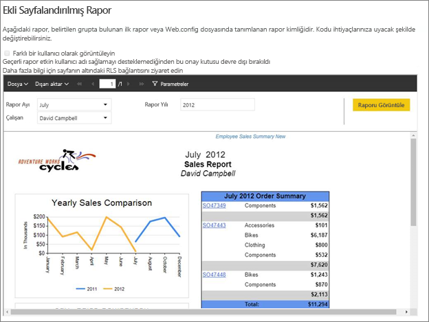
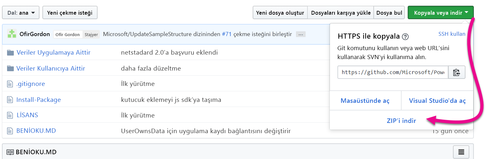
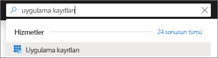
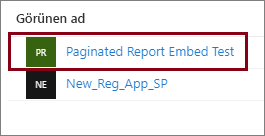
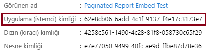
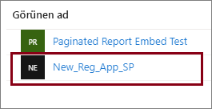
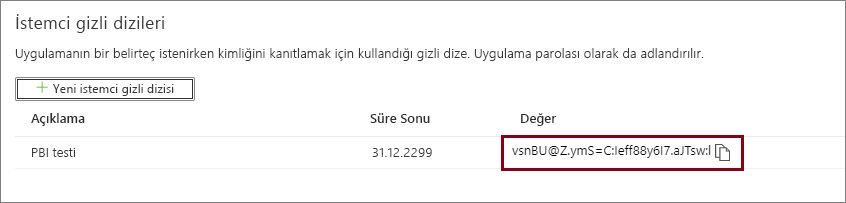
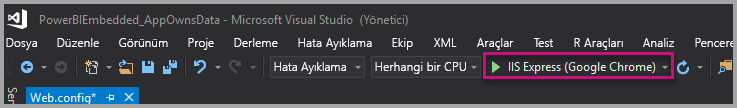
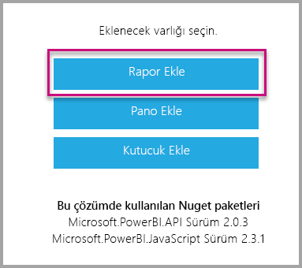

# <a name="tutorial-embed-power-bi-paginated-reports-into-an-application-for-your-customers-preview"></a>Öğretici: Uygulamaya müşterileriniz için sayfalandırılmış Power BI raporları ekleme (önizleme)

**Azure’da Power BI Embedded** veya **Office’te Power BI Embedded** ile verilerin sahibi uygulamadır örneğini kullanarak sayfalandırılmış raporları bir uygulamaya ekleyebilirsiniz. **Verilerin sahibi uygulamadır** örneği, eklenmiş analiz platformu olarak Power BI’ı kullanan bir uygulamanız olması durumunda kullanılır. Bir **ISV** veya **geliştirici** olarak, tamamen tümleşik ve etkileşimli bir uygulamada sayfalandırılmış raporlar görüntüleyen Power BI içeriği oluşturabilirsiniz. Üstelik kullanıcıların Power BI lisansı olması gerekmez. Bu öğreticide, müşterileriniz için Power BI JavaScript API’siyle birlikte Power BI .NET SDK’sını kullanıp sayfalandırılmış bir raporu uygulama ile tümleştirme işlemi gösterilir.



Bu öğreticide aşağıdakilerin nasıl yapılacağını öğreneceksiniz:
> [!div class="checklist"]
> * Azure’da bir uygulama kaydetme.
> * Bir uygulamaya sayfalandırılmış Power BI raporu ekleme.

## <a name="prerequisites"></a>Önkoşullar

Başlamak için şunlara sahip olmalısınız:

* Bir [hizmet sorumlusu (yalnızca uygulama belirteci)](embed-service-principal.md)
* Bir [Microsoft Azure](https://azure.microsoft.com/) aboneliği
* Kendi [Azure Active Directory kiracısı](create-an-azure-active-directory-tenant.md) kurulumunuz
* En az bir A4 veya P1 [kapasitesi](#create-a-dedicated-capacity), [sayfalandırılmış raporlar](../service-admin-premium-workloads.md#paginated-reports) iş yükü etkinleştirilmiş

Azure aboneliğiniz yoksa başlamadan önce [ücretsiz bir hesap](https://azure.microsoft.com/free/?WT.mc_id=A261C142F) oluşturun.

## <a name="set-up-your-power-bi-environment"></a>Power BI ortamınızı ayarlama

Sayfalandırılmış raporları eklemek için bir çalışma alanını ayrılmış kapasiteye atamanız ve raporu çalışma alanına yüklemeniz gerekir.

### <a name="create-an-app-workspace"></a>Uygulama çalışma alanı oluştur

Uygulamanızda oturum açmak için [hizmet sorumlusu](embed-service-principal.md) kullandığınız için [yeni çalışma alanlarını](../service-create-the-new-workspaces.md) kullanmanız gerekir. *Hizmet sorumlusu* olarak ayrıca uygulamanızda kullanılan uygulama çalışma alanlarının yöneticisi veya üyesi olmanız gerekir.

### <a name="create-a-dedicated-capacity"></a>Adanmış kapasite oluşturma

Ekleyeceğiniz sayfalandırılmış raporu içeri aktarmadan veya yüklemeden önce, raporu içeren çalışma alanına en az bir A4 veya P1 kapasitesi atanmış olmalıdır. İki tür kapasiteden birini seçebilirsiniz:
* **Power BI Premium**: Sayfalandırılmış rapor eklemek için *P* SKU kapasitesi gerekir. Power BI içeriği eklerken bu çözüm *Power BI ekleme* olarak adlandırılır. Bu abonelikle ilgili daha fazla bilgi için bkz. [Power BI Premium nedir?](../service-premium-what-is.md)
* **Azure Power BI Embedded**: [Microsoft Azure portalından](https://portal.azure.com) ayrılmış kapasite satın alabilirsiniz. Bu abonelik *A* SKU’ları kullanır. Sayfalandırılmış raporlar eklemek için en az bir *A4* aboneliğine ihtiyacınız vardır. Power BI Embedded kapasitesi oluşturma hakkında ayrıntılı bilgi için bkz. [Azure portalında Power BI Embedded kapasitesi oluşturma](azure-pbie-create-capacity.md).

Aşağıdaki tabloda her SKU'nun kaynakları ve limitleri açıklanmaktadır. İhtiyaçlarınıza en uygun kapasiteyi öğrenmek için [Senaryom için hangi SKU’yu satın almalıyım?](https://docs.microsoft.com/power-bi/developer/embedded-faq#power-bi-now-offers-three-skus-for-embedding-a-skus-em-skus-and-p-skus-which-one-should-i-purchase-for-my-scenario) tablosuna bakın.

| Kapasite Düğümleri | Toplam sanal çekirdek sayısı | Arka uç sanal çekirdek sayısı | RAM (GB) | Ön uç sanal çekirdek sayısı | 
| --- | --- | --- | --- | --- |
| P1/A4 | 8 | 4 | 25 | 4 |
| P2/A5 | 16 | 8 | 50 | 8 |
| P3/A6 | 32 | 16 | 100 | 16 |
| | | | | |

### <a name="assign-an-app-workspace-to-a-dedicated-capacity"></a>Adanmış kapasiteye uygulama çalışma alanı atama

Adanmış kapasite oluşturduktan sonra, uygulama çalışma alanınızı bu adanmış kapasiteye atayabilirsiniz.

[Hizmet sorumlusu](embed-service-principal.md) kullanarak çalışma alanına adanmış kapasite atamak için [Power BI REST API'sini](https://docs.microsoft.com/rest/api/power-bi/capacities/groups_assigntocapacity) kullanın. Power BI REST API'lerini kullanırken [hizmet sorumlusu nesne kimliğini](embed-service-principal.md#how-to-get-the-service-principal-object-id) kullandığınızdan emin olun.

### <a name="create-and-upload-your-paginated-reports"></a>Sayfalandırılmış raporlarınızı oluşturma ve yükleme

Sayfalandırılmış raporunuzu [Power BI Rapor Oluşturucusu](../paginated-reports-report-builder-power-bi.md#create-reports-in-power-bi-report-builder) ile oluşturduktan sonra [raporu hizmete yükleyebilirsiniz](../paginated-reports-quickstart-aw.md#upload-the-report-to-the-service).

[Power BI REST API'lerini](https://docs.microsoft.com/rest/api/power-bi/imports/postimportingroup) kullanarak sayfalandırılmış raporları yeni çalışma alanlarında içeri aktarabilirsiniz.

## <a name="embed-content-using-the-sample-application"></a>Örnek uygulamayı kullanarak içeriği ekleme

Bu örnek tanıtım amacıyla bilerek basit tutulmuştur. Uygulama gizli dizisinin korunması size veya geliştiricilerinize bağlıdır.

Örnek uygulamayı kullanarak içeriğinizi eklemeye başlamak için aşağıdaki adımları izleyin.

1. [Visual Studio](https://www.visualstudio.com/)'yu (sürüm 2013 veya üzeri) indirin. En son [NuGet paketini](https://www.nuget.org/profiles/powerbi) indirdiğinizden emin olun.

2. Başlamak için GitHub’dan [Verilerin Sahibi Uygulamadır örneğini](https://github.com/Microsoft/PowerBI-Developer-Samples) indirin.

    

3. Örnek uygulamada **Web.config** dosyasını açın. Uygulamayı çalıştırmak için doldurmanız gereken alanlar vardır. **AuthenticationType** için **ServicePrincipal**'ı seçin.

    Şu alanları doldurun:
    * [applicationId](#application-id)
    * [workspaceId](#workspace-id)
    * [reportId](#report-id)
    * [applicationsecret](#application-secret)
    * [tenant](#tenant)

    > [!Note]
    > Bu örnekte varsayılan **AuthenticationType** MasterUser'dır. **ServicePrincipal** olarak değiştirdiğinizden emin olun. 


    

### <a name="application-id"></a>Uygulama Kimliği

**applicationId** bilgilerini **Azure**’daki **Uygulama Kimliği** ile doldurun. Uygulama, izin istediğiniz kullanıcılara kendini tanıtmak için **applicationId** değerini kullanır.

**applicationId** değerini almak için aşağıdaki adımları izleyin:

1. [Azure portalında](https://portal.azure.com) oturum açın.

2. Sol gezinti bölmesinde **Tüm Hizmetler**'i seçip **Uygulama Kayıtları** araması yapın.

    

3. **applicationId** değerinin gerektiği uygulamayı seçin.

    

4. GUID olarak listelenen bir **Uygulama Kimliği** vardır. Bu **Uygulama Kimliği**’ni uygulamanın **applicationId** değeri olarak kullanın.

    

### <a name="workspace-id"></a>Çalışma Alanı Kimliği

**workspaceId** bilgisini Power BI’daki uygulama çalışma alanı (grup) GUID’si ile doldurun. Bu bilgiyi Power BI hizmetinin oturumu açıkken URL'den alabileceğiniz gibi Powershell'i kullanarak da alabilirsiniz.

URL <br>


Powershell <br>

```powershell
Get-PowerBIworkspace -name "Paginated Report Embed"
```

   

### <a name="report-id"></a>Rapor Kimliği

**reportId** bilgisini Power BI’daki rapor GUID’si ile doldurun. Bu bilgiyi Power BI hizmetinin oturumu açıkken URL'den alabileceğiniz gibi Powershell'i kullanarak da alabilirsiniz.

URL<br>


Powershell <br>

```powershell
Get-PowerBIworkspace -name "Paginated Report Embed" | Get-PowerBIReport
```


### <a name="application-secret"></a>Uygulama gizli dizisi

**ApplicationSecret** alanına **Azure**'daki **Uygulama kayıtları** bölümünden alacağınız **Anahtarlar** bilgilerini girin.

**ApplicationSecret** değerini almak için aşağıdaki adımları izleyin:

1. [Azure portalında](https://portal.azure.com) oturum açın.

2. Sol gezinti bölmesinde **Tüm hizmetler**'i seçip **Uygulama kayıtları** araması yapın.

    

3. **ApplicationSecret** değerini kullanması gereken uygulamayı seçin.

    

4. **Yönet**’in altında **Sertifikalar ve gizli diziler**’i seçin.

5. **Yeni istemci gizli dizileri**’ni seçin.

6. **Açıklama** kutusuna bir ad girin ve bir süre seçin. Ardından **Kaydet**’i seçerek uygulamanız için **Değer**’i alın. Anahtar değerini kaydettikten sonra **Anahtarlar** bölmesini kapattığınızda değer alanı yalnızca gizlenmiş olarak gösterilir. Bu aşamada anahtar değerini alamazsınız. Anahtar değerini kaybederseniz Azure portalında yeni bir anahtar değeri oluşturun.

    

### <a name="tenant"></a>Kiracı

**tenant** bilgisini Azure kiracı kimliğinizle doldurun. Bu bilgiyi Power BI hizmetinin oturumu açıkken [Azure AD yönetim merkezinden](/onedrive/find-your-office-365-tenant-id) alabileceğiniz gibi Powershell'i kullanarak da alabilirsiniz.

### <a name="run-the-application"></a>Uygulamayı çalıştırma

1. **Visual Studio**’da **Çalıştır**’ı seçin.

    

2. Ardından **Rapor Ekle**’yi seçin.

    

3. Artık raporu örnek uygulamada görüntüleyebilirsiniz.

    

## <a name="embed-power-bi-paginated-reports-within-your-application"></a>Uygulamanıza sayfalandırılmış Power BI raporları ekleme

Power BI sayfalandırılmış raporları ekleme adımları [Power BI REST API’leri](https://docs.microsoft.com/rest/api/power-bi/) ile uygulanabilse de, bu makalede açıklanan örnek kodlar **.NET SDK** ile hazırlanmıştır.

Uygulamanıza müşterileriniz için Power BI sayfalandırılmış raporlarını eklemek için bir **Azure AD** [hizmet sorumlusuna](embed-service-principal.md) sahip olmanız ve [Power BI REST API'lerini](https://docs.microsoft.com/rest/api/power-bi/) çağırabilmek için bir [Azure AD erişim belirteci](get-azuread-access-token.md#access-token-for-non-power-bi-users-app-owns-data) almanız gerekir.

**Erişim belirtecinizle** Power BI İstemcisi'ni oluşturmak için [Power BI REST API'leriyle](https://docs.microsoft.com/rest/api/power-bi/) etkileşim kurmanızı sağlayacak Power BI istemci nesnesini oluşturun. Power BI istemci nesnesini oluşturmak için **AccessToken** öğesini ***Microsoft.Rest.TokenCredentials*** nesnesine sarmanız gerekir.

```csharp
using Microsoft.IdentityModel.Clients.ActiveDirectory;
using Microsoft.Rest;
using Microsoft.PowerBI.Api.V2;

var tokenCredentials = new TokenCredentials(authenticationResult.AccessToken, "Bearer");

// Create a Power BI Client object. it's used to call Power BI APIs.
using (var client = new PowerBIClient(new Uri(ApiUrl), tokenCredentials))
{
    // Your code to embed items.
}
```

### <a name="get-the-paginated-report-you-want-to-embed"></a>Eklemek istediğiniz sayfalandırılmış raporu alın

Eklemek istediğiniz öğeye ilişkin bir başvuru almak için Power BI istemci nesnesini kullanabilirsiniz.

Burada belirli bir çalışma alanının ilk raporunu nasıl alacağınızı gösteren bir kod örneği vardır.

*Eklemek istediğiniz içerik öğesini (rapor, pano veya kutucuk) alma örneği, [örnek uygulama](https://github.com/Microsoft/PowerBI-Developer-Samples) içindeki Services\EmbedService.cs dosyasında sağlanır.*

```csharp
using Microsoft.PowerBI.Api.V2;
using Microsoft.PowerBI.Api.V2.Models;

// You need to provide the workspaceId where the dashboard resides.
ODataResponseListReport reports = await client.Reports.GetReportsInGroupAsync(workspaceId);

// Get the first report in the group.
Report report = reports.Value.FirstOrDefault();
```

### <a name="create-the-embed-token"></a>Ekleme belirtecini oluşturma

JavaScript API’sinden kullanılabilecek bir ekleme belirteci oluşturun. Power BI sayfalandırılmış raporlarını eklemek üzere bir ekleme belirteci almak için [Reports GenerateTokenForCreateInGroup](https://docs.microsoft.com/rest/api/power-bi/embedtoken/reports_generatetokenforcreateingroup) API'sini kullanın.

Ekleme belirteci oluşturma örneği, [örnek uygulamanın](https://github.com/Microsoft/PowerBI-Developer-Samples) *Services\EmbedService.cs* dosyasında sağlanmıştır.

```csharp
using Microsoft.PowerBI.Api.V2;
using Microsoft.PowerBI.Api.V2.Models;

// Generate Embed Token.
var generateTokenRequestParameters = new GenerateTokenRequest(accessLevel: "view");
EmbedToken tokenResponse = client.Reports.GenerateTokenInGroup(workspaceId, report.Id, generateTokenRequestParameters);

// Generate Embed Configuration.
var embedConfig = new EmbedConfig()
{
    EmbedToken = tokenResponse,
    EmbedUrl = report.EmbedUrl,
    Id = report.Id
};
```

### <a name="load-an-item-using-javascript"></a>JavaScript kullanarak öğe yükleme

JavaScript kullanarak web sayfanızdaki bir div öğesine sayfalandırılmış rapor yükleyebilirsiniz.

JavaScript API kullanan tam bir örnek için [Playground aracı](https://microsoft.github.io/PowerBI-JavaScript/demo)'nı kullanabilirsiniz. Deneme Alanı aracı, farklı türde Power BI Embedded örnekleri ile yürütmenin hızlı bir yoludur. Ayrıca [PowerBI-JavaScript wiki](https://github.com/Microsoft/powerbi-javascript/wiki) sayfasını ziyaret ederek JavaScript API’si hakkında daha fazla bilgi alabilirsiniz.

## <a name="next-steps"></a>Sonraki adımlar

Bu öğreticide müşterileriniz için bir uygulamaya Power BI sayfalandırılmış raporu eklemeyi öğrendiniz. Kuruluşunuz için de Power BI içeriği ekleme denemeleri yapabilirsiniz.

Başka bir sorunuz mu var? [Power BI Topluluğu'na sorun](https://community.powerbi.com/)
