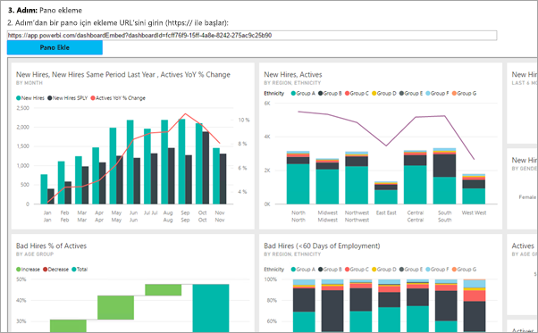
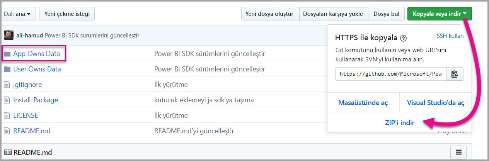

# <a name="tutorial-embed-a-power-bi-content-into-your-application-for-national-clouds"></a>Öğretici: Ulusal bulutlar için Power BI içeriğini uygulamanıza ekleme

Ulusal bulut için iş süreci uygulamalarınıza analiz içeriğinin nasıl ekleneceğini öğrenin. Web uygulamalarınıza bir raporu, panoyu veya kutucuğu eklemek için Power BI JavaScript API’si ile Power BI .NET SDK’sını kullanabilirsiniz.

Power BI [ulusal bulutları](https://docs.microsoft.com/azure/active-directory/develop/authentication-national-cloud) da destekler.

Farklı ulusal bulutlar şunlardır:

* ABD Kamu Topluluk Bulutu (GCC)

* U. S. Askeri Yükleniciler (DoDCON)

* U. S. Askeri (DoD)

* Almanya için Power BI bulutu

* Çin için Power BI bulutu



Bu adım adım kılavuza başlamak için **Power BI hesabınız** olması gerekir. Ayarlanmış bir hesabınız yoksa, devlet veya ülke türüne bağlı olarak kendiniz için uygun ulusal bulutu seçebilirsiniz. [ABD kamu Power BI hesabına](../service-govus-signup.md), [Almanya için Power BI bulutu hesabına](https://powerbi.microsoft.com/power-bi-germany/?ru=https%3A%2F%2Fapp.powerbi.de%2F%3FnoSignUpCheck%3D1) veya [Çin için Power BI bulutu hesabına](https://www.21vbluecloud.com/powerbi/) kaybolabilirsiniz.

> [!NOTE]
> Bunun yerine kuruluşunuz için bir pano eklemek mi istiyorsunuz? Bkz. [Kuruluşunuz için bir panoyu uygulamayla tümleştirme](integrate-dashboard.md).

Bir panoyu web uygulamasıyla tümleştirmek için **Power BI** API'sini ve Azure Active Directory (AD) yetkilendirme **erişim belirtecini** kullanarak panoya ulaşmanız gerekir. Ardından panoyu ekleme belirteciyle yükleyebilirsiniz. **Power BI API'si** belirli **Power BI** kaynaklarına programlı erişim sağlar. Daha fazla bilgi için bkz. [Power BI REST API](https://docs.microsoft.com/rest/api/power-bi/), Power BI .NET SDK’sı ve [Power BI JavaScript API](https://github.com/Microsoft/PowerBI-JavaScript).

## <a name="download-the-sample"></a>Örneği indirme

Bu makalede GitHub üzerindeki [App Owns Data örneğinde](https://github.com/Microsoft/PowerBI-Developer-Samples) kullanılan kodlar gösterilmiştir. Bu adım adım kılavuzla birlikte ilerlemek için örneği indirebilirsiniz. 



* Kamu Topluluk Bulutu (GCC):

    > [!Note]
    > GCC hesapları yalnızca P ve EM kapasitelerini desteklemektedir.

1. GCCCloud.config içeriğiyle Cloud.config dosyasının üzerine yazın.

2. Web.config dosyasındaki applicationId (Yerel uygulamanın applicationId’si), workspaceId, kullanıcı (ana kullanıcınız) ve parola değerlerini güncelleştirin.

3. GCC parametrelerini web.config dosyasına aşağıdaki şekilde ekleyin.

```xml
<add key="authorityUrl" value="https://login.microsoftonline.net/common/" />
<add key="resourceUrl" value="https://analysis.usgovcloudapi.net/powerbi/api" />
<add key="apiUrl" value="https://api.powerbigov.us/" />
<add key="embedUrlBase" value="https://app.powerbigov.us" />
```

* Askeri Yükleniciler (DoDCON):

1. TBCloud.config içeriğini Cloud.config dosyasının üzerine yazın.

2. Web.config dosyasındaki applicationId (Yerel uygulamanın applicationId’si), workspaceId, kullanıcı (ana kullanıcınız) ve parola değerlerini güncelleştirin.

3. DoDCON parametrelerini web.config dosyasına aşağıdaki şekilde ekleyin.

```xml
<add key="authorityUrl" value="https://login.microsoftonlineS.net/common/" />
<add key="resourceUrl" value="https://high.analysis.usgovcloudapi.net/powerbi/api" />
<add key="apiUrl" value="https://api.high.powerbigov.us/" />
<add key="embedUrlBase" value="https://app.high.powerbigov.us" />
```

* Askeri (DoD):

1. PFCloud.config içeriğini Cloud.config dosyasının üzerine yazın.

2. Web.config dosyasındaki applicationId (Yerel uygulamanın applicationId’si), workspaceId, kullanıcı (ana kullanıcınız) ve parola değerlerini güncelleştirin.

3. DoDCON parametrelerini web.config dosyasına aşağıdaki şekilde ekleyin.

```xml
<add key="authorityUrl" value="https://login.microsoftonline.net/common/" />
<add key="resourceUrl" value="https://mil.analysis.usgovcloudapi.net/powerbi/api" />
<add key="apiUrl" value="https://api.mil.powerbigov.us/" />
<add key="embedUrlBase" value="https://app.mil.powerbigov.us" />
```

* Almanya için Power BI bulutu parametreleri

1. Almanya için Power BI bulutu içeriğini Cloud.config dosyasının üzerine yazın.

2. Web.config dosyasındaki applicationId (Yerel uygulamanın applicationId’si), workspaceId, kullanıcı (ana kullanıcınız) ve parola değerlerini güncelleştirin.

3. Almanya için Power BI bulutu parametrelerini web.config dosyasına aşağıdaki şekilde ekleyin.

```xml
<add key="authorityUrl" value="https://login.microsoftonline.de/common/" />
<add key="resourceUrl" value="https://analysis.cloudapi.de/powerbi/api" />
<add key="apiUrl" value="https://api.powerbi.de/" />
<add key="embedUrlBase" value="https://app.powerbi.de" />
```

* Çin için Power BI bulutu parametreleri

1. [Çin için Power BI](https://github.com/Microsoft/PowerBI-Developer-Samples/blob/master/App%20Owns%20Data/PowerBIEmbedded_AppOwnsData/CloudConfigs/Power%20BI%20operated%20by%2021Vianet%20in%20China/Cloud.config) bulutu içeriğini Cloud.config dosyasının üzerine yazın.

2. Web.config dosyasındaki applicationId (Yerel uygulamanın applicationId’si), workspaceId, kullanıcı (ana kullanıcınız) ve parola değerlerini güncelleştirin.

3. Çin için Power BI bulutu parametrelerini web.config dosyasına aşağıdaki şekilde ekleyin.

```xml
<add key="authorityUrl" value="https://login.chinacloudapi.cn/common/" />
<add key="resourceUrl" value="https://analysis.chinacloudapi.cn/powerbi/api" />
<add key="apiUrl" value="https://api.powerbi.cn/" />
<add key="embedUrlBase" value="https://app.powerbi.cn" />
```

## <a name="step-1---register-an-app-in-azure-ad"></a>1\. Adım: Bir uygulamayı Azure AD'ye kaydetme

REST API çağrıları gerçekleştirmek için uygulamanızı Azure AD’ye kaydedin. Daha fazla bilgi için bkz. [Bir Azure AD uygulamasını Power BI içeriği eklemek üzere kaydetme](register-app.md). Farklı ulusal bulut ilişkileri olduğundan, uygulamanızı kaydetmek için farklı URL’ler vardır.

* Kamu Topluluk Bulutu (GCC) - ```https://app.powerbigov.us/apps```

* Askeri Yükleniciler (DoDCON) - ```https://app.high.powerbigov.us/apps```

* Askeri (DoD) - ```https://app.mil.powerbigov.us/apps```

* Almanya için Power BI bulutu - ```https://app.powerbi.de/apps```

* Çin için Power BI bulutu - ```https://app.powerbi.cn/apps```

[Müşteriniz için ekleme örneğini](https://github.com/Microsoft/PowerBI-Developer-Samples/tree/master/App%20Owns%20Data) indirdiyseniz aldığınız **uygulama kimliğini** kullanarak örneğin, Azure AD kimlik doğrulamasından geçmesini sağlayabilirsiniz. Örneği yapılandırmak için *web.config* dosyasındaki **applicationId** değerini değiştirin.

## <a name="step-2---get-an-access-token-from-azure-ad"></a>2\. Adım: Azure AD'den erişim belirteci alma

Uygulamanızın içinden Power BI REST API'si çağrısı yapabilmek için Azure AD'den bir **erişim belirteci** almanız gerekir. Daha fazla bilgi için bkz. [Power BI uygulamanız için kullanıcıların kimliğini doğrulama ve Azure AD erişim belirteci alma](get-azuread-access-token.md). Farklı ulusal bulut ilişkileri olduğundan, uygulamanıza yönelik bir erişim belirteci almak için farklı URL’ler vardır.

* Kamu Topluluk Bulutu (GCC) - ```https://login.microsoftonline.com```

* Askeri Yükleniciler (DoDCON) - ```https://login.microsoftonline.us```

* Askeri (DoD) - ```https://login.microsoftonline.us```

* Almanya için Power BI bulutu - ```https://login.microsoftonline.de```

* Çin için Power BI bulutu - ```https://login.chinacloudapi.cn```

**Controllers\HomeController.cs** dosyasındaki her bir içerik öğesi görevinde bu erişim belirteçleriyle ilgili örnekleri bulabilirsiniz.

## <a name="step-3---get-a-content-item"></a>3\. Adım: İçerik öğesi alma

Power BI içeriğinizi doğru şekilde eklemek için yapmanız gereken birkaç şey vardır. Bu adımların tümü doğrudan REST API ile gerçekleştirilebilir ancak örnek uygulama ve buradaki örneklerde .NET SDK kullanılmıştır.

### <a name="create-the-power-bi-client-with-your-access-token"></a>Power BI İstemcisini erişim belirtecinizle oluşturma

Erişim belirtecinizi kullanarak Power BI API’lerle etkileşim kurmanızı sağlayacak Power BI istemci nesnenizi oluşturmanız gerekir. Power BI istemci nesnenizi oluşturmak için AccessToken öğesini *Microsoft.Rest.TokenCredentials* nesnesine sarmanız gerekir.

```csharp
using Microsoft.IdentityModel.Clients.ActiveDirectory;
using Microsoft.Rest;
using Microsoft.PowerBI.Api.V2;

var tokenCredentials = new TokenCredentials(authenticationResult.AccessToken, "Bearer");

// Create a Power BI Client object. This is used to call the Power BI APIs.
using (var client = new PowerBIClient(new Uri(ApiUrl), tokenCredentials))
{
    // Your code to embed items.
}
```

### <a name="get-the-content-item-you-want-to-embed"></a>Eklemek istediğiniz içerik öğesini alma

Eklemek istediğiniz öğeye ilişkin bir başvuru almak için Power BI istemci nesnesini kullanın. Panoları, kutucukları veya raporları ekleyebilirsiniz. Bu örnekte belirli bir çalışma alanının ilk panosunu, kutucuğunu veya raporunu nasıl alacağınız gösterilmiştir.

[App Owns Data örneğinin](https://github.com/Microsoft/PowerBI-Developer-Samples/tree/master/App%20Owns%20Data) **Controllers\HomeController.cs** dosyasında bir örnek mevcuttur.

#### <a name="reports"></a>Raporlar

```csharp
using Microsoft.PowerBI.Api.V2;
using Microsoft.PowerBI.Api.V2.Models;

// You need to provide the workspaceId where the dashboard resides.
ODataResponseListReport reports = client.Reports.GetReportsInGroupAsync(workspaceId);

// Get the first report in the group.
Report report = reports.Value.FirstOrDefault();
```

#### <a name="dashboards"></a>Panolar

```csharp
using Microsoft.PowerBI.Api.V2;
using Microsoft.PowerBI.Api.V2.Models;

// You need to provide the workspaceId where the dashboard resides.
ODataResponseListDashboard dashboards = client.Dashboards.GetDashboardsInGroup(workspaceId);

// Get the first report in the group.
Dashboard dashboard = dashboards.Value.FirstOrDefault();
```

#### <a name="tiles"></a>Kutucuklar

```csharp
using Microsoft.PowerBI.Api.V2;
using Microsoft.PowerBI.Api.V2.Models;

// To retrieve the tile, you first need to retrieve the dashboard.

// You need to provide the workspaceId where the dashboard resides.
ODataResponseListDashboard dashboards = client.Dashboards.GetDashboardsInGroup(workspaceId);

// Get the first report in the group.
Dashboard dashboard = dashboards.Value.FirstOrDefault();

// Get a list of tiles from a specific dashboard
ODataResponseListTile tiles = client.Dashboards.GetTilesInGroup(workspaceId, dashboard.Id);

// Get the first tile in the group.
Tile tile = tiles.Value.FirstOrDefault();
```

### <a name="create-the-embed-token"></a>Ekleme belirtecini oluşturma

JavaScript API’sini kullanarak bir ekleme belirteci oluşturabilirsiniz. Ekleme belirteci, eklediğiniz öğeye özeldir. Eklediğiniz her Power BI içeriği için yeni bir ekleme belirteci oluşturmanız gerekir. Kullanılacak **accessLevel** dahil olmak üzere daha fazla bilgi için bkz. [Ekleme Belirteci](https://docs.microsoft.com/rest/api/power-bi/embedtoken).

> [!IMPORTANT]
> Ekleme belirteçleri yalnızca geliştirici testlerine yönelik olduğundan, bir Power BI ana hesabının oluşturabileceği ekleme belirteçlerinin sayısı sınırlıdır. Üretim ekleme senaryoları için [kapasite satın alınmalıdır](https://docs.microsoft.com/power-bi/developer/embedded-faq#technical). Kapasite satın alındıktan sonra, ekleme belirteci oluşturmayla ilgili bir sınır yoktur.

[Kuruluşunuz için ekleme örneğinin](https://github.com/Microsoft/PowerBI-Developer-Samples/tree/master/App%20Owns%20Data) **Controllers\HomeController.cs** dosyasında bir örnek mevcuttur.

**EmbedConfig** ve **TileEmbedConfig** için bir sınıf oluşturulur. **Models\EmbedConfig.cs** ve **Models\TileEmbedConfig.cs** içinde bir örnek mevcuttur.

#### <a name="reports"></a>Raporlar

```csharp
using Microsoft.PowerBI.Api.V2;
using Microsoft.PowerBI.Api.V2.Models;

// Generate Embed Token.
var generateTokenRequestParameters = new GenerateTokenRequest(accessLevel: "view");
EmbedToken tokenResponse = client.Reports.GenerateTokenInGroup(workspaceId, report.Id, generateTokenRequestParameters);

// Generate Embed Configuration.
var embedConfig = new EmbedConfig()
{
    EmbedToken = tokenResponse,
    EmbedUrl = report.EmbedUrl,
    Id = report.Id
};
```

#### <a name="dashboards"></a>Panolar

```csharp
using Microsoft.PowerBI.Api.V2;
using Microsoft.PowerBI.Api.V2.Models;

// Generate Embed Token.
var generateTokenRequestParameters = new GenerateTokenRequest(accessLevel: "view");
EmbedToken tokenResponse = client.Dashboards.GenerateTokenInGroup(workspaceId, dashboard.Id, generateTokenRequestParameters);

// Generate Embed Configuration.
var embedConfig = new EmbedConfig()
{
    EmbedToken = tokenResponse,
    EmbedUrl = dashboard.EmbedUrl,
    Id = dashboard.Id
};
```

#### <a name="tiles"></a>Kutucuklar

```csharp
using Microsoft.PowerBI.Api.V2;
using Microsoft.PowerBI.Api.V2.Models;

// Generate Embed Token for a tile.
var generateTokenRequestParameters = new GenerateTokenRequest(accessLevel: "view");
EmbedToken tokenResponse = client.Tiles.GenerateTokenInGroup(workspaceId, dashboard.Id, tile.Id, generateTokenRequestParameters);

// Generate Embed Configuration.
var embedConfig = new TileEmbedConfig()
{
    EmbedToken = tokenResponse,
    EmbedUrl = tile.EmbedUrl,
    Id = tile.Id,
    dashboardId = dashboard.Id
};
```

## <a name="step-4---load-an-item-using-javascript"></a>4\. Adım: JavaScript kullanarak öğe yükleme

JavaScript kullanarak web sayfanızdaki bir div öğesine pano yükleyebilirsiniz. Bu örnekte EmbedConfig/TileEmbedConfig modelinin yanı sıra pano, kutucuk veya rapor görünümleri kullanılmaktadır. JavaScript API kullanan tam bir örnek için [Microsoft Power BI Embedded Örneği](https://microsoft.github.io/PowerBI-JavaScript/demo)'ni kullanabilirsiniz.

Bir uygulama örneği [Kuruluşunuz için ekleme örneği](https://github.com/Microsoft/PowerBI-Developer-Samples/tree/master/App%20Owns%20Data) içinde mevcuttur.

### <a name="viewshomeembeddashboardcshtml"></a>Views\Home\EmbedDashboard.cshtml

```csharp
<script src="~/scripts/powerbi.js"></script>
<div id="dashboardContainer"></div>
<script>
    // Read embed application token from Model
    var accessToken = "@Model.EmbedToken.Token";

    // Read embed URL from Model
    var embedUrl = "@Html.Raw(Model.EmbedUrl)";

    // Read dashboard Id from Model
    var embedDashboardId = "@Model.Id";

    // Get models. models contains enums that can be used.
    var models = window['powerbi-client'].models;

    // Embed configuration used to describe the what and how to embed.
    // This object is used when calling powerbi.embed.
    // This also includes settings and options such as filters.
    // You can find more information at https://github.com/Microsoft/PowerBI-JavaScript/wiki/Embed-Configuration-Details.
    var config = {
        type: 'dashboard',
        tokenType: models.TokenType.Embed,
        accessToken: accessToken,
        embedUrl: embedUrl,
        id: embedDashboardId
    };

    // Get a reference to the embedded dashboard HTML element
    var dashboardContainer = $('#dashboardContainer')[0];

    // Embed the dashboard and display it within the div container.
    var dashboard = powerbi.embed(dashboardContainer, config);
</script>
```

### <a name="viewshomeembedtilecshtml"></a>Views\Home\EmbedTile.cshtml

```csharp
<script src="~/scripts/powerbi.js"></script>
<div id="tileContainer"></div>
<script>
    // Read embed application token from Model
    var accessToken = "@Model.EmbedToken.Token";

    // Read embed URL from Model
    var embedUrl = "@Html.Raw(Model.EmbedUrl)";

    // Read tile Id from Model
    var embedTileId = "@Model.Id";

    // Read dashboard Id from Model
    var embedDashboardId = "@Model.dashboardId";

    // Get models. models contains enums that can be used.
    var models = window['powerbi-client'].models;

    // Embed configuration used to describe the what and how to embed.
    // This object is used when calling powerbi.embed.
    // This also includes settings and options such as filters.
    // You can find more information at https://github.com/Microsoft/PowerBI-JavaScript/wiki/Embed-Configuration-Details.
    var config = {
        type: 'tile',
        tokenType: models.TokenType.Embed,
        accessToken: accessToken,
        embedUrl: embedUrl,
        id: embedTileId,
        dashboardId: embedDashboardId
    };

    // Get a reference to the embedded tile HTML element
    var tileContainer = $('#tileContainer')[0];

    // Embed the tile and display it within the div container.
    var tile = powerbi.embed(tileContainer, config);
</script>
```

### <a name="viewshomeembedreportcshtml"></a>Views\Home\EmbedReport.cshtml

```csharp
<script src="~/scripts/powerbi.js"></script>
<div id="reportContainer"></div>
<script>
    // Read embed application token from Model
    var accessToken = "@Model.EmbedToken.Token";

    // Read embed URL from Model
    var embedUrl = "@Html.Raw(Model.EmbedUrl)";

    // Read report Id from Model
    var embedReportId = "@Model.Id";

    // Get models. models contains enums that can be used.
    var models = window['powerbi-client'].models;

    // Embed configuration used to describe the what and how to embed.
    // This object is used when calling powerbi.embed.
    // This also includes settings and options such as filters.
    // You can find more information at https://github.com/Microsoft/PowerBI-JavaScript/wiki/Embed-Configuration-Details.
    var config = {
        type: 'report',
        tokenType: models.TokenType.Embed,
        accessToken: accessToken,
        embedUrl: embedUrl,
        id: embedReportId,
        permissions: models.Permissions.All,
        settings: {
            filterPaneEnabled: true,
            navContentPaneEnabled: true
        }
    };

    // Get a reference to the embedded report HTML element
    var reportContainer = $('#reportContainer')[0];

    // Embed the report and display it within the div container.
    var report = powerbi.embed(reportContainer, config);
</script>
```

## <a name="next-steps"></a>Sonraki adımlar

* GitHub üzerindeki örnek uygulamayı gözden geçirebilirsiniz. Yukarıdaki örnekler de bu örneği temel almaktadır. Daha fazla bilgi için bkz. [Kuruluşunuz için ekleme örneği](https://github.com/Microsoft/PowerBI-Developer-Samples/tree/master/App%20Owns%20Data).

* JavaScript API’si hakkında daha fazla bilgi için [Power BI JavaScript API](https://github.com/Microsoft/PowerBI-JavaScript) bölümüne bakın.

* Almanya için Power BI bulutu hakkında daha fazla bilgi için [Almanya için Power BI bulutu ile ilgili SSS](https://docs.microsoft.com/power-bi/service-govde-faq) bölümüne bakın.

* [Power BI Çalışma Alanı Koleksiyonu içeriğini Power BI’a geçirme](migrate-from-powerbi-embedded.md)

Önemli noktalar ve sınırlamalar

Başka bir sorunuz mu var? [Power BI Topluluğu'na sorun](https://community.powerbi.com/)
