# <a name="tutorial-embed-a-power-bi-report-dashboard-or-tile-into-an-application-for-your-customers"></a>Öğretici: Müşterileriniz için bir Power BI raporunu, panosunu veya kutucuğunu bir uygulamaya ekleme
**Azure’da Power BI Embedded** ile raporları, panoları veya kutucukları **verilerin sahibi uygulamadır** örneğini kullanarak bir uygulamaya ekleyebilirsiniz. **Verilerin sahibi uygulamadır** örneği, eklenmiş analiz platformu olarak Power BI’ı kullanan bir uygulamanız olması durumunda kullanılır. Bu genellikle bir **ISV geliştiricisi** senaryosudur. Bir **ISV geliştiricisi** olarak, tamamen tümleşik ve etkileşimli bir uygulamada raporlar, panolar veya kutucuklar görüntüleyen Power BI içeriği oluşturabilirsiniz. Üstelik uygulama kullanıcılarının Power BI lisansı olması veya Power BI’dan yararlandıklarını bilmeleri bile gerekmez. Bu öğretici, **verilerin sahibi uygulamadır** yapısını kullanan müşterileriniz için **Azure’da Power BI Embedded** kullanırken **Power BI** JavaScript API’si ile birlikte **Power BI** .NET SDK’sı kullanarak bir raporu bir uygulama ile tümleştirme işlemini göstermektedir.

Bu öğreticide aşağıdakilerin nasıl yapılacağını öğreneceksiniz:
>[!div class="checklist"]
>* Azure’da bir uygulama kaydetme.
>* Bir uygulamaya Power BI raporu ekleme.

## <a name="prerequisites"></a>Önkoşullar
Başlamak için bir **Power BI Pro** hesabı (bu, **ana hesabınız**) ve **Microsoft Azure** aboneliği gerekir.

* **Power BI Pro**’ya kaydolmadıysanız başlamadan önce [ücretsiz deneme için kaydolun](https://powerbi.microsoft.com/en-us/pricing/).
* Azure aboneliğiniz yoksa başlamadan önce [ücretsiz bir hesap](https://azure.microsoft.com/free/?WT.mc_id=A261C142F) oluşturun.
* [Azure Active Directory kiracınız](create-an-azure-active-directory-tenant.md) ayarlanmış olmalıdır.
* [Visual Studio](https://www.visualstudio.com/) yüklü olmalıdır (sürüm 2013 veya üzeri).

## <a name="setup-your-embedded-analytics-development-environment"></a>Eklediğiniz analiz geliştirme ortamını ayarlama

Raporları, panoları veya kutucukları uygulamanıza eklemeye başlamadan önce ortamınızın ekleme işlevlerine izin verecek şekilde ayarlanmış olduğundan emin olmanız gerekir. Kurulumun bir parçası olarak aşağıdaki işlemleri yapmanız gerekir.

Hızla kullanmaya başlamak ve bir ortam oluşturma ve rapor ekleme adımlarını gösteren örnek bir uygulama indirmek için [Katılım deneyimi aracını](https://aka.ms/embedsetup/AppOwnsData) inceleyebilirsiniz.

Ancak, ortamı el ile ayarlamayı seçerseniz aşağıdaki adımlara devam edebilirsiniz.
### <a name="register-an-application-in-azure-active-directory-azure-ad"></a>Azure Active Directory'de (Azure AD) bir uygulamayı kaydetme

Power BI REST API'lerine erişmesini sağlamak için uygulamanızı Azure Active Directory'ye kaydetmeniz gerekir. Kayıt işlemi sayesinde uygulamanız için bir kimlik oluşturabilir ve Power BI REST kaynaklarıyla ilgili izinleri belirleyebilirsiniz.

1. [Microsoft Power BI API Koşulları](https://powerbi.microsoft.com/api-terms)'nı kabul edin.

2. [Azure portalında](https://portal.azure.com) oturum açın.
 
    

3. Sol taraftaki gezinti bölmesinde **Tüm Hizmetler**'i, **Uygulama Kayıtları**'nı ve sonra **Yeni uygulama kaydı**'nı seçin.
   
    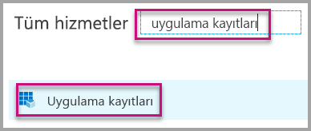</br>
    

4. Talimatları izleyerek yeni bir uygulama oluşturun. Verilerin sahibi uygulamadır yapısı için **Yerel** uygulama türünü kullanmanız gerekir. Ayrıca, **Azure AD**'nin belirteç yanıtlarını döndürmek için kullanacağı bir **Yeniden Yönlendirme URI'si** belirtmeniz gerekir. Uygulamanıza özgü bir değer girin (örneğin: `http://localhost:13526/Redirect`).

    

### <a name="apply-permissions-to-your-application-within-azure-active-directory"></a>Azure Active Directory'de uygulamanıza izinler uygulama

Uygulamanız için uygulama kayıt sayfasında belirtilenlere ek izinler etkinleştirmeniz gerekir. Ekleme için kullanılan ve bir genel yönetici hesabı olması gereken *ana* hesapla oturum açmanız gerekir.

### <a name="use-the-azure-active-directory-portal"></a>Azure Active Directory portalını kullanma

1. Azure portalındaki [Uygulama kayıtları](https://portal.azure.com/#blade/Microsoft_AAD_IAM/ApplicationsListBlade) sayfasına gidip ekleme için kullandığınız uygulamayı seçin.
   
    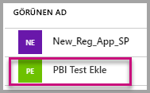

2. **Ayarlar**’ı ve sonra **API Erişimi** altında **Gerekli izinler**'i seçin.
   
    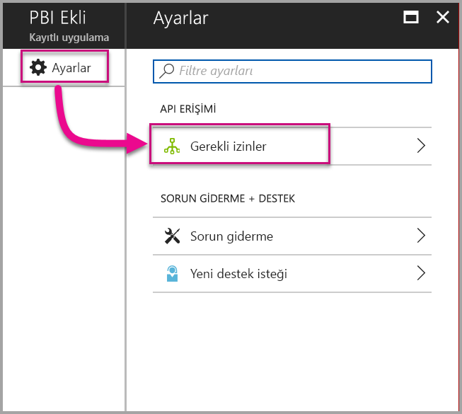

3. **Windows Azure Active Directory**'yi seçin ve **Oturum açmış kullanıcı olarak dizine erişin** seçeneğinin belirlenmiş olduğundan emin olun. **Kaydet**'i seçin.
   
    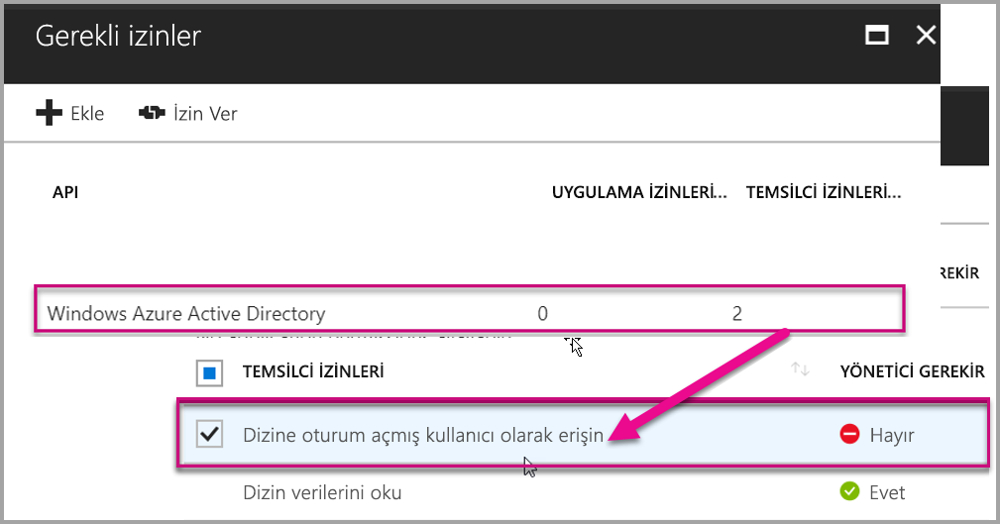

4. **Ekle**'yi seçin.

    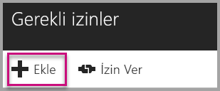

5. **Bir API seçin** öğesini seçin.

    

6. **Power BI Hizmeti**’ni, ardından **Seç**’i seçin.

    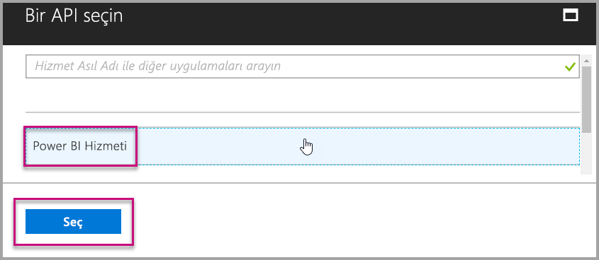

7. **Temsilci İzinleri** bölümündeki tüm izinleri seçin. Seçimlerin kaydedilmesi için teker teker seçmeniz gerekir. Tümünü seçtikten sonra **Kaydet**'i seçin.
   
    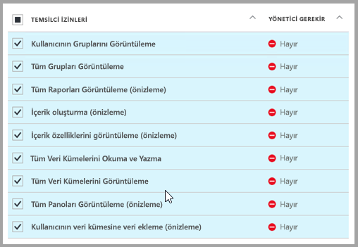

8. **Gerekli izinler** bölümünde **İzin Ver**'i seçin.
   
    **İzin Ver** eylemi Azure AD tarafından onay istenmesini önlemek için *ana hesabı* gerektirir. Bu eylemi gerçekleştiren hesap Genel Yönetici ise kuruluşunuzdaki tüm kullanıcılara bu uygulama için izin vermeniz gerekir. Bu eylemi gerçekleştiren hesap *ana hesap* ise ve Genel Yönetici değilse bu uygulama için yalnızca *ana hesaba* izin vermelisiniz.
   
    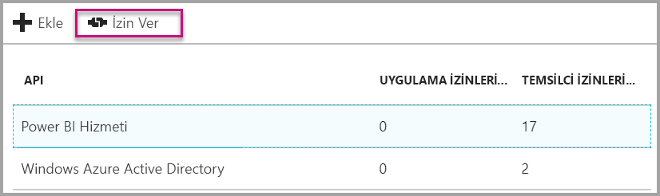

## <a name="setup-your-power-bi-environment"></a>Power BI ortamınızı ayarlama

### <a name="create-an-app-workspace"></a>Uygulama çalışma alanı oluştur

Müşterileriniz için rapor, pano veya kutucuklar ekliyorsanız, içeriğinizi bir uygulama çalışma alanına yerleştirmeniz gerekir. *Ana* hesabın, ilgili uygulama çalışma alanının yöneticisi olması gerekir.

1. İşe çalışma alanını oluşturarak başlayın. **Çalışma alanları** > **Uygulama çalışma alanı oluşturma**'yı seçin. Burası, uygulamanızın erişmesi gereken içerikleri yerleştirdiğiniz yerdir.

    

2. Çalışma alanına bir ad verin. Karşılık gelen **Çalışma Alanı Kimliği** kullanılamıyorsa düzenleyerek benzersiz bir kimlik belirleyin. Bu kimlik uygulamanın da adı olmalıdır.

    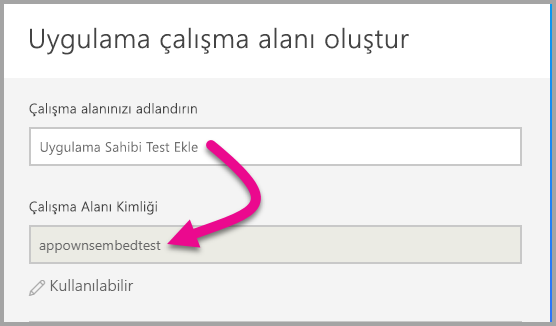

3. Değiştirebileceğiniz birkaç ayar vardır. **Ortak** seçeneğini belirlerseniz çalışma alanınızdakileri kuruluşunuzdaki herkes görebilir. **Özel**'i seçerseniz çalışma alanının içeriğini yalnızca üyeler görebilir.

    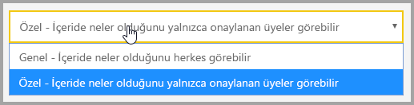

    Grubu oluşturduktan sonra Ortak/Özel ayarını değiştiremezsiniz.

4. Üyelere **düzenleme** veya **yalnızca görüntüleme** erişimi verebilirsiniz.

    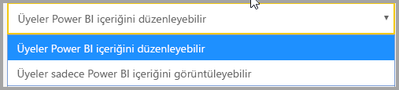

5. Çalışma alanı erişimi vermek istediğiniz kişilerin e-posta adreslerini girip **Ekle**'yi seçin. Grup takma adlarını ekleyemezsiniz, yalnızca kişilere izin verilir.

6. Eklediğiniz kişilerin üye mi yoksa yönetici mi olacağına karar verin. Yöneticiler çalışma alanını düzenleyebilir, başka üyeler ekleyebilir. Yalnızca görüntüleme erişimine sahip olanlar dışındaki üyeler çalışma alanındaki içeriği düzenleyebilir. Hem yöneticiler hem de üyeler uygulamayı yayımlayabilir.

    Artık yeni çalışma alanını görüntüleyebilirsiniz. Power BI çalışma alanını oluşturur ve açar. Üyesi olduğunuz çalışma alanlarının listesinde gösterilir. Yönetici olduğunuz için üç nokta (…) simgesini seçerek geri gidebilir, değişiklik yapabilir, yeni üye ekleyebilir veya üye izinlerini değiştirebilirsiniz.

    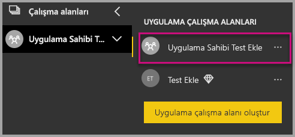

### <a name="create-and-publish-your-reports"></a>Raporlarınızı oluşturma ve yayımlama

Power BI Desktop'ı kullanarak raporlarınızı ve veri kümelerinizi oluşturabilir, ardından bu raporları uygulama çalışma alanında yayımlayabilirsiniz. Raporları yayımlayan son kullanıcının uygulama çalışma alanında yayımlama yapabilmesi için bir Power BI Pro lisansına sahip olması gerekir.

1. GitHub'dan örnek [Blog Tanıtımı](https://github.com/Microsoft/powerbi-desktop-samples)’nı indirin.

    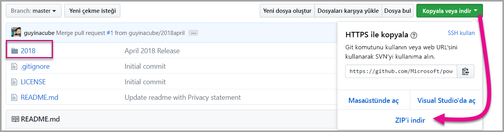

2. **Power BI Desktop**’ta örnek PBIX raporunu açın

   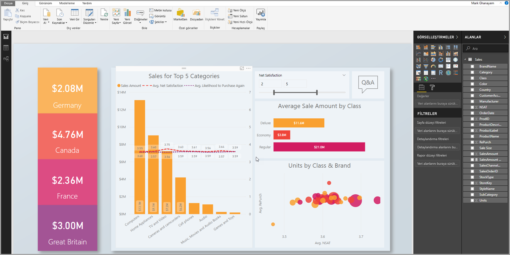

3. **Uygulama çalışma alanında** yayımlayın

   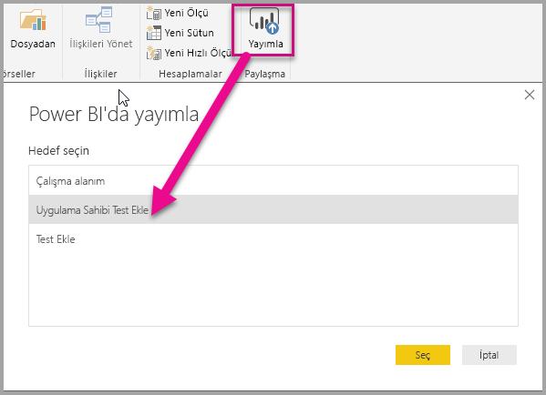

    Artık raporunuzu Power BI hizmetinde çevrimiçi görüntüleyebilirsiniz.

   

## <a name="embed-your-content-using-the-sample-application"></a>Örnek uygulamayı kullanarak içeriği ekleme

Örnek bir uygulamayı kullanarak içeriğinizi eklemeye başlamak için bu adımları izleyin.

1. Başlamak için GitHub’dan [Verilerin Sahibi Uygulamadır örneğini](https://github.com/Microsoft/PowerBI-Developer-Samples) indirin.

    

2. Örnek uygulamada Web.config dosyasını açın. Uygulamayı başarıyla çalıştırmak için doldurmanız gereken 5 alan vardır: **clientId**, **groupId**, **reportId**, **pbiUsername** ve **pbiPassword**.

    

    **clientId** bilgilerini **Azure**’daki **Uygulama Kimliği** ile doldurun. **clientId**, izin istediğiniz kullanıcılara kendini tanıtmak için uygulama tarafından kullanılır. **clientId** değerini almak için aşağıdaki adımları izleyin:

    [Azure portalında](https://portal.azure.com) oturum açın.

    

    Sol gezinti bölmesinde **Tüm Hizmetler**'i ve **Uygulama Kayıtları**'nı seçin.

     **clientId** değerini almak istediğiniz uygulamayı seçin.

    

    GUID olarak listelenen bir **Uygulama Kimliği** görmeniz gerekir. Bu **Uygulama Kimliği**’ni uygulamanın **clientId** değeri olarak kullanın.

    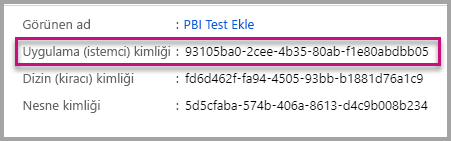

    **groupId** bilgilerini Power BI’daki **uygulama çalışma alanı GUID’si** ile doldurun.

    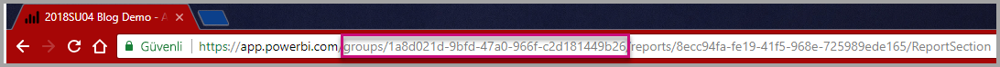

    **reportId** bilgilerini Power BI’daki **rapor GUID’si** ile doldurun.

    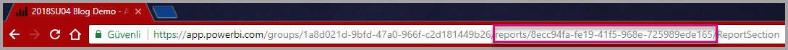

    * **pbiUsername** bilgisini Power BI ana kullanıcı hesabıyla doldurun.
    * **pbiPassword** bilgisini Power BI ana kullanıcı hesabının parolasıyla doldurun.

3. Uygulamayı çalıştırın!

    İlk olarak **Visual Studio**’da **Çalıştır**’ı seçin.

    

    Ardından **Rapor Ekle**’yi seçin. Test etmeyi seçtiğiniz içeriğe (raporlar, panolar veya kutucuklar) bağlı olarak uygulamada bu seçeneği belirleyin.

    

    Artık raporu örnek uygulamada görüntüleyebilirsiniz.

    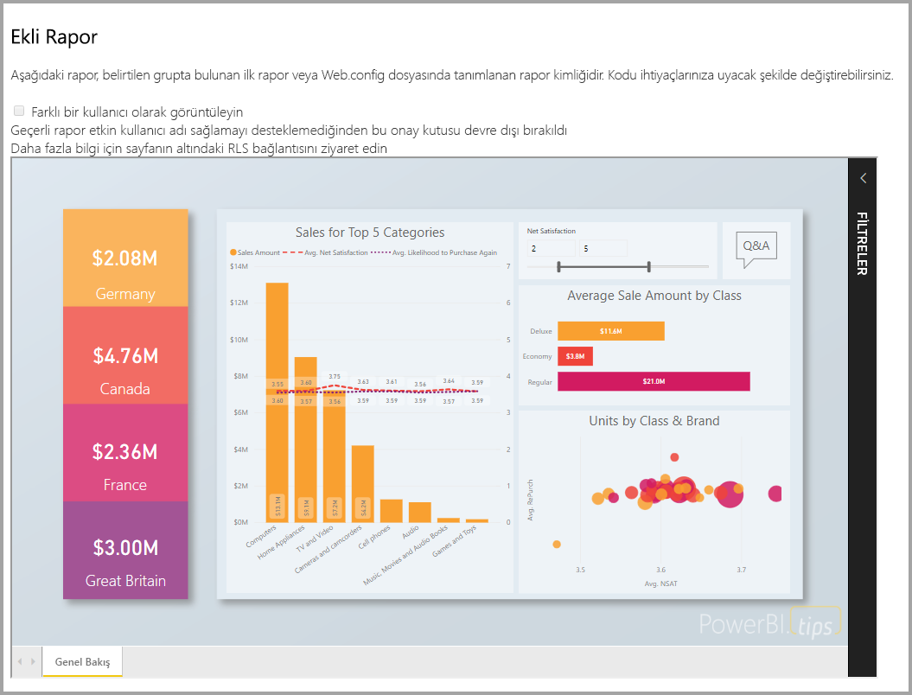

## <a name="embed-your-content-within-your-application"></a>İçeriğinizi uygulamanın içine ekleme
İçeriğinizi ekleme adımları [Power BI REST API'leri](https://docs.microsoft.com/rest/api/power-bi/) ile yapılabilse de, bu makalede açıklanan örnek kodlar **.NET SDK** ile hazırlanır.

Uygulamanıza müşterileriniz için içerik ekleme işlemi, **Azure AD**’den ana hesabınız için bir **erişim belirteci** alınmasını gerektirir. [Power BI REST API’lerine](https://docs.microsoft.com/rest/api/power-bi/) çağrı yapmadan önce, **verilerin sahibi uygulamadır** örneği kullanılarak Power BI uygulamanız için [Azure AD erişim belirteci](get-azuread-access-token.md#access-token-for-non-power-bi-users-app-owns-data) alınması gerekir.

**Erişim belirtecinizle** Power BI İstemcisi'ni oluşturmak için, [Power BI REST API'leriyle](https://docs.microsoft.com/rest/api/power-bi/) etkileşim kurmanızı sağlayacak Power BI istemci nesnenizi oluşturmanız gerekir. Bunun için **AccessToken** öğesini ***Microsoft.Rest.TokenCredentials*** nesnesine sarmanız gerekir.

```csharp
using Microsoft.IdentityModel.Clients.ActiveDirectory;
using Microsoft.Rest;
using Microsoft.PowerBI.Api.V2;

var tokenCredentials = new TokenCredentials(authenticationResult.AccessToken, "Bearer");

// Create a Power BI Client object. It is used to call Power BI APIs.
using (var client = new PowerBIClient(new Uri(ApiUrl), tokenCredentials))
{
    // Your code to embed items.
}
```

### <a name="get-the-content-item-you-want-to-embed"></a>Eklemek istediğiniz içerik öğesini alma
Eklemek istediğiniz öğeye ilişkin bir başvuru almak için Power BI istemci nesnesini kullanabilirsiniz.

Burada belirli bir çalışma alanının ilk raporunu nasıl alacağınızı gösteren bir kod örneği vardır.

*Eklemek istediğiniz içerik öğesini (rapor, pano veya kutucuk) alma örneği, [örnek uygulama](#embed-your-content-within-a-sample-application) içindeki Controllers\HomeController.cs dosyasında sağlanır.*

```csharp
using Microsoft.PowerBI.Api.V2;
using Microsoft.PowerBI.Api.V2.Models;

// You need to provide the GroupID where the dashboard resides.
ODataResponseListReport reports = client.Reports.GetReportsInGroupAsync(GroupId);

// Get the first report in the group.
Report report = reports.Value.FirstOrDefault();
```

### <a name="create-the-embed-token"></a>Ekleme belirtecini oluşturma
JavaScript API'sinden kullanılabilecek bir ekleme belirtecinin oluşturulması gerekir. Ekleme belirteci, eklediğiniz öğeye özeldir. Dolayısıyla, eklediğiniz her Power BI içeriği için yeni bir ekleme belirteci oluşturmanız gerekir. Kullanılacak **accessLevel** dahil olmak üzere daha fazla bilgi için bkz. [GenerateToken API](https://msdn.microsoft.com/library/mt784614.aspx).

Burada rapor için uygulamanıza bir ekleme belirteci yerleştirme örneği verilmiştir.

*Rapor, pano veya kutucuk için ekleme belirteci oluşturma örneği, [örnek uygulama](#embed-your-content-within-a-sample-application) içindeki Controllers\HomeController.cs dosyasında sağlanır.*

```csharp
using Microsoft.PowerBI.Api.V2;
using Microsoft.PowerBI.Api.V2.Models;

// Generate Embed Token.
var generateTokenRequestParameters = new GenerateTokenRequest(accessLevel: "view");
EmbedToken tokenResponse = client.Reports.GenerateTokenInGroup(GroupId, report.Id, generateTokenRequestParameters);

// Generate Embed Configuration.
var embedConfig = new EmbedConfig()
{
    EmbedToken = tokenResponse,
    EmbedUrl = report.EmbedUrl,
    Id = report.Id
};
```

Bu örnekte **EmbedConfig** ve **TileEmbedConfig** için bir sınıf oluşturulduğu kabul edilmektedir. Bu örnek **Models\EmbedConfig.cs** dosyasında ve **Models\TileEmbedConfig.cs** dosyasında sağlanır.

### <a name="load-an-item-using-javascript"></a>JavaScript kullanarak öğe yükleme
JavaScript kullanarak web sayfanızdaki bir div öğesine rapor yükleyebilirsiniz. 

Burada, **EmbedConfig** modeliyle **TileEmbedConfig** modelinin yanı sıra rapor görünümünü de kullanan bir örnek verilmiştir.

*Rapor, pano veya kutucuk görünümü ekleme örneği, [örnek uygulama](#embed-your-content-within-a-sample-application) içindeki Views\Home\EmbedReport.cshtml, Views\Home\EmbedDashboard.cshtml, veya Views\Home\Embedtile.cshtml dosyasında sağlanır.*

```javascript
<script src="~/scripts/powerbi.js"></script>
<div id="reportContainer"></div>
<script>
    // Read embed application token from Model
    var accessToken = "@Model.EmbedToken.Token";

    // Read embed URL from Model
    var embedUrl = "@Html.Raw(Model.EmbedUrl)";

    // Read report Id from Model
    var embedReportId = "@Model.Id";

    // Get models. models contains enums that can be used.
    var models = window['powerbi-client'].models;

    // Embed configuration used to describe the what and how to embed.
    // This object is used when calling powerbi.embed.
    // This also includes settings and options such as filters.
    // You can find more information at https://github.com/Microsoft/PowerBI-JavaScript/wiki/Embed-Configuration-Details.
    var config = {
        type: 'report',
        tokenType: models.TokenType.Embed,
        accessToken: accessToken,
        embedUrl: embedUrl,
        id: embedReportId,
        permissions: models.Permissions.All,
        settings: {
            filterPaneEnabled: true,
            navContentPaneEnabled: true
        }
    };

    // Get a reference to the embedded report HTML element
    var reportContainer = $('#reportContainer')[0];

    // Embed the report and display it within the div container.
    var report = powerbi.embed(reportContainer, config);
</script>
```

JavaScript API kullanan tam bir örnek için [Playground aracı](https://microsoft.github.io/PowerBI-JavaScript/demo)'nı kullanabilirsiniz. Bunu yapmak, farklı türde Power BI Embedded örnekleri ile yürütmenin hızlı bir yoludur. Ayrıca [PowerBI-JavaScript wiki](https://github.com/Microsoft/powerbi-javascript/wiki) sayfasını ziyaret ederek JavaScript API’si hakkında daha fazla bilgi alabilirsiniz.

## <a name="move-to-production"></a>Üretime geçme

Uygulamanızın geliştirme aşamasını tamamladığınıza göre şimdi adanmış kapasite ile uygulamanızın çalışma alanını destekleme işlemine geçmelisiniz. Üretime geçmek için adanmış kapasite gerekir.

### <a name="create-a-dedicated-capacity"></a>Adanmış kapasite oluşturma
Adanmış kapasite oluşturduğunuzda, müşteriniz için özel olarak ayrılmış bir kaynaktan yararlanabilirsiniz. [Microsoft Azure portalının](https://portal.azure.com) içinden adanmış kapasite satın alabilirsiniz. Power BI Embedded kapasitesi oluşturma hakkında ayrıntılı bilgi için bkz. [Azure portalında Power BI Embedded kapasitesi oluşturma](https://docs.microsoft.com/azure/power-bi-embedded/create-capacity).

Gereksinimlerinize en uygun Power BI Embedded kapasitesini saptamak için aşağıdaki tabloyu kullanın.

| Kapasite Düğümü | Toplam çekirdek<br/>*(Arka uç + ön uç)* | Arka Uç Çekirdekleri | Ön Uç Çekirdekleri | DirectQuery/canlı bağlantı sınırları | Yoğun saatlerde işlenen maksimum sayfa sayısı |
| --- | --- | --- | --- | --- | --- |
| A1 |1 sanal çekirdek |0,5 çekirdek, 3 GB RAM |0,5 çekirdek | saniyede 5 |1-300 |
| A2 |2 sanal çekirdek |1 çekirdek, 5 GB RAM |1 çekirdek | saniyede 10 |301-600 |
| A3 |4 sanal çekirdek |2 çekirdek, 10 GB RAM |2 çekirdek | saniyede 15 |601-1200 |
| A4 |8 sanal çekirdek |4 çekirdek, 25 GB RAM |4 çekirdek |saniyede 30 |1201-2400 |
| A5 |16 sanal çekirdek |8 çekirdek, 50 GB RAM |8 çekirdek |saniyede 60 |2401-4800 |
| A6 |32 sanal çekirdek |16 çekirdek, 100 GB RAM |16 çekirdek |saniyede 120 |4801-9600 |

**_A SKU'larla, ÜCRETSİZ Power BI lisansını kullanarak Power BI içeriğine erişemezsiniz._**

PRO lisanslarına sahip ekleme belirteçlerinin kullanılması, geliştirme testlerine yöneliktir. Bu nedenle, bir Power BI ana hesabının oluşturabileceği ekleme belirteçlerinin sayısı sınırlıdır. Bir üretim ortamında ekleme yapmak için adanmış kapasite satın almanız gerekir. Adanmış kapasiteyle oluşturabileceğiniz ekleme belirteçlerinin sayısıyla ilgili bir sınır yoktur. Geçerli eklenmiş kullanımı yüzde cinsinden gösteren kullanım değerini denetlemek için [Kullanılabilir Özellikler](https://docs.microsoft.com/rest/api/power-bi/availablefeatures/getavailablefeatures) bölümüne gidin. Kullanım miktarı ana hesabı temel alır.

Daha ayrıntılı bilgi için bkz. [Embedded analytics capacity planning (Katıştırılmış analiz kapasite planlama) teknik incelemesi](https://aka.ms/pbiewhitepaper).

### <a name="assign-an-app-workspace-to-a-dedicated-capacity"></a>Adanmış kapasiteye uygulama çalışma alanı atama

Adanmış kapasite oluşturduktan sonra, uygulama çalışma alanınızı bu adanmış kapasiteye atayabilirsiniz. Bunu yapmak için aşağıdaki adımları uygulayın.

1. **Power BI hizmetinde**, çalışma alanlarını genişletin ve içeriğinizi eklemek için kullandığınız çalışma alanına yönelik olan üç noktayı seçin. Ardından **Çalışma alanlarını düzenle**’yi seçin.

    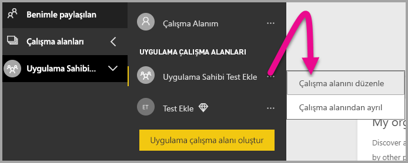

2. **Gelişmiş**’i genişletin, ardından **Adanmış kapasite**’yi etkinleştirin, sonra da oluşturduğunuz adanmış kapasiteyi seçin. Sonra **Kaydet**'i seçin.

    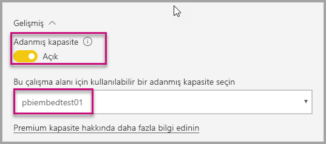

3. **Kaydet**'i seçtikten sonra uygulama çalışma alanının yanında bir **elmas** simgesi görünmelidir.

    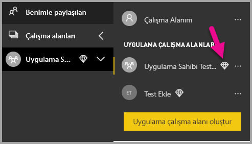

## <a name="next-steps"></a>Sonraki adımlar
Bu öğreticide müşterileriniz için bir uygulamaya Power BI içeriği eklemeyi öğrendiniz. Kuruluşunuz için de Power BI içeriği ekleme denemeleri yapabilirsiniz.

> [!div class="nextstepaction"]
>[Kuruluşunuz için ekleme](embed-sample-for-your-organization.md)

Başka bir sorunuz mu var? [Power BI Topluluğu'na sorun](http://community.powerbi.com/)
