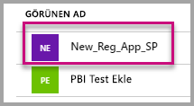
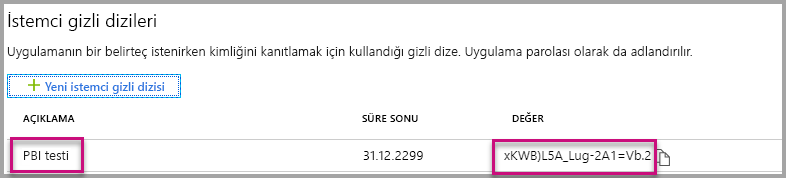

# <a name="tutorial-embed-power-bi-content-into-an-application-for-your-customers"></a>Öğretici: Müşterileriniz için Power BI içeriğini bir uygulamaya ekleme

**Azure’da Power BI Embedded** ile verilerin sahibi uygulamadır örneğini kullanarak raporları, panoları veya kutucukları bir uygulamaya ekleyebilirsiniz. **Verilerin sahibi uygulamadır** örneği, eklenmiş analiz platformu olarak Power BI’ı kullanan bir uygulamanız olması durumunda kullanılır. Bir **ISV geliştiricisi** olarak, tamamen tümleşik ve etkileşimli bir uygulamada raporlar, panolar veya kutucuklar görüntüleyen Power BI içeriği oluşturabilirsiniz. Üstelik kullanıcıların Power BI lisansı olması gerekmez. Bu öğreticide, müşterileriniz için **Azure’da Power BI Embedded** kullanarak Power BI JavaScript API’siyle birlikte Power BI .NET SDK’sını kullanıp bir raporu uygulama ile tümleştirme işlemi gösterilir.


Bu öğreticide aşağıdakilerin nasıl yapılacağını öğreneceksiniz:
> [!div class="checklist"]
> * Azure’da bir uygulama kaydetme.
> * Bir uygulamaya Power BI raporu ekleme.

## <a name="prerequisites"></a>Önkoşullar

Başlamak için şunlara sahip olmalısınız:

* [Power BI Pro hesabı](../service-self-service-signup-for-power-bi.md) (Power BI Pro hesabınızda oturum açmak için bir kullanıcı adıyla paroladan oluşan ana hesap) veya [hizmet sorumlusu (yalnızca uygulama belirteci)](embed-service-principal.md).
* [Microsoft Azure](https://azure.microsoft.com/) aboneliği.
* [Azure Active Directory kiracınız](create-an-azure-active-directory-tenant.md) ayarlanmış olmalıdır.

**Power BI Pro**’ya kaydolmadıysanız başlamadan önce [ücretsiz deneme için kaydolun](https://powerbi.microsoft.com/pricing/).

Azure aboneliğiniz yoksa başlamadan önce [ücretsiz bir hesap](https://azure.microsoft.com/free/?WT.mc_id=A261C142F) oluşturun.

## <a name="set-up-your-embedded-analytics-development-environment"></a>Eklediğiniz analiz geliştirme ortamını ayarlama

Raporları, panoları veya kutucukları uygulamanıza eklemeye başlamadan önce ortamınızın Power BI ile ekleme işlevlerine izin verdiğinden emin olmanız gerekir.

Hızla çalışmaya başlayıp ortam oluşturma ve rapor ekleme işlemi boyunca adım adım size yol gösteren örnek bir uygulamayı indirmek için [Ekleme kurulum aracı](https://aka.ms/embedsetup/AppOwnsData) bölümünün üzerinden geçebilirsiniz.

Ancak, ortamı el ile ayarlamayı seçerseniz aşağıdaki adımlara devam edebilirsiniz.

### <a name="register-an-application-in-azure-active-directory-azure-ad"></a>Azure Active Directory'de (Azure AD) bir uygulamayı kaydetme

Uygulamanızın [Power BI REST API'lerine](https://docs.microsoft.com/rest/api/power-bi/) erişmesini sağlamak için [uygulamanızı Azure Active Directory'ye kaydedin](register-app.md). Uygulamanızı kaydettiğinizde uygulamanız için bir kimlik oluşturabilir ve Power BI REST kaynaklarıyla ilgili izinleri belirleyebilirsiniz. Uygulama kaydına nasıl başlayacağınız, ana hesap mı yoksa [hizmet sorumlusu ](embed-service-principal.md) mu kullanmak istediğinize bağlıdır.

İzlediğiniz yöntem, Azure'a kaydettiğiniz uygulamanın türünü etkiler.

Ana hesap kullanarak devam ediyorsanız, **Yerel** uygulama kaydetme işlemini kullanın. Yerel uygulama kullanmanızın nedeni etkileşimli olmayan bir oturum açma yöntemiyle çalışmanızdır.

Öte yandan hizmet sorumlusu kullanarak devam ederseniz, **sunucu tarafı web uygulaması** kaydetme işlemini kullanmalısınız. Sunucu tarafı web uygulamasını kaydederek bir uygulama gizli dizisi oluşturursunuz.

## <a name="set-up-your-power-bi-environment"></a>Power BI ortamınızı ayarlama

### <a name="create-an-app-workspace"></a>Uygulama çalışma alanı oluştur

Müşterileriniz için raporlar, panolar ve kutucuklar yerleştiriyorsanız, uygulama çalışma alanı içine içeriğinizi yerleştirmeniz gerekir. Ayarlayabileceğiniz farklı türlerde çalışma alanları vardır: [geleneksel çalışma alanları](../service-create-workspaces.md) veya [yeni çalışma alanları](../service-create-the-new-workspaces.md). *Ana* hesap kullanıyorsanız, hangi tür çalışma alanı kullandığınız önemli değildir. Ama uygulamanızda oturum açarken *[hizmet sorumlusu](embed-service-principal.md)* kullanıyorsanız, yeni çalışma alanlarını kullanmanız gerekir. Her iki senaryoda da, hem *ana* hesap hem de *hizmet sorumlusu* uygulamaya katılan uygulama çalışma alanlarında yönetici olmalıdır.

### <a name="create-and-publish-your-reports"></a>Raporlarınızı oluşturma ve yayımlama

Power BI Desktop'ı kullanarak raporlarınızı ve veri kümelerinizi oluşturabilir, ardından bu raporları uygulama çalışma alanında yayımlayabilirsiniz. Bu görevi gerçekleştirmenin iki yolu vardır: Son kullanıcı olarak, raporları bir ana hesapla (Power BI Pro lisansı) geleneksel uygulama çalışma alanına yayımlayabilirsiniz. Hizmet sorumlusu kullanıyorsanız, raporları [Power BI REST API'lerini](https://docs.microsoft.com/rest/api/power-bi/imports/postimportingroup) kullanarak yeni çalışma alanlarına yayımlayabilirsiniz.

Aşağıdaki adımlar PBIX raporunuzu Power BI çalışma alanınıza yayımlama işleminde yol gösterir.

1. GitHub'dan örnek [Blog Tanıtımı](https://github.com/Microsoft/powerbi-desktop-samples)’nı indirin.

    

2. **Power BI Desktop**’ta örnek PBIX raporunu açın.

   

3. **Uygulama çalışma alanlarına** yayımlayın. Bu işlem, ana hesap (Power Pro lisansı) veya hizmet sorumlusu kullanmanıza göre farklılık gösterir. Ana hesap kullanıyorsanız, raporunuzu Power BI Desktop aracılığıyla yayımlayabilirsiniz.  Şimdi hizmet sorumlusu kullanıyorsanız Power BI REST API'lerini kullanmanız gerekir.

## <a name="embed-content-using-the-sample-application"></a>Örnek uygulamayı kullanarak içeriği ekleme

Bu örnek tanıtım amacıyla bilerek basit tutulmuştur. Uygulama gizli dizisinin veya ana hesap kimlik bilgilerinin korunması size veya geliştiricilerinize bağlıdır.

Örnek uygulamayı kullanarak içeriğinizi eklemeye başlamak için aşağıdaki adımları izleyin.

1. [Visual Studio](https://www.visualstudio.com/)'yu (sürüm 2013 veya üzeri) indirin. En son [NuGet paketini](https://www.nuget.org/profiles/powerbi) indirdiğinizden emin olun.

2. Başlamak için GitHub’dan [Verilerin Sahibi Uygulamadır örneğini](https://github.com/Microsoft/PowerBI-Developer-Samples) indirin.

    

3. Örnek uygulamada **Web.config** dosyasını açın. Uygulamayı çalıştırmak için doldurmanız gereken alanlar vardır. **AuthenticationType** olarak **MasterUser** veya **ServicePrincipal**'ı seçebilirsiniz. Seçtiğiniz kimlik doğrulama yöntemine bağlı olarak, tamamlanması gereken farklı alanlar vardır.

    > [!Note]
    > Bu örnekte varsayılan **AuthenticationType** MasterUser'dır.

    <center>

    | **MasterUser** <br> (Power BI Pro lisansı) | **ServicePrincipal** <br> (yalnızca uygulama belirteci)|
    |---------------|-------------------|
    | [applicationId](#application-id) | [applicationId](#application-id) |
    | [workspaceId](#workspace-id) | [workspaceId](#workspace-id) |
    | [reportId](#report-id) | [reportId](#report-id) |
    | [pbiUsername](#power-bi-username-and-password) |  |
    | [pbiPassword](#power-bi-username-and-password) |  |
    |  | [applicationsecret](#application-secret) |
    |  | [tenant](#tenant) |

   </center>

    

### <a name="application-id"></a>Uygulama Kimliği

Bu öznitelik her iki AuthenticationType ayarı (ana hesap ve [hizmet sorumlusu](embed-service-principal.md)) için de gereklidir.

**applicationId** bilgilerini **Azure**’daki **Uygulama Kimliği** ile doldurun. Uygulama, izin istediğiniz kullanıcılara kendini tanıtmak için **applicationId** değerini kullanır.

**applicationId** değerini almak için aşağıdaki adımları izleyin:

1. [Azure portalında](https://portal.azure.com) oturum açın.

2. Sol gezinti bölmesinde **Tüm Hizmetler**'i, sonra da **Uygulama Kayıtları**'nı seçin.

    

3. **applicationId** değerinin gerektiği uygulamayı seçin.

    

4. GUID olarak listelenen bir **Uygulama Kimliği** vardır. Bu **Uygulama Kimliği**’ni uygulamanın **applicationId** değeri olarak kullanın.

    

### <a name="workspace-id"></a>Çalışma Alanı Kimliği

Bu öznitelik her iki AuthenticationType ayarı (ana hesap ve [hizmet sorumlusu](embed-service-principal.md)) için de gereklidir.

**workspaceId** bilgisini Power BI’daki uygulama çalışma alanı (grup) GUID’si ile doldurun. Bu bilgiyi Power BI hizmetinin oturumu açıkken URL'den alabileceğiniz gibi Powershell'i kullanarak da alabilirsiniz.

URL <br>


Powershell <br>

```powershell
Get-PowerBIworkspace -name "App Owns Embed Test"
```

   

### <a name="report-id"></a>Rapor Kimliği

Bu öznitelik her iki AuthenticationType ayarı (ana hesap ve [hizmet sorumlusu](embed-service-principal.md)) için de gereklidir.

**reportId** bilgisini Power BI’daki rapor GUID’si ile doldurun. Bu bilgiyi Power BI hizmetinin oturumu açıkken URL'den alabileceğiniz gibi Powershell'i kullanarak da alabilirsiniz.

URL<br>


Powershell <br>

```powershell
Get-PowerBIworkspace -name "App Owns Embed Test" | Get-PowerBIReport
```


### <a name="power-bi-username-and-password"></a>Power BI kullanıcı adı ve parolası

Bu öznitelikler yalnızca AuthenticationType ayarı ana hesap olduğunda gereklidir.

Kimlik doğrulaması için [hizmet sorumlusu](embed-service-principal.md) kullanıyorsanız, kullanıcı adı ve parola özniteliklerini doldurmanız gerekmez.

* **pbiUsername** bilgisini Power BI ana hesabıyla doldurun.
* **pbiPassword** bilgisini Power BI ana hesabının parolasıyla doldurun.

### <a name="application-secret"></a>Uygulama gizli dizisi

Bu öznitelik yalnızca [hizmet sorumlusu](embed-service-principal.md) AuthenticationType ayarı için gereklidir.

**ApplicationSecret** alanına **Azure**'daki **Uygulama kayıtları** bölümünden alacağınız **Anahtarlar** bilgilerini girin.  Bu öznitelik [hizmet sorumlusu](embed-service-principal.md) kullanıldığında çalışır.

**ApplicationSecret** değerini almak için aşağıdaki adımları izleyin:

1. [Azure portalında](https://portal.azure.com) oturum açın.

2. Sol gezinti bölmesinde **Tüm hizmetler**'i, sonra da **Uygulama kayıtları**'nı seçin.

    

3. **ApplicationSecret** değerini kullanması gereken uygulamayı seçin.

    

4. Seçin **sertifikalarını ve gizli dizilerini** altında **Yönet**.

5. Seçin **yeni istemci gizli dizileri**.

6. **Açıklama** kutusuna bir ad girin ve bir süre seçin. Ardından **Kaydet**’i seçerek uygulamanız için **Değer**’i alın. Anahtar değerini kaydettikten sonra **Anahtarlar** bölmesini kapattığınızda değer alanı yalnızca gizlenmiş olarak gösterilir. Bu aşamada anahtar değerini alamazsınız. Anahtar değerini kaybederseniz Azure portalında yeni bir anahtar değeri oluşturun.

    

### <a name="tenant"></a>Kiracı

Bu öznitelik yalnızca [hizmet sorumlusu](embed-service-principal.md) AuthenticationType ayarı için gereklidir.

**tenant** bilgisini Azure kiracı kimliğinizle doldurun. Bu bilgiyi Power BI hizmetinin oturumu açıkken [Azure AD yönetim merkezinden](/onedrive/find-your-office-365-tenant-id) alabileceğiniz gibi Powershell'i kullanarak da alabilirsiniz.

### <a name="run-the-application"></a>Uygulamayı çalıştırma

1. **Visual Studio**’da **Çalıştır**’ı seçin.

    

2. Ardından **Rapor Ekle**’yi seçin. Test etmeyi seçtiğiniz içeriğe (raporlar, panolar veya kutucuklar) bağlı olarak uygulamada bu seçeneği belirleyin.

    

3. Artık raporu örnek uygulamada görüntüleyebilirsiniz.

    

## <a name="embed-content-within-your-application"></a>İçeriği uygulamanızın içine ekleme

İçeriğinizi ekleme adımları [Power BI REST API’leri](https://docs.microsoft.com/rest/api/power-bi/) ile uygulanabilse de, bu makalede açıklanan örnek kodlar **.NET SDK** ile hazırlanır.

Uygulamanıza müşterileriniz için içerik ekleme işlemi, **Azure AD**’den ana hesabınız veya [hizmet sorumlunuz](embed-service-principal.md) için bir **erişim belirteci** alınmasını gerektirir. [Power BI REST API’lerine](https://docs.microsoft.com/rest/api/power-bi/) çağrı yapmadan önce, Power BI uygulamanız için [Azure AD erişim belirteci](get-azuread-access-token.md#access-token-for-non-power-bi-users-app-owns-data) almanız gerekir.

**Erişim belirtecinizle** Power BI İstemcisi'ni oluşturmak için, [Power BI REST API'leriyle](https://docs.microsoft.com/rest/api/power-bi/) etkileşim kurmanızı sağlayacak Power BI istemci nesnenizi oluşturmanız gerekir. Power BI istemci nesnesini oluşturmak için **AccessToken** öğesini ***Microsoft.Rest.TokenCredentials*** nesnesine sarmanız gerekir.

```csharp
using Microsoft.IdentityModel.Clients.ActiveDirectory;
using Microsoft.Rest;
using Microsoft.PowerBI.Api.V2;

var tokenCredentials = new TokenCredentials(authenticationResult.AccessToken, "Bearer");

// Create a Power BI Client object. it's used to call Power BI APIs.
using (var client = new PowerBIClient(new Uri(ApiUrl), tokenCredentials))
{
    // Your code to embed items.
}
```

### <a name="get-the-content-item-you-want-to-embed"></a>Eklemek istediğiniz içerik öğesini alma

Eklemek istediğiniz öğeye ilişkin bir başvuru almak için Power BI istemci nesnesini kullanabilirsiniz.

Burada belirli bir çalışma alanının ilk raporunu nasıl alacağınızı gösteren bir kod örneği vardır.

*Eklemek istediğiniz içerik öğesini (rapor, pano veya kutucuk) alma örneği, [örnek uygulama](https://github.com/Microsoft/PowerBI-Developer-Samples) içindeki Services\EmbedService.cs dosyasında sağlanır.*

```csharp
using Microsoft.PowerBI.Api.V2;
using Microsoft.PowerBI.Api.V2.Models;

// You need to provide the workspaceId where the dashboard resides.
ODataResponseListReport reports = await client.Reports.GetReportsInGroupAsync(workspaceId);

// Get the first report in the group.
Report report = reports.Value.FirstOrDefault();
```

### <a name="create-the-embed-token"></a>Ekleme belirtecini oluşturma

JavaScript API’sinden kullanılabilecek bir ekleme belirteci oluşturulmuştur. Ekleme belirteci, eklediğiniz öğeye özeldir. Dolayısıyla, eklediğiniz her Power BI içeriği için yeni bir ekleme belirteci oluşturmanız gerekir. Kullanılacak **accessLevel** dahil olmak üzere daha fazla bilgi için bkz. [GenerateToken API](https://msdn.microsoft.com/library/mt784614.aspx).

*Eklemek istediğiniz rapor, pano veya kutucuk için ekleme belirteci oluşturma örneği, [örnek uygulama](https://github.com/Microsoft/PowerBI-Developer-Samples) içindeki Services\EmbedService.cs dosyasında sağlanır.*

```csharp
using Microsoft.PowerBI.Api.V2;
using Microsoft.PowerBI.Api.V2.Models;

// Generate Embed Token.
var generateTokenRequestParameters = new GenerateTokenRequest(accessLevel: "view");
EmbedToken tokenResponse = client.Reports.GenerateTokenInGroup(workspaceId, report.Id, generateTokenRequestParameters);

// Generate Embed Configuration.
var embedConfig = new EmbedConfig()
{
    EmbedToken = tokenResponse,
    EmbedUrl = report.EmbedUrl,
    Id = report.Id
};
```

**EmbedConfig** ve **TileEmbedConfig** için bir sınıf oluşturulur. **Models\EmbedConfig.cs** dosyasında ve **Models\TileEmbedConfig.cs** dosyasında bir örnek sağlanır.

### <a name="load-an-item-using-javascript"></a>JavaScript kullanarak öğe yükleme

JavaScript kullanarak web sayfanızdaki bir div öğesine rapor yükleyebilirsiniz.

JavaScript API kullanan tam bir örnek için [Playground aracı](https://microsoft.github.io/PowerBI-JavaScript/demo)'nı kullanabilirsiniz. Deneme Alanı aracı, farklı türde Power BI Embedded örnekleri ile yürütmenin hızlı bir yoludur. Ayrıca [PowerBI-JavaScript wiki](https://github.com/Microsoft/powerbi-javascript/wiki) sayfasını ziyaret ederek JavaScript API’si hakkında daha fazla bilgi alabilirsiniz.

Burada, **EmbedConfig** modeliyle **TileEmbedConfig** modelinin yanı sıra rapor görünümünü de kullanan bir örnek verilmiştir.

*Rapor, pano veya kutucuk görünümü ekleme örneği, [örnek uygulama](#embed-content-using-the-sample-application) içindeki Views\Home\EmbedReport.cshtml, Views\Home\EmbedDashboard.cshtml veya Views\Home\Embedtile.cshtml dosyasında sağlanır.*

```javascript
<script src="~/scripts/powerbi.js"></script>
<div id="reportContainer"></div>
<script>
    // Read embed application token from Model
    var accessToken = "@Model.EmbedToken.Token";

    // Read embed URL from Model
    var embedUrl = "@Html.Raw(Model.EmbedUrl)";

    // Read report Id from Model
    var embedReportId = "@Model.Id";

    // Get models. models contains enums that can be used.
    var models = window['powerbi-client'].models;

    // Embed configuration used to describe what and how to embed.
    // This object is used when calling powerbi.embed.
    // This also includes settings and options such as filters.
    // You can find more information at https://github.com/Microsoft/PowerBI-JavaScript/wiki/Embed-Configuration-Details.
    var config = {
        type: 'report',
        tokenType: models.TokenType.Embed,
        accessToken: accessToken,
        embedUrl: embedUrl,
        id: embedReportId,
        permissions: models.Permissions.All,
        settings: {
            filterPaneEnabled: true,
            navContentPaneEnabled: true
        }
    };

    // Get a reference to the embedded report HTML element
    var reportContainer = $('#reportContainer')[0];

    // Embed the report and display it within the div container.
    var report = powerbi.embed(reportContainer, config);
</script>
```

## <a name="move-to-production"></a>Üretime geçme

Uygulamanızın geliştirme aşamasını tamamladığınıza göre şimdi adanmış kapasite ile uygulamanızın çalışma alanını destekleme işlemine geçmelisiniz. 

> [!Important]
> Üretime geçmek için adanmış kapasite gerekir.

### <a name="create-a-dedicated-capacity"></a>Adanmış kapasite oluşturma

Adanmış kapasite oluşturduğunuzda, müşteriniz için özel olarak ayrılmış bir kaynaktan yararlanabilirsiniz. [Microsoft Azure portalının](https://portal.azure.com) içinden adanmış kapasite satın alabilirsiniz. Power BI Embedded kapasitesi oluşturma hakkında ayrıntılı bilgi için bkz. [Azure portalında Power BI Embedded kapasitesi oluşturma](azure-pbie-create-capacity.md).

Gereksinimlerinize en uygun Power BI Embedded kapasitesini saptamak için aşağıdaki tabloyu kullanın.

| Kapasite Düğümü | Toplam çekirdek<br/>*(Arka uç + ön uç)* | Arka Uç Çekirdekleri | Ön Uç Çekirdekleri | DirectQuery/canlı bağlantı sınırları|
| --- | --- | --- | --- | --- | --- |
| A1 |1 sanal çekirdek |0,5 çekirdek, 3 GB RAM |0,5 çekirdek |saniyede 0 5 |
| A2 |2 sanal çekirdek |1 çekirdek, 5 GB RAM |1 çekirdek | saniyede 10 |
| A3 |4 sanal çekirdek |2 çekirdek, 10 GB RAM |2 çekirdek | saniyede 15 |
| A4 |8 sanal çekirdek |4 çekirdek, 25 GB RAM |4 çekirdek |saniyede 30 |
| A5 |16 sanal çekirdek |8 çekirdek, 50 GB RAM |8 çekirdek |saniyede 60 |
| A6 |32 sanal çekirdek |16 çekirdek, 100 GB RAM |16 çekirdek |saniyede 120 |

**_A SKU’larla, ÜCRETSİZ Power BI lisansını kullanarak Power BI içeriğine erişemezsiniz._ **

PRO lisanslarına sahip ekleme belirteçlerinin kullanılması, geliştirme testlerine yöneliktir. Bu nedenle, bir Power BI ana hesabının veya hizmet sorumlusunun oluşturabileceği ekleme belirteçlerinin sayısı sınırlıdır. Adanmış kapasite için üretim ortamında ekleme yapmak gerekir. Adanmış kapasiteyle oluşturabileceğiniz ekleme belirteçlerinin sayısıyla ilgili bir sınır yoktur. Geçerli eklenmiş kullanımı yüzde cinsinden gösteren kullanım değerini denetlemek için [Kullanılabilir Özellikler](https://docs.microsoft.com/rest/api/power-bi/availablefeatures/getavailablefeatures) bölümüne gidin. Kullanım miktarı ana hesabı temel alır.

Daha fazla bilgi için [Tümleşik analiz kapasite planlaması teknik incelemesi](https://aka.ms/pbiewhitepaper).

### <a name="assign-an-app-workspace-to-a-dedicated-capacity"></a>Adanmış kapasiteye uygulama çalışma alanı atama

Adanmış kapasite oluşturduktan sonra, uygulama çalışma alanınızı bu adanmış kapasiteye atayabilirsiniz.

[Hizmet sorumlusu](embed-service-principal.md) kullanarak çalışma alanına adanmış kapasite atamak için [Power BI REST API'sini](https://docs.microsoft.com/rest/api/power-bi/capacities/groups_assigntocapacity) kullanın. Power BI REST API'lerini kullanırken [hizmet sorumlusu nesne kimliğini](embed-service-principal.md#how-to-get-the-service-principal-object-id) kullandığınızdan emin olun.

**Ana hesap** kullanarak çalışma alanına adanmış kapasite atamak için aşağıdaki adımları izleyin.

1. **Power BI hizmetinde**, çalışma alanlarını genişletin ve içeriğinizi eklemek için kullandığınız çalışma alanına yönelik olan üç noktayı seçin. Ardından **Çalışma alanlarını düzenle**’yi seçin.

    

2. **Gelişmiş**’i genişletin, ardından **Adanmış kapasite**’yi etkinleştirin, sonra da oluşturduğunuz adanmış kapasiteyi seçin. Sonra **Kaydet**'i seçin.

    

3. **Kaydet**’i seçtikten sonra, uygulama çalışma alanının yanında bir **baklava** işareti görmeniz gerekir.

    

## <a name="next-steps"></a>Sonraki adımlar

Bu öğreticide müşterileriniz için bir uygulamaya Power BI içeriği eklemeyi öğrendiniz. Kuruluşunuz için de Power BI içeriği ekleme denemeleri yapabilirsiniz.

> [!div class="nextstepaction"]
>[Kuruluşunuz için ekleme](embed-sample-for-your-organization.md)

Başka bir sorunuz mu var? [Power BI Topluluğu'na sorun](http://community.powerbi.com/)
