# <a name="tutorial-embed-a-power-bi-report-dashboard-or-tile-into-an-application-for-your-organization"></a>Öğretici: Kuruluşunuz için bir uygulamaya Power BI raporu, pano veya kutucuk ekleme

Bu öğreticide, bir raporun bir uygulamayla nasıl tümleştirileceği gösterilmektedir. Kuruluşunuz için bir uygulamaya Power BI yerleştirmek için Power BI JavaScript API’si ile birlikte Power BI .NET SDK’sını kullanırsınız. Power BI’da, **verilerin sahibi kullanıcıdır** yapısını kullanarak bir uygulamaya raporlar, panolar veya kutucuklar ekleyebilirsiniz. **Verilerin sahibi kullanıcıdır** yapısı, uygulamanızın Power BI hizmetinin kapsamını genişletmesini sağlar.

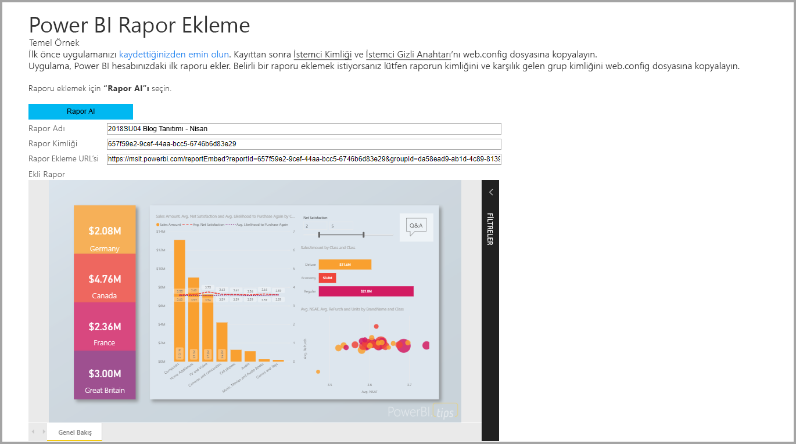

Bu öğreticide, aşağıdaki görevleri öğreneceksiniz:
>[!div class="checklist"]
>* Azure’da bir uygulama kaydetme.
>* Bir uygulamaya Power BI raporu ekleme.

## <a name="prerequisites"></a>Önkoşullar

Başlamak için bir Power BI Pro hesabı ve bir Microsoft Azure aboneliği gerekir:

* Power BI Pro’ya kaydolmadıysanız, başlamadan önce [ücretsiz deneme için kaydolun](https://powerbi.microsoft.com/en-us/pricing/).
* Azure aboneliğiniz yoksa başlamadan önce [ücretsiz bir hesap](https://azure.microsoft.com/free/?WT.mc_id=A261C142F) oluşturun.
* Kendi [Azure Active Directory (Azure AD) kiracınızı](create-an-azure-active-directory-tenant.md) ayarlayın.
* [Visual Studio](https://www.visualstudio.com/) 2013 veya sonraki bir sürümü yükleyin.

## <a name="set-up-your-embedded-analytics-development-environment"></a>Eklediğiniz analiz geliştirme ortamını ayarlama

Uygulamanıza raporlar, panolar ve kutucuklar eklemeye başlamadan önce, ortamınızın eklemeye izin verecek şekilde ayarlandığından emin olun. Kurulumun parçası olarak şu eylemlerden birini uygulayın:

- Ortam oluşturma ve rapor ekleme işlemi boyunca adım adım size yol gösteren örnek bir uygulamayı hızlı şekilde kullanmak ve indirmek için [kurulum aracı ekleme](https://aka.ms/embedsetup/UserOwnsData) bölümünün üzerinden geçebilirsiniz.

- Ortamı kendiniz ayarlamayı seçerseniz aşağıdaki bölümlerde yer alan adımları uygulayın.

### <a name="register-an-application-in-azure-active-directory"></a>Bir uygulamayı Azure Active Directory’ye kaydetme

Uygulamanızın Power BI REST API’lerine erişmesini sağlamak için uygulamanızı Azure Active Directory’ye kaydedin. Daha sonra uygulamanız için bir kimlik oluşturabilir ve Power BI REST kaynaklarına yönelik izinleri belirtebilirsiniz.

1. [Microsoft Power BI API koşulları](https://powerbi.microsoft.com/api-terms)’nı kabul edin.

2. [Azure portalında](https://portal.azure.com) oturum açın.

    

3. Sol gezinti bölmesinde **Tüm hizmetler**’i ve sonra **Uygulama kayıtları**’nı seçin. Daha sonra **Yeni uygulama kaydı**’nı seçin.

    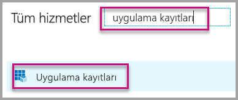</br>

    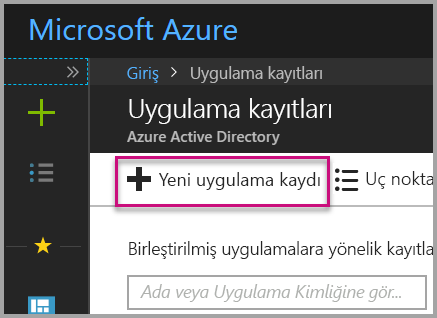

4. Talimatları izleyerek yeni bir uygulama oluşturun. **Verilerin sahibi kullanıcıdır** bölümünde **Uygulama türü** için **Web uygulaması / API** seçeneğini kullanın. Azure AD’nin belirteç yanıtlarını döndürmek için kullandığı bir **Oturum açma URL’si** de sağlamanız gerekir. Uygulamanıza özgü bir değer girin. Örnek: `http://localhost:13526/`.

    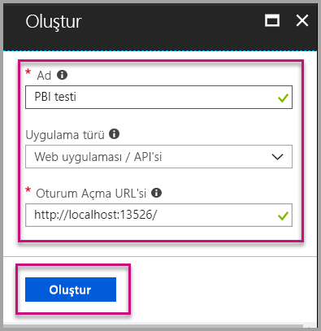

### <a name="apply-permissions-to-your-application-within-azure-active-directory"></a>Azure Active Directory'de uygulamanıza izinler uygulama

Uygulama kayıt sayfasında sağlananlara ek olarak uygulamanız için izinleri etkinleştirmeniz gerekir. İzinleri etkinleştirmek için bir genel yönetici hesabıyla oturum açın.

### <a name="use-the-azure-active-directory-portal"></a>Azure Active Directory portalını kullanma

1. Azure portalında [Uygulama kayıtları](https://portal.azure.com/#blade/Microsoft_AAD_IAM/ApplicationsListBlade)’na göz atın ve yerleştirmek için kullandığınız uygulamayı seçin.

    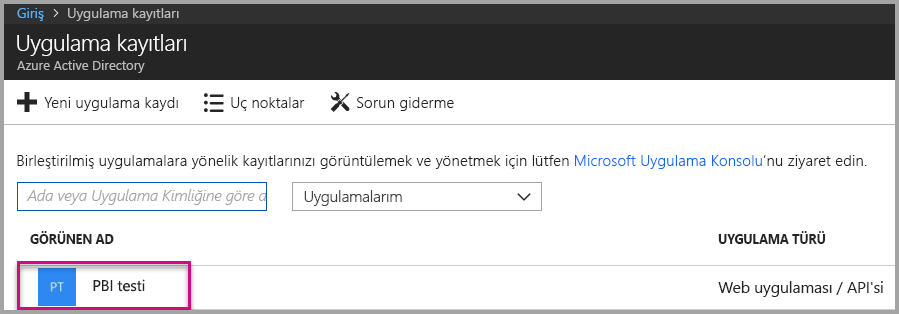

2. **Ayarlar** seçeneğini belirleyin. Daha sonra **API Erişimi** bölümünde **Gerekli izinler**’i seçin.

    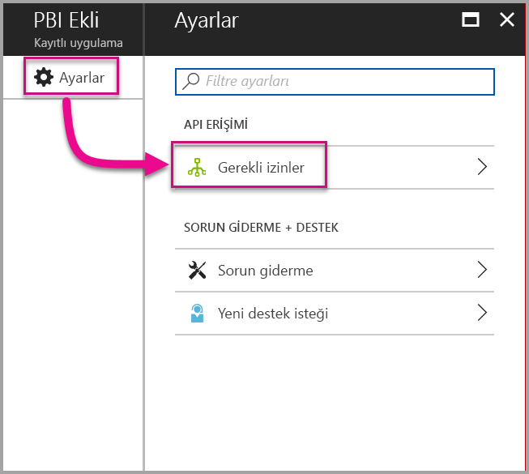

3. **Windows Azure Active Directory** seçeneğini belirleyin. Daha sonra **Oturum açmış kullanıcı olarak dizine erişin** seçeneğinin belirlendiğinden emin olun. **Kaydet**'i seçin.

    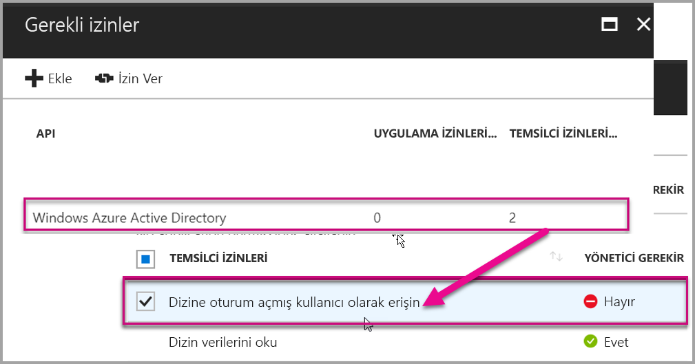

4. **Ekle**'yi seçin.

    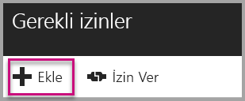

5. **Bir API seçin** seçeneğini belirleyin.

    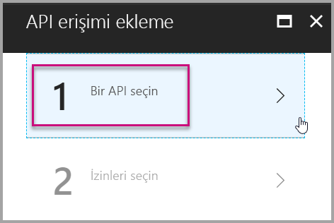

6. **Power BI Hizmeti**’ni seçin. Ardından **Seç** seçeneğini belirleyin.

    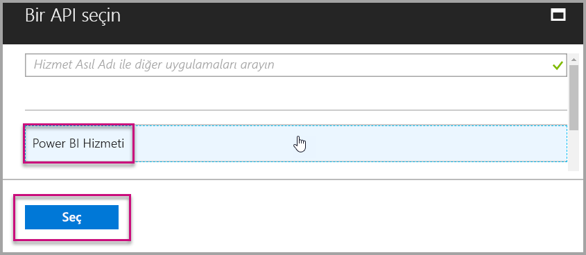

7. **Temsilci İzinleri** bölümündeki tüm izinleri seçin. Seçimleri kaydetmek için teker teker seçin. İşiniz bittiğinde **Kaydet**’i seçin.

    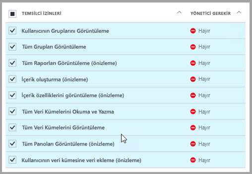

## <a name="set-up-your-power-bi-environment"></a>Power BI ortamınızı ayarlama

### <a name="create-an-app-workspace"></a>Uygulama çalışma alanı oluştur

Müşterileriniz için raporlar, panolar ve kutucuklar yerleştiriyorsanız, uygulama çalışma alanı içine içeriğinizi yerleştirmeniz gerekir:

1. İşe çalışma alanını oluşturarak başlayın. **Çalışma alanları** > **Uygulama çalışma alanı oluşturma**'yı seçin. Bu çalışma alanı, uygulamanızın erişmesi gereken içeriği yerleştirdiğiniz yerdir.

    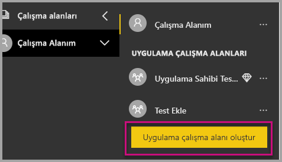

2. Çalışma alanına bir ad verin. Karşılık gelen **Çalışma Alanı Kimliği** kullanılamıyorsa düzenleyerek benzersiz bir kimlik belirleyin. Bu adın aynı zamanda uygulamanın da adı olması gerekir.

    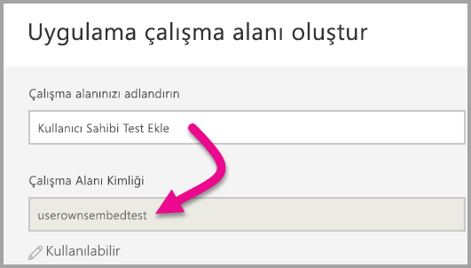

3. Değiştirebileceğiniz birkaç ayar vardır. **Ortak** seçeneğini belirlerseniz çalışma alanınızdakileri kuruluşunuzdaki herkes görebilir. **Özel**, çalışma alanının içeriklerini yalnızca çalışma alanı üyelerinin görebileceği anlamına gelir.

    

    Grubu oluşturduktan sonra Genel veya Özel ayarını değiştiremezsiniz.

4. Ayrıca, üyelerin düzenleme mi yapabileceğini yoksa yalnızca görüntüleme erişimine mi sahip olabileceğini de seçebilirsiniz.

    

5. Çalışma alanına erişiminin olmasını istediğiniz kişilerin e-posta adreslerini ekleyin ve **Ekle**’yi seçin. Grup takma adlarını ekleyemezsiniz, yalnızca kişilere izin verilir.

6. Eklediğiniz kişilerin üye mi yoksa yönetici mi olacağına karar verin. Yöneticiler çalışma alanını düzenleyebilir, başka üyeler ekleyebilir. Yalnızca görüntüleme erişimine sahip olanlar dışındaki üyeler çalışma alanındaki içeriği düzenleyebilir. Hem yöneticiler hem de üyeler uygulamayı yayımlayabilir.

    Artık yeni çalışma alanını görüntüleyebilirsiniz. Power BI çalışma alanını oluşturur ve açar. Bu, üyesi olduğunuz çalışma alanlarının listesinde gösterilir. Yönetici olduğunuz için üç nokta (…) simgesini seçerek geri gidebilir, değişiklik yapabilir, yeni üye ekleyebilir veya üye izinlerini değiştirebilirsiniz.

    

### <a name="create-and-publish-your-reports"></a>Raporlarınızı oluşturma ve yayımlama

Power BI Desktop kullanarak raporlarınızı ve veri kümelerinizi oluşturabilirsiniz. Daha sonra bu raporları bir uygulama çalışma alanında yayımlayabilirsiniz. Raporları yayımlayan son kullanıcının bir uygulama çalışma alanında yayımlamak için bir Power BI Pro lisansına sahip olması gerekir.

1. GitHub'dan örnek [Blog Tanıtımı](https://github.com/Microsoft/powerbi-desktop-samples)’nı indirin.

    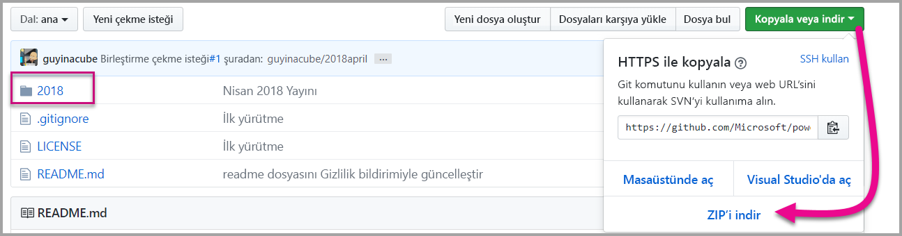

2. Power BI Desktop’ta örnek .pbix raporunu açın.

   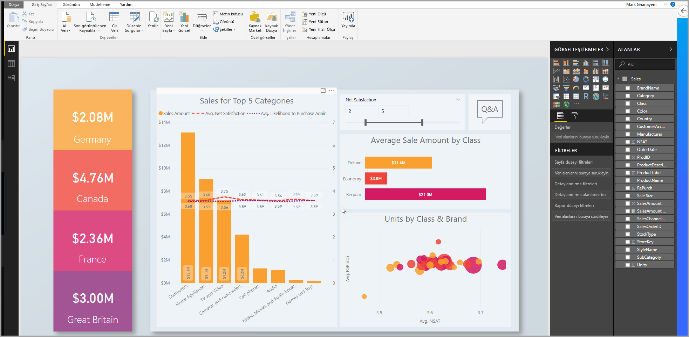

3. Uygulama çalışma alanında yayımlayın.

   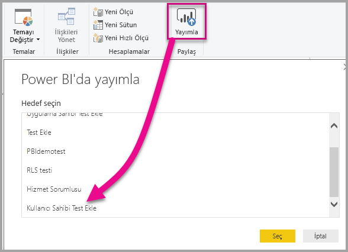

    Artık raporunuzu Power BI hizmetinde çevrimiçi görüntüleyebilirsiniz.

   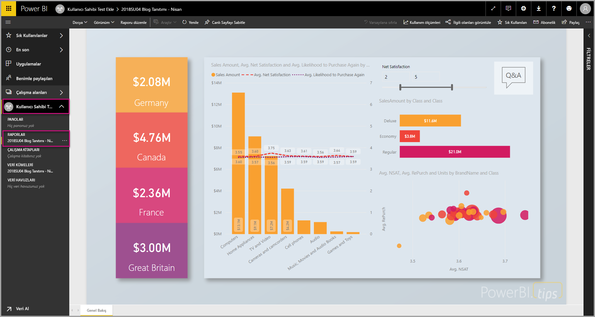

## <a name="embed-your-content-by-using-the-sample-application"></a>Örnek uygulamayı kullanarak içeriğinizi ekleme

Örnek uygulama kullanarak içeriğinizi eklemek için şu adımları izleyin:

1. Başlamak için GitHub’dan [Verilerin Sahibi Kullanıcıdır örneğini](https://github.com/Microsoft/PowerBI-Developer-Samples) indirin. Üç farklı örnek uygulama vardır: biri [raporlar](https://github.com/Microsoft/PowerBI-Developer-Samples/tree/master/User%20Owns%20Data/integrate-report-web-app) için, biri [panolar](https://github.com/Microsoft/PowerBI-Developer-Samples/tree/master/User%20Owns%20Data/integrate-dashboard-web-app) için ve biri de [kutucuklar](https://github.com/Microsoft/PowerBI-Developer-Samples/tree/master/User%20Owns%20Data/integrate-tile-web-app) içindir. Bu makalede, **raporlar** uygulamasına başvurulmaktadır.

    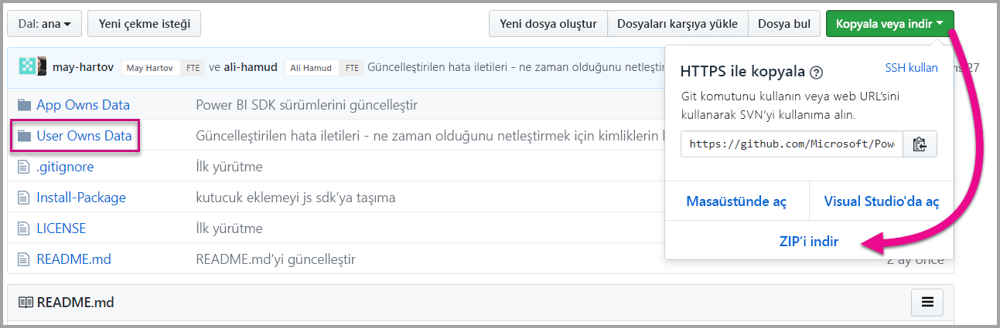

2. Örnek uygulamada **Cloud.config** dosyasını açın. Uygulamayı başarıyla çalıştırmak için doldurmanız gereken birkaç alan vardır: **ClientID** ve **ClientSecret**.

    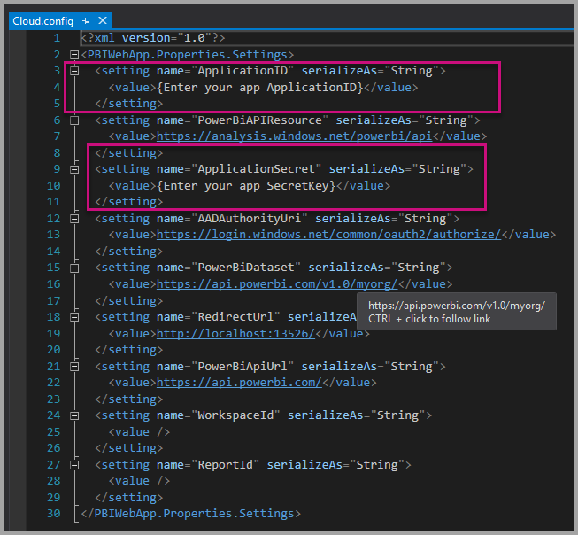

    **ClientID** bilgilerini Azure’daki **Uygulama Kimliği** ile doldurun. Uygulama, izin istediğiniz kullanıcılara kendini tanıtmak için **ClientID** değerini kullanır.

    **ClientID** değerini almak için aşağıdaki adımları izleyin:

    1. [Azure portalında](https://portal.azure.com) oturum açın.

        

    1. Sol gezinti bölmesinde **Tüm hizmetler**’i ve sonra **Uygulama kayıtları**’nı seçin.

        

    1. **ClientID** değerini kullanması gereken uygulamayı seçin.

        

    1. GUID olarak listelenen bir **Uygulama Kimliği** görmeniz gerekir. Bu **Uygulama Kimliği**’ni uygulamanın **ClientID** değeri olarak kullanın.

        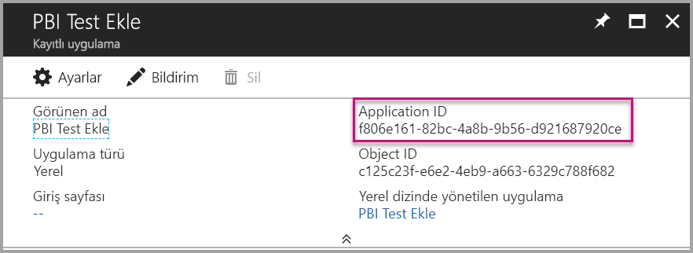

    1. **ClientSecret** alanına **Azure**'daki **Uygulama kayıtları** bölümünden alacağınız **Anahtarlar** bilgilerini girin.

    1. **ClientSecret** değerini almak için aşağıdaki adımları izleyin:

        1. [Azure portalında](https://portal.azure.com) oturum açın.

            

        1. Sol gezinti bölmesinde **Tüm hizmetler**’i ve sonra **Uygulama kayıtları**’nı seçin.

            

        1. **ClientSecret** değerini kullanması gereken uygulamayı seçin.

            

        1. **Ayarlar** seçeneğini belirleyin.

            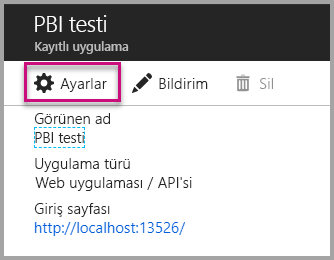

        1. **Anahtarlar**'ı seçin.

            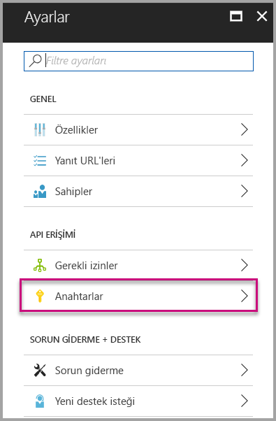

    1. **Açıklama** kutusuna bir ad girin ve bir süre seçin. Ardından **Kaydet**’i seçerek uygulamanız için **Değer**’i alın. Anahtar değerini kaydettikten sonra **Anahtarlar** bölmesini kapattığınızda değer alanı yalnızca gizlenmiş olarak gösterilir. Bu aşamada anahtar değerini alamazsınız. Anahtar değerini kaybederseniz Azure portalında yeni bir anahtar değeri oluşturun.

        

    1. **groupId** için, Power BI’daki uygulama çalışma alanı GUID’sini girin.

        

    1. **reportId** için, Power BI’daki rapor GUID’sini girin.

        

3. Uygulamayı çalıştırma:

    1. İlk olarak **Visual Studio**’da **Çalıştır**’ı seçin.

        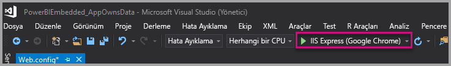

    1. Ardından **Rapor Al**'ı seçin.

        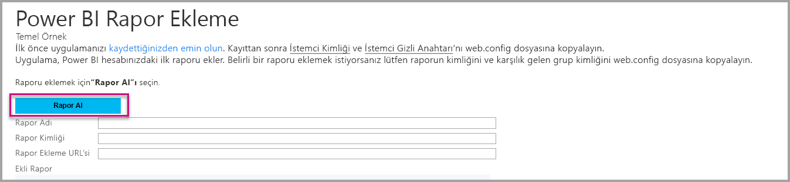

    1. Artık raporu örnek uygulamada görüntüleyebilirsiniz.

        

## <a name="embed-your-content-within-your-application"></a>İçeriğinizi uygulamanın içine ekleme

İçeriğinizi ekleme adımları [Power BI REST API’leri](https://docs.microsoft.com/rest/api/power-bi/) ile yapılabilse de, bu makalede açıklanan örnek kodlar .NET SDK ile hazırlanır.

Bir raporu web uygulamasıyla tümleştirmek için Power BI REST API’sini veya Power BI C# SDK’sını kullanırsınız. Rapor almak için Azure Active Directory yetkilendirme erişim belirteci de kullanırsınız. Daha sonra aynı erişim belirtecini kullanarak raporu yüklersiniz. Power BI Rest API’si, belirli Power BI kaynaklarına programlı erişim sağlar. Daha fazla bilgi için bkz. [Power BI REST API’leri](https://docs.microsoft.com/rest/api/power-bi/) ve [Power BI JavaScript API’si](https://github.com/Microsoft/PowerBI-JavaScript).

### <a name="get-an-access-token-from-azure-ad"></a>Azure AD'den erişim belirteci alma

Uygulamanızın içinden Power BI REST API’si çağrısı yapabilmek için önce Azure AD’den bir erişim belirteci almanız gerekir. Daha fazla bilgi için bkz. [Power BI uygulamanız için kullanıcıların kimliğini doğrulama ve Azure AD erişim belirteci alma](get-azuread-access-token.md).

### <a name="get-a-report"></a>Rapor alma

Bir Power BI raporu almak için, Power BI raporlarının listesini alan [Get Reports](https://docs.microsoft.com/rest/api/power-bi/reports/getreports) işlemini kullanırsınız. Rapor listesinden bir rapor kimliği alabilirsiniz.

### <a name="get-reports-by-using-an-access-token"></a>Erişim belirteci kullanarak rapor alma

[Get Reports](https://docs.microsoft.com/rest/api/power-bi/reports/getreports) işlemi rapor listesini döndürür. Rapor listesindeki raporlardan birini alabilirsiniz.

REST API çağrısını yapmak için *Taşıyıcı {erişim belirteci}* biçiminde *Yetkilendirme* üst bilgisi dahil etmeniz gerekir.

#### <a name="get-reports-with-the-rest-api"></a>REST API'si ile rapor alma

Aşağıdaki kod örneği, **REST API’si** ile nasıl rapor alınacağını göstermektedir:

> [!NOTE]  
> Eklemek istediğiniz bir içerik öğesini alma örneği, [örnek uygulama](#embed-your-content-using-the-sample-application) içindeki **Default.aspx.cs** dosyasında sağlanır. Rapor, pano veya kutucuk örnek olarak verilebilir.

```csharp
using Newtonsoft.Json;

//Get a Report. In this sample, you get the first Report.
protected void GetReport(int index)
{
    //Configure Reports request
    System.Net.WebRequest request = System.Net.WebRequest.Create(
        String.Format("{0}/Reports",
        baseUri)) as System.Net.HttpWebRequest;

    request.Method = "GET";
    request.ContentLength = 0;
    request.Headers.Add("Authorization", String.Format("Bearer {0}", accessToken.Value));

    //Get Reports response from request.GetResponse()
    using (var response = request.GetResponse() as System.Net.HttpWebResponse)
    {
        //Get reader from response stream
        using (var reader = new System.IO.StreamReader(response.GetResponseStream()))
        {
            //Deserialize JSON string
            PBIReports Reports = JsonConvert.DeserializeObject<PBIReports>(reader.ReadToEnd());

            //Sample assumes at least one Report.
            //You could write an app that lists all Reports
            if (Reports.value.Length > 0)
            {
                var report = Reports.value[index];

                txtEmbedUrl.Text = report.embedUrl;
                txtReportId.Text = report.id;
                txtReportName.Text = report.name;
            }
        }
    }
}

//Power BI Reports used to deserialize the Get Reports response.
public class PBIReports
{
    public PBIReport[] value { get; set; }
}
public class PBIReport
{
    public string id { get; set; }
    public string name { get; set; }
    public string webUrl { get; set; }
    public string embedUrl { get; set; }
}
```

#### <a name="get-reports-by-using-the-net-sdk"></a>.NET SDK kullanarak rapor alma

REST API'sini doğrudan çağırmak yerine .NET SDK kullanarak rapor listesi alabilirsiniz. Aşağıdaki kod örneği, raporların nasıl listeleneceğini göstermektedir:

```csharp
using Microsoft.IdentityModel.Clients.ActiveDirectory;
using Microsoft.PowerBI.Api.V2;
using Microsoft.PowerBI.Api.V2.Models;

var tokenCredentials = new TokenCredentials(<ACCESS TOKEN>, "Bearer");

// Create a Power BI Client object. It is used to call Power BI APIs.
using (var client = new PowerBIClient(new Uri(ApiUrl), tokenCredentials))
{
    // Get the first report all reports in that workspace
    ODataResponseListReport reports = client.Reports.GetReports();

    Report report = reports.Value.FirstOrDefault();

    var embedUrl = report.EmbedUrl;
}
```

### <a name="load-a-report-by-using-javascript"></a>JavaScript kullanarak rapor yükleme

JavaScript kullanarak web sayfanızdaki bir div öğesine rapor yükleyebilirsiniz. Aşağıdaki kod örneği, belirli bir çalışma alanından nasıl rapor alınacağını göstermektedir:

> [!NOTE]  
> Eklemek istediğiniz bir içerik öğesini yükleme örneği, [örnek uygulama](#embed-your-content-using-the-sample-application) içindeki **Default.aspx** dosyasında sağlanır. Rapor, pano veya kutucuk örnek olarak verilebilir.

```javascript
<!-- Embed Report-->
<div> 
    <asp:Panel ID="PanelEmbed" runat="server" Visible="true">
        <div>
            <div><b class="step">Step 3</b>: Embed a report</div>

            <div>Enter an embed url for a report from Step 2 (starts with https://):</div>
            <input type="text" id="tb_EmbedURL" style="width: 1024px;" />
            <br />
            <input type="button" id="bEmbedReportAction" value="Embed Report" />
        </div>

        <div id="reportContainer"></div>
    </asp:Panel>
</div>
```

#### <a name="sitemaster"></a>Site.master

```javascript
window.onload = function () {
    // client side click to embed a selected report.
    var el = document.getElementById("bEmbedReportAction");
    if (el.addEventListener) {
        el.addEventListener("click", updateEmbedReporte, false);
    } else {
        el.attachEvent('onclick', updateEmbedReport);
    }

    // handle server side post backs, optimize for reload scenarios
    // show embedded report if all fields were filled in.
    var accessTokenElement = document.getElementById('MainContent_accessTokenTextbox');
    if (accessTokenElement !== null) {
        var accessToken = accessTokenElement.value;
        if (accessToken !== "")
            updateEmbedReport();
    }
};

// update embed report
function updateEmbedReport() {

    // check if the embed url was selected
    var embedUrl = document.getElementById('tb_EmbedURL').value;
    if (embedUrl === "")
        return;

    // get the access token.
    accessToken = document.getElementById('MainContent_accessTokenTextbox').value;

    // Embed configuration used to describe the what and how to embed.
    // This object is used when calling powerbi.embed.
    // You can find more information at https://github.com/Microsoft/PowerBI-JavaScript/wiki/Embed-Configuration-Details.
    var config = {
        type: 'report',
        accessToken: accessToken,
        embedUrl: embedUrl
    };

    // Grab the reference to the div HTML element that will host the report.
    var reportContainer = document.getElementById('reportContainer');

    // Embed the report and display it within the div container.
    var report = powerbi.embed(reportContainer, config);

    // report.on will add an event handler which prints to Log window.
    report.on("error", function (event) {
        var logView = document.getElementById('logView');
        logView.innerHTML = logView.innerHTML + "Error<br/>";
        logView.innerHTML = logView.innerHTML + JSON.stringify(event.detail, null, "  ") + "<br/>";
        logView.innerHTML = logView.innerHTML + "---------<br/>";
    }
  );
}
```

## <a name="using-a-power-bi-premium-dedicated-capacity"></a>Power BI Premium adanmış kapasitesini kullanma

Uygulamanızın geliştirme aşamasını tamamladığınıza göre şimdi adanmış kapasite ile uygulamanızın çalışma alanını destekleme işlemine geçmelisiniz.

### <a name="create-a-dedicated-capacity"></a>Adanmış kapasite oluşturma

Adanmış kapasite oluşturduğunuzda, uygulama çalışma alanınızdaki içerik için özel olarak ayrılmış bir kaynaktan yararlanabilirsiniz. [Power BI Premium](../service-premium.md)’u kullanarak adanmış kapasite oluşturabilirsiniz.

Aşağıdaki tabloda, [Microsoft Office 365](../service-admin-premium-purchase.md)'te kullanılabilir olan Power BI Premium SKU’ları listelenmektedir:

| Kapasite düğümü | Toplam sanal çekirdek<br/>(arka uç + ön uç) | Arka uç sanal çekirdekleri | Ön uç sanal çekirdekleri | DirectQuery/canlı bağlantı sınırları | Yoğun saatlerde işlenen maksimum sayfa sayısı |
| --- | --- | --- | --- | --- | --- |
| EM1 |1 sanal çekirdek |0,5 sanal çekirdek, 10 GB RAM |0,5 sanal çekirdek |Saniyede 3,75 |150-300 |
| EM2 |2 sanal çekirdek |1 sanal çekirdek, 10 GB RAM |1 sanal çekirdek |Saniyede 7,5 |301-600 |
| EM3 |4 sanal çekirdek |2 sanal çekirdek, 10 GB RAM |2 sanal çekirdek |saniyede 15 |601-1200 |
| P1 |8 sanal çekirdek |4 sanal çekirdek, 25 GB RAM |4 sanal çekirdek |saniyede 30 |1201-2400 |
| P2 |16 sanal çekirdek |8 sanal çekirdek, 50 GB RAM |8 sanal çekirdek |saniyede 60 |2401-4800 |
| P3 |32 sanal çekirdek |16 sanal çekirdek, 100 GB RAM |16 sanal çekirdek |saniyede 120 |4801-9600 |
| P4 |64 sanal çekirdek |32 sanal çekirdek, 200 GB RAM |32 sanal çekirdek |saniyede 240 |9601-19.200 |
| P5 |128 sanal çekirdek |64 sanal çekirdek, 400 GB RAM |64 sanal çekirdek |saniyede 480 |19.201-38.400 |

> [!NOTE]
> - Microsoft Office uygulamaları ile ekleme işlemi yapmaya çalışırken, ücretsiz bir Power BI lisansıyla içeriğe erişmek için EM SKU’larını kullanabilirsiniz. Ancak Powerbi.com veya Power BI mobil kullanırken ücretsiz bir Power BI lisansı ile içeriğe erişemezsiniz.
> - Powerbi.com veya Power BI mobil kullanarak Microsoft Office uygulamaları ile ekleme işlemi yapmaya çalışırken, ücretsiz Power BI lisansı ile içeriğe erişebilirsiniz.

### <a name="assign-an-app-workspace-to-a-dedicated-capacity"></a>Adanmış kapasiteye uygulama çalışma alanı atama

Adanmış kapasite oluşturduktan sonra, uygulama çalışma alanınızı bu adanmış kapasiteye atayabilirsiniz. Bu işlemi tamamlamak için şu adımları uygulayın:

1. Power BI hizmetinde, çalışma alanlarını genişletin ve içeriğinizi eklemek için kullandığınız çalışma alanının üç noktasını seçin. Ardından **Çalışma alanlarını düzenle**’yi seçin.

    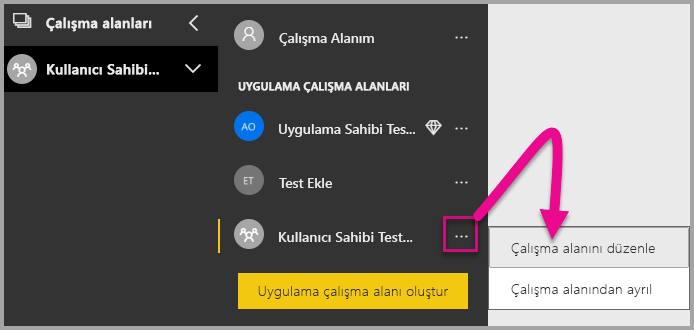

2. **Gelişmiş**’i genişletin ve **Adanmış kapasite**’yi etkinleştirin. Oluşturduğunuz adanmış kapasiteyi seçin. Sonra **Kaydet**'i seçin.

    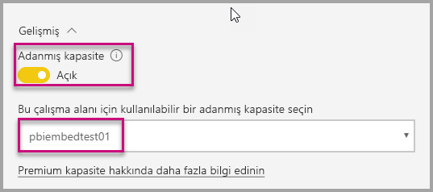

3. **Kaydet**’i seçtikten sonra, uygulama çalışma alanının yanında bir baklava işareti görmeniz gerekir.

    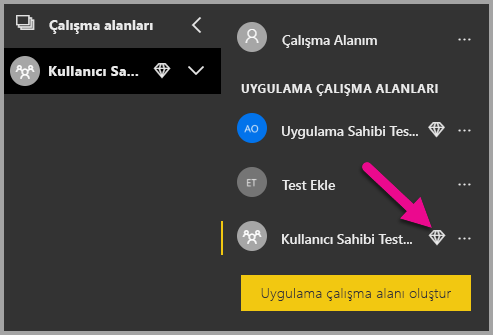

## <a name="admin-settings"></a>Yönetici ayarları

Genel yöneticiler veya Power BI hizmeti yöneticileri, bir kiracı için REST API’lerini kullanma seçeneğini etkinleştirebilir veya devre dışı bırakabilir. Power BI yöneticileri, kuruluşun tamamı veya yalnızca belirli güvenlik grupları için bu ayarı yapabilir. Varsayılan olarak kuruluşun tamamı için etkindir. [Power BI yönetici portalında](../service-admin-portal.md) bu değişiklikleri yapabilirsiniz.

## <a name="next-steps"></a>Sonraki adımlar

Bu öğreticide, Power BI kuruluş hesabınızı kullanarak bir uygulamaya Power BI içeriği eklemeyi öğrendiniz. Şimdi uygulamaları kullanarak bir uygulamaya Power BI içeriği eklemeyi deneyebilirsiniz. Müşterileriniz için de Power BI içeriği ekleme denemeleri yapabilirsiniz:

> [!div class="nextstepaction"]
> [Uygulamalardan ekleme](embed-from-apps.md)

> [!div class="nextstepaction"]
>[Müşterileriniz için ekleme](embed-sample-for-customers.md)

Başka sorularınız varsa [Power BI Topluluğu’na sormayı deneyin](http://community.powerbi.com/).
