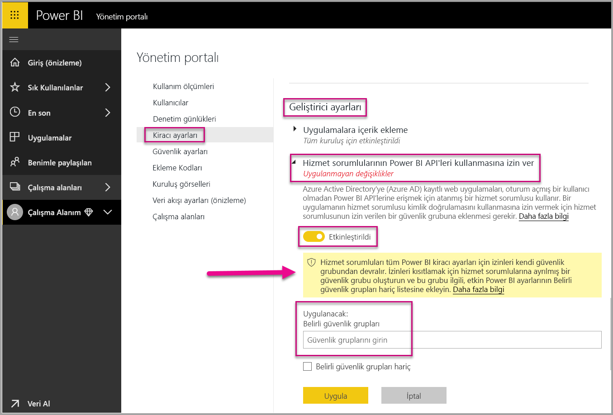
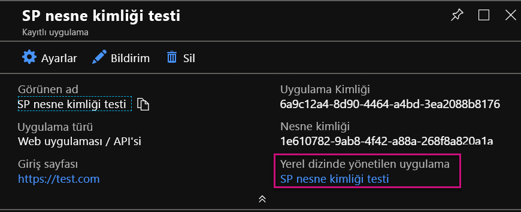
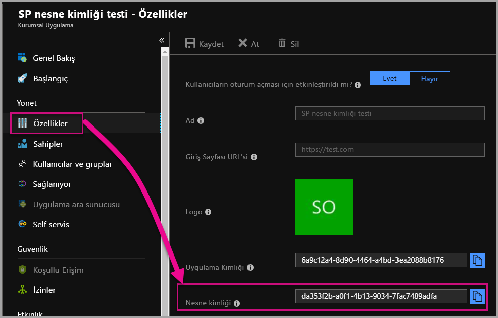

# <a name="service-principal-with-power-bi-preview"></a>Power BI ile hizmet sorumlusu (Önizleme)

**Hizmet sorumlusu** ile Power BI içeriğini bir uygulamaya ekleyebilir ve **yalnızca uygulama** belirteci ile Power BI'da otomasyonu kullanabilirsiniz. Hizmet sorumlusu **Power BI Embedded** kullanırken veya **Power BI görevlerini ve işlemlerini otomatikleştirirken** yararlıdır.

Power BI Embedded ile çalışırken hizmet sorumlusu kullanmanın bazı avantajları vardır. Önemli avantajlarından biri, uygulamanızda kimlik doğrulaması yapmak için bir ana hesaba (yalnızca oturum açmak için bir kullanıcı adı ve parola olan Power BI Pro lisansı) gerek duymamanızdır. Hizmet sorumlusu uygulamanın kimliğini doğrulamak için bir uygulama kimliği ve uygulama gizli dizisi kullanır.

Power BI görevlerini otomatikleştirmeye çalışırken hizmet sorumlularını her ölçekte işlemek ve yönetmek için de betik yazabilirsiniz.

## <a name="application-and-service-principal-relationship"></a>Uygulama ve hizmet sorumlusu ilişkisi

Azure AD kiracısının güvenliğini sağlayan kaynaklara erişmek için erişim gerektiren varlık bir güvenlik sorumlusunu temsil eder. Bu eylem hem kullanıcılar (kullanıcı sorumlusu) hem de uygulamalar (hizmet sorumlusu) için geçerlidir.

Güvenlik sorumlusu Azure AD kiracısındaki kullanıcılar ve uygulamalar için erişim ilkesini ve izinleri tanımlar. Bu erişim ilkesi oturum açarken kullanıcı ve uygulamaların kimliğini doğrulama ve kaynak erişimi sırasında yetkilendirme gibi temel özellikleri etkinleştirir. Daha fazla bilgi için [Azure Active Directory’de (AAD) Uygulama ve hizmet sorumlusu](https://docs.microsoft.com/azure/active-directory/develop/app-objects-and-service-principals) bölümüne bakın.

Azure portalında bir Azure AD uygulamasını kaydettiğinizde Azure AD kiracınızda iki nesne oluşturulur:

* [Uygulama nesnesi](https://docs.microsoft.com/azure/active-directory/develop/app-objects-and-service-principals#application-object)
* [Hizmet sorumlusu nesnesi](https://docs.microsoft.com/azure/active-directory/develop/app-objects-and-service-principals#service-principal-object)

Uygulama nesnesini uygulamanızın tüm kiracılar arasında kullanılan *genel* gösterimi olarak ve hizmet sorumlusu nesnesini uygulamanızın belirli kiracılarda kullanılan *yerel* gösterimi olarak düşünün.

Uygulama nesnesi, buna karşılık gelen hizmet sorumlusu nesnelerini oluştururken kullanılmak üzere ortak ve varsayılan özelliklerin *türetildiği* şablon görevi görür.

Uygulamanın kullanıldığı her kiracı için bir hizmet sorumlusu gereklidir. Bu uygulamanın oturum açıp kiracı tarafından korunan kaynaklara erişebilmesi için bir kimlik oluşturmasını sağlar. Tek kiracı uygulamasının (ana kiracısında) uygulama kaydı sırasında kullanılmak için oluşturulan ve onaylanan tek bir hizmet sorumlusu vardır.

## <a name="service-principal-with-power-bi-embedded"></a>Power BI Embedded ile hizmet sorumlusu

Hizmet sorumlusuyla, bir uygulama kimliği ve uygulama gizli dizisi kullanarak ana hesabınızın bilgilerini uygulamanızda maskeleyebilirsiniz. Kimliğini doğrulamak için artık uygulamanıza bir ana hesabı sabit kodlamanız gerekmez.

**Power BI API’leri** ve **Power BI .NET SDK’sı** artık hizmet sorumlusunu kullanan çağrıları desteklediği için hizmet sorumlusuyla [Power BI REST API’lerini](https://docs.microsoft.com/rest/api/power-bi/) kullanabilirsiniz. Örneğin çalışma alanı oluşturma, çalışma alanlarına kullanıcı ekleme, çalışma alanlarından kullanıcı kaldırma ve çalışma alanlarına içerik aktarma gibi çalışma alanı değişiklikleri yapabilirsiniz.

Hizmet sorumlusunu yalnızca Power BI yapıtlarınız ve kaynaklarınız [yeni Power BI çalışma alanında](../service-create-the-new-workspaces.md) depolanıyorsa kullanabilirsiniz.

## <a name="service-principal-vs-master-account"></a>Hizmet sorumlusu ve ana hesap

Kimlik doğrulaması için bir hizmet sorumlusu kullanmakla standart ana hesap (Power BI Pro lisansı) kullanmanın farkları vardır. Aşağıdaki tablo bazı önemli farkları vurgular.

| Çağır | Ana Kullanıcı Hesabı <br> (Power BI Pro lisansı) | Hizmet Sorumlusu <br> (yalnızca uygulama belirteci) |
|------------------------------------------------------|---------------------|-------------------|
| Power BI hizmetinde oturum açabilir  | Evet | Hayır |
| Power BI Yönetim portalında etkindir | Hayır | Evet |
| [Uygulama çalışma alanlarıyla çalışır (v1)](../service-create-workspaces.md) | Evet | Hayır |
| [Yeni uygulama çalışma alanlarıyla çalışır (v2)](../service-create-the-new-workspaces.md) | Evet | Evet |
| Power BI Embedded ile kullanıldığında çalışma alanı yöneticisi olması gerekir | Evet | Evet |
| Power BI REST API’lerini kullanabilir | Evet | Evet |
| Oluşturulması için genel yönetici gerekir | Evet | Hayır |
| Şirket içi veri ağ geçidini yükleyebilir ve yönetebilir | Evet | Hayır |

## <a name="get-started-with-a-service-principal"></a>Hizmet sorumlusuyla çalışmaya başlama

Ana hesabın geleneksel kullanımından farklı olarak hizmet sorumlusu (yalnızca uygulama belirteci) kullanmak için birkaç farklı parçanın ayarlanması gerekir. Hizmet sorumlusuyla (yalnızca uygulama belirteci) çalışmaya başlamak için doğru ortamı ayarlamanız gerekir.

1. Azure Active Directory’de (AAD) Power BI ile kullanılacak [bir sunucu tarafı web uygulaması kaydedin.](register-app.md) Uygulamayı kaydettikten sonra uygulama kimliği, uygulama gizli dizisi ve hizmet sorumlusu nesne kimliği elde ederek Power BI içeriğinize erişebilirsiniz. [PowerShell](https://docs.microsoft.com/powershell/azure/create-azure-service-principal-azureps?view=azps-1.1.0) ile bir hizmet sorumlusu oluşturabilirsiniz.

    Yeni bir Azure Active Directory uygulaması oluşturmak için örnek betik aşağıda verilmiştir.

    ```powershell
    # The app id - $app.appid
    # The service principal object id - $sp.objectId
    # The app key - $key.value

    # Sign in as a user that is allowed to create an app.
    Connect-AzureAD

    # Create a new AAD web application
    $app = New-AzureADApplication -DisplayName "testApp1" -Homepage "https://localhost:44322" -ReplyUrls "https://localhost:44322"

    # Creates a service principal
    $sp = New-AzureADServicePrincipal -AppId $app.AppId

    # Get the service principal key.
    $key = New-AzureADServicePrincipalPasswordCredential -ObjectId $sp.ObjectId
    ```

   > [!Important]
   > Hizmet sorumlusunun Power BI ile kullanımını etkinleştirdikten sonra, uygulamanın AD izinleri artık geçerli olmaz. Bundan sonra uygulamanın izinleri Power BI yönetim portalı üzerinden yönetilir.

2. [Azure Active Directory’de (AAD) bir güvenlik grubu oluşturun](https://docs.microsoft.com/azure/active-directory/fundamentals/active-directory-groups-create-azure-portal) ve oluşturduğunuz uygulamayı bu güvenlik grubuna ekleyin. [PowerShell](https://docs.microsoft.com/powershell/azure/create-azure-service-principal-azureps?view=azps-1.1.0) ile bir AAD güvenlik grubu oluşturabilirsiniz.

    Güvenlik grubu oluşturmak ve bu güvenlik grubuna uygulama eklemek için örnek betik aşağıda verilmiştir.

    ```powershell
    # Required to sign in as a tenant admin
    Connect-AzureAD

    # Create an AAD security group
    $group = New-AzureADGroup -DisplayName <Group display name> -SecurityEnabled $true -MailEnabled $false -MailNickName notSet

    # Add the service principal to the group
    Add-AzureADGroupMember -ObjectId $($group.ObjectId) -RefObjectId $($sp.ObjectId)
    ```

3. Power BI Yöneticisi olarak hizmet sorumlusunu Power BI yönetim portalının **Geliştirici ayarları**'nda etkinleştirmeniz gerekir. Azure AD'de oluşturduğunuz güvenlik grubunu **Geliştirici ayarları**'nın **Belirli bir güvenlik grubu** bölümüne ekleyin.

   > [!Important]
   > Hizmet sorumluları tüm Power BI kiracı ayarları için izinleri kendi güvenlik grubundan devralır. İzinleri kısıtlamak için hizmet sorumlularına ayrılmış bir güvenlik grubu oluşturun ve bu grubu ilgili, etkin Power BI ayarlarının 'Belirli güvenlik grupları hariç' listesine ekleyin.

    

4. [Power BI ortamınızı](embed-sample-for-customers.md#set-up-your-power-bi-environment) ayarlayın.

5. Hizmet sorumlusunu oluşturduğunuz yeni çalışma alanına **yönetici** olarak ekleyin. Bu görevi [API’ler](https://docs.microsoft.com/rest/api/power-bi/groups/addgroupuser) aracılığıyla veya Power BI hizmetiyle yönetebilirsiniz.

6. Şimdi içeriğinizi örnek bir uygulamanın veya kendi uygulamanızın içine eklemeyi seçin.

    * [Örnek uygulamayı kullanarak içeriği ekleme](embed-sample-for-customers.md#embed-content-using-the-sample-application)
    * [İçeriği uygulamanızın içine ekleme](embed-sample-for-customers.md#embed-content-within-your-application)

7. Artık [üretime geçmeye](embed-sample-for-customers.md#move-to-production) hazırsınız.

## <a name="migrate-to-service-principal"></a>Hizmet sorumlusuna geçme

Şu anda Power BI veya Power BI Embedded ile bir ana hesap kullanıyorsanız hizmet sorumlusu kullanmaya geçebilirsiniz.

[Hizmet sorumlusuyla çalışmaya başlama](#get-started-with-a-service-principal) bölümündeki ilk üç adımı tamamlandıktan sonra aşağıdaki bilgileri izleyin.

Power BI’da zaten [yeni çalışma alanlarını](../service-create-the-new-workspaces.md) kullanıyorsanız Power BI yapıtlarınızla hizmet sorumlusunu çalışma alanlarına **yönetici** olarak ekleyin. Öte yandan, [geleneksel çalışma alanlarını](../service-create-workspaces.md) kullanıyorsanız Power BI yapıtlarınızı yeni çalışma alanına kopyalayın veya taşıyın ve ardından hizmet sorumlusunu bu çalışma alanlarına **yönetici** olarak ekleyin.

Power BI yapıtlarını ve kaynaklarını bir çalışma alanından diğerine taşımak için kullanıcı arabirimi özelliği yoktur; dolayısıyla bu görevi gerçekleştirmek için [API’leri](https://powerbi.microsoft.com/pt-br/blog/duplicate-workspaces-using-the-power-bi-rest-apis-a-step-by-step-tutorial/) kullanmanız gerekir. Hizmet sorumlusuyla API’leri kullanırken hizmet sorumlusu nesne kimliği gerekir.

### <a name="how-to-get-the-service-principal-object-id"></a>Hizmet sorumlusu nesne kimliğini alma

Yeni uygulama çalışma alanına bir hizmet sorumlusu atamak için [Power BI REST API’lerini](https://docs.microsoft.com/rest/api/power-bi/groups/addgroupuser) kullanırsınız. İşlemlerde hizmet sorumlusuna başvurmak veya değişiklikler yapmak için (örneğin, hizmet sorumlusunu çalışma alanına yönetici olarak uygulama) **hizmet sorumlusu nesne kimliğini** kullanırsınız.

Azure portalından hizmet sorumlusu nesne kimliğini alma adımları aşağıda verilmiştir.

1. Azure portalında yeni Uygulama kaydı oluşturun.  

2. Ardından **Yerel dizinde yönetilen uygulama** alanının altında, oluşturduğunuz uygulamanın adını seçin.

   

    > [!Note]
    > Yukarıdaki resimde yer alan nesne kimliği hizmet sorumlusu ile kullanılan kimlik değildir.

3. Nesne Kimliğini görmek için **Özellikler**’i seçin.

    

PowerShell ile hizmet sorumlusu nesne kimliğini almak için örnek betik aşağıda verilmiştir.

   ```powershell
   Get-AzureADServicePrincipal -Filter "DisplayName eq '<application name>'"
   ```

## <a name="considerations-and-limitations"></a>Önemli noktalar ve sınırlamalar

* Hizmet sorumlusu yalnızca [yeni uygulama çalışma alanlarıyla](../service-create-the-new-workspaces.md) çalışır.
* Hizmet sorumlusu kullanırken **Çalışma Alanım** desteklenmez.
* Üretime geçmek için Ayrılmış Premium kapasite gerekir.
* Hizmet sorumlusunu kullanarak Power BI portalında oturum açamazsınız.
* Power BI yönetim portalındaki geliştirici ayarlarında hizmet sorumlusunu etkinleştirmek için Power BI yönetici hakları gereklidir.
* Hizmet sorumlusunu kullanarak şirket içi veri ağ geçidini yükleyemez veya yönetemezsiniz.
* [Kuruluşunuz için eklenen](embed-sample-for-your-organization.md) uygulamalar hizmet sorumlusunu kullanamaz.
* [Veri akışları](../service-dataflows-overview.md) yönetimi desteklenmez.

## <a name="next-steps"></a>Sonraki adımlar

* [Uygulamayı kaydetme](register-app.md)
* [Müşterileriniz için Power BI Embedded](embed-sample-for-customers.md)
* [Azure Active Directory'deki uygulama ve hizmet sorumlusu nesneleri](https://docs.microsoft.com/azure/active-directory/develop/app-objects-and-service-principals)
