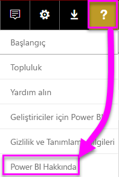
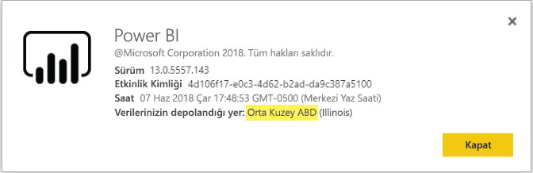

# <a name="frequently-asked-questions-about-power-bi-embedded"></a>Power BI Embedded hakkında sık sorulan sorular

* Başka sorularınız varsa [Power BI Topluluğu'na sorun](http://community.powerbi.com/).
* Sorununuz hâlâ çözülmedi mi? [Power BI destek sayfasını](https://powerbi.microsoft.com/support/) ziyaret edin.

## <a name="general"></a>Genel

### <a name="what-is-power-bi-embedded"></a>Power BI Embedded nedir?

[Microsoft Power BI Embedded (PBIE)](azure-pbie-what-is-power-bi-embedded.md) uygulama geliştiricilerin, kendi veri görselleştirmelerini ve denetimlerini sıfırdan oluşturmak zorunda kalmadan uygulamalarına nefes kesen, tam etkileşimli raporlar ekleyebilmelerini sağlar.

### <a name="who-is-the-target-audience-for-power-bi-embedded"></a>Power BI Embedded kimler içindir?

Uygulamaların kodunu oluşturan ve bağımsız yazılım satıcıları (ISV) olarak da bilinen yazılım şirketleri ve geliştiriciler içindir.

### <a name="how-is-power-bi-embedded-different-from-power-bi-the-service"></a>Power BI Embedded hangi açıdan Power BI hizmetinden farklıdır?

Power BI, kuruluşlara en kritik iş verilerini tek bir görünümde sunan hizmet olarak yazılım analiz çözümüdür.

Microsoft, Power BI Embedded'i müşterilerinin analitik kararlar almasına yardımcı olmak için uygulamalarına görseller eklemek isteyen ISV'lere yönelik geliştirmiştir. Bu sayede ISV'ler kendi analiz çözümlerini kendileri oluşturmak zorunda kalmaz. [Tümleşik analiz](embedding.md), iş kullanıcılarının iş verilerine erişebilmesini ve uygulama içerisinde içgörüler oluşturmak için bu veriler üzere sorgu yürütebilmesini sağlar.


### <a name="what-is-the-difference-between-power-bi-premium-and-power-bi-embedded"></a>Power BI Premium ve Power BI Embedded arasındaki fark nedir?

Power BI Premium, kuruluşu, iş ortaklarını, müşterilerini ve sağlayıcılarını tek bir görünümde sunan eksiksiz bir İş Zekası çözümü isteyen kuruluşlar için kapasiteye göre tasarlanmıştır. Power BI Premium kuruluşların karar almasına yardımcı olur. Power BI Premium mobil uygulamalar ve şirket içinde geliştirilen uygulamalar aracılığıyla veya Power BI portalında içerik tüketmesine olanak tanıyan bir SaaS ürünüdür.

Power BI Embedded uygulamalarına görsel eklemek isteyen ISV'lere yöneliktir. Power BI Embedded, uygulama geliştiricilerine yönelik olduğundan ve kuruluş içindekiler veya dışındakiler dahil olmak üzere tüm uygulama kullanıcıları Power BI Embedded kapsamında depolanan içerikleri kullanabildiğinden Power BI Embedded müşterilerinizin karar almasına yardımcı olur. Power BI Embedded kapasitesi içeriğini, tek tıklamayla Web'de veya SharePoint'te yayımlama özelliğiyle paylaşamazsınız.

### <a name="what-is-the-microsoft-recommendation-for-when-a-customer-should-buy-power-bi-premium-vs-power-bi-embedded"></a>Microsoft bir müşterinin hangi durumlarda Power BI Premium ve hangi durumlarda Power BI Embedded satın almasını önerir?

Microsoft kuruluşların bir kurumsal sınıf self servis bulut BI çözümü olan Power BI Premium'u satın almasını önerir. ISV'lerin bulut destekli tümleşik analiz bileşenleri için Power BI Embedded satın almasını öneririz. Öte yandan müşteriye hangi ürünü satın alacağı konusunda hiçbir kısıtlama uygulanmaz.

Bir ISV (tipik olarak büyük), kuruluşunda uygulamaya eklemenin yanı sıra önceden paketlenmiş Power BI hizmetinin ek avantajlarından da yararlanmak üzere P SKU kullanmak isteyebilir. Bazı Kuruluşlar, yalnızca iş uygulamaları oluşturmak ve bunlara analiz eklemek istediklerinde ve önceden paketlenmiş Power BI hizmetini kullanmak istemediklerinde Azure'da A SKU kullanabilir.

### <a name="how-many-embed-tokens-can-i-create"></a>Kaç tane ekleme belirteci oluşturabilirim?

PRO lisansına sahip ekleme belirteçleri geliştirme testlerine yöneliktir. Bu nedenle, bir Power BI ana hesabı veya [hizmet sorumlusu](embed-service-principal.md) sınırlı sayıda belirteç oluşturabilir. Üretim ortamında ekleme yapmak için [kapasite satın alın](#technical). Kapasiteyi satın aldıktan sonra, oluşturabileceğiniz ekleme belirteçlerinin sayısıyla ilgili bir sınır yoktur. Geçerli eklenmiş kullanımı yüzde cinsinden gösteren kullanım değerini denetlemek için [Kullanılabilir Özellikler](https://docs.microsoft.com/rest/api/power-bi/availablefeatures) bölümüne gidin.

## <a name="technical"></a>Teknik

### <a name="what-is-the-difference-between-the-a-skus-in-azure-and-the-em-skus-in-office-365"></a>Azure’da A SKU ile Office 365’te EM SKU arasındaki fark nedir?

PowerBI.com sosyal işbirliği ve e-posta aboneliği gibi daha birçok özelliği olan kurumsal bir Hizmet olarak Yazılım (SaaS) çözümüdür. PowerBI.com, ISV'lerin tümleşik analiz çözümü içeriklerini ve kiracı düzeyi ayarlarını yönetmesine yardımcı olur.

Power BI Embedded geliştiricilerin tümleşik analiz çözümü oluşturmak için kullanabileceği bir Hizmet olarak Platform (PaaS) API kümesidir.

Aşağıda özellik farklarının kısmi bir listesini bulabilirsiniz.

| Öne çıkan özelliği | Power BI Embedded | Power BI Premium Kapasitesi | Power BI Premium Kapasitesi |
|----------------------------------------------------------------------------------|-------------------|---------------------------|---------------------------|
|   | A SKU'ları-Azure kapasitesi | EM SKU'ları-O365 kapasitesi | P SKU'ları-O365 kapasitesi |
| Power BI Uygulaması çalışma alanından yapıtları ekleme | Evet | Evet | Evet |
| Katıştırılmış uygulamada Power BI raporlarını kullanma - SaaS | Hayır | Evet | Evet |
| Katıştırılmış uygulamada Power BI raporlarını kullanma - PaaS | Evet | Evet | Evet |
| Power BI raporlarını SharePoint'te kullanma | Hayır | Evet | Evet |
| Power BI raporlarını Dynamics'te kullanma | Hayır | Evet | Evet |
| Power BI raporlarını Teams'de kullanma (mobil uygulama hariç) | Hayır | Evet | Evet |
| ÜCRETSİZ Power BI lisansıyla içeriklere Powerbi.com ve Power BI mobilden erişme | Hayır | Hayır | Evet |
| MS Office uygulamalarına eklenmiş ÜCRETSİZ Power BI lisansıyla içeriklere erişme | Hayır | Evet | Evet |

### <a name="power-bi-now-offers-three-skus-for-embedding-a-skus-em-skus-and-p-skus-which-one-should-i-purchase-for-my-scenario"></a>Power BI artık ekleme için üç SKU sunar: A SKU, EM SKU ve P SKU. Benim durumumda hangisini satın almalıyım?

|  |A SKU (Power BI Embedded)  |EM SKU (Power BI Premium)  |P SKU (Power BI Premium)  |
|---------|---------|---------|---------|
|Satın alma  |Azure portalı |Office |Office |
|Kullanım örnekleri | Kendi uygulamanıza içerik ekleme | <li> Kendi uygulamanıza içerik ekleme <br><br><br> <li> MS Office uygulamalarına içerik ekleme: <br> - [SharePoint](https://powerbi.microsoft.com/blog/integrate-power-bi-reports-in-sharepoint-online/) <br> - [Teams (mobil uygulama hariç)](https://powerbi.microsoft.com/blog/power-bi-teams-up-with-microsoft-teams/) <br> - [Dynamics 365](https://docs.microsoft.com/dynamics365/customer-engagement/basics/add-edit-power-bi-visualizations-dashboard) | <li> Kendi uygulamanıza içerik ekleme <br><br><br> <li> MS Office uygulamalarına içerik ekleme: <br> - [SharePoint](https://powerbi.microsoft.com/blog/integrate-power-bi-reports-in-sharepoint-online/) <br> - [Teams (mobil uygulama hariç)](https://powerbi.microsoft.com/blog/power-bi-teams-up-with-microsoft-teams/) <br> - [Dynamics 365](https://docs.microsoft.com/dynamics365/customer-engagement/basics/add-edit-power-bi-visualizations-dashboard) <br><br><br> <li> [Power BI hizmeti](https://powerbi.microsoft.com/) aracılığıyla Power BI kullanıcılarıyla içerik paylaşma  |
|Faturalama |Saatlik |Aylık |Aylık |
|Taahhüt  |Taahhütsüz |Yıllık  |Aylık/Yıllık |
|Ayrım |Tam esneklik; Azure portalında veya API'ler ile kaynaklar duraklatılabilir/sürdürülebilir, ölçek artırılabilir/azaltılabilir  |SharePoint Online ve Microsoft Teams'de içerik eklemek için kullanabilirsiniz (mobil uygulama hariç) |Uygulamalarda katıştırma birleştirilebilir ve Power BI Hizmeti aynı kapasitede kullanılabilir |

### <a name="what-are-the-prerequisites-to-create-a-pbie-capacity-in-azure"></a>Azure’da PBIE kapasitesi oluşturmanın önkoşulları nelerdir?

* Kuruluş dizininizde oturum açın (Microsoft hesapları desteklenmez).
* Power BI kiracısına sahip olmanız gerekir; diğer bir deyişle, dizininizde en az bir kullanıcının Power BI’a kaydolmuş olması gerekir. 
* Kuruluş dizininizde bir Azure aboneliğinizin olması gerekir.

### <a name="how-can-i-monitor-power-bi-embedded-capacity-consumption"></a>Power BI Embedded kapasite tüketimini nasıl izleyebilirim?

* [Power BI Yönetim portalını](../service-admin-portal.md#power-bi-embedded) kullanarak.

* Power BI’daki [ölçüm uygulamasını](https://docs.microsoft.com/power-bi/service-admin-premium-monitor-capacity) indirerek.

* [Azure tanılama günlüğüne kaydetmeyi](azure-pbie-diag-logs.md) kullanarak.

### <a name="can-my-capacity-scale-automatically-to-adjust-to-my-app-consumption"></a>Kapasitem, uygulama tüketimime göre otomatik olarak ölçeklendirme sağlayabilir mi?

Şu anda otomatik ölçeklendirme olanağı olmasa da tüm API'leri kullanarak dilediğiniz zaman ölçeklendirme yapabilirsiniz.

### <a name="why-creatingscalingresuming-a-capacity-results-in-putting-the-capacity-into-a-suspended-state"></a>Kapasite oluşturma/ölçeklendirme/serbest bırakma işlemi neden kapasitenin askıya alınma durumuna geçmesine neden oluyor?

Kapasite sağlama (ölçeklendirme/serbert bırakma/oluşturma) işlemi başarısız olabilir. Kapasitenin ProvisioningState değerini denetlemek için Ayrıntıları Alma API'sini kullanabilirsiniz: [Kapasiteler - Ayrıntıları Alma](https://docs.microsoft.com/rest/api/power-bi-embedded/capacities/getdetails).

### <a name="can-i-only-create-power-bi-embedded-capacities-in-a-specific-region"></a>Yalnızca belirli bir bölgede mi Power BI Embedded kapasiteleri oluşturabilirim?

[Çoklu coğrafya (Önizleme)](embedded-multi-geo.md) özelliği ile, Power BI ana kiracı konumunuzdan farklı bir bölgede [Power BI Embedded kapasitesi](azure-pbie-create-capacity.md) satın alabilirsiniz

### <a name="why-cant-i-see-a-workspace-although-i-have-permissions"></a>İzinlerim olduğu halde bir çalışma alanını neden göremiyorum?

Kullanıcıya çalışma alanı, uygulama veya yapıt üzerinde izinler verildiğinde, API çağrıları üzerinden hemen kullanılabilir olmayabilir.
Sonuçta 'GET' API yanıtında bir yapıt eksik olabilir veya yapıtı kullanmaya çalışıldığında hata alınabilir.
Kullanıcı [refreshUserPermissions API'sini](https://docs.microsoft.com/rest/api/power-bi/users/refreshuserpermissions) çağırarak bu sorunu çözebilir ve bu API kullanıcı izinlerini güncelleştirir.


### <a name="how-can-i-find-my-pbi-tenant-region"></a>PBI kiracı bölgemi nasıl bulabilirim?

PBI Kiracı bölgenizi bulmak için PBI portalını kullanabilirsiniz.

[https://app.powerbi.com/](https://app.powerbi.com/ ) > ? > Power BI Hakkında




### <a name="what-does-the-cloud-solution-provider-csp-channel-support"></a>Bulut Çözümü Sağlayıcısı (CSP) kanalı neyi destekler?

* CSP abonelik türüyle kiracınız için PBIE oluşturabilirsiniz
* İş ortağı hesabı müşteri kiracısında oturum açabilir ve müşteri kiracısı için PBIE satın alabilir. Power BI kapasite yöneticisi olarak müşteri kiracısı kullanıcısını belirtin

### <a name="why-do-i-get-an-unsupported-account-message"></a>Neden desteklenmeyen hesap iletisi alıyorum?

Power BI için kuruluş hesabıyla kaydolmanız gerekir. Microsoft hesabı kullanarak Power BI'a kaydolma denemesi desteklenmez.

### <a name="can-i-use-apis-to-create-and-manage-azure-capacities"></a>Azure kapasitelerini oluşturmak ve yönetmek için API'leri kullanabilir miyim?

Evet, PBIE kaynaklarını oluşturmak ve yönetmek için kullanabileceğiniz Powershell cmdlet'leri ve Azure Resource Manager REST API'leri vardır.

* [Rest API'leri](https://docs.microsoft.com/rest/api/power-bi-embedded/) 
* [PowerShell cmdlet'leri](https://docs.microsoft.com/powershell/module/azurerm.powerbiembedded/)

### <a name="what-is-the-pbi-embedded-dedicated-capacity-role-in-a-pbi-embedded-solution"></a>PBI Embedded çözümünde PBI Embedded adanmış kapasite rolü nedir?

[Çözümünüzü üretime yükseltmek](embed-sample-for-customers.md#move-to-production) için uygulamanızın kullandığı Power BI içeriğini (uygulama çalışma alanı) bir Power BI Embedded (A SKU) kapasitesine atamanız gerekir.

### <a name="in-what-azure-regions-is-pbi-embedded-available"></a>PBI Embedded hangi Azure bölgelerinde kullanılabilir?

[PAM](https://ecosystemmanager.azurewebsites.net/home) (EcoManager) - bkz. Ürün kullanılabilirlik yöneticisi

Kullanılabilir bölgeler (16 - Power BI ile aynı bölgeler)

* ABD (6) - Doğu ABD, Doğu ABD 2, Orta Kuzey ABD, Orta Güney ABD, Batı ABD, Batı ABD 2
* Avrupa (2) - Kuzey Avrupa, Batı Avrupa
* Asya Pasifik (2) - Güneydoğu Asya, Doğu Asya
* Brezilya (1) - Brezilya Güney
* Japonya (1) - Japonya Doğu
* Avustralya (1) - Avustralya Güneydoğu
* Hindistan (1) - Batı Hindistan
* Kanada (1) - Kanada Orta
* Birleşik Krallık (1) - UK Güney

### <a name="what-is-power-bi-embeddeds-authentication-model"></a>Power BI Embedded'in kimlik doğrulama modeli nedir?

Power BI Embedded, ana kullanıcının (belirlenmiş Power BI Pro lisanslı kullanıcısı) kimlik doğrulamasında Azure AD kullanmaya devam eder veya Power BI'da uygulama kimliğini doğrulamak için [hizmet sorumlusunu](embed-service-principal.md) kullanır.  

 ISV kendi uygulamaları için kendi kimlik doğrulaması ve yetkilendirmesini ayarlayabilir.

Zaten bir Azure AD kiracınız varsa mevcut dizininizi kullanabilirsiniz. Ayrıca tümleşik uygulamanızın içerik güvenliği için yeni bir Azure AD kiracısı da oluşturabilirsiniz.

Bir AAD belirteci almak için [Azure Active Directory Kimlik Doğrulama Kitaplıkları](https://docs.microsoft.com/azure/active-directory/develop/active-directory-authentication-libraries)'ndan birini kullanabilirsiniz. Birden fazla platformda kullanılabilen istemci kitaplıkları vardır.

### <a name="my-application-already-uses-aad-for-user-authentication-how-can-we-use-this-identity-when-authenticating-to-power-bi-in-a-user-owns-data-scenario"></a>Uygulamam zaten Kullanıcı Kimlik Doğrulaması için AAD kullanır. "Verilerin Kullanıcıya Ait" olduğu bir senaryoda Power BI'da kimlik doğrulaması yaparken bu Kimliği nasıl kullanabiliriz?

Bu standart OAuth kullanıcı adına akışıdır (<https://docs.microsoft.com/azure/active-directory/develop/web-api>). Uygulamanızı, Power BI hizmeti izinleri gerektirecek şekilde (gerekli kapsamlarla birlikte) yapılandırmanız gerekir. Uygulamanıza yönelik bir kullanıcı belirteciniz olduğunda, kullanıcı erişim belirtecini kullanarak ADAL API AcquireTokenAsync çağrısı yapmanız ve kaynak kimliği olarak Power BI kaynak URL'sini belirtmeniz yeterlidir:

```csharp
var context = new AD.AuthenticationContext(authorityUrl);
var userAssertion = new AD.UserAssertion(userAccessToken);
var clientAssertion = new AD.ClientAssertionCertificate(MyAppId, MyAppCertificate)
var authenticationResult = await context.AcquireTokenAsync(resourceId, clientAssertion, userAssertion);
```

### <a name="what-object-id-is-the-service-principal-object-id"></a>Hangi nesne kimliği hizmet sorumlusu nesne kimliğidir?

Kayıtlı uygulamanın ana ekranındaki *Nesne Kimliği*, uygulamanın nesne kimliğidir.

*Yerel dizinde yönetilen uygulama > Özellikler* bölümünde bulunan nesne kimliği, kullanmanız gereken hizmet sorumlusu nesne kimliğidir. Bu nesne kimliği işlemler için bir hizmet sorumlusuna başvurmaya veya hizmet sorumlusu nesne kimliğinde değişiklik yapmaya yöneliktir. Örneğin, çalışma alanına yönetici olarak bir hizmet sorumlusu uygulamak olabilir.

### <a name="how-is-power-bi-embedded-different-from-other-azure-services"></a>Power BI Embedded hangi açıdan diğer Azure hizmetlerinden farklıdır?

Azure'da Power BI Embedded'i satın almadan önce bir Power BI hesabınız olmalıdır. Power BI Embedded dağıtım bölgeniz, Power BI hesabınızı belirler. Azure'da Power BI Embedded kaynağınızı yöneterek:

* Ölçeği artırın/azaltın
* Kapasite yöneticileri ekleyin
* Hizmeti duraklatın/sürdürün

Power BI Embedded kapasitenize çalışma alanları atamak/çalışma alanının atamasını kaldırmak için PowerBI.com'u kullanın.

### <a name="what-content-pack-data-types-can-you-embed"></a>Hangi içerik paketi verilerini ekleyebilirsiniz?

İçerik paketi veri kümelerinden oluşturulan **Panoları** ve **kutucukları** *ekleyemezsiniz*. Öte yandan, içerik paketi veri kümesinden oluşturulan **raporları** *ekleyebilirsiniz*.

### <a name="what-is-the-difference-between-using-row-level-security-rls-vs-javascript-filters"></a>Satır düzeyi güvenlik (RLS) ile JavaScript filtrelerini kullanmanın ne farkı vardır?

RLS ile JavaScript filtrelerinden hangisinin ne zaman kullanılacağı hakkında genellikle bir karışıklık vardır çünkü bir yöntem belirli bir kullanıcının neleri görebileceğini denetlerken diğeri kullanıcının görünümünü en iyi duruma getirmeye odaklanır.

RLS’de, ISV geliştiricisi model oluşturma ve ekleme belirteci oluşturmanın bir parçası olarak veri filtrelemesini denetler. Son kullanıcı yalnızca ISV’nin görmesine izin verdiği kadarını görür. Bu durumda kullanıcı filtrelenenlerden daha azını görmeyi seçebilir ancak RLS yapılandırmasını atlayarak izin verilenden daha fazlasını göremez.

İstemci tarafı filtrelemede (JavaScript), ISV son kullanıcının ilk görünümde neler göreceğini belirleyebilir ancak kullanıcının görünümün kendisinde gerçekleştirdiği değişiklikleri denetleyemez. Kullanıcının Javascript istemci kodu arka uçta veri filtrelemeyi tetikleyebildiğinden, güvenli olarak kabul edilemez.

Diğer ayrıntılar için bkz. [RLS ve JavaScript filtreleri](embedded-row-level-security.md#using-rls-vs-javascript-filters).

### <a name="how-do-i-manage-permissions-for-service-principals-with-power-bi"></a>Power BI ile hizmet sorumlularının izinlerini nasıl yönetebilirim?

[Hizmet sorumlusunun](embed-service-principal.md) Power BI ile kullanımını etkinleştirdikten sonra, uygulamanın AD izinleri artık geçerli olmaz. Bundan sonra uygulamanın izinleri Power BI yönetim portalı üzerinden yönetilir.

Hizmet sorumluları tüm Power BI kiracı ayarları için izinleri kendi güvenlik grubundan devralır. İzinleri kısıtlamak için hizmet sorumlularına ayrılmış bir güvenlik grubu oluşturun ve bu grubu ilgili, etkin Power BI ayarlarının **Belirli güvenlik grupları hariç** listesine ekleyin.

Bu durum, hizmet sorumlusunu yeni çalışma alanına bir **yönetici** olarak eklediğinizde önemlidir. Bu görevi [API'ler](https://docs.microsoft.com/rest/api/power-bi/groups/addgroupuser) aracılığıyla veya Power BI hizmetiyle yönetebilirsiniz.

### <a name="when-to-use-an-application-id-vs-a-service-principal-object-id"></a>Uygulama kimliği ve hizmet sorumlusu nesne kimliği ne zaman kullanılır?

**[Uygulama kimliği](embed-sample-for-customers.md#application-id)** , kimlik doğrulaması için uygulama kimliği geçirilirken erişim belirtecini oluşturmak için kullanılır.

İşlemlerde hizmet sorumlusuna başvurmak veya değişiklikler yapmak için (örneğin, hizmet sorumlusunu çalışma alanına yönetici olarak uygulama) **[hizmet sorumlusu nesne kimliğini](embed-service-principal.md#how-to-get-the-service-principal-object-id)** kullanırsınız.

### <a name="can-you-manage-an-on-premises-data-gateway-with-service-principal"></a>Şirket içi veri ağ geçidini hizmet sorumlusuyla yönetebilir misiniz?

Şirket içi veri ağ geçidini, ana hesapla yaptığınız gibi [hizmet sorumlusunu](embed-service-principal.md) kullanarak yönetemezsiniz.

Ana hesapla, veri ağ geçidini yükleyebilir, ağ geçidine kullanıcı ekleyebilir, veri kaynaklarına bağlanabilir ve diğer yönetim görevlerini yerine getirebilirsiniz.

Hizmet sorumlusuyla, SQL Server Analysis Services (SSAS) şirket içi canlı bağlantı veri kaynağını kullanarak [satır düzeyi güvenliği (RLS)](embedded-row-level-security.md#on-premises-data-gateway-with-service-principal) yapılandırabilirsiniz. Bu şekilde, hizmet sorumlusu kullanarak **Power BI Embedded** ile tümleştirildiğinde SSAS'de kullanıcıları ve onların erişimini yönetebilirsiniz.

### <a name="can-you-sign-into-the-power-bi-service-with-service-principal"></a>Hizmet sorumlusuyla Power BI hizmetinde oturum açabilir misiniz?

Hayır; hizmet sorumlusunu kullanarak Power BI'da oturum açamazsınız.

Ayrıca, yalnızca ekleme belirteci oluşturduğunuzda, dış uygulamalarda (SaaS embed) bir kullanıcı olarak içerik kullanamazsınız.

### <a name="what-are-the-best-practices-to-improve-performance"></a>Performansı artırmak için en iyi yöntemler nelerdir?

[Power BI Embedded performansı](embedded-performance-best-practices.md)

## <a name="licensing"></a>Lisanslama

### <a name="how-do-i-purchase-power-bi-embedded"></a>Power BI Embedded'ı nasıl satın alabilirim?

Power BI Embedded Azure üzerinden sunulmaktadır.

### <a name="what-happens-if-i-already-purchased-power-bi-premium-and-now-i-want-some-power-bi-embedded-in-azure-benefits"></a>Power BI Premium'u satın aldıysam ve Azure'da Power BI Embedded'in bazı avantajlarından yararlanmak istiyorsam ne yapmalıyım?

Müşteriler, geçerli sözleşme döneminin sonuna dek tüm mevcut Power BI Premium satın alma işlemleri için ödemelerine devam eder. Daha sonra gerektiği şekilde Power BI Premium ürünlerinde değişiklik yapabilirler.

### <a name="do-i-still-have-to-buy-power-bi-premium-to-get-access-to-power-bi-embedded"></a>Power BI Embedded'a erişmek için yine de Power BI Premium satın almam gerekiyor mu?

Hayır; Power BI Embedded, müşterilerinize çözümünüzü sunmak ve dağıtmak üzere ihtiyaç duyduğunuz Azure tabanlı kapasiteyi içermektedir.

### <a name="whats-the-purchase-commitment-for-power-bi-embedded"></a>Power BI Embedded satın alma taahhüdü nedir?

Müşteriler kullanımlarını saatlik olarak değiştirebilir. Power BI Embedded hizmeti için aylık veya yıllık taahhüt yoktur.

### <a name="how-does-the-usage-of-power-bi-embedded-show-up-on-my-bill"></a>Power BI Embedded kullanımı faturamda nasıl gösterilir?

Power BI Embedded dağıtılan düğüm türlerine dayalı tahmini bir saatlik ücrete göre faturalandırılır. Kaynağınız etkin olduğu sürece, kullanım olmasa bile faturalandırılırsınız. Faturalandırmayı durdurmak için kaynağınızı duraklatmanız gerekir.

### <a name="who-needs-a-power-bi-pro-license-for-power-bi-embedded-and-why"></a>Power BI Embedded için kimlerin Power BI Pro lisansı alması gerekir ve bunun nedeni nedir?

REST API'leri kullanmak için Power BI Pro lisansına veya [hizmet sorumlusuna](embed-service-principal.md) ihtiyacınız vardır. Power BI çalışma alanına rapor eklemek için analistlerin Power BI lisansına veya hizmet sorumlusuna ihtiyacı vardır. Power BI kiracısını ve kapasitesini yönetmek için yöneticilerin Power BI Pro lisansı olması gerekir.

Power BI Embedded katıştırılan içeriği yönetmek ve doğrulamak için Power BI portalının kullanılmasına olanak tanıdığından doğru depolarda raporlara erişmek üzere PowerBI.com'da uygulamanın kimliğini doğrulamak için Power BI Pro lisansı gereklidir.

Bununla birlikte, kendi uygulamasının içinde [ekli raporlar oluşturmak/düzenlemek](https://github.com/Microsoft/PowerBI-JavaScript/wiki/Create-Report-in-Embed-View) için, son kullanıcının bir Pro lisansına ihtiyacı yoktur, hatta bir Power BI kullanıcısı olması bile gerekmez.

### <a name="can-i-get-started-for-free"></a>Ücretsiz olarak başlayabilir miyim?

Evet, Power BI Embedded için [Azure kredilerinizi](https://azure.microsoft.com/free/) kullanabilirsiniz.

### <a name="can-i-get-a-trial-experience-for-power-bi-embedded-in-azure"></a>Azure'da Power BI Embedded için bir deneme sürümü alabilir miyim?

Power BI Embedded Azure kapsamında yer aldığından hizmeti [Azure'a kaydolurken tanınan 200 ABD Doları kredi](https://azure.microsoft.com/free/) ile kullanabilirsiniz.

### <a name="is-power-bi-embedded-available-for-national-clouds-us-government-germany-china"></a>Power BI Embedded, ulusal bulutlarda (ABD, Almanya, Çin) kullanılabilir mi?

Power BI Embedded [ulusal bulutlar](embed-sample-for-customers-national-clouds.md) için de kullanılabilir.

### <a name="is-power-bi-embedded-available-for-non-profits-and-educational"></a>Power BI Embedded kâr amacı gütmeyen ve eğitim kuruluşları için kullanılabilir mi?

Kâr amacı gütmeyen ve eğitim kuruluşları için özel Azure fiyatlandırması yoktur.

## <a name="power-bi-workspace-collection"></a>Power BI Çalışma Alanı Koleksiyonu

### <a name="what-is-power-bi-workspace-collection"></a>Power BI Çalışma Alanı Koleksiyonu nedir?

**Power BI Çalışma Alanı Koleksiyonu** (**Power BI Embedded** Sürüm 1), **Power BI Çalışma Alanı Koleksiyonu** Azure kaynağını temel alan bir çözümdür. Bu çözüm, **Power BI Çalışma Alanı Koleksiyonu** çözümü altındaki Power BI içeriğini, özel API’leri ve Power BI’da uygulama kimliğini doğrulamak amacıyla çalışma alanı koleksiyonu anahtarlarını kullanarak müşterileriniz için **Power BI Embedded** uygulamaları oluşturmanıza olanak tanır.

### <a name="can-i-migrate-from-power-bi-workspace-collection-to-power-bi-embedded"></a>Power BI Çalışma Alanı Koleksiyonundan Power BI Embedded’e geçiş yapabilir miyim?

1. **Power BI Çalışma Alanı Koleksiyonu** içeriğini Power BI - https://docs.microsoft.com/power-bi/developer/migrate-from-powerbi-embedded#content-migration sürümüne kopyalamak için geçiş aracını kullanabilirsiniz.

2. İlk olarak, Power BI içeriği kullanan **Power BI Embedded** uygulama POC’si ile başlayın.

3. Üretime hazır olduğunuzda **Power BI Embedded** ayrılmış kapasitesi satın alın ve Power BI içeriğinizi (çalışma alanı) bu kapasiteye atayın.

    > [!Note]
    > Bir **Power BI Embedded** çözümü ile paralel olarak derleme yaparken **Power BI Çalışma Alanı Koleksiyonu**’nu kullanmaya devam edebilirsiniz. Hazır olduğunuzda, müşterinizi yeni **Power BI Embedded** çözümüne geçirebilir ve **Power BI Çalışma Alanı Koleksiyonu** çözümünü kullanımdan kaldırabilirsiniz.

Daha fazla bilgi için lütfen [Power BI Çalışma Alanı Koleksiyonu içeriğini Power BI Embedded'e geçirme](https://docs.microsoft.com/power-bi/developer/migrate-from-powerbi-embedded) bölümüne başvurun.

### <a name="is-power-bi-workspace-collection-on-a-deprecation-path"></a>Power BI Çalışma Alanı Koleksiyonu'nun kullanımdan kaldırılması planlanıyor mu?

Evet. Ancak halihazırda **Power BI Çalışma Alanı Koleksiyonu** çözümünü kullanan müşteriler kullanımdan kaldırılmasına kadar kullanmaya devam edebilir. Müşteriler ayrıca yeni çalışma alanı koleksiyonları ve hala **Power BI Çalışma Alanı Koleksiyonu** çözümünü kullanan herhangi bir **Power BI Embedded** uygulaması oluşturabilir.

Öte yandan bu, hiçbir **Power BI Çalışma Alanı Koleksiyonu** çözümüne yeni özellik eklenmeyeceği anlamına da gelir. Müşterilerin yeni **Power BI Embedded** çözümüne geçişi planlamalarını öneririz.

### <a name="when-is-power-bi-workspace-collection-support-discontinued"></a>Power BI Çalışma Alanı Koleksiyonu desteği ne zaman sona erecek?

Halihazırda **Power BI Çalışma Alanı Koleksiyonları** çözümünü kullanan müşteriler, çözümü Haziran 2018 sonuna ya da destek sözleşmelerinin sonuna kadar kullanmaya devam edebilir.

### <a name="in-what-regions-can-i-create-a-pbi-workspace-collection"></a>PBI Çalışma Alanı Koleksiyonu'nu hangi bölgelerde oluşturabilirim?

Avustralya Güneydoğu, Brezilya Güney, Kanada Orta, Doğu ABD 2, Doğu Japonya, ABD Orta Kuzey, Kuzey Avrupa, Orta Güney ABD, Güneydoğu Asya, UK Güney, Batı Avrupa, Batı Hindistan ve Batı ABD bölgeleri kullanılabilir.

### <a name="why-should-i-migrate-from-pbi-workspace-collection-to-power-bi-embedded"></a>Power BI Çalışma Alanı Koleksiyonundan Power BI Embedded’e neden geçiş yapmalıyım?

**Power BI Çalışma Alanı Koleksiyonu** ile kullanamayacağınız bazı yeni **Power BI Embedded** çözümü özellikleri vardır.

Özelliklerden bazıları şunlardır:
* Tüm PBI veri kaynakları desteklenir. Yalnızca iki **Power BI Çalışma Alanı Koleksiyonu** veri kaynağı desteklenir. 
* Soru-cevap, yenileme, yer işaretleri, pano ve kutucuk ve pano ekleme ve özel menü gibi yeni özellikler yalnızca **Power BI Embedded** çözümünde desteklenir.
* Kapasite faturalama modeli.

## <a name="embedding-setup-tool"></a>Katıştırma kurulum aracı

### <a name="what-is-the-embedding-setup-tool"></a>Katıştırma kurulum aracı nedir?

[Katıştırma kurulum aracı](https://aka.ms/embedsetup), hızlıca kullanmaya başlamanıza ve bir örnek uygulama indirerek Power BI ile katıştırmaya başlamanıza olanak tanır.

### <a name="which-solution-should-i-choose"></a>Hangi çözümü seçmem gerekir?

* [Embedding for your customers](embedding.md#embedding-for-your-customers) seçeneği, Power BI hesabı olmayan kullanıcılar için panolar ve raporlar eklemenize olanak sağlar. [Embed for your customers](https://aka.ms/embedsetup/AppOwnsData) çözümünü çalıştırın.
* [Embedding for your organization](embedding.md#embedding-for-your-organization) seçeneği, Power BI hizmetinin kapsamını genişletmenize olanak tanır. [Embed for your organization](https://aka.ms/embedsetup/UserOwnsData) çözümünü çalıştırın.

### <a name="ive-downloaded-the-sample-app-which-solution-do-i-choose"></a>Örnek uygulamayı indirdim, hangi çözümü seçmem gerekiyor?

**Embed for your customers** deneyimi ile çalışıyorsanız *PowerBI-Developer-Samples.zip* dosyasını kaydedin ve sıkıştırmasını açın. Ardından *PowerBI-Developer-Samples-master\App Owns Data* klasörünü açın ve *PowerBIEmbedded_AppOwnsData.sln* dosyasını çalıştırın.

**Embed for your organization** deneyimi ile çalışıyorsanız *PowerBI-Developer-Samples.zip* dosyasını kaydedin ve sıkıştırmasını açın. Ardından *PowerBI-Developer-Samples-master\User Owns Data\integrate-report-web-app* klasörünü açın ve *pbi-saas-embed-report.sln* dosyasını çalıştırın.

### <a name="how-can-i-edit-my-registered-application"></a>Kayıtlı uygulamamı nasıl düzenleyebilirim?

Azure AD'ye kayıtlı uygulamaları düzenlemeyi öğrenmek için bkz. [Hızlı başlangıç: Azure Active Directory’de uygulamayı güncelleştirme](https://docs.microsoft.com/azure/active-directory/develop/quickstart-v1-update-azure-ad-app).

### <a name="how-can-i-edit-my-power-bi-user-profile-or-data"></a>Power BI kullanıcı profilimi veya verilerimi nasıl düzenleyebilirim?

Power BI verilerinizi düzenleme hakkında bilgiyi [burada](https://docs.microsoft.com/power-bi/service-basic-concepts) bulabilirsiniz.

Daha fazla bilgi için bkz. [Ekli uygulamanızın sorunlarını giderme](embedded-troubleshoot.md).

Başka bir sorunuz mu var? [Power BI Topluluğu'na başvurun](http://community.powerbi.com/)
