# <a name="row-level-security-with-power-bi-embedded"></a>Power BI Embedded ile satır düzeyi güvenlik

Pano, kutucuk, rapor ve veri kümelerindeki verilere kullanıcı erişimini kısıtlamak için **satır düzeyi güvenlik (RLS)** kullanılabilir. Farklı kullanıcıların tümü, aynı yapıtlarla farklı veriler görerek çalışabilir. Ekleme işlemlerinde RLS desteklenir.

Tipik bir ISV senaryosunda olduğu gibi, Power BI harici kullanıcılar (verilerin sahibinin uygulama olduğu) için ekleme yapıyorsanız bu makale tam size göre! Kullanıcı ve rolü hesaba katmak için ekleme belirtecini yapılandırın.

Kuruluşunuzun içindeki Power BI kullanıcıları için ekleme yapıyorsanız (verilerin sahibi kullanıcı), RLS doğrudan Power BI hizmetinde olduğu gibi çalışır. Uygulamanızda yapmanız gereken başka işlem yoktur. Daha fazla bilgi için bkz. [Power BI ile Satır Düzeyi Güvenlik (RLS)](../service-admin-rls.md).


RLS'den faydalanmak için üç ana kavramı anlamak önemlidir: Kullanıcılar, Roller ve Kurallar. Şimdi her birine daha yakından bakalım:

**Kullanıcılar** – Yapıtı (pano, kutucuk, rapor veya veri kümesi) görüntüleyen son kullanıcılar. Power BI Embedded'da kullanıcılar bir ekleme belirteci içindeki kullanıcı adı özelliği ile tanımlanır.

**Roller**: Kullanıcılar rollere aittir. Rol, kural kapsayıcısıdır ve *Satış Yöneticisi* veya *Satış Temsilcisi* gibi adlar verilebilir. Rolleri Power BI Desktop uygulamasından oluşturabilirsiniz. Daha fazla bilgi için bkz. [Power BI Desktop ile satır düzeyi güvenlik (RLS)](../desktop-rls.md).

**Kurallar**: Roller kurallara sahiptir ve bu kurallar, verilere uygulanacak gerçek filtrelerdir. Kurallar, "Country = USA" kadar basit veya çok daha dinamik bir şey olabilir.
Bu makalenin kalan bölümünde RLS yazma ve sonra bunu eklenmiş bir uygulama içinde kullanma için bir örnek verilmektedir. Örneğimizde [Retail Analysis Sample](http://go.microsoft.com/fwlink/?LinkID=780547) PBIX dosyası kullanılmıştır.


## <a name="adding-roles-with-power-bi-desktop"></a>Power BI Desktop ile rol ekleme

**Retail Analysis örneğimizde** bir perakende zincirindeki tüm mağazaların satış rakamları gösterilir. RLS kullanılmadığında oturum açıp raporu görüntüleyen tüm bölge yöneticileri aynı verileri görür. Üst yönetim, her bölge yöneticisinin yalnızca kendi yönettiği mağazaların satış rakamlarını görebilmesini talep etmiştir. Üst yönetim, RLS kullanarak verileri bölge yöneticisine göre kısıtlayabilir.

RLS, Power BI Desktop uygulamasında gerçekleştirilir. Veri kümesini ve raporu açtığımızda şema görünümüne geçerek şemayı görebiliriz:


Bu şemada dikkat etmeniz gereken birkaç nokta mevcuttur:

* **Total Sales** gibi tüm ölçüler **Sales** olgu tablosunda depolanmaktadır.
* İlgili dört ek boyut tablosu daha vardır: **Item**, **Time**, **Store** ve **District**.
* İlişki çizgilerindeki oklar, filtrelerin bir tablodan diğerine akış yönünü gösterir. Örneğin **Time[Date]** için bir filtre uygulandığında geçerli şemada yalnızca **Sales** tablosundaki değerler filtrelenecektir. İlişki çizgilerindeki tüm oklar Sales tablosunu işaret ettiği için bu filtreden etkilenecek başka tablo yoktur.
* **District** tablosu, her bölgenin yöneticisini göstermektedir:
  
    

Bu şemaya göre **District** tablosundaki **District Manager** sütununa bir filtre uygularsak ve bu filtre raporu görüntüleyen kullanıcıyla eşleşirse, bu **Store** ve **Sales** tablolarını ilgili bölge yöneticisine ait verileri gösterecek şekilde filtreler.

Aşağıdaki adımları uygulayın:

1. **Modelleme** sekmesinde **Rolleri Yönet**'i seçin.

    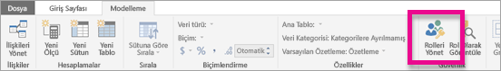
2. **Manager** adlı yeni bir rol oluşturun.

    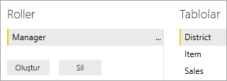
3. **District** tablosuna şu DAX deyimini girin: **[District Manager] = USERNAME()** .

    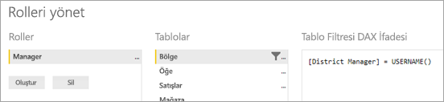
4. Kuralların çalıştığından emin olmak için **Modelleme** sekmesinde **Rol olarak görüntüle**'yi ve ardından oluşturduğunuz **Manager** rolünü ve **Diğer kullanıcılar**'ı seçin. Kullanıcı olarak **AndrewMa** girin.

    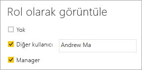

    Raporlarda veriler **AndrewMa** olarak oturum açmışsınız gibi gösterilir.

Burada yaptığımız gibi filtreyi uygulamak **District**, **Store** ve **Sales** tablolarındaki tüm kayıtları filtreler. Ancak **Sales** ile **Time**, **Sales** ile **Item** ve **Item** ile **Time** tabloları arasındaki ilişkilerdeki filtre yönü nedeniyle tablolar filtrelenmez. İki yönlü çapraz filtreleme hakkında daha fazla bilgi edinmek için [Bidirectional cross-filtering in SQL Server Analysis Services 2016 and Power BI Desktop (SQL Server Analysis Services 2016 ve Power BI Desktop'ta iki yönlü çapraz filtreleme)](http://download.microsoft.com/download/2/7/8/2782DF95-3E0D-40CD-BFC8-749A2882E109/Bidirectional%20cross-filtering%20in%20Analysis%20Services%202016%20and%20Power%20BI.docx) teknik incelemesini indirin.

## <a name="applying-user-and-role-to-an-embed-token"></a>Ekleme belirtecine kullanıcı ve rol uygulama

Power BI Desktop rollerini yapılandırdınız ancak uygulamanızın rollerden faydalanabilmesi için yapmanız gereken birkaç işlem daha vardır.

Kullanıcıların kimlik doğrulaması ve yetkilendirmesi uygulama tarafından gerçekleştirilir ve kullanıcıya belirli bir Power BI Embedded raporuna erişim izni vermek için ekleme belirteçleri kullanılır. Power BI Embedded, kullanıcıyla ilgili belirli bilgilere sahip değildir. RLS'nin çalışması için ekleme belirtecinin bir parçası olarak kimlik biçiminde ek bağlam iletmeniz gerekir. [Ekleme Belirteci](https://docs.microsoft.com/rest/api/power-bi/embedtoken) API’sini kullanarak kimlikleri iletebilirsiniz.

API, ilgili veri kümelerini belirten bir kimlik listesini kabul eder. RLS'nin çalışması için aşağıdaki parçaları kimlikle birlikte iletmeniz gerekir.

* **username (zorunlu)** : RLS kurallarını uygularken kullanıcının kimliğini belirlemeye yardımcı olmak için kullanılabilen bir dize. Yalnızca tek bir kullanıcı listelenebilir. Kullanıcı adınız *ASCII* karakterler ile oluşturulabilir.
* **roles (zorunlu)** : Satır Düzeyi Güvenlik kurallarını uygularken seçilecek rolleri içeren dize. Birden fazla rol iletiliyorsa dize dizisi olarak iletilmesi gerekir.
* **dataset (zorunlu)** : Eklediğiniz yapıta uygulanabilen bir veri kümesi.

**GenerateTokenInGroup** yöntemini **PowerBIClient.Reports** üzerinde kullanarak ekleme belirtecini oluşturabilirsiniz.

Örneğin [PowerBIEmbedded_AppOwnsData](https://github.com/Microsoft/PowerBI-Developer-Samples/tree/master/App%20Owns%20Data) örneğini değiştirebilirsiniz. *Services\EmbedService.cs satır 76 ve 77* şuradan güncelleştirilebilir:

```csharp
// Generate Embed Token.
var generateTokenRequestParameters = new GenerateTokenRequest(accessLevel: "view");

var tokenResponse = await client.Reports.GenerateTokenInGroupAsync(GroupId, report.Id, generateTokenRequestParameters);
```

to

```csharp
var generateTokenRequestParameters = new GenerateTokenRequest("View", null, identities: new List<EffectiveIdentity> { new EffectiveIdentity(username: "username", roles: new List<string> { "roleA", "roleB" }, datasets: new List<string> { "datasetId" }) });

var tokenResponse = await client.Reports.GenerateTokenInGroupAsync("groupId", "reportId", generateTokenRequestParameters);
```

REST API'yi çağırıyorsanız güncelleştirilmiş API artık kullanıcı adı, dize rolleri listesi ve dize veri kümesi listesini içeren **identities** adlı ek bir JSON dizisi kabul etmektedir. 

Örnek olarak aşağıdaki kodu kullanın:

```json
{
    "accessLevel": "View",
    "identities": [
        {
            "username": "EffectiveIdentity",
            "roles": [ "Role1", "Role2" ],
            "datasets": [ "fe0a1aeb-f6a4-4b27-a2d3-b5df3bb28bdc" ]
        }
    ]
}
```

Tüm parçaları bir araya getirdiniz. Artık bir kullanıcı uygulamanızda oturum açıp bu yapıtı görüntülemek istediğinde, belirlediğiniz satır düzeyi güvenliğe uygun şekilde, yalnızca görme iznine sahip olduğu verileri görür.

## <a name="working-with-analysis-services-live-connections"></a>Analysis Services canlı bağlantılarıyla çalışma

Satır düzeyi güvenlik şirket içi sunucular için Analysis Services canlı bağlantılarıyla birlikte kullanılabilir. Bu bağlantı türünü kullanırken anlamanız gereken birkaç belirli kavram vardır.

Kullanıcı adı özelliği için sunulan etkin kimliğin, Analysis Services sunucusunda gerekli izinlere sahip bir Windows kullanıcısı olması gerekir.

### <a name="on-premises-data-gateway-configuration"></a>Şirket içi veri ağ geçidi yapılandırması

Analysis Services canlı bağlantılarıyla çalışılırken bir [Şirket içi veri ağ geçidi](../service-gateway-onprem.md) kullanılır. Listelenmiş bir kimlikle ekleme belirteci oluştururken ana hesabın ağ geçidinin yöneticisi olarak listelenmesi gerekir. Ana hesap listede yoksa, verilerin özelliğine satır düzeyi güvenlik uygulanmaz. Ağ geçidinde yönetici olmayan bir kullanıcı, rolleri sağlayabilir ancak etkin kimlik için kendi kullanıcı adını belirtmesi gerekir.

### <a name="use-of-roles"></a>Rollerin kullanımı

Roller bir katıştırma belirteci içinde kimlikle birlikte sağlanabilir. Rol sağlanmazsa ilgili rolleri çözümlemek için sağlanmış olan kullanıcı adı kullanılabilir.

### <a name="using-the-customdata-feature"></a>CustomData özelliğini kullanma

CustomData özelliği yalnızca **Azure Analysis Services** içinde bulunan modeller için ve yalnızca **Canlı bağlan** modunda çalışır. Kullanıcıların ve rollerin aksine CustomData özelliği bir .pbix dosyasının içinde ayarlanamaz. CustomData özelliğiyle bir belirteç oluştururken kullanıcı adını bilmeniz gerekir.

CustomData özelliği, veri kaynağınız olarak **Azure Analysis Services** kullandığınızda uygulamanızdaki Power BI verilerini görüntülerken (uygulamanızda Azure Analysis Services’e bağlı Power BI verilerini görüntülerken) Satır filtresi eklemenize olanak tanır.

CustomData özelliği, CustomData bağlantı dizesi özelliği kullanılarak serbest metin (dize) geçirilmesine olanak sağlar. Analysis Services bu değeri *CUSTOMDATA()* işlevi aracılığıyla kullanır.

**Azure Analysis Services**'de yalnızca *CUSTOMDATA()* işlevini kullanarak dinamik RLS (filtreyi değerlendirmek için dinamik değerler kullanılır) edinebilirsiniz.

Bunu, rol DAX sorgusunun içinde veya bir ölçü DAX sorgusunda herhangi bir rol olmadan kullanabilirsiniz.
CustomData özelliği, şu yapılara yönelik belirteç oluşturma işlevimizin bir parçasıdır: pano, rapor ve kutucuk. Panolarda birden çok CustomData kimliği (kutucuk/model başına bir adet) bulunabilir.

#### <a name="customdata-sdk-additions"></a>CustomData SDK Eklemeleri

CustomData dize özelliği, belirteç oluşturma senaryosunda etkili kimliğimize eklendi.

```json
[JsonProperty(PropertyName = "customData")]
public string CustomData { get; set; }
```

Kimlik aşağıdaki çağrı kullanılarak özel verilerle oluşturulabilir:

```csharp
public EffectiveIdentity(string username, IList<string> datasets, IList<string> roles = null, string customData = null);
```

#### <a name="customdata-sdk-usage"></a>CustomData SDK Kullanımı

REST API’yi çağırıyorsanız her kimliğin içine özel veriler ekleyebilirsiniz, örneğin:

```json
{
    "accessLevel": "View",
    "identities": [
        {
            "username": "EffectiveIdentity",
            "roles": [ "Role1", "Role2" ],
            "customData": "MyCustomData",
            "datasets": [ "fe0a1aeb-f6a4-4b27-a2d3-b5df3bb28bdc" ]
        }
    ]
}
```

Power BI Embedded uygulamanızla CustomData() özelliğini ayarlamaya başlamanız için adımlar burada verilmiştir.

1. Azure Analysis Services veritabanınızı oluşturun. Ardından [SQL Server Management Studio](https://docs.microsoft.com/sql/ssms/download-sql-server-management-studio-ssms?view=sql-server-2017) aracılığıyla Azure Analysis Services sunucunuzda oturum açın.

    

    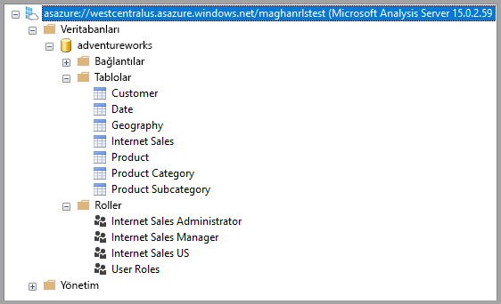

2. Analysis Services sunucusunda bir Rol oluşturun.

    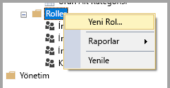

3. **Genel** ayarlarınızı belirleyin.  Buradan **Rol Adı**'nı belirtirsiniz ve veritabanı izinlerini **Salt** okunur olarak ayarlarsınız.

    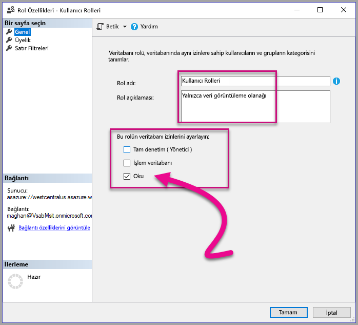

4. **Üyelik** ayarlarını belirleyin. Burada, bu rol tarafından etkilenen kullanıcıları eklersiniz.

    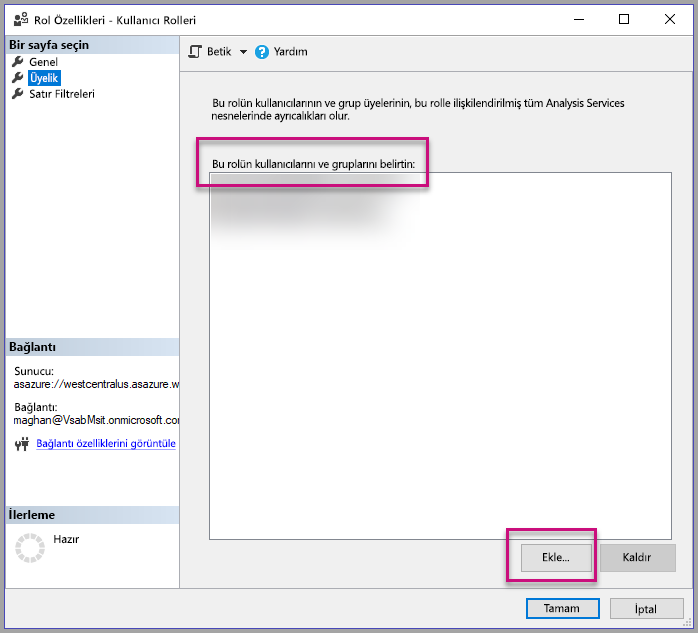

5. *CUSTOMDATA()* işlevini kullanarak **Satır filtreleri** DAX sorgunuzu ayarlayın.

    

6. PBI raporu oluşturun ve ayrılmış kapasiteye sahip bir çalışma alanında yayımlayın.

    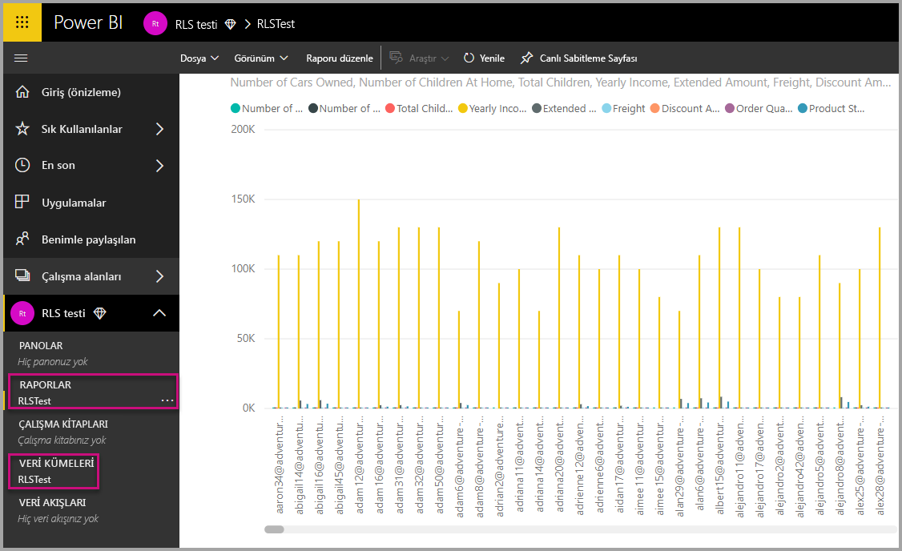

7. CustomData özelliğini uygulamanızda kullanmak için Power BI API’lerinden yararlanın.  CustomData özelliğiyle bir belirteç oluştururken kullanıcı adını bilmeniz gerekir. Kullanıcı adı, ana kullanıcının UNP’sine eşit olmalıdır. Ana kullanıcı, oluşturduğunuz rol veya rollerin üyesi olmalıdır. Hiçbir rol belirtilmezse, ana kullanıcının üye olduğu tüm roller RLS değerlendirmesi için kullanılır.

    İle çalışırken bir [hizmet sorumlusu](embed-service-principal.md), yönetici hesabı kullanarak yerine Yukarıdaki adımlar gerekir. Oluşturma, ekleme belirteci kullanarak [hizmet sorumlusu nesne kimliği](embed-service-principal.md#how-to-get-the-service-principal-object-id) yapılandırmalıdır.

    > [!Note]
    > Uygulamanızı üretime dağıtmaya hazır olduğunuzda ana kullanıcı hesabı alanı veya seçeneği son kullanıcıya gösterilmemelidir.

    CustomData özelliğini eklemek için [kodu](#customdata-sdk-additions) görüntüleyin.

8. Artık raporunuzun içerdiği tüm verileri görmek için CustomData değer veya değerlerini uygulamadan önce raporu uygulamanızda görüntüleyebilirsiniz.

    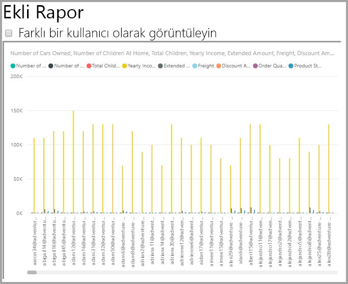

    Sonra raporun farklı bir veri kümesini nasıl görüntülediğini görmek için Özel veri değerini veya değerlerini uygulayın.
    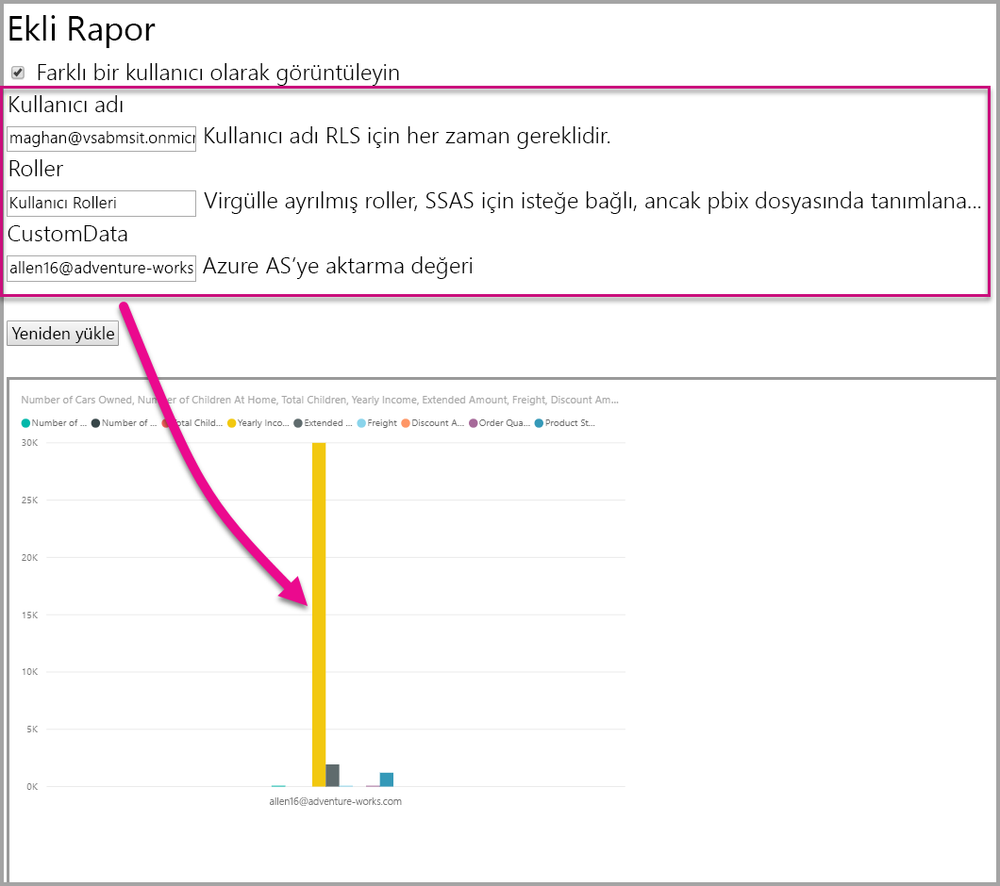

## <a name="using-rls-vs-javascript-filters"></a>RLS veya JavaScript filtrelerini kullanma

Raporda verilerinizi filtrelemeye karar verirseniz **satır düzeyi güvenliği (RLS)** veya **JavaScript filtrelerini** kullanabilirsiniz.

[Satır düzeyi güvenlik](../service-admin-rls.md) veri modeli düzeyinde verileri filtreleyen bir özelliktir. Arka uç veri kaynağınız RLS ayarlarınızı denetler. Veri modelinize bağlı olarak ekleme belirteci oluşturma özelliği oturum için kullanıcı adını ve diğer rolleri ayarlar. Bu, istemci tarafı kod tarafından geçersiz kılınamaz, kaldırılamaz veya denetlenemez. Güvenli kabul edilmesinin nedeni budur. Verileri güvenli bir şekilde filtrelemek için RLS kullanmanızı öneririz. Aşağıdaki seçeneklerden birini kullanarak verilerinizi RLS ile filtreleyebilirsiniz.

* [Rolleri Power BI raporunda yapılandırma](../desktop-rls.md).
* Rolleri veri kaynağı düzeyinde yapılandırma (yalnızca canlı Analysis Services bağlantısı).
* `EffectiveIdentity` kullanarak bir [Ekleme Belirteci](https://docs.microsoft.com/rest/api/power-bi/embedtoken/datasets_generatetokeningroup) ile programlı olarak. Ekleme belirteci kullanıldığında asıl filtre belirli bir oturum için ekleme belirtecinden geçer.

[JavaScript filtreleri](https://github.com/Microsoft/PowerBI-JavaScript/wiki/Filters#page-level-and-visual-level-filters), ile kullanıcı verilerin sınırlı, kapsamlı veya filtrelenmiş bir görünümünü kullanabilir. Öte yandan kullanıcı hala model şeması tablolarına, sütunlara ve ölçülere erişebilir ve verilere buralardan ulaşabilir. Verilere sınırlı erişim yalnızca RLS tarafından uygulanabilir ve istemci tarafı filtreleme API’leri üzerinden uygulanamaz.

## <a name="token-based-identity-with-azure-sql-database-preview"></a>Azure SQL Veritabanı ile Belirteç Tabanlı Kimlik (Önizleme)

**Belirteç tabanlı kimlik**, **Azure SQL Veritabanı** için **Azure Active Directory (AAD)** erişim belirtecini kullanarak ekleme belirtecine etkili bir kimlik belirtmenize olanak tanır.

Verilerini **Azure SQL Veritabanı**'nda tutan müşteriler artık **Power BI Embedded** ile tümleştirerek Azure SQL'de kullanıcılarını yönetmelerini ve verilerine erişmelerini sağlayan yeni özellikten yararlanabilir.

Ekleme belirteci oluştururken Azure SQL'deki bir kullanıcının etkili kimliğini belirtebilirsiniz. Kullanıcının etkili kimliği belirtmek için AAD erişim belirtecini sunucuya geçirebilirsiniz. Erişim belirteci Azure SQL'den söz konusu kullanıcının yalnızca ilgili verilerini almak için kullanılır.

Her kullanıcının Azure SQL'deki görünümünü yönetmek veya çok kiracılı bir veritabanındaki belirli bir kullanıcı olarak Azure SQL'de oturum açmak için kullanılabilir. Ayrıca Azure SQL'de bu oturuma satır düzeyi güvenlik uygulayabilir ve oturumun yalnızca ilgili verilerini alarak Power BI'da RLS'yi yönetme gereğini ortadan kaldırır.

Bu tür etkili kimlik sorunları Azure SQL Server'da RLS kurallarını doğrudan uygular. Power BI Embedded, Azure SQL Server'dan verileri sorgularken sağlanan erişim belirtecini kullanır. Kullanıcının UPN değerine (erişim belirtecinin sağlanma nedeni olan değer), USER_NAME() SQL işlevinin sonucundan erişilebilir.

Belirteç tabanlı kimlik, yalnızca AAD kimlik doğrulamasına izin verecek şekilde yapılandırılmış Azure SQL Veritabanı'na bağlı, ayrılmış kapasitedeki DirectQuery modellerinde çalışır. ([Azure SQL Veritabanı için AAD kimlik doğrulaması hakkında daha fazla bilgi edinin](https://docs.microsoft.com/azure/sql-database/sql-database-manage-logins).) Belirteç tabanlı kimlik kullanmak için, veri kümesinin veri kaynağı son kullanıcıların OAuth2 kimlik bilgilerini kullanacak şekilde yapılandırılmalıdır.

   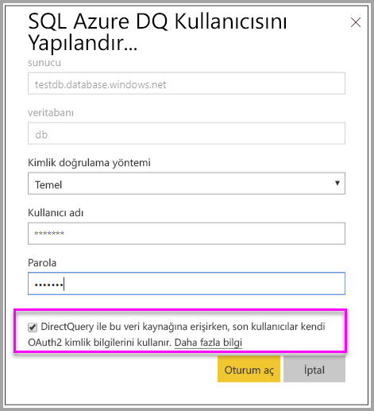

### <a name="token-based-identity-sdk-additions"></a>Belirteç Tabanlı Kimlik SDK'sı eklemeleri

Kimlik blobu özelliği, belirteç oluşturma senaryosunda etkili kimliğimize eklendi.

```JSON
[JsonProperty(PropertyName = "identityBlob")]
public IdentityBlob IdentityBlob { get; set; }
```

IdentityBlob türü bir değer dize özelliği barındıran basit bir JSON yapısıdır

```JSON
[JsonProperty(PropertyName = "value")]
public string value { get; set; }
```

EffectiveIdentity aşağıdaki çağrı kullanılarak kimlik blobuyla oluşturulabilir:

```C#
public EffectiveIdentity(string username, IList<string> datasets, IList<string> roles = null, string customData = null, IdentityBlob identityBlob = null);
```

Kimlik blobu aşağıdaki çağrı kullanılarak oluşturulabilir.

```C#
public IdentityBlob(string value);
```

### <a name="token-based-identity-rest-api-usage"></a>Belirteç Tabanlı Kimlik REST API'si Kullanımı

[REST API](https://docs.microsoft.com/rest/api/power-bi/embedtoken/reports_generatetoken#definitions)’yi çağırıyorsanız her kimliğin içine kimlik blobu ekleyebilirsiniz.

```JSON
{
    "accessLevel": "View",
    "identities": [
        {
            "datasets": ["fe0a1aeb-f6a4-4b27-a2d3-b5df3bb28bdc"],
        “identityBlob”: {
            “value”: “eyJ0eXAiOiJKV1QiLCJh….”
         }
        }
    ]
}
```

Kimlik blobunda sağlanan değerin Azure SQL Server için geçerli bir erişim belirteci olması gerekir (kaynak URL'si <https://database.windows.net/>).

   > [!Note]
   > Azure SQL'e bir erişim belirteci oluşturmak için, uygulamanın Azure portalındaki AAD uygulama kaydı yapılandırmasında **Azure SQL Veritabanı** API'si üzerinde **Access Azure SQL DB ve Veri Ambarı** temsilci iznine sahip olması gerekir.

   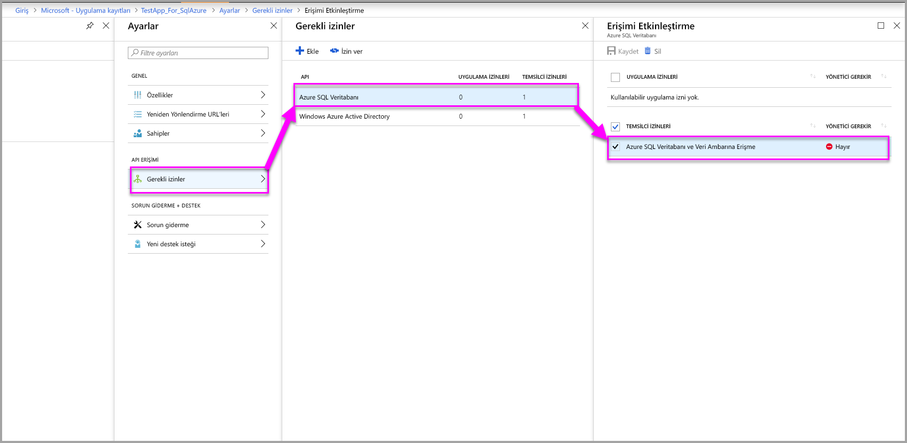

## <a name="on-premises-data-gateway-with-service-principal-preview"></a>Hizmet sorumlusuyla şirket içi veri ağ geçidi (Önizleme)

SQL Server Analysis Services (SSAS) şirket içi canlı bağlantı veri kaynağı kullanarak satır düzeyi güvenliği (RLS) yapılandıran müşteriler, **Power BI Embedded** ile tümleştirildiğinde kullanıcıları ve bu kullanıcıların SSAS'deki verilere erişimini yönetmek için yeni [hizmet sorumlusu](embed-service-principal.md) özelliğinden yararlanabilir.

[Power BI REST API'lerinin](https://docs.microsoft.com/rest/api/power-bi/) kullanılması, [hizmet sorumlusu nesnesini](https://docs.microsoft.com/azure/active-directory/develop/app-objects-and-service-principals#service-principal-object) kullanarak ekleme belirteci için SSAS şirket içi canlı bağlantılarına etkin kimlik belirtmenize olanak tanır.

Şimdiye kadar SSAS şirket içi canlı bağlantılarına etkin kimlik belirtebilmek için, ekleme belirtecini oluşturan ana kullanıcının bir ağ geçidi yöneticisi olması gerekiyordu. Artık kullanıcının ağ geçidi yöneticisi olması gerekmez; ağ geçidi yöneticisi kullanıcıya söz konusu veri kaynağı üzerinde ayrılmış izin verebilir ve bu izin kullanıcının ekleme belirtecini oluştururken etkin kimliği geçersiz kılmasını sağlar. Bu yeni özellik canlı SSAS bağlantısı için hizmet sorumlusuyla eklemeye olanak tanır.

Bu senaryoyu etkinleştirmek için, ağ geçidi yöneticisi [Veri Kaynağı Kullanıcısı Ekleme REST API'sini](https://docs.microsoft.com/rest/api/power-bi/gateways/adddatasourceuser) kullanarak hizmet sorumlusuna Power BI Embedded üzerinde *ReadOverrideEffectiveIdentity* iznini verir.

Yönetim portalını kullanarak bu izni ayarlayamazsınız. Bu izin yalnızca API'yle ayarlanır. Yönetim portalında, bu tür izinleri olan kullanıcılar ve SPN'ler için bir gösterge görürsünüz.

## <a name="considerations-and-limitations"></a>Önemli noktalar ve sınırlamalar

* Power BI hizmetinde kullanıcıların rollere atanması, ekleme belirteci kullanıldığında RLS'yi etkilemez.
* Power BI hizmeti RLS ayarını yöneticilere veya düzenleme izni olan üyelere uygulamaz ancak ekleme belirteciyle ilettiğiniz kimlikler verilere uygulanır.
* Analysis Services canlı bağlantıları şirket içi sunucular için desteklenmektedir.
* Azure Analysis Services canlı bağlantıları role göre filtrelemeyi destekler. CustomData kullanılarak dinamik filtreleme yapılabilir.
* Temel alınan veri kümesi RLS gerektirmiyorsa GenerateToken isteğinin etkin kimlik **içermemesi** gerekir.
* Temel alınan veri kümesi bir bulut modeliyse (önbelleğe alınmış model veya DirectQuery) etkin kimliğin en az bir rol içermesi gerekir. Aksi halde, rol ataması gerçekleşmez.
* Kimlik listesi sayesinde, pano ekleme işlemi için birden çok kimlik belirteci kullanılabilir. Diğer tüm yapıtlar için liste tek bir kimlik içerir.

### <a name="token-based-identity-limitations-preview"></a>Belirteç Tabanlı Kimlik sınırlamaları (Önizleme)

* Bu özellik kullanımı yalnızca Power BI Premium ile kısıtlar.
* Bu özellik SQL Server şirketi içi ile çalışmaz.
* Bu özellik Multi-Geo ile çalışmaz.

Başka bir sorunuz mu var? [Power BI Topluluğu'na sorun](https://community.powerbi.com/)
