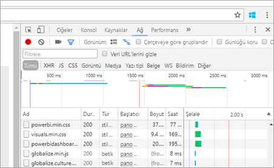
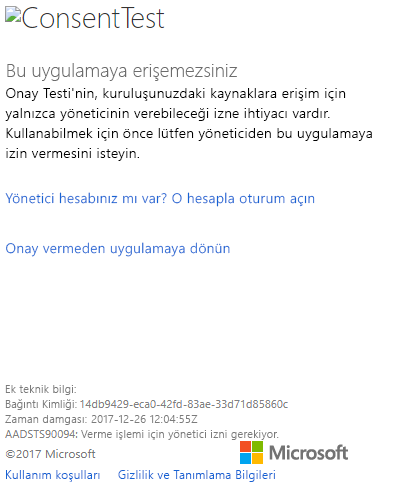
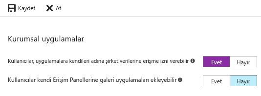

# <a name="troubleshoot-your-embedded-application"></a>Ekli uygulamanızla ilgili sorunları giderme

Bu makalede, Power BI'dan içerik ekleme sırasında sıkça karşılaşılan bazı sorunlar açıklanmaktadır.

## <a name="tools-to-troubleshoot"></a>Sorun giderme araçları

### <a name="fiddler-trace"></a>Fiddler ile İzleme

[Fiddler](http://www.telerik.com/fiddler), Telerik tarafından kullanıma sunulup HTTP trafiğini izleyen ücretsiz bir araçtır.  İstemci makinesinde Power BI API'lerini kullanarak trafiği görebilirsiniz. Bu araç hataları ve diğer ilgili bilgileri gösterebilir.


### <a name="f12-in-browser-for-front-end-debugging"></a>Ön uç hata ayıklama için Tarayıcıda F12

F12 tarayıcınızda geliştirici penceresini açar. Bu araç, ağ trafiğini ve diğer bilgileri görüntüleme olanağı sağlar.



### <a name="extract-error-details-from-power-bi-response"></a>Power BI yanıtından hata ayrıntılarını ayıklama

Bu kod parçacığı, HTTP özel durumundan hata ayrıntılarını ayıklama işleminin nasıl yapılacağını göstermektedir:

```csharp
public static string GetExceptionText(this HttpOperationException exc)
{
    var errorText = string.Format("Request: {0}\r\nStatus: {1} ({2})\r\nResponse: {3}",
    exc.Request.Content, exc.Response.StatusCode, (int)exc.Response.StatusCode, exc.Response.Content);
    if (exc.Response.Headers.ContainsKey("RequestId"))
    {
        var requestId = exc.Response.Headers["RequestId"].FirstOrDefault();
        errorText += string.Format("\r\nRequestId: {0}", requestId);
    }

    return errorText;
}
```

Sorun giderme işlemi için İstek Kimliklerinin ve hata ayrıntılarının günlüğe kaydedilmesini öneriyoruz.
Microsoft destek bölümüyle iletişime geçerken İstek Kimliğini belirtin.

## <a name="app-registration"></a>Uygulama kaydı

### <a name="app-registration-failure"></a>Uygulama kaydı hatası

Azure portal veya Power BI uygulaması kayıt sayfasındaki hata iletileri, yetersiz ayrıcalıktan bahsedecektir. Bir uygulama kaydı için Azure AD kiracısında yönetici olmanız ya da yönetici olmayan kullanıcılar için uygulama kayıtlarının etkinleştirilmiş olması gerekir.

### <a name="power-bi-service-doesnt-appear-in-the-azure-portal-when-registering-a-new-app"></a>Power BI Hizmeti yeni bir Uygulama kaydı sırasında Azure portalında görünmüyor

En az bir kullanıcının Power BI'a kaydolmuş olması gerekir. API listesinde **Power BI Hizmetini** görmüyorsanız hiçbir kullanıcı Power BI'a kaydolmamış demektir.

## <a name="rest-api"></a>REST API

### <a name="api-call-returning-401"></a>401 kodunu döndüren API çağrısı

Daha fazla araştırmak için Fiddler ile yakalama gerekebilir. Azure AD'de kayıtlı uygulama için gerekli izin kapsamı eksik olabilir. Azure portalındaki Azure AD için uygulama kaydında gerekli kapsamın mevcut olduğunu doğrulayın.

### <a name="api-call-returning-403"></a>403 kodunu döndüren API çağrısı

Daha fazla araştırmak için Fiddler ile yakalama gerekebilir. 403 hatasının birkaç nedeni olabilir.

* Kullanıcı, paylaşılan bir kapasitede oluşturulabilecek ekleme belirteci miktarını aşmıştır. Ekleme belirteçleri oluşturmak için Azure kapasitesi satın alın ve çalışma alanını bu kapasiteye atayın. Bkz. [Azure portalında Power BI Embedded kapasitesi oluşturma](https://docs.microsoft.com/azure/power-bi-embedded/create-capacity).
* Azure AD kimlik doğrulama belirtecinin kullanım süresi dolmuştur.
* Kimliği doğrulanmış kullanıcı, grubun (uygulama çalışma alanı) üyesi değildir.
* Kimliği doğrulanmış kullanıcı, grubun (uygulama çalışma alanı) yöneticisi değildir.
* Yetkilendirme üst bilgisi doğru listelenmemiş olabilir. Yazım hatası olmadığından emin olun.

GenerateToken çağrılmadan önce uygulamanın arka ucunun kimlik doğrulaması belirtecini yenilemesi gerekebilir.

    ```
    GET https://wabi-us-north-central-redirect.analysis.windows.net/metadata/cluster HTTP/1.1
    Host: wabi-us-north-central-redirect.analysis.windows.net
    ...
    Authorization: Bearer eyJ0eXAiOi...
    ...

    HTTP/1.1 403 Forbidden
    ...

    {"error":{"code":"TokenExpired","message":"Access token has expired, resubmit with a new access token"}}
    ```

## <a name="authentication"></a>Kimlik Doğrulama

### <a name="authentication-failed-with-aadsts90002-tenant-authorize-not-found"></a>Kimlik doğrulaması şu hatayla başarısız oldu: AADSTS90002: Kiracı 'yetkilendirmesi' bulunamadı

 İleti günlüğünde ***hata: invalid_request, error_description: AADSTS90002: Kiracı 'yetkilendirmesi' bulunamadı*** gibi iletiler alırsanız, bunun nedeni ADAL 4.x'in yetki url'si olarak "https://login.microsoftonline.com/{Tenant}/oauth2/authorize/" url'sini desteklememesidir.
 
Bu sorunu çözmek için yetki url'nizin sonundaki "oauth2/authorize/" bölümünü kırpmalısınız. Bu konuda başvuru için [Power BI Geliştirici Örnekleri](https://github.com/Microsoft/PowerBI-Developer-Samples)'ne bakın.

 ADAL 4.x sürüm notlarında [Daha İyi Yetkili doğrulaması](https://github.com/AzureAD/azure-activedirectory-library-for-dotnet/wiki/Changes-adalnet-4.0#better-authority-validation) bölümünü gözden geçirin.

### <a name="authentication-failed-with-aadsts70002-or-aadsts50053"></a>AADSTS70002 veya AADSTS50053 ile kimlik doğrulaması başarısız oldu

** _(AADSTS70002: Kimlik bilgileri doğrulanırken hata oluştu. AADSTS50053: Hatalı bir Kullanıcı Kimliği veya parolayla çok fazla sayıda oturum açma denemesi yaptınız)_ **

Power BI Embedded'i ve Azure AD Doğrudan kimlik doğrulamasını kullanıyorsanız ve oturum açarken ***error:unauthorized_client, error_description:AADSTS70002: Kimlik bilgileri doğrulanırken hata oluştu. AADSTS50053: Hatalı bir Kullanıcı Kimliği ve parolayla çok fazla sayıda oturum açma denemesi yaptınız*** gibi iletiler alıyorsanız bunun nedeni, doğrudan kimlik doğrulamasının 14 Haziran 2018'den itibaren artık kullanımda olmamasıdır.

Kapsam olarak kuruluşun veya bir [hizmet sorumlusunun](https://docs.microsoft.com/azure/active-directory/develop/active-directory-application-objects#service-principal-object) belirlendiği bir [Azure AD İlkesi](https://docs.microsoft.com/azure/active-directory/manage-apps/configure-authentication-for-federated-users-portal#enable-direct-authentication-for-legacy-applications) kullanarak bu işlemi geri almanın bir yolu vardır.

Bu ilkeyi yalnızca uygulama özelinde etkinleştirmenizi öneririz.

Bu ilkeyi oluşturmak için, ilkeyi oluşturduğunuz ve atadığınız dizinin **Genel Yöneticisi** olmanız gerekir. Burada, bu uygulama için ilkeyi oluşturmaya ve SP'ye atamaya yönelik örnek bir betik verilmiştir:

1. [Azure AD Preview PowerShell Modülü](https://docs.microsoft.com/powershell/azure/active-directory/install-adv2?view=azureadps-2.0)'nü yükleyin.

2. Aşağıdaki PowerShell komutlarını satır satır çalıştırın ($sp değişkeninin sonucunda birden çok uygulama olmadığından emin olun).

```powershell
Connect-AzureAD
```

```powershell
$sp = Get-AzureADServicePrincipal -SearchString "Name_Of_Application"
```

```powershell
$policy = New-AzureADPolicy -Definition @("{`"HomeRealmDiscoveryPolicy`":{`"AllowCloudPasswordValidation`":true}}") -DisplayName EnableDirectAuth -Type HomeRealmDiscoveryPolicy -IsOrganizationDefault $false
```

```powershell
Add-AzureADServicePrincipalPolicy -Id $sp.ObjectId -RefObjectId $policy.Id 
```

İlkeyi atadığınızda test etmeden önce yayılması için 15-20 saniye kadar bekleyin.

### <a name="generate-token-fails-when-providing-effective-identity"></a>Etkin kimlik sağlanırken belirteç oluşturulamıyor

GenerateToken, etkin kimlik sağlandığında birkaç nedenden dolayı başarısız olabilir.

* Veri kümesi etkin kimliği desteklemiyor
* Kullanıcı adı sağlanmadı
* Rol sağlanmadı
* DatasetId sağlanmadı
* Kullanıcı doğru izinlere sahip değil

Hangisi olduğunu belirlemek için aşağıdaki adımları deneyin.

* [Veri kümesi al](https://docs.microsoft.com/rest/api/power-bi/datasets) komutunu yürütün. IsEffectiveIdentityRequired özelliği doğru mu?
* Kullanıcı adı her EffectiveIdentity için zorunludur.
* IsEffectiveIdentityRolesRequired doğruysa Rol gereklidir.
* DatasetId her EffectiveIdentity için zorunludur.
* Analysis Services için ana kullanıcı bir ağ geçidi yöneticisi olmak zorundadır.

### <a name="aadsts90094-the-grant-requires-admin-permission"></a>AADSTS90094: Verme işlemi için yönetici izni gerekiyor

**_Belirtiler:_ **<br>
Yönetici olmayan bir kullanıcı onay vermek için uygulamada ilk kez oturum açmayı deniyorsa aşağıdaki hatalardan birini alır:

* Onay Testi'nin, kuruluşunuzdaki kaynaklara erişim için yalnızca yöneticinin verebileceği izne ihtiyacı vardır. Kullanabilmek için önce yöneticiden bu uygulamaya izin vermesini isteyin.
* AADSTS90094: Verme işlemi için yönetici izni gerekiyor.

    

Yönetici oturum açabilir ve başarılı bir şekilde onay verebilir.

**_Kök nedeni:_ **<br>
Kiracı için kullanıcı onayı devre dışı bırakıldı.

**_Çeşitli düzeltmeler yapılabilir:_ **

*Kiracının tamamı için kullanıcı onayını etkinleştir (tüm kullanıcılar, tüm uygulamalar)*

1. Azure portalda "Azure Active Directory" => "Kullanıcılar ve gruplar" => "Kullanıcı ayarları" bölümüne gidin
2. "Kullanıcılar, uygulamalara kendileri adına şirket verilerine erişme izni verebilir" ayarını etkinleştirin ve değişiklikleri kaydedin

    

Kiracının tamamı için veya belirli bir kullanıcı için bir yönetici tarafından uygulamaya *izin verme*.

### <a name="cs1061-error"></a>Hatası CS1061

İndirme [Microsoft.IdentityModel.Clients.activedirectory](https://www.nuget.org/packages/Microsoft.IdentityModel.Clients.ActiveDirectory/2.22.302111727) yaşıyorsanız bir "'AcquireToken' ve 'türünde bir ilk bağımsız değişken kabul eden hiçbir erişilebilir AcquireToken' için 'Authenticationcontext'i' tanımı içermiyor ' Authenticationcontext'i ' bulunamadı (bir using eksik yönergeniz veya derleme başvurunuz?) "hatası.

## <a name="data-sources"></a>Veri kaynakları

### <a name="isv-wants-to-have-different-credentials-for-the-same-data-source"></a>ISV aynı veri kaynağı için farklı kimlik bilgilerine sahip olmak istiyor

Bir veri kaynağında, bir ana kullanıcı için tek kimlik bilgisi kümesi olabilir. Farklı kimlik bilgileri kullanmanız gerekiyorsa ek ana kullanıcılar oluşturun. Ardından, her ana kullanıcı bağlamında farklı kimlik bilgileri atayın ve kullanıcının Azure AD belirtecini kullanarak ekleyin.

## <a name="troubleshoot-your-embedded-application-with-the-ierror-object"></a>IError nesnesini kullanarak ekli uygulamanızla ilgili sorunları giderme

Uygulamanızda hata ayıklamak ve hatalarınızın nedenini daha iyi anlamak için [**JavaScript SDK** tarafından *error* olayı ile döndürülen **IError nesnesini**](https://github.com/Microsoft/PowerBI-JavaScript/wiki/Troubleshooting-and-debugging-of-embedded-parts) kullanabilirsiniz.

IError nesnesine ulaştıktan sonra kullandığınız ekleme türüne uygun olan sık karşılaşılan hataları incelemeniz gerekir. **IError özelliklerini** aşağıdaki tabloda bulunan değerlerle karşılaştırarak arızanın olası nedenlerini bulabilirsiniz.

### <a name="typical-errors-when-embedding-for-power-bi-users"></a>Power BI kullanıcıları için sık karşılaşılan ekleme hataları

| İleti | Ayrıntılı İleti | Hata Kodu | Olası nedenler |
|-------------------------------------------------------|-----------------------------------------------------------------------------------------------------------------------------|-----------|--------------------------------------------------------|
| TokenExpired | Erişim belirtecinin süresi doldu, yeni bir erişim belirteciyle yeniden gönderin | 403 | Belirtecin süresi doldu  |
| PowerBIEntityNotFound | Rapor alma işlemi başarısız oldu | 404 | <li> Rapor kimliği yanlış <li> Rapor mevcut değil  |
| Parametreler geçersiz | powerbiToken parametresi belirtilmedi | YOK | <li> Erişim belirteci sağlanmadı <li> Rapor Kimliği sağlanmadı |
| LoadReportFailed | Başlatılamadı - Küme çözümlenemedi | 403 | * Hatalı erişim belirteci * Ekleme türü belirteç türüyle eşleşmiyor |
| PowerBINotAuthorizedException | Rapor alma işlemi başarısız oldu | 401 | <li> Grup kimliği yanlış <li> Yetkisiz grup |
| TokenExpired | Erişim belirtecinin süresi doldu, yeni bir erişim belirteciyle yeniden gönderin. Şu başlığa sahip rapor görseli işlenemedi: <visual title> | YOK | Sorgu verisi belirtecinin süresi doldu |
| OpenConnectionError | Görsel görüntülenemiyor. Şu başlığa sahip rapor görseli işlenemedi: <visual title> | YOK | Kapasiteyle ilgili bir rapor oturumda açıkken kapasite duraklatıldı veya silindi |
| ExplorationContainer_FailedToLoadModel_DefaultDetails | Bu raporla ilişkili model şeması yüklenemedi. Sunucuya bağlı olduğunuzdan emin olun ve yeniden deneyin. | YOK | <li> Kapasite duraklatıldı <li> Kapasite silindi |

### <a name="typical-errors-when-embedding-for-non-power-bi-users-using-an-embed-token"></a>Power BI kullanıcısı olmayanlar (Erişim Belirteci kullananlar) için ekleme sırasında karşılaşılan hatalar

| İleti | Ayrıntılı İleti | Hata Kodu | Nedenler |
|-------------------------------------------------------|-------------------------------------------------------------------------------------------------------------------------------|------------|-------------------------------------------------|
| TokenExpired | Erişim belirtecinin süresi doldu, yeni bir erişim belirteciyle yeniden gönderin | 403 | Belirtecin süresi doldu  |
| LoadReportFailed | Rapor alma işlemi başarısız oldu | 404 | <li> Rapor kimliği yanlış <li> Rapor mevcut değil  |
| LoadReportFailed | Rapor alma işlemi başarısız oldu | 403 | Rapor Kimliği belirteçle eşleşmiyor |
| LoadReportFailed | Rapor alma işlemi başarısız oldu | 500 | Belirtilen Rapor Kimliği GUID değil |
| Parametreler geçersiz | powerbiToken parametresi belirtilmedi | YOK | <li> Erişim belirteci sağlanmadı <li> Rapor Kimliği sağlanmadı |
| LoadReportFailed | Başlatılamadı - Küme çözümlenemedi | 403 | Belirteç türü yanlış, Hatalı Belirteç |
| PowerBINotAuthorizedException | Rapor alma işlemi başarısız oldu | 401 | Yanlış/yetkisiz grup kimliği |
| TokenExpired | Erişim belirtecinin süresi doldu, yeni bir erişim belirteciyle yeniden gönderin. Şu başlığa sahip rapor görseli işlenemedi: <visual title> | YOK | Sorgu verisi belirtecinin süresi doldu |
| OpenConnectionError | Görsel görüntülenemiyor. Şu başlığa sahip rapor görseli işlenemedi: <visual title> | YOK | Kapasiteyle ilgili bir rapor oturumda açıkken kapasite duraklatıldı veya silindi |
| ExplorationContainer_FailedToLoadModel_DefaultDetails | Bu raporla ilişkili model şeması yüklenemedi. Sunucuya bağlı olduğunuzdan emin olun ve yeniden deneyin. | YOK | <li> Kapasite duraklatıldı <li> Kapasite silindi |

## <a name="content-rendering"></a>İçerik işleme

### <a name="performance"></a>Performans

[Power BI Embedded performansı](embedded-performance-best-practices.md)

### <a name="rendering-or-consumption-of-embedded-content-fails-or-times-out"></a>Ekli içeriği işleme veya kullanma girişimi başarısız oldu veya zaman aşımına uğradı

Ekleme belirtecinin son kullanma tarihinin geçmediğinden emin olun. Ekleme belirtecinin son kullanma tarihini kontrol ettiğinizden ve yenilediğinizden emin olun. Daha fazla bilgi için bkz. [JavaScript SDK kullanarak belirteci yenileme](https://github.com/Microsoft/PowerBI-JavaScript/wiki/Refresh-token-using-JavaScript-SDK-example).

### <a name="report-or-dashboard-doesnt-load"></a>Rapor veya pano yüklenmiyor

Kullanıcı raporu veya panoyu göremiyorsa rapor ya da panonun powerbi.com'a doğru şekilde yüklendiğinden emin olun. Rapor veya pano, powerbi.com'a yüklenmezse uygulamanızda çalışmaz.

### <a name="report-or-dashboard-is-performing-slowly"></a>Rapor veya pano yavaş çalışıyor

Power BI Desktop'tan veya powerbi.com'da dosyayı açın ve uygulamanızla veya API'leri eklemeyle ilgili sorunları elemek için performansın kabul edilebilir olduğunu doğrulayın.

## <a name="embed-setup-tool"></a>Ekleme kurulum aracı

Bir örnek uygulamayı hızlıca indirmek için [Katıştırma kurulum aracını](https://aka.ms/embedsetup) inceleyebilirsiniz. Daha sonra uygulamanızı örnekle karşılaştırabilirsiniz.

### <a name="prerequisites"></a>Önkoşullar

Katıştırma kurulum aracını kullanmadan önce tüm uygun önkoşulları yerine getirdiğinizi doğrulayın. Bir **Power BI Pro** hesabı ve bir **Microsoft Azure** aboneliği gerekir.

* **Power BI Pro**’ya kaydolmadıysanız başlamadan önce [ücretsiz deneme için kaydolun](https://powerbi.microsoft.com/pricing/).
* Azure aboneliğiniz yoksa başlamadan önce [ücretsiz bir hesap](https://azure.microsoft.com/free/?WT.mc_id=A261C142F) oluşturun.
* [Azure Active Directory kiracınız](create-an-azure-active-directory-tenant.md) ayarlanmış olmalıdır.
* [Visual Studio](https://www.visualstudio.com/) yüklü olmalıdır (sürüm 2013 veya üzeri).

### <a name="common-issues"></a>Sık Karşılaşılan Sorunlar

Ekleme kurulum aracı ile test ederken karşılaşabileceğiniz bazı yaygın sorunlar şunlardır:

#### <a name="using-the-embed-for-your-customers-sample-application"></a>Embed for your customers örnek uygulamasını kullanma

**Embed for your customers** deneyimi ile çalışıyorsanız *PowerBI-Developer-Samples.zip* dosyasını kaydedin ve sıkıştırmasını açın. Ardından *PowerBI-Developer-Samples-master\App Owns Data* klasörünü açın ve *PowerBIEmbedded_AppOwnsData.sln* dosyasını çalıştırın.

**İzin ver**’i seçtiğinizde (İzin verme adımı) aşağıdaki hatayı alırsınız:

    AADSTS70001: Application with identifier <client ID> wasn't found in the directory <directory ID>

Bunun çözümü, açılır pencereyi kapatmak ve birkaç saniye bekleyip tekrar denemektir. Bu eylemi birkaç kez yinelemeniz gerekebilir. Uygulama kayıt işlemini tamamlama ile dış API’lerin kullanımına sunulması arasındaki zaman aralığı bu soruna neden olur.

Örnek uygulama çalıştırılırken aşağıdaki hata iletisi görüntülenir:

    Password is empty. Please fill password of Power BI username in web.config.

Örnek uygulamaya eklenmeyen tek değer kullanıcı parolanız olduğundan bu hata oluşur. Çözümde Web.config dosyasını açın ve pbiPassword alanını kullanıcınızın parolasıyla doldurun.

Şu hatayı alırsanız: AADSTS50079: Kullanıcının çok faktörlü kimlik doğrulaması kullanması gereklidir.

    Need to use an AAD account that doesn't have MFA enabled.

#### <a name="using-the-embed-for-your-organization-sample-application"></a>Embed for your organization örnek uygulamasını kullanma

**Embed for your organization** deneyimi ile çalışıyorsanız *PowerBI-Developer-Samples.zip* dosyasını kaydedin ve sıkıştırmasını açın. Ardından *PowerBI-Developer-Samples-master\User Owns Data\integrate-report-web-app* klasörünü açın ve *pbi-saas-embed-report.sln* dosyasını çalıştırın.

**Embed for your organization** örnek uygulamasını çalıştırdığınızda aşağıdaki hatayı alırsınız:

    AADSTS50011: The reply URL specified in the request doesn't match the reply URLs configured for the application: <client ID>

Bu hatanın nedeni, web sunucusu uygulaması için belirtilen yeniden yönlendirme URL’sinin örneğe ait URL’den farklı olmasıdır. Örnek uygulamayı kaydetmek istiyorsanız yeniden yönlendirme URL’si olarak `http://localhost:13526/` kullanın.

Kayıtlı uygulamayı düzenlemek isterseniz, uygulamanın web API’lerine erişim sağlayabilmesi için [Azure AD kayıtlı uygulamasını](https://docs.microsoft.com/azure/active-directory/develop/quickstart-v1-update-azure-ad-app) güncelleştirme hakkında bilgi edinin.

Power BI kullanıcı profilinizi veya verilerinizi düzenlemek istiyorsanız, [Power BI verilerinizi](https://docs.microsoft.com/power-bi/service-basic-concepts) düzenleme hakkında bilgi edinin.

Şu hatayı alırsanız: AADSTS50079: Kullanıcının çok faktörlü kimlik doğrulaması kullanması gereklidir.

    Need to use an AAD account that doesn't have MFA enabled.

Daha fazla bilgi için lütfen bkz. [Power BI Embedded SSS](embedded-faq.md).

Başka bir sorunuz mu var? [Power BI Topluluğu'na başvurun](http://community.powerbi.com/)

Daha fazla yardıma ihtiyacınız varsa [destek ekibine ulaşın](https://powerbi.microsoft.com/support/pro/?Type=documentation&q=power+bi+embedded) veya [Azure portal aracılığıyla bir destek bileti oluşturun](https://ms.portal.azure.com/#blade/Microsoft_Azure_Support/HelpAndSupportBlade/newsupportrequest) ve karşılaştığınız hata iletilerini belirtin.

## <a name="next-steps"></a>Sonraki adımlar

Daha fazla bilgi için bkz. [SSS](embedded-faq.md).

Başka bir sorunuz mu var? [Power BI Topluluğu'na başvurun](http://community.powerbi.com/)
