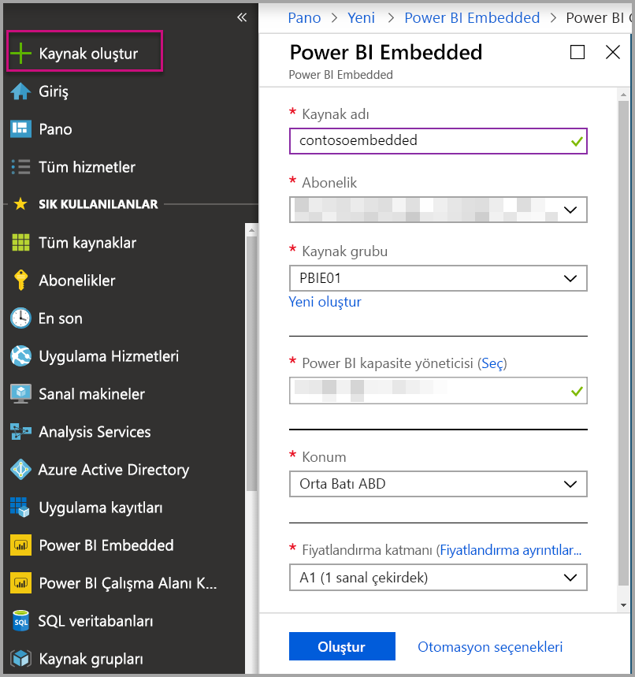
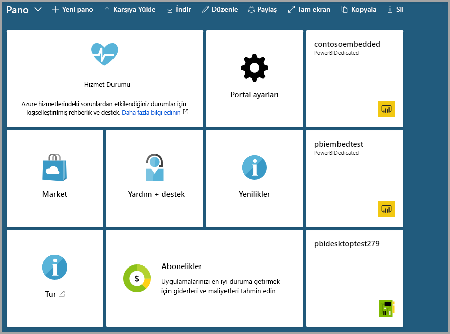

# Azure portalda Power BI Embedded kapasitesi oluşturma

Bu makalede Microsoft Azure'da [Power BI Embedded](azure-pbie-what-is-power-bi-embedded.md) kapasitesi oluşturma adımları anlatılır. Power BI Embedded, uygulamalarınıza hızlıca etkileyici görseller, raporlar ve panolar eklemenize yardımcı olarak Power BI özelliklerini daha basit hale getirir.

Azure aboneliğiniz yoksa başlamadan önce [ücretsiz bir hesap](https://azure.microsoft.com/free/) oluşturun.

> [!VIDEO https://www.youtube.com/embed/aXrvFfg_iSk]

## Başlamadan önce

Bu hızlı başlangıcı tamamlamak için aşağıdakilere ihtiyacınız vardır:

* **Azure aboneliği:** Hesap oluşturmak için [Azure Ücretsiz Deneme](https://azure.microsoft.com/free/) sayfasını ziyaret edin.
* **Azure Active Directory:** Aboneliğinizin bir Azure Active Directory (AAD) kiracısıyla ilişkilendirilmesi gerekir. Ayrıca ***bu kiracıdaki bir hesapla Azure'da oturum açmış olmanız gerekir***. Microsoft hesapları desteklenmez. Daha fazla bilgi için bkz. [Kimlik doğrulaması ve izinler](https://docs.microsoft.com/azure/analysis-services/analysis-services-manage-users).
* **Power BI kiracısı:** AAD kiracınızdaki hesaplardan en az birinin Power BI hizmetine kaydolmuş olması gerekir.
* **Kaynak grubu:** Mevcut kaynak gruplarınızdan birini kullanabilir veya [yeni bir tane oluşturabilirsiniz](https://docs.microsoft.com/azure/azure-resource-manager/resource-group-overview).

## Kapasite oluşturma

1. [Azure portalında](https://portal.azure.com/) oturum açın.

2. Arama kutusuna *Power BI Embedded* yazın.

3. Power BI Embedded içinde **Oluştur**'u seçin.

4. İstenen bilgileri girdikten sonra **Oluştur**'u seçin.

    

    |Ayar |Açıklama |
    |---------|---------|
    |**Kaynak adı**|Kapasiteyi tanımlamak için kullanılacak ad. Kaynak adı, Azure portalın yanı sıra Power BI yönetici portalında görüntülenir.|
    |**Abonelik**|Kapasiteyi oluşturmak istediğiniz abonelik.|
    |**Kaynak grubu**|Bu yeni kapasiteyi içeren kaynak grubu. Var olan kaynak gruplarından birini seçebilir veya yeni bir tane oluşturabilirsiniz. Daha fazla bilgi için bkz. [Azure Resource Manager'a genel bakış](https://docs.microsoft.com/azure/azure-resource-manager/resource-group-overview).|
    |**Power BI kapasite yöneticisi**|Power BI kapasite yöneticileri Power BI yönetici portalında kapasiteyi görüntüleyebilir ve başka kullanıcılara atama izni verebilir. Kapasite yöneticisi varsayılan olarak sizin hesabınızdır. Kapasite yöneticisinin Power BI kiracınızda olması gerekir.|
    |**Konum**|Kiracınız içinde Power BI hizmetinin barındırıldığı konum. Varsayılan konum ana bölgenizdir ancak [Multi-Geo seçeneklerini kullanarak](embedded-multi-geo.md) konumu değiştirebilirsiniz.
    |**Fiyatlandırma katmanı**|İhtiyaçlarınıza uygun SKU (sanal çekirdek sayısı ve bellek boyutu) değerini seçin.  Ayrıntılar için bkz. [Power BI Embedded fiyatlandırması](https://azure.microsoft.com/pricing/details/power-bi-embedded/)|

**Tüm hizmetler** > **Power BI Embedded**'e giderek kapasitenizin hazır olup olmadığını görebilirsiniz. Alternatif olarak, bildirimler bölümünden veya dikey pencerenin içinden **Panoya sabitle**'yi seçip panonuza gidebilir ve yeni kapasitenizi görebilirsiniz.

## Sonraki adımlar

Yeni Power BI Embedded kapasitenizi kullanmak için Power BI yönetici portalına giderek çalışma alanı atayın. Daha fazla bilgi için bkz. [Power BI Premium ve Power BI Embedded'da kapasiteleri yönetme](https://powerbi.microsoft.com/documentation/powerbi-admin-premium-manage/).

Bu kapasiteyi kullanmanız gerekmiyorsa duraklatarak faturaya yansımasını önleyebilirsiniz. Daha fazla bilgi için bkz. [Azure portalda Power BI Embedded kapasitenizi duraklatma ve başlatma](azure-pbie-pause-start.md).

Uygulamanıza Power BI içeriği eklemeye başlamak için bkz. [Power BI panolarınızı, raporlarınızı ve kutucuklarınızı ekleme](https://powerbi.microsoft.com/documentation/powerbi-developer-embedding-content/).

Başka bir sorunuz mu var? [Power BI Topluluğu'na sorun](https://community.powerbi.com/)