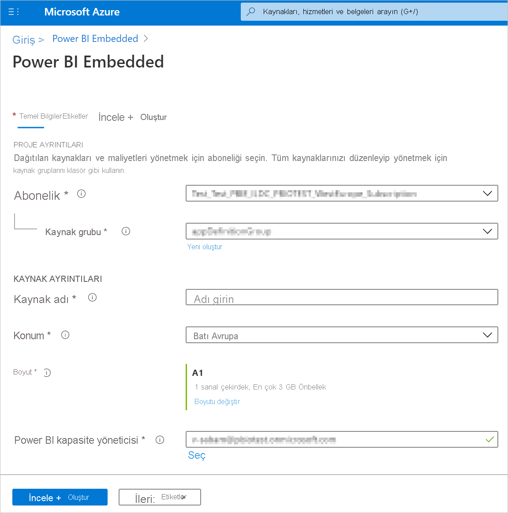
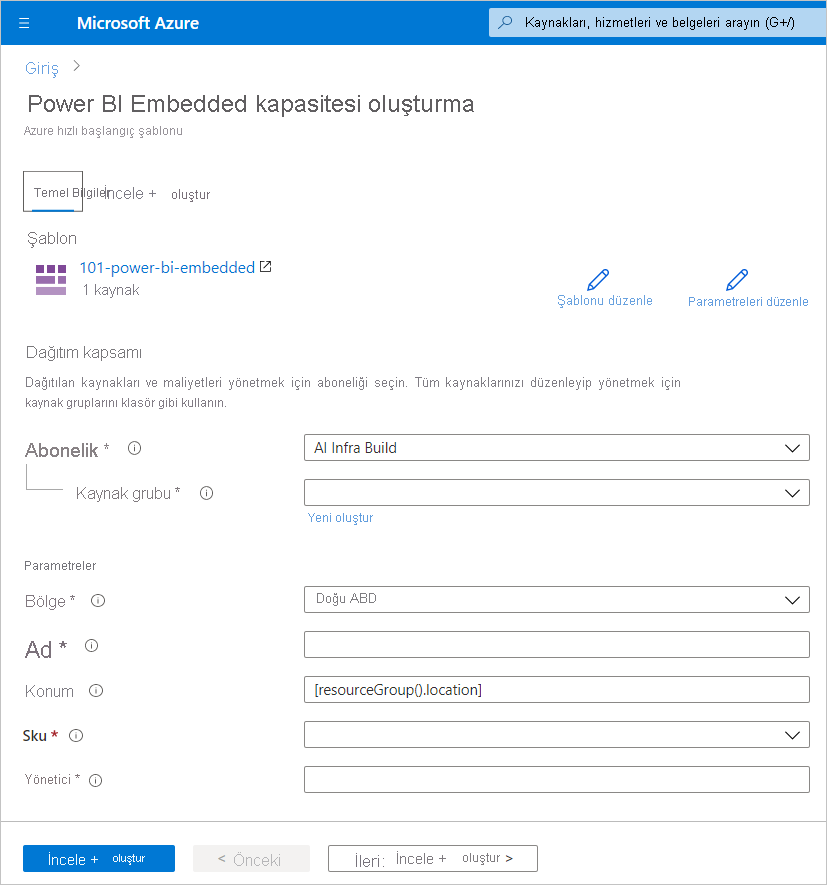
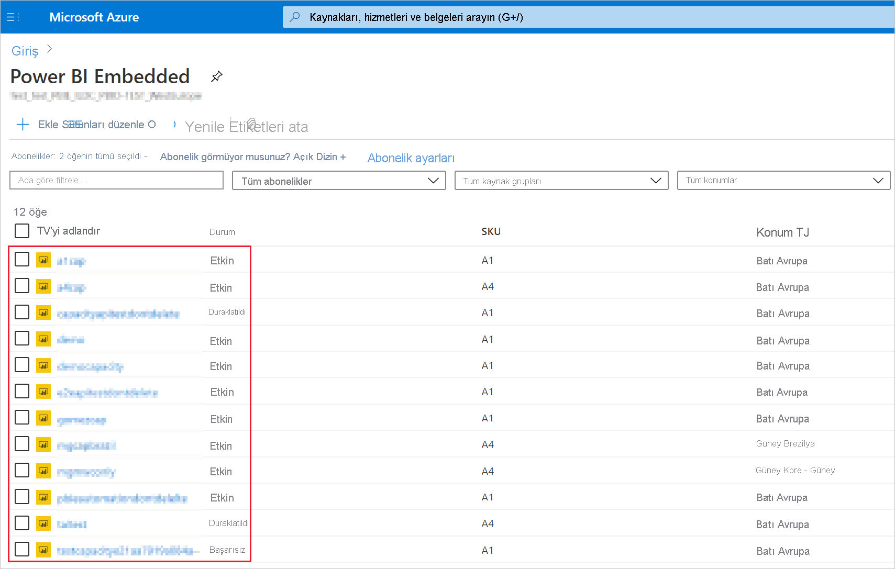
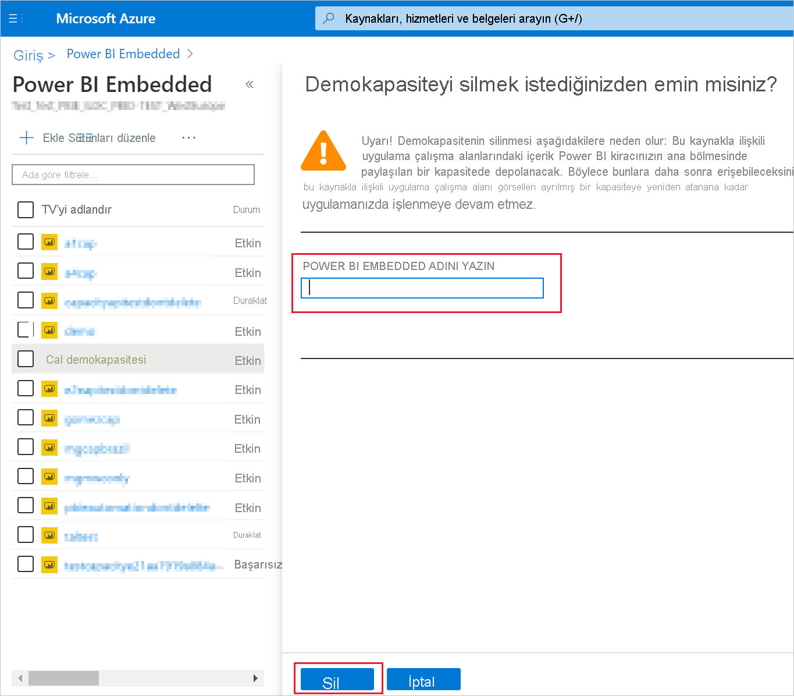

# <a name="create-power-bi-embedded-capacity-in-the-azure-portal"></a>Azure portalda Power BI Embedded kapasitesi oluşturma

Bu makalede Microsoft Azure'da [Power BI Embedded](azure-pbie-what-is-power-bi-embedded.md) kapasitesi oluşturma adımları anlatılır. Power BI Embedded, uygulamalarınıza hızlıca etkileyici görseller, raporlar ve panolar eklemenize yardımcı olarak Power BI özelliklerini daha basit hale getirir.

## <a name="before-you-begin"></a>Başlamadan önce

Bu hızlı başlangıcı tamamlamak için aşağıdakilere ihtiyacınız vardır:

* **Azure aboneliği:** Hesap oluşturmak için [Azure Ücretsiz Deneme](https://azure.microsoft.com/free/) sayfasını ziyaret edin.

* **Azure Active Directory:** Aboneliğinizin bir Azure Active Directory (Azure AD) kiracısıyla ilişkilendirilmesi gerekir. Ayrıca ***bu kiracıdaki bir hesapla Azure'da oturum açmış olmanız gerekir***. Microsoft hesapları desteklenmez. Daha fazla bilgi için bkz. [Kimlik doğrulaması ve izinler](https://docs.microsoft.com/azure/analysis-services/analysis-services-manage-users).

* **Power BI kiracısı:** Azure Active Directory kiracınızdaki hesaplardan en az birinin Power BI hizmetine kaydolmuş olması gerekir.

* **Kaynak grubu:** Mevcut kaynak gruplarınızdan birini kullanabilir veya [yeni bir tane oluşturabilirsiniz](https://docs.microsoft.com/azure/azure-resource-manager/resource-group-overview).

## <a name="create-a-capacity"></a>Kapasite oluşturma

Power BI Embedded kapasitesi oluşturmadan önce Power BI’da en az bir kez oturum açtığınızdan emin olun.

# <a name="portal"></a>[Portal](#tab/portal)

1. [Azure portalında](https://portal.azure.com/) oturum açın.

2. Arama kutusuna *Power BI Embedded* yazın.

3. Power BI Embedded içinde **Ekle**’yi seçin.

4. Gerekli bilgileri girdikten sonra **İncele ve Oluştur**’u seçin.

    

    * **Abonelik** - Kapasiteyi oluşturmak istediğiniz abonelik.

    * **Kaynak grubu** - Bu yeni kapasiteyi içeren kaynak grubu. Var olan kaynak gruplarından birini seçebilir veya yeni bir tane oluşturabilirsiniz. Daha fazla bilgi için bkz. [Azure Resource Manager'a genel bakış](https://docs.microsoft.com/azure/azure-resource-manager/resource-group-overview).

    * **Kaynak adı** - Kapasitenin kaynak adı.

    * **Konum** - Kiracınız için Power BI hizmetinin barındırıldığı konum. Varsayılan konum ana bölgenizdir ancak [Multi-Geo seçeneklerini kullanarak](embedded-multi-geo.md) konumu değiştirebilirsiniz.

    * **Boyut** - İhtiyacınız olan [bir SKU](../../admin/service-admin-premium-purchase.md#purchase-a-skus-for-testing-and-other-scenarios). Daha fazla bilgi için bkz. [SKU belleği ve işlem gücü](/power-bi/developer/embedded/embedded-capacity).

    * **Power BI kapasite yöneticisi** - Kapasite için bir yönetici.
        >[!NOTE]
        >* Varsayılan olarak kapasite yöneticisi, kapasiteyi oluşturan kullanıcıdır.
        >* Kapasite yöneticisi olarak farklı bir kullanıcı veya hizmet sorumlusu seçebilirsiniz.
        >* Kapasite yöneticisinin, kapasitenin sağlandığı kiracıya ait olması gerekir. İşletmeden işletmeye (B2B) kullanıcılar, kapasite yöneticileri olamaz.

# <a name="azure-cli"></a>[Azure CLI](#tab/CLI)

### <a name="use-azure-cloud-shell"></a>Azure Cloud Shell kullanma

Azure, tarayıcınız aracılığıyla kullanabileceğiniz etkileşimli bir kabuk ortamı olan Azure Cloud Shell’i barındırır. Azure hizmetleriyle çalışmak için Cloud Shell ile Bash veya PowerShell kullanabilirsiniz. Bu makaledeki kodu, yerel ortamınıza herhangi bir şey yüklemeye gerek kalmadan çalıştırmak için Cloud Shell’in önceden yüklenmiş komutlarını kullanabilirsiniz.

Azure Cloud Shell’i başlatmak için:

| Seçenek | Örnek/Bağlantı |
|-----------------------------------------------|---|
| Kod bloğunun sağ üst köşesindeki **Deneyin**’i seçin. **Deneyin** seçeneği belirlendiğinde, kod otomatik olarak Cloud Shell’e kopyalanmaz. |  |
| Cloud Shell’i tarayıcınızda açmak için [https://shell.azure.com](https://shell.azure.com) bölümüne gidin veya **Cloud Shell’i Başlat** düğmesini seçin. | [](https://shell.azure.com) |
| [Azure portalın](https://portal.azure.com) sağ üst köşesindeki menü çubuğunda yer alan **Cloud Shell** düğmesini seçin. |  |

Azure Cloud Shell’de bu makaledeki kodu çalıştırmak için:

1. Cloud Shell’i başlatın.

2. Kodu kopyalamak için kod bloğunda **Kopyala** düğmesini seçin.

3. Windows ve Linux sisteminde **Ctrl**+**Shift**+**V** tuşlarını kullanarak veya macOS’de **Cmd**+**Shift**+**V** tuşlarını kullanarak kodu Cloud Shell oturumuna yapıştırın.

4. Kodu çalıştırmak için **Enter** tuşuna basın.

## <a name="prepare-your-environment"></a>Ortamınızı hazırlama

Power BI ekli kapasite komutları için Azure CLI 2.3.1 veya sonraki bir sürüm gerekir. Yüklü olan sürümü ve bağımlı kitaplıkları bulmak için `az --version` kodunu çalıştırın. Yüklemek veya yükseltmek için bkz. [Azure CLI’yı yükleme](/cli/azure/install-azure-cli).

1. Oturum açın.

   CLI’nın yerel yüklemesini kullanıyorsanız [az login](/cli/azure/reference-index#az-login) komutunu kullanarak oturum açın.

    ```azurecli
    az login
    ```

    Terminalinizde görüntülenen adımları uygulayarak kimlik doğrulama işlemini tamamlayın.

2. Azure CLI uzantısını yükleyin.

    Azure CLI için uzantı başvurularıyla çalışırken önce uzantıyı yüklemeniz gerekir.  Azure CLI uzantıları, henüz temel CLI’nın parçası olarak gönderilmeyen deneysel ve ön sürüm komutlarına erişmenize olanak sağlar.  Güncelleştirme ve kaldırma da dahil olmak üzere uzantılar hakkında daha fazla bilgi edinmek için bkz. [Azure CLI ile uzantıları kullanma](/cli/azure/azure-cli-extensions-overview).

    Aşağıdaki komutu çalıştırarak, Power BI ekli kapasitesi için uzantıyı yükleyin:

    ```azurecli
    az extension add --name powerbidedicated
    ```

### <a name="create-a-capacity-with-azure-cli"></a>Azure CLI ile kapasite oluşturma

Kapasite oluşturmak için [az Power BI embedded-capacity create](https://docs.microsoft.com/cli/azure/ext/powerbidedicated/powerbi/embedded-capacity?view=azure-cli-latest#ext-powerbidedicated-az-powerbi-embedded-capacity-create) komutunu kullanın.

```azurecli
az powerbi embedded-capacity create --location westeurope
                                    --name
                                    --resource-group
                                    --sku-name "A1"
                                    --sku-tier "PBIE_Azure"
```

### <a name="delete-a-capacity-with-azure-cli"></a>Azure CLI ile kapasite silme

Azure CLI kullanarak kapasite silmek için [az powerbi embedded-capacity delete](https://docs.microsoft.com/cli/azure/ext/powerbidedicated/powerbi/embedded-capacity?view=azure-cli-latest#ext-powerbidedicated-az-powerbi-embedded-capacity-delete) komutunu kullanın.

```azurecli
az powerbi embedded-capacity delete --name
                                    --resource-group
```

### <a name="manage-your-capacity-with-azure-cli"></a>Azure CLI ile kapasitenizi yönetme

[az powerbi](https://docs.microsoft.com/cli/azure/ext/powerbidedicated/powerbi?view=azure-cli-latest)’da tüm Power BI Embedded Azure CLI komutlarını görüntüleyebilirsiniz.

# <a name="arm-template"></a>[ARM şablonu](#tab/ARM-template)

### <a name="use-resource-manager-template"></a>Resource Manager şablonu kullanma

[Resource Manager şablonu](https://docs.microsoft.com/azure/azure-resource-manager/templates/overview) projenizin altyapısını ve yapılandırmasını tanımlayan bir JavaScript Nesne Gösterimi (JSON) dosyasıdır. Şablon, dağıtmak istediğiniz öğeyi oluşturmaya yönelik programlama komutları dizisini yazmak zorunda kalmadan bu öğeyi belirtmenize imkan tanıyan bildirim temelli söz dizimini kullanır. Resource Manager şablonları geliştirme hakkında daha fazla bilgi edinmek istiyorsanız bkz. [Resource Manager belgeleri](https://docs.microsoft.com/azure/azure-resource-manager/) ve [şablon başvurusu](https://docs.microsoft.com/azure/templates/).

Azure aboneliğiniz yoksa başlamadan önce [ücretsiz](https://azure.microsoft.com/free/) bir hesap oluşturun.

### <a name="review-the-template"></a>Şablonu gözden geçirme

Bu hızlı başlangıçta kullanılan şablon [Azure Hızlı Başlangıç Şablonlarından](https://azure.microsoft.com/resources/templates/101-power-bi-embedded) alınmıştır.

```json
{
    "$schema": "https://schema.management.azure.com/schemas/2019-04-01/deploymentTemplate.json#",
    "contentVersion": "1.0.0.0",
    "parameters": {
        "name": {
            "type": "string",
            "metadata": {
              "description": "The capacity name, which is displayed in the Azure portal and the Power BI admin portal"
            }
        },
        "location": {
            "type": "string",
            "defaultValue": "[resourceGroup().location]",
            "metadata": {
              "description": "The location where Power BI is hosted for your tenant"
            }
        },
        "sku": {
            "type": "string",
            "allowedValues": [
                "A1",
                "A2",
                "A3",
                "A4",
                "A5",
                "A6"
            ],
            "metadata": {
              "description": "The pricing tier, which determines the v-core count and memory size for the capacity"
            }
        },
        "admin": {
            "type": "string",
            "metadata": {
              "description": "A user within your Power BI tenant, who will serve as an admin for this capacity"
            }
        }
    },
    "resources": [
        {
            "type": "Microsoft.PowerBIDedicated/capacities",
            "apiVersion": "2017-10-01",
            "name": "[parameters('name')]",
            "location": "[parameters('location')]",
            "sku": {
                "name": "[parameters('sku')]"
            },
            "properties": {
                "administration": {
                    "members": [
                        "[parameters('admin')]"
                    ]
                }
            }
        }
    ]
}
```

Şablonda bir Azure kaynağı tanımlanmıştır: [Microsoft.PowerBIDedicated/capacities Az](https://docs.microsoft.com/azure/templates/microsoft.powerbidedicated/allversions) - Power BI Embedded kapasitesi oluşturun.

### <a name="deploy-the-template"></a>Şablonu dağıtma

1. Aşağıdaki bağlantıyı seçerek Azure’da oturum açıp bir şablon açın. Şablon, Power BI Embedded kapasitesi oluşturur.

    [](https://portal.azure.com/#create/Microsoft.Template/uri/https%3a%2f%2fraw.githubusercontent.com%2fAzure%2fazure-quickstart-templates%2fmaster%2f101-power-bi-embedded%2fazuredeploy.json)

2. Gerekli bilgileri girdikten sonra **İncele ve Oluştur**’u seçin.

    

    * **Abonelik** - Kapasiteyi oluşturmak istediğiniz abonelik.

    * **Kaynak grubu** - Bu yeni kapasiteyi içeren kaynak grubu. Var olan kaynak gruplarından birini seçebilir veya yeni bir tane oluşturabilirsiniz. Daha fazla bilgi için bkz. [Azure Resource Manager'a genel bakış](https://docs.microsoft.com/azure/azure-resource-manager/resource-group-overview).

    * **Bölge** - Kapasitenin ait olacağı bölge.

    * **Ad** - Kapasite adı.

    * **Konum** - Kiracınız için Power BI hizmetinin barındırıldığı konum. Varsayılan konum ana bölgenizdir ancak [Multi-Geo seçeneklerini kullanarak](https://docs.microsoft.com/power-bi/developer/embedded/embedded-multi-geo
) konumu değiştirebilirsiniz.

    * **SKU** - İhtiyacınız olan [bir SKU](../../admin/service-admin-premium-purchase.md#purchase-a-skus-for-testing-and-other-scenarios). Daha fazla bilgi için bkz. [SKU belleği ve işlem gücü](/power-bi/developer/embedded/embedded-capacity).

    * **Yönetici** - Kapasite için bir yönetici.
        >[!NOTE]
        >* Varsayılan olarak kapasite yöneticisi, kapasiteyi oluşturan kullanıcıdır.
        >* Kapasite yöneticisi olarak farklı bir kullanıcı veya hizmet sorumlusu seçebilirsiniz.
        >* Kapasite yöneticisinin, kapasitenin sağlandığı kiracıya ait olması gerekir. İşletmeden işletmeye (B2B) kullanıcılar, kapasite yöneticileri olamaz.

### <a name="validate-the-deployment"></a>Dağıtımı doğrulama

Dağıtımı doğrulamak için aşağıdakileri yapın:

1. [Azure portalında](https://portal.azure.com/) oturum açın.

2. Arama kutusuna *Power BI Embedded* yazın.

3. Power BI Embedded kapasitelerinin listesini inceleyin ve oluşturduğunuz yeni kapasitenin listelendiğini doğrulayın.

    

### <a name="clean-up-resources"></a>Kaynakları temizleme

Oluşturduğunuz kapasiteyi silmek için şu adımları izleyin:

1. [Azure portalında](https://portal.azure.com/) oturum açın.

2. Arama kutusuna *Power BI Embedded* yazın.

3. Oluşturduğunuz kapasitenin bağlam menüsünü açın ve **Sil**’e tıklayın.

    

4. Onay sayfasında kapasitenin adını girin ve **Sil**’e tıklayın.

    

---

## <a name="next-steps"></a>Sonraki adımlar

>[!div class="nextstepaction"]
>[Kapasiteleri yönetme](../../admin/service-admin-premium-manage.md)

>[!div class="nextstepaction"]
>[Azure portalda Power BI Embedded kapasitenizi duraklatma ve başlatma](azure-pbie-pause-start.md)

>[!div class="nextstepaction"]
>[Müşterileriniz için Power BI içeriğini bir uygulamaya ekleme](embed-sample-for-customers.md)

>[!div class="nextstepaction"]
>[Başka bir sorunuz mu var? Power BI Topluluğu'na sormayı deneyin](https://community.powerbi.com/)
