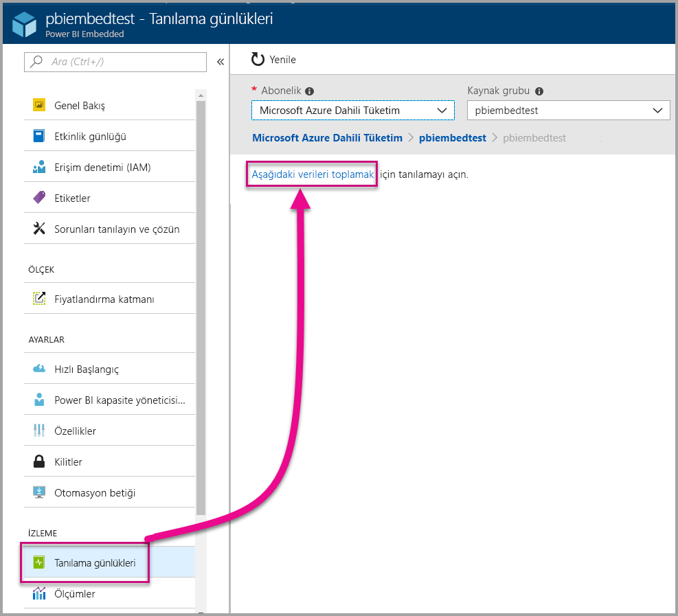
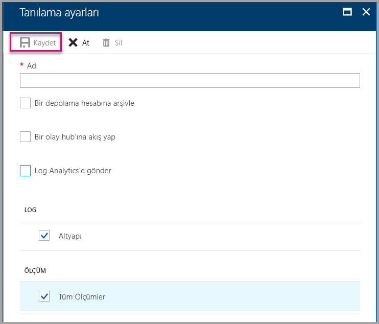
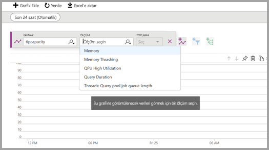
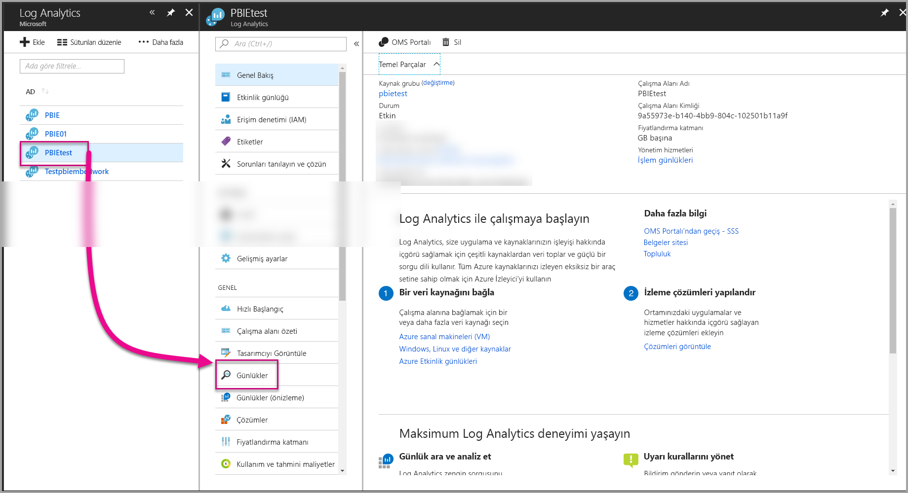
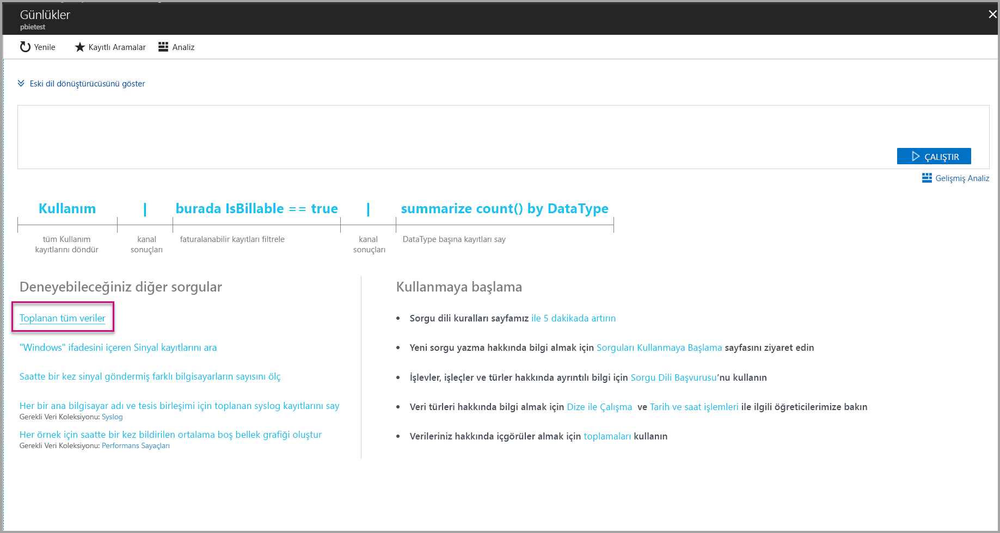
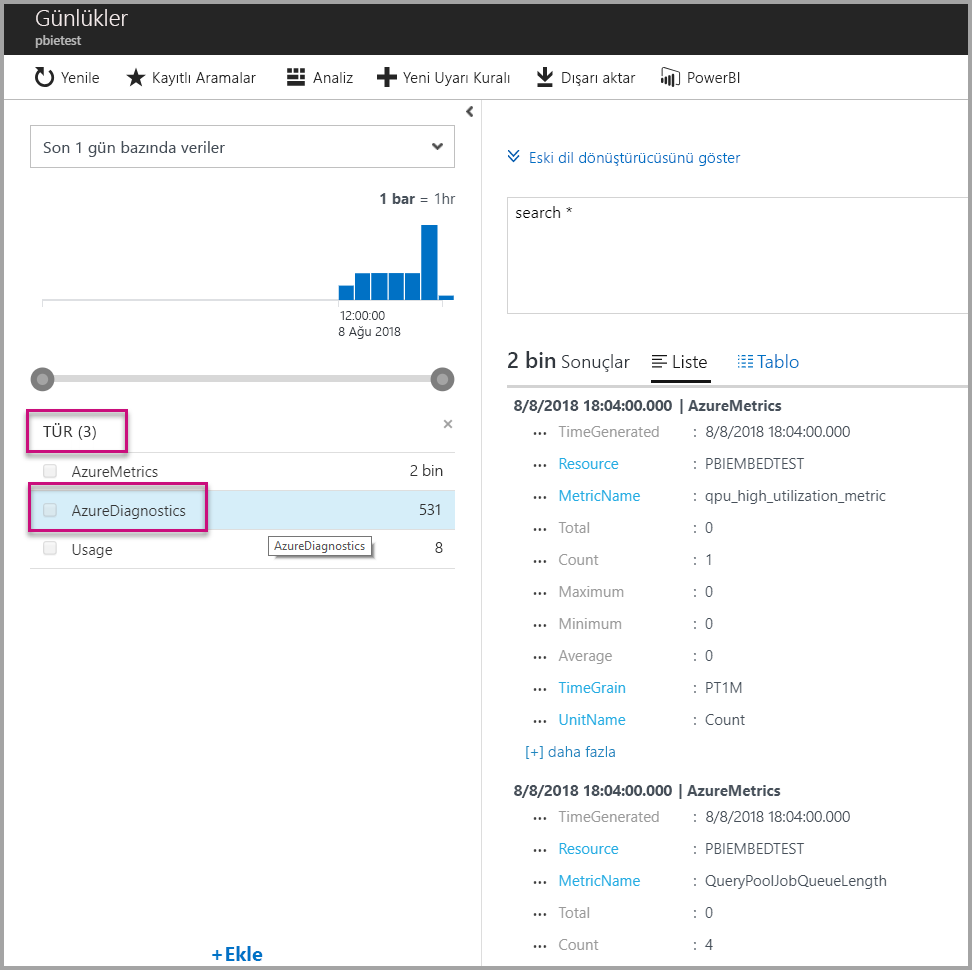
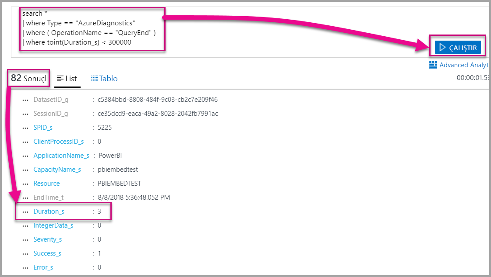

# <a name="diagnostic-logging-for-power-bi-embedded-in-azure"></a>Azure'da Power BI Embedded için tanılama günlüğüne kaydetme

[Azure kaynak tanılama günlükleri](https://docs.microsoft.com/azure/monitoring-and-diagnostics/monitoring-overview-of-diagnostic-logs) ile kapasitenizdeki birçok olayı günlüğe kaydedebilir, bir analiz aracına aktarabilir ve kaynağınızın davranışlarıyla ilgili içgörüler elde edebilirsiniz.

Tanılama özelliklerini aşağıdaki gibi senaryolar için kullanabilirsiniz:

* Uzun süren veya sorunlu sorguların tespit edilmesi.
* [Kapasite ölçümlerinin](https://powerbi.microsoft.com/blog/power-bi-developer-community-april-update/) elde edilmesi.
* Belirli veri kümelerinin kullanımının izlenmesi.

## <a name="set-up-diagnostics-logging"></a>Tanılama günlüğüne kaydetmeyi ayarlama

### <a name="azure-portal"></a>Azure portalı

1. [Azure portal](https://portal.azure.com) > Power BI Embedded kaynağı sayfasında gezinti bölmesinden **Tanılama günlükleri**'ni ve ardından **Tanılamayı aç**'ı seçin.

    

2. **Tanılama ayarları** sayfasında aşağıdaki seçenekleri belirtin:

    * **Ad**: Oluşturulacak tanılama ayarları için bir ad girin.

    * **Bir depolama hesabına arşivle**: Bu seçeneği kullanmak için var olan bir depolama hesabına bağlanmanız gerekir. Depolama hesabı oluşturma yönergeleri için bkz. [Depolama hesabı oluşturma](https://docs.microsoft.com/azure/storage/common/storage-create-storage-account). Ardından portalda bu sayfaya dönerek depolama hesabınızı seçin. Yeni oluşturulan depolama hesaplarının açılan menüde görünmesi birkaç dakika sürebilir. Günlük dosyası JSON biçiminde depolanır.
    * **Bir olay hub'ına akış yap**: Bu seçeneği kullanmak için var olan bir Event Hubs ad alanına ve olay hub'ına bağlanmanız gerekir. Daha fazla bilgi için bkz. [Azure portalı kullanarak Event Hubs ad alanı ve olay hub'ı oluşturma](https://docs.microsoft.com/azure/event-hubs/event-hubs-create).
    * **Log Analytics'e gönder**: Bu seçeneği kullanmak için var olan bir çalışma alanını kullanın veya portalda [yeni bir çalışma alanı oluşturma](https://docs.microsoft.com/azure/log-analytics/log-analytics-quick-collect-azurevm#create-a-workspace) adımlarını izleyerek yeni bir Log Analytics çalışma alanı oluşturun. Bu seçenek yerleşik analiz, pano oluşturma ve bildirim özellikleri sunan [Azure Log Analytics](https://docs.microsoft.com/azure/log-analytics/log-analytics-overview) hizmetinden faydalanır. Log Analytics'i kullanarak diğer veri kaynaklarındaki verilere bağlanabilir ve uygulamanızın tüm kaynaklarını aynı anda görüntüleyebilirsiniz. [Tek tıklamayla Power BI](https://docs.microsoft.com/azure/log-analytics/log-analytics-powerbi)'a da bağlanabilir.
    Log Analytics'teki günlüklerinizi görüntüleme hakkında daha fazla bilgi için bkz. [Log Analytics'te günlük görüntüleme](https://docs.microsoft.com/azure/log-analytics/log-analytics-activity).
    * **Altyapı**: Aşağıda [listelenen altyapı olaylarını](#whats-logged) günlüğe kaydetmek için bu seçeneği belirleyin.
    * **Tüm Ölçümler**: [Ölçümler](https://docs.microsoft.com/azure/analysis-services/analysis-services-monitor#server-metrics) içinde ayrıntılı veri depolamak için bu seçeneği belirleyin. Bir depolama hesabına arşivleme yapıyorsanız tanılama günlüklerinin saklama süresini belirleyebilirsiniz. Saklama süresinin sonunda günlükler otomatik olarak silinir.

3. **Kaydet**'i seçin.

    Tanılama günlüklerinizin kaydedilme şeklini değiştirmek için bu sayfaya dönerek ayarları düzenleyebilirsiniz.

    

### <a name="using-powershell-to-enable-diagnostics"></a>Tanılamayı etkinleştirmek için PowerShell'i kullanma

Ölçümleri ve tanılama günlüğüne kaydetmeyi PowerShell kullanarak etkinleştirmek için aşağıdaki komutları kullanın:

* Tanılama günlüklerinin bir depolama hesabına kaydedilmesini sağlamak için şu komutu kullanın:

    ```powershell
    Set-AzureRmDiagnosticSetting -ResourceId [your resource id] -StorageAccountId [your storage account id] -Enabled $true
    ```
    Depolama hesabı kimliği, günlükleri göndermek istediğiniz depolama hesabının kaynak kimliğidir.

* Tanılama günlüklerinin akışını bir olay hub'ına yapmak için şu komutu kullanın:

    ```powershell
    Set-AzureRmDiagnosticSetting -ResourceId [your resource id] -ServiceBusRuleId [your service bus rule id] -Enabled $true
    ```
* Azure Service Bus kural kimliği, şu biçime sahip bir dizedir:

    ```powershell
    {service bus resource ID}/authorizationrules/{key name}
    ```

* Tanılama günlüklerini Log Analytics çalışma alanına göndermek için şu komutu kullanın:

    ```powershell
        Set-AzureRmDiagnosticSetting -ResourceId [your resource id] -WorkspaceId [resource id of the log analytics workspace] -Enabled $true
    ```

* Log Analytics çalışma alanının kaynak kimliğini almak için aşağıdaki komutu kullanabilirsiniz:

    ```powershell
    (Get-AzureRmOperationalInsightsWorkspace).ResourceId
    ```

Bu parametreleri bir arada kullanarak birden fazla çıkış seçeneği oluşturabilirsiniz.

### <a name="rest-api"></a>REST API

[Azure İzleyici REST API'sini kullanarak tanılama ayarlarını değiştirmeyi](https://docs.microsoft.com/rest/api/monitor/) öğrenin. 

### <a name="resource-manager-template"></a>Resource Manager şablonu

[Resource Manager şablonu kullanarak kaynak oluşturma sırasında tanılama ayarını etkinleştirmeyi](https://docs.microsoft.com/azure/monitoring-and-diagnostics/monitoring-enable-diagnostic-logs-using-template) öğrenin.

## <a name="whats-logged"></a>Günlüğe neler kaydedilir?

**Altyapı** ve/veya **Tüm Ölçümler** kategorisini seçebilirsiniz.

### <a name="engine"></a>Altyapı

Altyapı kategorisi, kaynağa aşağıdaki olayları günlüğe kaydetmesini bildirir ve her olayda şu özellikler bulunur:

|     Olay Adı     |     Olay Açıklaması     |
|----------------------------|----------------------------------------------------------------------------------|
|    Audit Login    |    İzleme başladıktan sonra gerçekleştirilen tüm yeni altyapı bağlantısı olaylarını kaydeder.    |
|    Session Initialize    |    İzleme başladıktan sonra gerçekleştirilen tüm oturum başlatma olaylarını kaydeder.    |
|    Vertipaq Query Begin    |    İzleme başladıktan sonra gerçekleştirilen tüm VertiPaq SE sorgu başlatma olaylarını kaydeder.    |
|    Query Begin    |    İzleme başladıktan sonra gerçekleştirilen tüm sorgu başlatma olaylarını kaydeder.    |
|    Query End    |    İzleme başladıktan sonra gerçekleştirilen tüm sorgu bitiş olaylarını kaydeder.    |
|    Vertipaq Query End    |    İzleme başladıktan sonra gerçekleştirilen tüm VertiPaq SE sorgu bitiş olaylarını kaydeder.    |
|    Audit Logout    |    İzleme başladıktan sonra gerçekleştirilen tüm sonlandırılan altyapı bağlantısı olaylarını kaydeder.    |
|    Hata    |    İzleme başladıktan sonra gerçekleştirilen tüm altyapı hatası olaylarını kaydeder.    |

<br>
<br>

| Özellik Adı | Vertipaq Query End Example | Özellik Açıklaması |
|-------------------|---------------------------------------------------------------------------------------------------------------------------------------------------------------------------------------------------------|--------------------------------------------------------------------------------------------------------------------------|
| EventClass | XM_SEQUERY_END | Olay Sınıfı, olayları kategorilere ayırmak için kullanılır. |
| EventSubclass | 0 | Olay Alt Sınıfı, her olay sınıfıyla ilgili ek bilgi sağlar. (örneğin, 0: VertiPaq Scan) |
| RootActivityId | ff217fd2-611d-43c0-9c12-19e202a94f70 | Kök etkinlik kimliği. |
| CurrentTime | 2018-04-06T18:30:11.9137358Z | Kullanılabilir durumdaysa etkinliğin başlatıldığı saat. |
| StartTime | 2018-04-06T18:30:11.9137358Z | Kullanılabilir durumdaysa etkinliğin başlatıldığı saat. |
| JobID | 0 | İlerlemeye ilişkin iş kimliği. |
| ObjectID | 464 | Nesne kimliği |
| ObjectType | 802012 | ObjectType |
| EndTime | 2018-04-06T18:30:11.9137358Z | Olayın bitiş saati. |
| Süre | 0 | Olayın süresi (milisaniye cinsinden). |
| SessionType | Kullanıcı | Oturum türü (işleme neden olan varlık). |
| ProgressTotal | 0 | İlerleme toplamı. |
| IntegerData | 0 | Tamsayı verileri. |
| Önem | 0 | Bir özel durumun önem derecesi. |
| Başarı | 1 | 1 = başarılı. 0 = başarısız (örneğin 1 değeri izin denetimi işleminin başarılı olduğunu belirtirken 0, bu denetimin başarısız olduğunu gösterir). |
| Hata | 0 | Belirli bir olayın hata numarası. |
| ConnectionID | 3 | Benzersiz bağlantı kimliği. |
| DatasetID | 5eaa550e-06ac-4adf-aba9-dbf0e8fd1527 | Kullanıcının deyiminin çalıştırıldığı veri kümesinin kimliği. |
| SessionID | 3D063F66-A111-48EE-B960-141DEBDA8951 | Oturum GUID'si. |
| SPID | 180 | Sunucu işlem kimliği. Kullanıcı oturumunu benzersiz bir şekilde tanımlar. Doğrudan XML/A tarafından kullanılan oturum GUID'sine karşılık gelir. |
| ClientProcessID | null | İstemci uygulamasının işlem kimliği. |
| ApplicationName | null | Sunucu bağlantısını oluşturan istemci uygulamasının adı. |
| CapacityName | pbi641fb41260f84aa2b778a85891ae2d97 | Power BI Embedded kapasite kaynağının adı. |


### <a name="allmetrics"></a>Tüm Ölçümler

**Tüm Ölçümler** seçeneğinin işaretlenmesi, tüm ölçümlerin verilerini günlüğe kaydederek bir Power BI Embedded kaynağı ile kullanmanızı sağlar.

   

## <a name="manage-your-logs"></a>Günlüklerinizi yönetme

Günlükler genelde ayarların tamamlanmasından sonraki birkaç saat içinde kullanılabilir. Depolama hesabınızdaki günlükleri istediğiniz şekilde yönetebilirsiniz:

* Günlüklerinize erişimi kısıtlayarak güvenliklerini sağlamak için standart Azure erişim denetimi yöntemlerini kullanabilirsiniz.
* Depolama hesabınızda tutmak istemediğiniz günlükleri silebilirsiniz.
* Eski günlüklerin depolama hesabınızdan silinmesini sağlamak için saklama süresi belirlemeyi unutmayın.

## <a name="view-logs-in-log-analytics"></a>Günlükleri Log Analytics'te görüntüleme

Ölçümler ve sunucu olayları, yan yana analiz edebilmeniz için Log Analytics'teki xEvent'ler ile tümleştirilir. Log Analytics ayrıca diğer Azure hizmetlerindeki olayları da alarak mimarinizdeki tanılama günlüğü verilerini bir arada görmenizi sağlayacak şekilde yapılandırılabilir.

Tanılama verilerinizi Log Analytics'te görüntülemek için aşağıda gösterilen şekilde sol taraftaki menüden veya Yönetim alanından **Günlükler** sayfasını açın.



Veri toplamayı etkinleştirdiniz, şimdi **Günlükler** sayfasında **Toplanan tüm veriler**'i seçin.



**Tür** bölümünde **AzureDiagnostics**'i ve ardından **Uygula**'yı seçin. AzureDiagnostics, Altyapı olaylarını içerir. Anında bir Log Analytics sorgusu oluşturulur.



**EventClass\_'ları** veya olay adlarından birini seçtiğinizde Log Analytics sorguyu oluşturmaya devam eder. Sorgularınızı daha sonra kullanmak üzere kaydetmeyi unutmayın.

Toplanan verilerde gelişmiş sorgulama, pano ve uyarı oluşturma özelliklerini sunan [Log Analytics](https://docs.microsoft.com/azure/log-analytics/) sayfasını incelemeyi unutmayın.

### <a name="queries"></a>Sorgular

Kullanabileceğiniz yüzlerce sorgu vardır. Başlamanıza yardımcı olacak birkaç seçenek aşağıda verilmiştir. Yeni Günlük Araması sorgu dilini kullanma hakkında daha fazla bilgi için bkz. [Log Analytics'teki günlük aramalarını anlama](https://docs.microsoft.com/azure/log-analytics/log-analytics-log-search).

* Tamamlanması beş dakikadan kısa (300.000 milisaniye) süren sorgu yanıtı.

    ```
    search *
    | where Type == "AzureDiagnostics"
    | where ( OperationName == "QueryEnd" )
    | where toint(Duration_s) < 300000
    ```

    

* Kapasite adlarını tanımlayın.

    ```
    search *
    | where ( Type == "AzureDiagnostics" )
    | summarize count() by CapacityName_s 
    ```

    

## <a name="next-steps"></a>Sonraki adımlar

Azure kaynaklarında tanılama günlüğüne kaydetme hakkında daha fazla bilgi edinebilirsiniz.

> [!div class="nextstepaction"]
> [Azure kaynaklarında tanılama günlüğüne kaydetme](https://docs.microsoft.com/azure/monitoring-and-diagnostics/monitoring-overview-of-diagnostic-logs)

> [!div class="nextstepaction"]
> [Set-AzureRmDiagnosticSetting](https://docs.microsoft.com/powershell/module/azurerm.insights/Set-AzureRmDiagnosticSetting)
