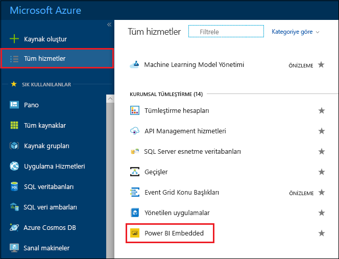
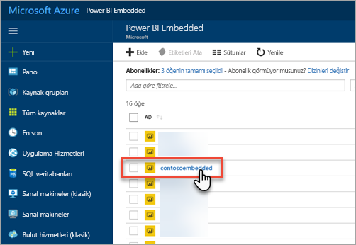
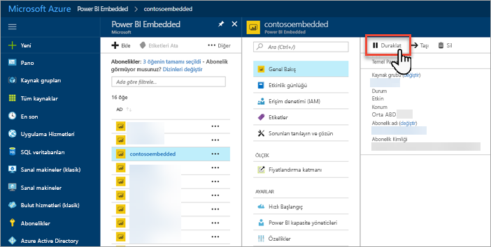
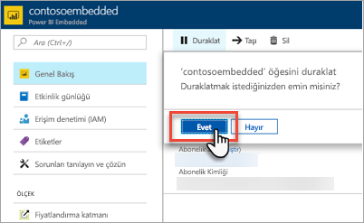
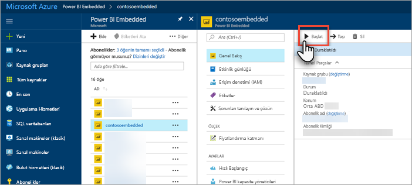
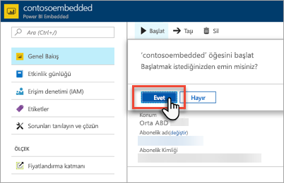

# Azure portalda Power BI Embedded kapasitenizi duraklatma ve başlatma

Bu makalede Microsoft Azure'daki bir Power BI Embedded kapasitesini duraklatma ve başlatma adımları anlatılmaktadır. Bu makalede önceden bir Power BI Embedded kapasitesi oluşturduğunuz kabul edilmektedir. Henüz oluşturmadıysanız başlamak için bkz. [Azure portalda Power BI Embedded kapasitesi oluşturma](azure-pbie-create-capacity.md).

Azure aboneliğiniz yoksa başlamadan önce [ücretsiz bir hesap](https://azure.microsoft.com/free/) oluşturun.

## Kapasitenizi duraklatma

Kapasitenizi duraklattığınızda faturalama gerçekleşmez. Kapasitenizi uzun bir süre boyunca kullanmayacaksanız duraklatma çok iyi bir seçenektir. Kapasitenizi duraklatmak için aşağıdaki adımları kullanın.

> [!NOTE]
> Kapasiteyi duraklattığınızda içerikler Power BI hizmetinde kullanım dışı kalabilir. Hizmetin kesintiye uğramasını önlemek için kapasitenizi duraklatmadan önce çalışma alanlarının atamasını kaldırdığınızdan emin olun.

1. [Azure portalında](https://portal.azure.com/) oturum açın.

2. Kapasitelerinizi görmek için **Tüm hizmetler** > **Power BI Embedded** yolunu izleyin.

    

3. Duraklatmak istediğiniz kapasiteyi seçin.

    

4. Kapasite ayrıntılarında **Duraklat**'ı seçin.

    

5. **Evet**'i seçerek kapasiteyi duraklatmak istediğinizi onaylayın.

    

## Kapasitenizi başlatma

Kapasitenizi başlatarak kullanmaya devam edebilirsiniz. Kapasiteyi başlattığınızda faturalandırma da devam eder.

1. [Azure portalında](https://portal.azure.com/) oturum açın.

2. Kapasitelerinizi görmek için **Tüm hizmetler** > **Power BI Embedded** yolunu izleyin.

    

3. Başlatmak istediğiniz kapasiteyi seçin.

    

4. Kapasite ayrıntılarında **Başlat**'ı seçin.

    

5. **Evet**'i seçerek kapasiteyi başlatmak istediğinizi onaylayın.

    

Kapasiteyi başlattıktan sonra atanmış içerikler kullanılmaya devam eder.

## Sonraki adımlar

Kapasitenizin ölçeğini büyütmek veya küçültmek isterseniz bkz. [Power BI Embedded kapasitenizi ölçeklendirme](azure-pbie-scale-capacity.md).

Uygulamanıza Power BI içeriği eklemeye başlamak için bkz. [Power BI panolarınızı, raporlarınızı ve kutucuklarınızı ekleme](https://powerbi.microsoft.com/documentation/powerbi-developer-embedding-content/).

Başka bir sorunuz mu var? [Power BI Topluluğu'na sorun](https://community.powerbi.com/)