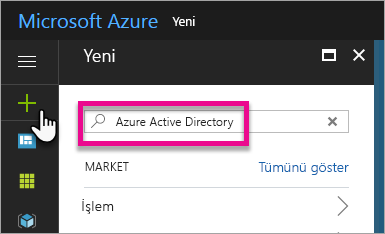
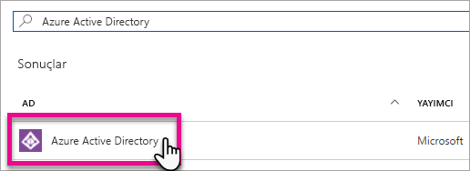
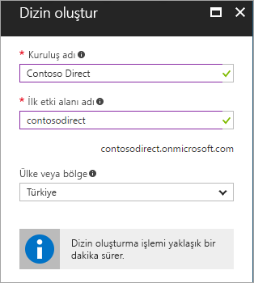
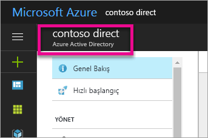
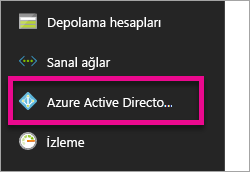
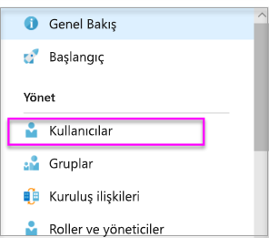
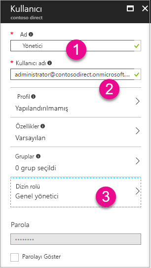
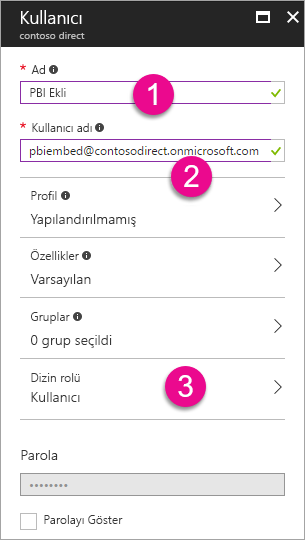
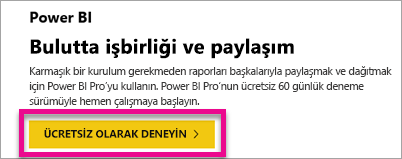

# Power BI ile kullanmak üzere bir Azure Active Directory kiracısı oluşturma

[Power BI REST API'lerini](../automation/rest-api-reference.md) çağıran özel uygulama için yeni bir Azure Active Directory (Azure AD) kiracısı oluşturmayı öğrenin.

Kiracı, Azure Active Directory'de bir kuruluşu temsil eder. Kuruluşunuzun Azure, Microsoft Intune veya Office 365 gibi bir Microsoft bulut hizmetine kaydolduğunda aldığı ve sahip olduğu ayrılmış bir Azure AD hizmeti örneğidir. Her Azure AD kiracısı diğer Azure AD kiracılarından ayrıdır.

Azure AD kiracısına sahip olduktan sonra bir uygulama tanımlayabilir ve [Power BI REST API'lerini](../automation/rest-api-reference.md) çağırabilmesi için uygulamanıza izin atayabilirsiniz.

Kuruluşunuz, uygulamanızla birlikte kullanabileceğiniz bir Azure AD kiracısına sahip olabilir. Ayrıca özel olarak uygulamanız için yeni kiracı da oluşturabilirsiniz. Bu makalede yeni kiracının nasıl oluşturulduğu gösterilir.

## Azure Active Directory kiracısı oluşturma

Power BI'ı özel uygulamanızla tümleştirmek için Azure AD'nin içinde Azure AD dizini gerektiren bir uygulama tanımlamalısınız. Bu dizin sizin *kiracınızdır*. Kuruluşunuzun Power BI veya Office 365 kullanmadığı için henüz bir kiracısı yoksa [bir geliştirme ortamı ayarlamanız gerekir](https://docs.microsoft.com/azure/active-directory/develop/active-directory-howto-tenant). Ayrıca, uygulamanızın kuruluşunuzun kiracısıyla karışmasını istemediğiniz durumlarda da bu öğeleri yalıtmanızı sağlayacak yeni bir kiracı oluşturmanız gerekir. Yalnızca test amacıyla kullanmak üzere de bir kiracı oluşturmak isteyebilirsiniz.

Yeni Azure AD kiracısı oluşturmak için:

1. [Azure portalına](https://portal.azure.com) gidip Azure aboneliği olan bir hesapla oturum açın.

2. **Artı simgesini (+)** seçip **Azure Active Directory** terimini aratın.

    

3. Arama sonuçlarında **Azure Active Directory** girişini seçin.

    

4. **Oluştur**'u seçin.

5. **Kuruluş adı** ve **İlk etki alanı adı** sağlayın. Ardından **Oluştur**'u seçin. Dizininiz oluşturulur.

    

   > [!NOTE]
   > İlk etki alanınız onmicrosoft.com'un bir parçasıdır. Daha sonra başka etki alanı adları ekleyebilirsiniz. Bir kiracı dizinine birden fazla etki alanı atanabilir.

6. Dizin oluşturma işlemini tamamladıktan sonra yeni dizininizi yönetmek için bilgi kutusunu seçin.

Ardından kiracı kullanıcılarını ekleyeceksiniz.

## Azure Active Directory kiracısı kullanıcıları oluşturma

Dizini oluşturduğunuza göre şimdi de en az iki kullanıcı oluşturalım. Biri kiracının Genel Yöneticisi ve diğeri de ekleme için ana kullanıcıdır. Ana kullanıcıyı bir hizmet hesabı olarak düşünebilirsiniz.

1. Azure portalında Azure Active Directory bölmesinde olduğunuzdan emin olun.

    

    Değilseniz sol taraftaki hizmet gezintisinden Azure Active Directory simgesini seçin.

    

2. **Yönet** bölümünde **Kullanıcılar**'ı seçin.

    

3. **Tüm kullanıcılar**'ı ve ardından **+ Yeni kullanıcı**'yı seçin.

4. Kiracınızın Genel Yöneticisi için **Ad** ve **Kullanıcı adı** sağlayın. **Dizin rolü**'nü **Genel yönetici** olarak değiştirin. İsterseniz geçici parolayı da gösterebilirsiniz. İşiniz bittiğinde **Oluştur**'u seçin.

    

5. Normal kiracı kullanıcı için de aynı işlemi yapın. Bu hesabı ana ekleme hesabınız olarak kullanabilirsiniz. Bu kez **Dizin rolü**'nü **Kullanıcı** olarak bırakın. Parolayı not alın ve **İleri**'yi seçin.

    

6. 5\. adımda oluşturduğunuz kullanıcı hesabıyla Power BI'a kaydolun. [Powerbi.com](https://powerbi.microsoft.com/get-started/) adresine gidip **Power BI - Cloud collaboration and sharing** (Power BI - Bulutta işbirliği ve paylaşım) bölümünün altındaki **Try free** (Ücretsiz deneyin) öğesini seçin.

    

    Kaydolduktan sonra Power BI Pro sürümünü 60 gün boyunca denemek isteyip istemediğiniz sorulur. Bunu kabul edip Pro kullanıcısı olabilir ve [bir ekli çözüm geliştirmeye başlama](embed-sample-for-customers.md) seçeneğinden yararlanabilirsiniz.

   > [!NOTE]
   > Kullanıcı hesabınızın e-posta adresiyle oturum açtığınızdan emin olun.

## Sonraki adımlar

Artık bir Azure AD kiracınız olduğuna göre, bu kiracıyı kullanarak Power BI'ın içindeki öğeleri test edebilirsiniz. Ayrıca uygulamanıza Power BI panoları ve raporları ekleyebilirsiniz. Daha fazla bilgi için bkz. [Power BI panolarınızı, raporlarınızı ve kutucuklarınızı ekleme](embed-sample-for-customers.md).

[Azure Active Directory nedir?](https://docs.microsoft.com/azure/active-directory/active-directory-whatis) 
 
[Hızlı başlangıç: Geliştirme ortamınızı ayarlama](https://docs.microsoft.com/azure/active-directory/develop/active-directory-howto-tenant)  

Başka bir sorunuz mu var? [Power BI Topluluğu'na sorun](https://community.powerbi.com/)
