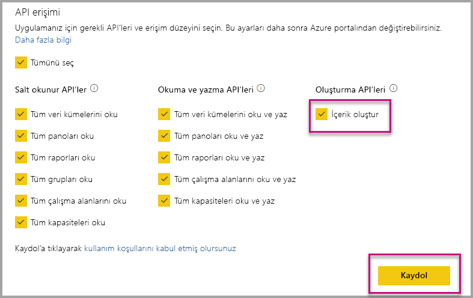

# Kuruluşunuz için içerik eklerken Power BI uygulamalarını otomatik olarak yükleme

Uygulamadan içerik eklemek için, ekleme işlemini yapan kullanıcının [uygulamaya erişimi](../../collaborate-share/service-create-distribute-apps.md) olmalıdır. Uygulama kullanıcı için yüklendiyse ekleme işlemi sorunsuz çalışır. Daha fazla bilgi için bkz. [Uygulamadan raporlar veya panolar ekleme](embed-from-apps.md). PowerBI.com'da tüm uygulamaların [otomatik olarak yüklenebilmesini](https://powerbi.microsoft.com/blog/automatically-install-apps/) tanımlamak mümkündür. Bununla birlikte bu eylem kiracı düzeyinde yapılır ve tüm uygulamalar için geçerli olur.

## Ekleme sırasında uygulamayı otomatik olarak yükleme

Kullanıcının uygulamaya erişim varsa ama uygulama yüklenmemişse, ekleme başarısız olur. Bu nedenle uygulamadan içerik eklerken bu hatalardan kaçınmak için uygulamanın ekleme sırasında otomatik olarak yüklenmesine izin verebilirsiniz. Bu eylem, kullanıcının eklemeye çalıştığı uygulama yüklü değilse otomatik olarak yükleneceği anlamına gelir. Dolayısıyla istediğiniz içerik anında eklenir ve sonuçta kullanıcı için sorunsuz bir deneyim sağlanır.

## Power BI kullanıcıları için ekleme (Veriler kullanıcıya aittir)

Kullanıcılarınızda uygulamaların otomatik yüklenmesine izin vermek için, [uygulamanızı kaydederken](register-app.md#register-an-azure-ad-app) 'İçerik Oluşturma' izni vermeli veya uygulamanızı zaten kaydettiyseniz bu izni eklemelisiniz.

Ardından ekleme URL'sinde uygulama kimliğini sağlamalısınız. Uygulama kimliğini sağlamak için, uygulama oluşturucunun önce uygulamayı yüklemesi ve ardından desteklenen [Power BI Rest API](/rest/api/power-bi/) çağrılarından ([Get Reports](/rest/api/power-bi/reports/getreports) veya [Get Dashboards](/rest/api/power-bi/dashboards/getdashboards)) birini kullanması gerekir. Sonra uygulama oluşturucu REST API yanıtından ekleme Url'sini almalıdır. İçerik bir uygulamadan geliyorsa uygulama kimliği URL'de gösterilir.  Ekleme URL'sini aldıktan sonra bunu kullanarak düzenli aralıklarla ekleyebilirsiniz.

## Güvenli Ekleme

Uygulamaları otomatik yüklemeyi kullanmak için, uygulama sağlayıcının önce uygulamayı yüklemesi ve ardından PowerBI.com'da uygulamaya gitmesi, rapora gitmesi ve normal yollarla bağlantıyı alması gerekir. Uygulamaya erişimi olan diğer tüm kullanıcılar bağlantıyı kullanıp raporu ekleyebilir.

## Önemli noktalar ve sınırlamalar

* Bu senaryoda yalnızca raporları ve panoları ekleyebilirsiniz.

* Bu özellik şu anda uygulamanın sahip olduğu verilerde ve SharePoint ekleme senaryolarında desteklenmemektedir.