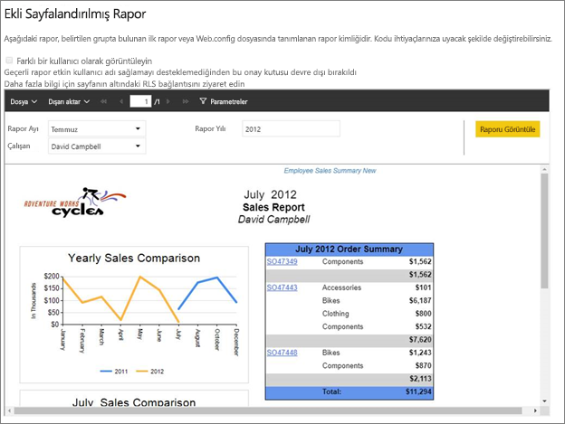
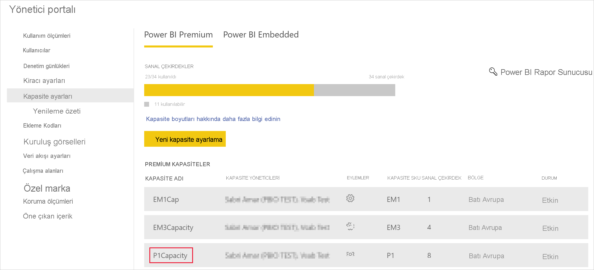
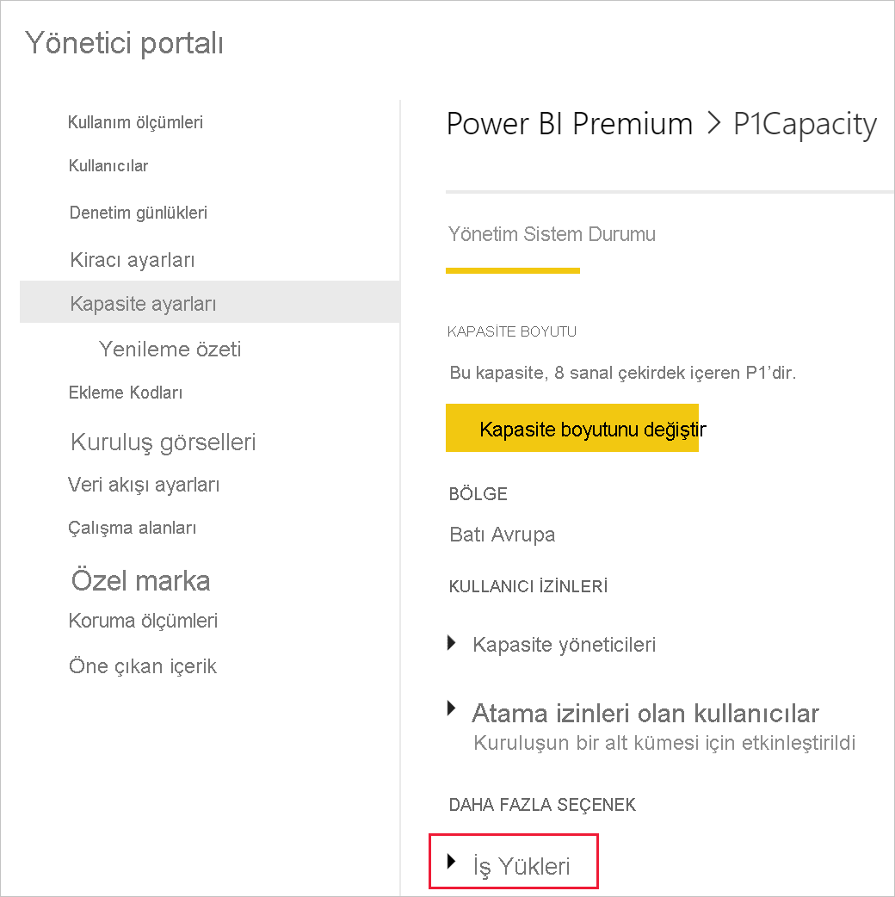
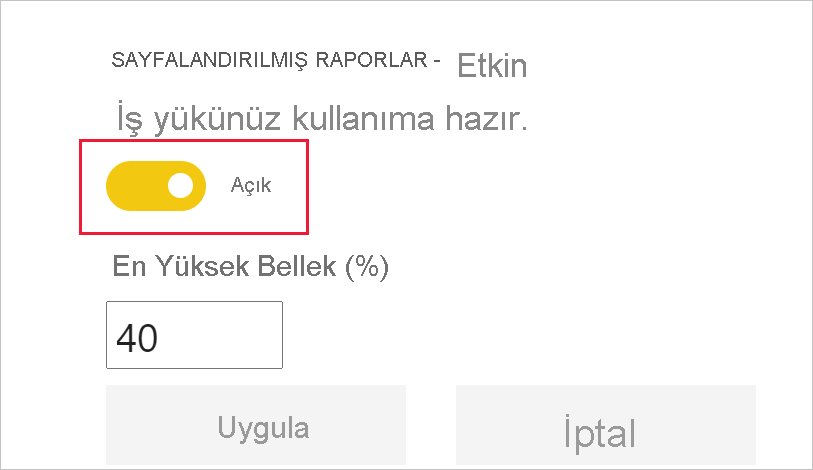
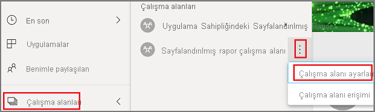
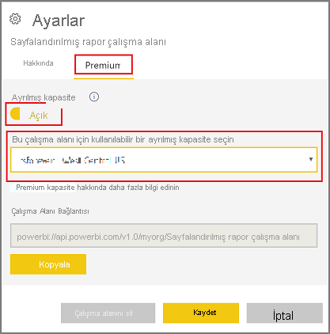
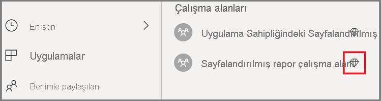
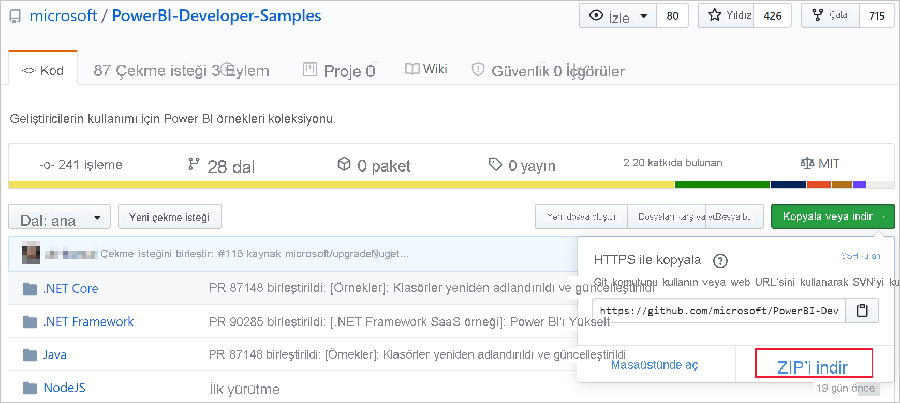
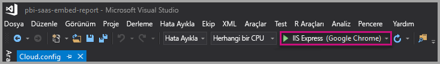
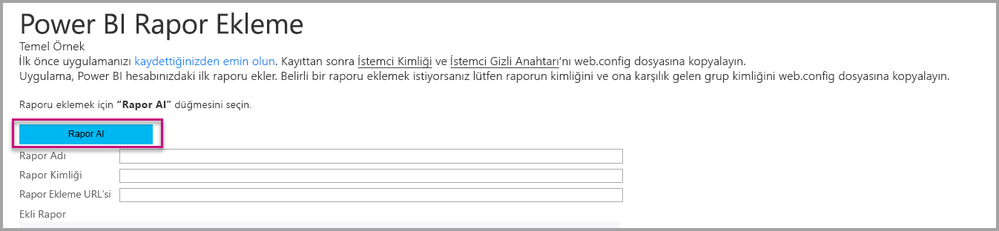

# <a name="tutorial-embed-power-bi-paginated-reports-into-an-application-for-your-organization"></a>Öğretici: Uygulamaya kuruluşunuz için sayfalandırılmış Power BI raporları ekleme

**Power BI**’da *kullanıcı verilere sahiptir* senaryosunu kullanarak bir uygulamaya kuruluşunuz için sayfalandırılmış raporlar ekleyebilirsiniz.

Sayfalandırılmış raporlar, yüksek kaliteli yazdırma için tasarlanmış raporlardır. Bu raporlar genellikle, yazdırılan sayfalara sığacak şekilde işlenmiş çok sayıda veri içerir.
Power BI’ın sayfalandırılmış raporları nasıl desteklediğini anlamak için bkz. [Power BI Premium’daki sayfalandırılmış raporlar nelerdir?](../../paginated-reports/paginated-reports-report-builder-power-bi.md)

**Verilerin sahibi kullanıcıdır** yapısı, tümleşik analizi kullanmak için uygulamanızın Power BI hizmetinin kapsamını genişletebilmesini sağlar. Bu öğreticide, sayfalandırılmış raporun bir uygulamayla nasıl tümleştirileceği gösterilmektedir.

Kuruluşunuz için bir uygulamaya Power BI eklemek için Power BI JavaScript API’si ile birlikte Power BI .NET SDK’sını kullanırsınız.



Bu öğreticide, aşağıdaki görevleri öğreneceksiniz:
> [!div class="checklist"]
> * Azure’da bir uygulama kaydetme.
> * Power BI kiracınızı kullanarak uygulamaya Power BI sayfalandırılmış raporu ekleme.

## <a name="prerequisites"></a>Önkoşullar
Başlamak için şunlara sahip olmalısınız:

* [Power BI Pro hesabı](../../admin/service-admin-purchasing-power-bi-pro.md).

* [Azure Active Directory kiracınız](create-an-azure-active-directory-tenant.md) ayarlanmış olmalıdır.

* En az P1 kapasitesi. Bkz. [Sayfalandırılmış raporlar için hangi boyutta Premium kapasite gerekiyor?](../../paginated-reports/paginated-reports-faq.md#what-size-premium-capacity-do-i-need-for-paginated-reports)

**Power BI Pro**’ya kaydolmadıysanız başlamadan önce [ücretsiz deneme için kaydolun](https://powerbi.microsoft.com/pricing/).

>[!NOTE]
>[Kullanıcı Başına Premium (PPU)](../../admin/service-premium-per-user-faq.md) desteklenir. Ancak PPU kullanıyorsanız yalnızca kuruluşunuzdaki PPU kullanıcıları çözümünüze erişebilir.

## <a name="set-up-your-power-bi-environment"></a>Power BI ortamınızı ayarlama

Power BI’ı sayfalandırılmış raporlarınızı ekleyecek şekilde ayarlamak için bu bölümdeki yönergeleri izleyin.

### <a name="register-a-server-side-web-application-app"></a>Sunucu tarafı web uygulaması kaydetme

Sunucu tarafı web uygulaması kaydetmek için [Power BI ile kullanmak için Azure AD uygulamasını kaydetme](register-app.md) sayfasındaki yönergeleri izleyin.

>[!NOTE]
>Uygulamayı kaydederken aşağıdakileri yaptığınızdan emin olun:
>* Uygulama gizli anahtarını alma
>* Uygulamanıza **Report.ReadAll** izinlerini (kapsam) uygulayın.

### <a name="create-a-capacity"></a>Kapasite oluşturma

Kapasite oluşturduğunuzda, uygulama çalışma alanınızdaki içeriğe özel kaynaktan yararlanabilirsiniz. Sayfalandırılmış raporlar için uygulama çalışma alanınızı en az P1 kapasitesiyle desteklemeniz gerekir. [Power BI Premium](../../admin/service-premium-what-is.md)’u kullanarak kapasite oluşturabilirsiniz.

Aşağıdaki tabloda, [Microsoft Office 365](../../admin/service-admin-premium-purchase.md)’te sayfalandırılmış raporlara yönelik kapasite oluşturmak için kullanılabilen Power BI Premium SKU’ları listelenmektedir:

| Kapasite düğümü | Toplam sanal çekirdek<br/>(arka uç + ön uç) | Arka uç sanal çekirdekleri | Ön uç sanal çekirdekleri | DirectQuery/canlı bağlantı sınırları |
| --- | --- | --- | --- | --- | --- |
| P1 |8 sanal çekirdek |4 sanal çekirdek, 25 GB RAM |4 sanal çekirdek |saniyede 30 |
| P2 |16 sanal çekirdek |8 sanal çekirdek, 50 GB RAM |8 sanal çekirdek |saniyede 60 |
| P3 |32 sanal çekirdek |16 sanal çekirdek, 100 GB RAM |16 sanal çekirdek |saniyede 120 |
| P4 |64 sanal çekirdek |32 sanal çekirdek, 200 GB RAM |32 sanal çekirdek |saniyede 240 |
| P5 |128 sanal çekirdek |64 sanal çekirdek, 400 GB RAM |64 sanal çekirdek |saniyede 480 |
|||||

### <a name="enable-paginated-reports-workload"></a>Sayfalandırılmış raporların iş yükünü etkinleştirme

Kapasitenizde sayfalandırılmış raporların iş yükünü etkinleştirmeniz gerekir.

1. [Power BI > Yönetim portalı > Kapasite ayarları](https://app.powerbi.com/admin-portal/capacities)’nda oturum açın.

2. Sayfalandırılmış raporu karşıya yüklemek istediğiniz çalışma alanını içeren kapasiteyi seçin.

    

3. **İş yüklerini** genişletin.

    

4. Sayfalandırılmış raporların iş yükünü etkinleştirin.

    

### <a name="assign-an-app-workspace-to-a-capacity"></a>Bir kapasiteye uygulama çalışma alanı atama

Kapasite oluşturduktan sonra, uygulama çalışma alanınızı bu kapasiteye atayabilirsiniz. Bu işlemi tamamlamak için şu adımları uygulayın:

1. Power BI hizmetinde, çalışma alanlarını genişletin ve içeriğinizi eklemek için kullandığınız çalışma alanındaki **Diğer** seçeneğini belirleyin. Sonra **Çalışma alanı ayarları**’nı seçin.

    

2. **Premium**’u seçin ve **Kapasite**’yi etkinleştirin. Oluşturduğunuz kapasiteyi seçin. Sonra **Kaydet**'i seçin.

    

3. **Kaydet**’i seçtikten sonra, uygulama çalışma alanının yanında bir baklava işareti görmeniz gerekir.

    

### <a name="create-and-publish-your-power-bi-paginated-reports"></a>Power BI sayfalandırılmış raporlarınızı oluşturma ve yayımlama

[Power BI Rapor Oluşturucusu](../../paginated-reports/paginated-reports-report-builder-power-bi.md#create-reports-in-power-bi-report-builder)’nu kullanarak sayfalandırılmış raporlarınızı oluşturabilirsiniz. Daha sonra en az P1 kapasitesine atanmış bir uygulama çalışma alanına [raporu yükleyebilir](../../paginated-reports/paginated-reports-quickstart-aw.md#upload-the-report-to-the-service) ve [sayfalandırılmış raporlar iş yükünü](#enable-paginated-reports-workload) açabilirsiniz. Raporu yükleyen son kullanıcının uygulama çalışma alanında yayımlama işlemi yapabilmesi için bir Power BI Pro lisansına sahip olması gerekir.
   
## <a name="embed-your-content-by-using-the-sample-application"></a>Örnek uygulamayı kullanarak içeriğinizi ekleme

Bu örnek tanıtım amacıyla bilerek basit tutulmuştur.

Örnek uygulamayı kullanarak içeriğinizi eklemeye başlamak için aşağıdaki adımları izleyin.

1. [Visual Studio](https://www.visualstudio.com/)'yu (sürüm 2013 veya üzeri) indirin. En son [NuGet paketini](https://www.nuget.org/profiles/powerbi) indirdiğinizden emin olun.

2. [PowerBI-Developer-Samples](https://github.com/Microsoft/PowerBI-Developer-Samples)’ı indirin ve .NET Framework > Kuruluşunuz için ekleme > integrate-web-app > **PBIWebApp**’i açın.

    

3. Örnek uygulamada **Cloud.config** dosyasını açın ve uygulamanızı çalıştırmak için aşağıdaki alanları doldurun:
    * [Uygulama Kimliği](#application-id)
    * [Çalışma Alanı Kimliği](#workspace-id)
    * [Rapor Kimliği](#report-id)
    * [AADAuthorityUrl](#aadauthorityurl)

    

### <a name="application-id"></a>Uygulama Kimliği

**applicationId** bilgilerini **Azure**’daki **Uygulama Kimliği** ile doldurun. Uygulama, izin istediğiniz kullanıcılara kendini tanıtmak için **applicationId** değerini kullanır.

**applicationId** değerini almak için aşağıdaki adımları izleyin:

1. [Azure portalında](https://portal.azure.com) oturum açın.

2. Sol gezinti bölmesinde **Tüm Hizmetler**'i, sonra da **Uygulama Kayıtları**'nı seçin.

3. **applicationId** değerinin gerektiği uygulamayı seçin.

    

4. GUID olarak listelenen bir **Uygulama Kimliği** vardır. Bu **Uygulama Kimliği**’ni uygulamanın **applicationId** değeri olarak kullanın.

    

### <a name="workspace-id"></a>Çalışma Alanı Kimliği

**workspaceId** bilgisini Power BI’daki uygulama çalışma alanı (grup) GUID’si ile doldurun. Bu bilgiyi Power BI hizmetinin oturumu açıkken URL'den alabileceğiniz gibi PowerShell'i kullanarak da alabilirsiniz.

URL <br>


PowerShell <br>

```powershell
Get-PowerBIworkspace -name "User Owns Embed Test"
```

   

### <a name="report-id"></a>Rapor Kimliği

**reportId** bilgisini Power BI’daki rapor GUID’si ile doldurun. Bu bilgiyi Power BI hizmetinin oturumu açıkken URL'den alabileceğiniz gibi PowerShell'i kullanarak da alabilirsiniz.


PowerShell <br>

```powershell
Get-PowerBIworkspace -name "User Owns Embed Test" | Get-PowerBIReport -Name "Sales Paginated Report"
```


### <a name="aadauthorityurl"></a>AADAuthorityUrl

**AADAuthorityUrl** alanını kurumsal kiracınızla eklemenize veya konuk kullanıcıyla eklemenize olanak tanıyan URL'yle doldurun.

Kurumsal kiracınızla eklemek için şu URL'yi kullanın: *https://login.microsoftonline.com/common/oauth2/authorize* .

Konukla eklemek için şu URL'yi kullanın: *`https://login.microsoftonline.com/report-owner-tenant-id`* . Burada *report-owner-tenant-id* yerine rapor sahibinin kiracı kimliğini ekleyin.

### <a name="run-the-application"></a>Uygulamayı çalıştırma

1. **Visual Studio**’da **Çalıştır**’ı seçin.

    

2. Ardından **Rapor Ekle**’yi seçin. Test etmeyi seçtiğiniz içeriğe (raporlar, panolar veya kutucuklar) bağlı olarak uygulamada bu seçeneği belirleyin.

    

3. Artık raporu örnek uygulamada görüntüleyebilirsiniz.

    

## <a name="next-steps"></a>Sonraki adımlar

Bu öğreticide, Power BI kuruluş hesabınızı kullanarak bir uygulamaya Power BI sayfalandırılmış raporları eklemeyi öğrendiniz. 

> [!div class="nextstepaction"]
> [Uygulamalardan ekleme](embed-from-apps.md)

> [!div class="nextstepaction"]
>[Müşterileriniz için Power BI içeriği ekleme](embed-sample-for-customers.md)

> [!div class="nextstepaction"]
>[Müşterileriniz için sayfalandırılmış Power BI raporları ekleme](embed-paginated-reports-customers.md)

Başka sorularınız varsa [Power BI Topluluğu’na sormayı deneyin](http://community.powerbi.com/).