# <a name="tutorial-embed-power-bi-content-into-an-application-for-your-organization"></a>Öğretici: Kuruluşunuz için Power BI içeriğini bir uygulamaya ekleme

**Power BI**’da, verilerin sahibi kullanıcıdır yapısını kullanarak bir uygulamaya raporlar (Power BI veya Sayfalandırılmış), panolar veya kutucuklar ekleyebilirsiniz. **Verilerin sahibi kullanıcıdır** yapısı, tümleşik analizi kullanmak için uygulamanızın Power BI hizmetinin kapsamını genişletebilmesini sağlar. Bu öğreticide, bir raporun (Power BI veya Sayfalandırılmış) bir uygulamayla nasıl tümleştirileceği gösterilmektedir. Kuruluşunuz için bir uygulamaya Power BI eklemek için Power BI JavaScript API’si ile birlikte Power BI .NET SDK’sını kullanırsınız.

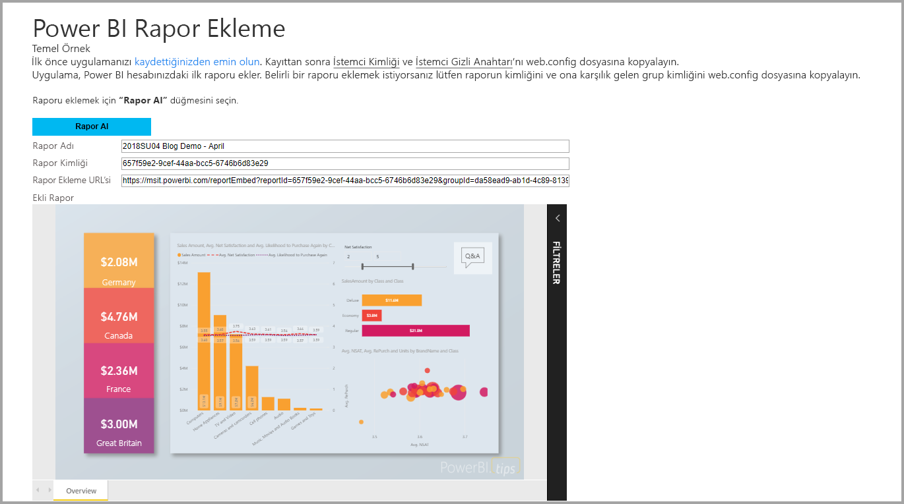

Bu öğreticide, aşağıdaki görevleri öğreneceksiniz:
> [!div class="checklist"]
> * Azure’da bir uygulama kaydetme.
> * Power BI kiracınızı kullanarak uygulamaya Power BI raporu veya Sayfalandırılmış rapor ekleme.

## <a name="prerequisites"></a>Önkoşullar

Başlamak için şunlara sahip olmalısınız:

* [Power BI Pro hesabı](../../service-self-service-signup-for-power-bi.md).
* [Microsoft Azure](https://azure.microsoft.com/) aboneliği.
* [Azure Active Directory kiracınız](create-an-azure-active-directory-tenant.md) ayarlanmış olmalıdır.
* Sayfalandırılmış raporları eklemek için en az P1 kapasitesine ihtiyacınız vardır. Bkz. [Sayfalandırılmış raporlar için hangi boyutta Premium kapasite gerekiyor?](../../paginated-reports/paginated-reports-faq.md#what-size-premium-capacity-do-i-need-for-paginated-reports)

**Power BI Pro**’ya kaydolmadıysanız başlamadan önce [ücretsiz deneme için kaydolun](https://powerbi.microsoft.com/pricing/).

Azure aboneliğiniz yoksa başlamadan önce [ücretsiz bir hesap](https://azure.microsoft.com/free/?WT.mc_id=A261C142F) oluşturun.

## <a name="set-up-your-embedded-analytics-development-environment"></a>Eklediğiniz analiz geliştirme ortamını ayarlama

Raporları, panoları veya kutucukları uygulamanıza eklemeye başlamadan önce ortamınızın Power BI ile ekleme işlevlerine izin verdiğinden emin olmanız gerekir.

Hızla çalışmaya başlayıp ortam oluşturma ve rapor ekleme işlemi boyunca adım adım size yol gösteren örnek bir uygulamayı indirmek için [Ekleme kurulum aracı](https://aka.ms/embedsetup/UserOwnsData) bölümünün üzerinden geçebilirsiniz. Sayfalandırılmış rapor ekleme durumunda oluşturulan çalışma alanında en az P1 kapasitesine ihtiyacınız vardır.

Ortamı el ile ayarlamayı seçerseniz aşağıdaki adımlara devam edebilirsiniz.

### <a name="register-an-application-in-azure-active-directory"></a>Bir uygulamayı Azure Active Directory’ye kaydetme

Uygulamanızın [Power BI REST API'lerine](https://docs.microsoft.com/rest/api/power-bi/) erişmesini sağlamak için [uygulamanızı Azure Active Directory'ye kaydedin](register-app.md). Uygulamanızı kaydettiğinizde uygulamanız için bir kimlik oluşturabilir ve Power BI REST kaynaklarıyla ilgili izinleri belirleyebilirsiniz.

**Sunucu tarafı web uygulaması** kaydetme işlemiyle devam etmelisiniz. Sunucu tarafı web uygulamasını kaydederek bir uygulama gizli dizisi oluşturursunuz.

Azure'da oluşturduğunuz uygulamanızı açın, *Kimlik Doğrulaması* bölümüne gidin, *Yeniden Yönlendirme URI'leri* altında *Yeniden Yönlendirme URI'si* alanına **/Redirect** ekleyin.

## <a name="set-up-your-power-bi-environment"></a>Power BI ortamınızı ayarlama

### <a name="create-a-workspace"></a>Çalışma alanı oluşturma

Müşterileriniz için raporlar, panolar ve kutucuklar yerleştiriyorsanız, çalışma alanı içine içeriğinizi yerleştirmeniz gerekir. Ayarlayabileceğiniz farklı türlerde çalışma alanları vardır: [geleneksel çalışma alanları](../../service-create-workspaces.md) veya [yeni çalışma alanları](../../service-create-the-new-workspaces.md).

### <a name="create-and-publish-your-power-bi-reports"></a>Power BI raporlarınızı oluşturma ve yayımlama

Power BI Desktop kullanarak raporlarınızı ve veri kümelerinizi oluşturabilirsiniz. Daha sonra bu raporları bir çalışma alanında yayımlayabilirsiniz. Raporları yayımlayan son kullanıcının bir çalışma alanında yayımlamak için Power BI Pro lisansına sahip olması gerekir.

1. GitHub'dan örnek [Tanıtım](https://github.com/Microsoft/powerbi-desktop-samples)'ı indirin.

    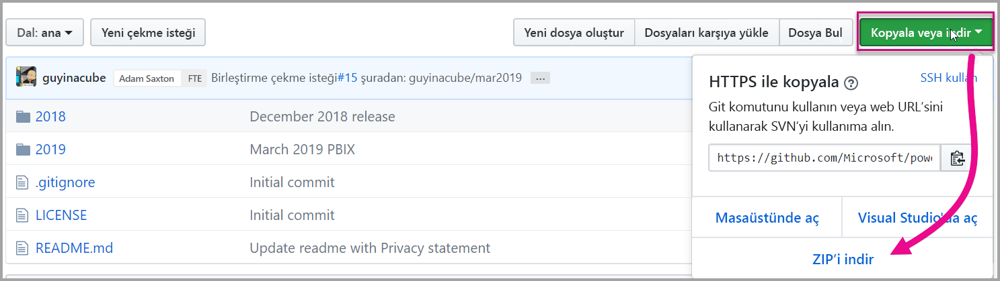

2. Power BI Desktop’ta örnek .pbix raporunu açın.

   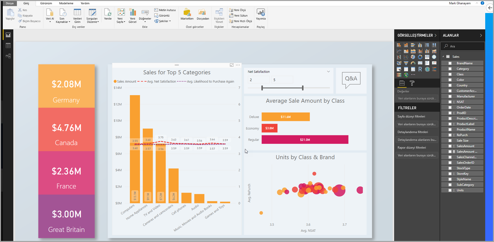

3. Çalışma alanında yayımlayın.

   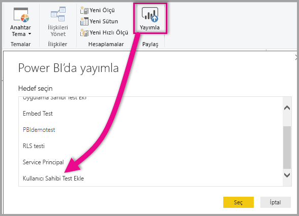

    Artık raporunuzu Power BI hizmetinde çevrimiçi görüntüleyebilirsiniz.

   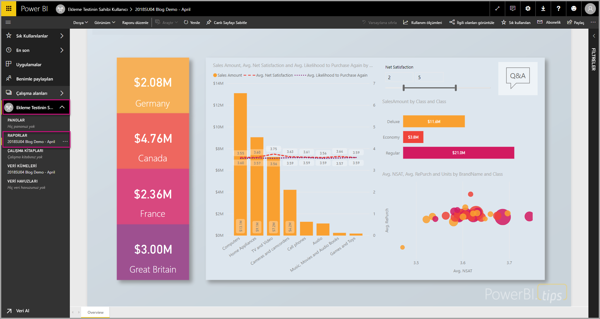
   
### <a name="create-and-publish-your-paginated-reports"></a>Sayfalandırılmış raporlarınızı oluşturma ve yayımlama

[Power BI Rapor Oluşturucusu](../../paginated-reports/paginated-reports-report-builder-power-bi.md#create-reports-in-power-bi-report-builder)’nu kullanarak sayfalandırılmış raporlarınızı oluşturabilirsiniz. Daha sonra en az P1 kapasitesine atanmış bir çalışma alanına [raporu yükleyebilirsiniz](../../paginated-reports/paginated-reports-quickstart-aw.md#upload-the-report-to-the-service). Raporu yükleyen son kullanıcının çalışma alanında yayımlayabilmesi için bir Power BI Pro lisansına sahip olması gerekir.
   
## <a name="embed-your-content-by-using-the-sample-application"></a>Örnek uygulamayı kullanarak içeriğinizi ekleme

Bu örnek tanıtım amacıyla bilerek basit tutulmuştur.

Örnek uygulamayı kullanarak içeriğinizi eklemeye başlamak için aşağıdaki adımları izleyin.

1. [Visual Studio](https://www.visualstudio.com/)'yu (sürüm 2013 veya üzeri) indirin. En son [NuGet paketini](https://www.nuget.org/profiles/powerbi) indirdiğinizden emin olun.

2. Başlamak için GitHub’dan [Verilerin Sahibi Kullanıcıdır örneğini](https://github.com/Microsoft/PowerBI-Developer-Samples) indirin.

    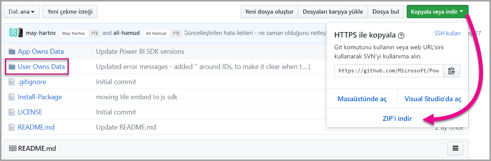

3. Örnek uygulamada **Cloud.config** dosyasını açın.

    Uygulamayı çalıştırmak için doldurmanız gereken alanlar vardır.

    | Alan |
    |--------------------|
    | **[Application ID](#application-id)** |
    | **[Workspace ID](#workspace-id)** |
    | **[Report ID](#report-id)** |
    | **[AADAuthorityUrl](#aadauthorityurl)** |

    

### <a name="application-id"></a>Uygulama Kimliği

**applicationId** bilgilerini **Azure**’daki **Uygulama Kimliği** ile doldurun. Uygulama, izin istediğiniz kullanıcılara kendini tanıtmak için **applicationId** değerini kullanır.

**applicationId** değerini almak için aşağıdaki adımları izleyin:

1. [Azure portalında](https://portal.azure.com) oturum açın.

2. Sol gezinti bölmesinde **Tüm Hizmetler**'i, sonra da **Uygulama Kayıtları**'nı seçin.

3. **applicationId** değerinin gerektiği uygulamayı seçin.

    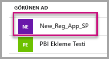

4. GUID olarak listelenen bir **Uygulama Kimliği** vardır. Bu **Uygulama Kimliği**’ni uygulamanın **applicationId** değeri olarak kullanın.

    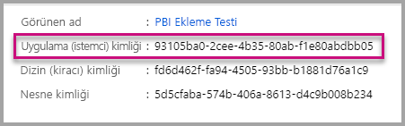

### <a name="workspace-id"></a>Çalışma Alanı Kimliği

**workspaceId** bilgisini Power BI’daki çalışma alanı (grup) GUID’si ile doldurun. Bu bilgiyi Power BI hizmetinin oturumu açıkken URL'den alabileceğiniz gibi PowerShell'i kullanarak da alabilirsiniz.

URL <br>


PowerShell <br>

```powershell
Get-PowerBIworkspace -name "User Owns Embed Test"
```

   

### <a name="report-id"></a>Rapor Kimliği

**reportId** bilgisini Power BI’daki rapor GUID’si ile doldurun. Bu bilgiyi Power BI hizmetinin oturumu açıkken URL'den alabileceğiniz gibi PowerShell'i kullanarak da alabilirsiniz.

Power BI Raporu URL'si <br>


Sayfalandırılmış Rapor URL'si<br>


PowerShell <br>

```powershell
Get-PowerBIworkspace -name "User Owns Embed Test" | Get-PowerBIReport
```


### <a name="aadauthorityurl"></a>AADAuthorityUrl

**AADAuthorityUrl** alanını kurumsal kiracınızla eklemenize veya konuk kullanıcıyla eklemenize olanak tanıyan URL'yle doldurun.

Kurumsal kiracınızla eklemek için şu URL'yi kullanın: *https://login.microsoftonline.com/common/oauth2/authorize* .

Konukla eklemek için şu URL'yi kullanın - `https://login.microsoftonline.com/report-owner-tenant-id` - Burada *report-owner-tenant-id* yerine rapor sahibinin kiracı kimliğini ekleyin.

### <a name="run-the-application"></a>Uygulamayı çalıştırma

1. **Visual Studio**’da **Çalıştır**’ı seçin.

    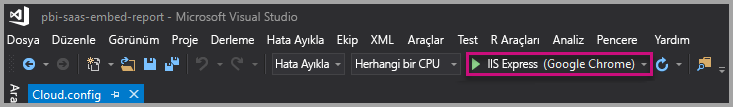

2. Ardından **Rapor Ekle**’yi seçin. Test etmeyi seçtiğiniz içeriğe (raporlar, panolar veya kutucuklar) bağlı olarak uygulamada bu seçeneği belirleyin.

    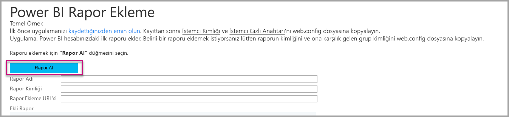

3. Artık raporu örnek uygulamada görüntüleyebilirsiniz.

    

## <a name="embed-your-content-within-your-application"></a>İçeriğinizi uygulamanın içine ekleme

İçeriğinizi ekleme adımları [Power BI REST API’leri](https://docs.microsoft.com/rest/api/power-bi/) ile yapılabilse de, bu makalede açıklanan örnek kodlar .NET SDK ile hazırlanır.

Bir raporu web uygulamasıyla tümleştirmek için Power BI REST API’sini veya Power BI C# SDK’sını kullanırsınız. Rapor almak için Azure Active Directory yetkilendirme erişim belirteci de kullanırsınız. Daha sonra aynı erişim belirtecini kullanarak raporu yüklersiniz. Power BI Rest API’si, belirli Power BI kaynaklarına programlı erişim sağlar. Daha fazla bilgi için bkz. [Power BI REST API’leri](https://docs.microsoft.com/rest/api/power-bi/) ve [Power BI JavaScript API’si](https://github.com/Microsoft/PowerBI-JavaScript).

### <a name="get-an-access-token-from-azure-ad"></a>Azure AD'den erişim belirteci alma

Uygulamanızın içinden Power BI REST API’si çağrısı yapabilmek için önce Azure AD’den bir erişim belirteci almanız gerekir. Daha fazla bilgi için bkz. [Power BI uygulamanız için kullanıcıların kimliğini doğrulama ve Azure AD erişim belirteci alma](get-azuread-access-token.md).

### <a name="get-a-report"></a>Rapor alma

Power BI raporu veya sayfalandırılmış rapor almak için, Power BI ve sayfalandırılmış raporlar listesini alan [Get Reports](https://docs.microsoft.com/rest/api/power-bi/reports/getreports) işlemini kullanırsınız. Rapor listesinden bir rapor kimliği alabilirsiniz.

### <a name="get-reports-by-using-an-access-token"></a>Erişim belirteci kullanarak rapor alma

[Get Reports](https://docs.microsoft.com/rest/api/power-bi/reports/getreports) işlemi rapor listesini döndürür. Rapor listesindeki raporlardan birini alabilirsiniz.

REST API çağrısını yapmak için *Taşıyıcı {erişim belirteci}* biçiminde *Yetkilendirme* üst bilgisi dahil etmeniz gerekir.

#### <a name="get-reports-with-the-rest-api"></a>REST API'si ile rapor alma

Aşağıdaki kod örneği, REST API ile nasıl rapor alınacağını gösterir:

> [!Note]
> Eklemek istediğiniz bir içerik öğesini alma örneği, [örnek uygulama](https://github.com/Microsoft/PowerBI-Developer-Samples) içindeki Default.aspx.cs dosyasında sağlanır. Rapor, pano veya kutucuk örnek olarak verilebilir.

```csharp
using Newtonsoft.Json;

//Get a Report. In this sample, you get the first Report.
protected void GetReport(int index)
{
    //Configure Reports request
    System.Net.WebRequest request = System.Net.WebRequest.Create(
        String.Format("{0}/Reports",
        baseUri)) as System.Net.HttpWebRequest;

    request.Method = "GET";
    request.ContentLength = 0;
    request.Headers.Add("Authorization", String.Format("Bearer {0}", accessToken.Value));

    //Get Reports response from request.GetResponse()
    using (var response = request.GetResponse() as System.Net.HttpWebResponse)
    {
        //Get reader from response stream
        using (var reader = new System.IO.StreamReader(response.GetResponseStream()))
        {
            //Deserialize JSON string
            PBIReports Reports = JsonConvert.DeserializeObject<PBIReports>(reader.ReadToEnd());

            //Sample assumes at least one Report.
            //You could write an app that lists all Reports
            if (Reports.value.Length > 0)
            {
                var report = Reports.value[index];

                txtEmbedUrl.Text = report.embedUrl;
                txtReportId.Text = report.id;
                txtReportName.Text = report.name;
            }
        }
    }
}

//Power BI Reports used to deserialize the Get Reports response.
public class PBIReports
{
    public PBIReport[] value { get; set; }
}
public class PBIReport
{
    public string id { get; set; }
    public string reportType { get; set }
    public string name { get; set; }
    public string webUrl { get; set; }
    public string embedUrl { get; set; }
}
```

#### <a name="get-reports-by-using-the-net-sdk"></a>.NET SDK kullanarak rapor alma

REST API'sini doğrudan çağırmak yerine .NET SDK kullanarak rapor listesi alabilirsiniz. Aşağıdaki kod örneği, raporların nasıl listeleneceğini göstermektedir:

```csharp
using Microsoft.IdentityModel.Clients.ActiveDirectory;
using Microsoft.PowerBI.Api.V2;
using Microsoft.PowerBI.Api.V2.Models;

var tokenCredentials = new TokenCredentials(<ACCESS TOKEN>, "Bearer");

// Create a Power BI Client object. It is used to call Power BI APIs.
using (var client = new PowerBIClient(new Uri(ApiUrl), tokenCredentials))
{
    // Get the first report all reports in that workspace
    ODataResponseListReport reports = client.Reports.GetReports();

    Report report = reports.Value.FirstOrDefault();

    var embedUrl = report.EmbedUrl;
}
```

### <a name="load-a-report-by-using-javascript"></a>JavaScript kullanarak rapor yükleme

JavaScript kullanarak web sayfanızdaki bir div öğesine rapor yükleyebilirsiniz. Aşağıdaki kod örneği, belirli bir çalışma alanından nasıl rapor alınacağını göstermektedir:

> [!NOTE]  
> Eklemek istediğiniz bir içerik öğesini yükleme örneği, [örnek uygulama](https://github.com/Microsoft/PowerBI-Developer-Samples) içindeki **Default.aspx** dosyasında sağlanır.

```javascript
<!-- Embed Report-->
<div> 
    <asp:Panel ID="PanelEmbed" runat="server" Visible="true">
        <div>
            <div><b class="step">Step 3</b>: Embed a report</div>

            <div>Enter an embed url for a report from Step 2 (starts with https://):</div>
            <input type="text" id="tb_EmbedURL" style="width: 1024px;" />
            <br />
            <input type="button" id="bEmbedReportAction" value="Embed Report" />
        </div>

        <div id="reportContainer"></div>
    </asp:Panel>
</div>
```

#### <a name="sitemaster"></a>Site.master

```javascript
window.onload = function () {
    // client side click to embed a selected report.
    var el = document.getElementById("bEmbedReportAction");
    if (el.addEventListener) {
        el.addEventListener("click", updateEmbedReport, false);
    } else {
        el.attachEvent('onclick', updateEmbedReport);
    }

    // handle server side post backs, optimize for reload scenarios
    // show embedded report if all fields were filled in.
    var accessTokenElement = document.getElementById('MainContent_accessTokenTextbox');
    if (accessTokenElement !== null) {
        var accessToken = accessTokenElement.value;
        if (accessToken !== "")
            updateEmbedReport();
    }
};

// update embed report
function updateEmbedReport() {

    // check if the embed url was selected
    var embedUrl = document.getElementById('tb_EmbedURL').value;
    if (embedUrl === "")
        return;

    // get the access token.
    accessToken = document.getElementById('MainContent_accessTokenTextbox').value;

    // Embed configuration used to describe the what and how to embed.
    // This object is used when calling powerbi.embed.
    // You can find more information at https://github.com/Microsoft/PowerBI-JavaScript/wiki/Embed-Configuration-Details.
    var config = {
        type: 'report',
        accessToken: accessToken,
        embedUrl: embedUrl
    };

    // Grab the reference to the div HTML element that will host the report.
    var reportContainer = document.getElementById('reportContainer');

    // Embed the report and display it within the div container.
    var report = powerbi.embed(reportContainer, config);

    // report.on will add an event handler which prints to Log window.
    report.on("error", function (event) {
        var logView = document.getElementById('logView');
        logView.innerHTML = logView.innerHTML + "Error<br/>";
        logView.innerHTML = logView.innerHTML + JSON.stringify(event.detail, null, "  ") + "<br/>";
        logView.innerHTML = logView.innerHTML + "---------<br/>";
    }
  );
}
```

## <a name="using-a-power-bi-premium-dedicated-capacity"></a>Power BI Premium adanmış kapasitesini kullanma

Uygulamanızın geliştirme aşamasını tamamladığınıza göre şimdi adanmış kapasite ile çalışma alanınızı destekleme işlemine geçmelisiniz.

### <a name="create-a-dedicated-capacity"></a>Adanmış kapasite oluşturma

Adanmış kapasite oluşturduğunuzda, çalışma alanınızdaki içerik için özel olarak ayrılmış bir kaynaktan yararlanabilirsiniz. Sayfalandırılmış raporlar için çalışma alanınızı en az P1 kapasitesiyle desteklemeniz gerekir. [Power BI Premium](../../service-premium-what-is.md)’u kullanarak adanmış kapasite oluşturabilirsiniz.

Aşağıdaki tabloda, [Microsoft Office 365](../../service-admin-premium-purchase.md)'te kullanılabilir olan Power BI Premium SKU’ları listelenmektedir:

| Kapasite düğümü | Toplam sanal çekirdek<br/>(arka uç + ön uç) | Arka uç sanal çekirdekleri | Ön uç sanal çekirdekleri | DirectQuery/canlı bağlantı sınırları |
| --- | --- | --- | --- | --- | --- |
| EM1 |1 sanal çekirdek |0,5 sanal çekirdek, 10 GB RAM |0,5 sanal çekirdek |Saniyede 3,75 |
| EM2 |2 sanal çekirdek |1 sanal çekirdek, 10 GB RAM |1 sanal çekirdek |Saniyede 7,5 |
| EM3 |4 sanal çekirdek |2 sanal çekirdek, 10 GB RAM |2 sanal çekirdek |saniyede 15 |
| P1 |8 sanal çekirdek |4 sanal çekirdek, 25 GB RAM |4 sanal çekirdek |saniyede 30 |
| P2 |16 sanal çekirdek |8 sanal çekirdek, 50 GB RAM |8 sanal çekirdek |saniyede 60 |
| P3 |32 sanal çekirdek |16 sanal çekirdek, 100 GB RAM |16 sanal çekirdek |saniyede 120 |
| P4 |64 sanal çekirdek |32 sanal çekirdek, 200 GB RAM |32 sanal çekirdek |saniyede 240 |
| P5 |128 sanal çekirdek |64 sanal çekirdek, 400 GB RAM |64 sanal çekirdek |saniyede 480 |

> [!NOTE]
> - Microsoft Office uygulamaları ile ekleme işlemi yapmaya çalışırken, ücretsiz bir Power BI lisansıyla içeriğe erişmek için EM SKU’larını kullanabilirsiniz. Ancak Powerbi.com veya Power BI mobil kullanırken ücretsiz bir Power BI lisansı ile içeriğe erişemezsiniz.
> - Powerbi.com veya Power BI mobil kullanarak Microsoft Office uygulamaları ile ekleme işlemi yapmaya çalışırken, ücretsiz Power BI lisansı ile içeriğe erişebilirsiniz.

### <a name="assign-a-workspace-to-a-dedicated-capacity"></a>Adanmış kapasiteye çalışma alanı atama

Adanmış kapasite oluşturduktan sonra, çalışma alanınızı bu adanmış kapasiteye atayabilirsiniz. Bu işlemi tamamlamak için şu adımları uygulayın:

1. Power BI hizmetinde, çalışma alanlarını genişletin ve içeriğinizi eklemek için kullandığınız çalışma alanının üç noktasını seçin. Ardından **Çalışma alanlarını düzenle**’yi seçin.

    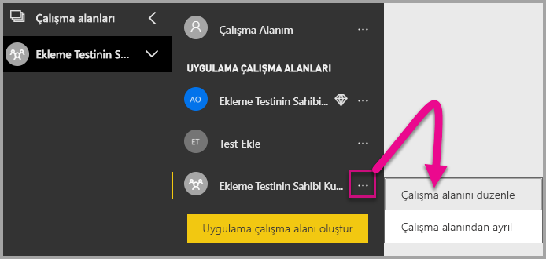

2. **Gelişmiş**’i genişletin ve **Adanmış kapasite**’yi etkinleştirin. Oluşturduğunuz adanmış kapasiteyi seçin. Sonra **Kaydet**'i seçin.

    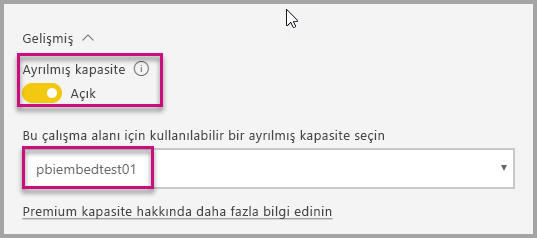

3. **Kaydet**’i seçtikten sonra, çalışma alanının yanında bir baklava işareti görmeniz gerekir.

    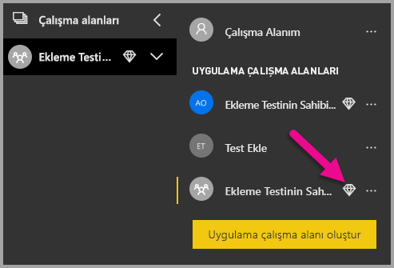

## <a name="admin-settings"></a>Yönetici ayarları

Genel yöneticiler veya Power BI hizmeti yöneticileri, bir kiracı için REST API’lerini kullanma seçeneğini etkinleştirebilir veya devre dışı bırakabilir. Power BI yöneticileri, kuruluşun tamamı veya yalnızca belirli güvenlik grupları için bu ayarı yapabilir. Varsayılan olarak kuruluşun tamamı için etkindir. [Power BI yönetici portalında](../../service-admin-portal.md) bu değişiklikleri yapabilirsiniz.

## <a name="next-steps"></a>Sonraki adımlar

Bu öğreticide, Power BI kuruluş hesabınızı kullanarak bir uygulamaya Power BI içeriği eklemeyi öğrendiniz. Şimdi uygulamaları kullanarak bir uygulamaya Power BI içeriği eklemeyi deneyebilirsiniz. Ayrıca müşterileriniz için Power BI içeriği eklemeyi de deneyebilirsiniz (henüz eklenmiş sayfalandırılmış raporlar için desteklenmemektedir):

> [!div class="nextstepaction"]
> [Uygulamalardan ekleme](embed-from-apps.md)

> [!div class="nextstepaction"]
>[Müşterileriniz için ekleme](embed-sample-for-customers.md)

Başka sorularınız varsa [Power BI Topluluğu’na sormayı deneyin](https://community.powerbi.com/).
