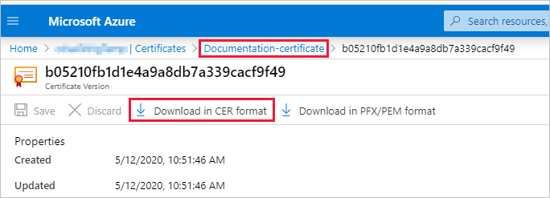
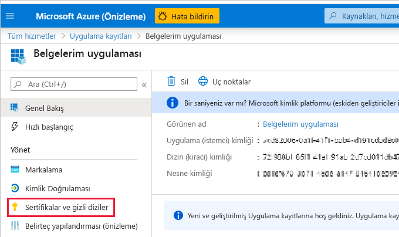

# <a name="embed-power-bi-content-with-service-principal-and-a-certificate"></a>Hizmet sorumlusu ve sertifikayla Power BI içeriği ekleme

[!INCLUDE[service principal overview](../../includes/service-principal-overview.md)]

>[!NOTE]
>Arka uç hizmetlerinizin güvenliğini, gizli diziler yerine sertifikaları kullanarak sağlamanızı öneririz. [Gizli dizileri veya sertifikaları kullanarak Azure AD’den erişim belirteçlerini alma hakkında daha fazla bilgi edinin](/azure/architecture/multitenant-identity/client-assertion).

## <a name="certificate-based-authentication"></a>Sertifika tabanlı kimlik doğrulaması

Sertifika tabanlı kimlik doğrulaması, Azure Active Directory (Azure AD) kullanılarak Windows, Android veya iOS cihazda bulunan ya da bir [Azure Key Vault](/azure/key-vault/basic-concepts)’ta tutulan bir istemci sertifikasıyla kimliğinizin doğrulanmasına olanak tanır.

Bu kimlik doğrulaması yönteminin kullanılması, döndürme veya iptal için CA kullanılarak merkezi bir yerden sertifikaların yönetilmesine olanak verir.

Azure AD’de [İstemci kimlik bilgisi akışları](https://github.com/AzureAD/microsoft-authentication-library-for-dotnet/wiki/Client-credential-flows) adlı GitHub sayfasında sertifikalar hakkında daha fazla bilgi edinebilirsiniz.

## <a name="method"></a>Yöntem

Ekli analizlerle hizmet sorumlusunu ve sertifika kullanmak için şu adımları izleyin:

1. Azure AD uygulaması oluşturun.

2. Bir Azure AD güvenlik grubu oluşturun.

3. Power BI hizmeti yönetici ayarlarını etkinleştirin.

4. Hizmet sorumlusunu çalışma alanınıza ekleyin.

5. Sertifika oluşturun.

6. Sertifikası kimlik doğrulaması ayarlayın.

7. Azure Key Vault’tan bir sertifikayı alın.

8. Hizmet sorumlusu ve sertifika kullanarak kimlik doğrulaması yapın.

## <a name="step-1---create-an-azure-ad-application"></a>1\. Adım: Azure AD uygulaması oluşturma

[!INCLUDE[service principal create app](../../includes/service-principal-create-app.md)]

### <a name="creating-an-azure-ad-app-using-powershell"></a>PowerShell kullanarak Azure AD uygulaması oluşturma

Bu bölüm, [PowerShell](/powershell/azure/create-azure-service-principal-azureps) kullanarak yeni bir Azure AD uygulaması oluşturmaya yönelik örnek betik içerir.

```powershell
# The app ID - $app.appid
# The service principal object ID - $sp.objectId
# The app key - $key.value

# Sign in as a user that's allowed to create an app
Connect-AzureAD

# Create a new Azure AD web application
$app = New-AzureADApplication -DisplayName "testApp1" -Homepage "https://localhost:44322" -ReplyUrls "https://localhost:44322"

# Creates a service principal
$sp = New-AzureADServicePrincipal -AppId $app.AppId
```

[!INCLUDE[service create steps two, three and four](../../includes/service-principal-create-steps.md)]

## <a name="step-5---create-a-certificate"></a>5\. Adım: Sertifika oluşturma

Güvenilir bir *Sertifika Yetkilisi*’nden bir sertifika temin edebilir veya kendiniz bir sertifika oluşturabilirsiniz.

Bu bölümde, [Azure Key Vault](/azure/key-vault/create-certificate) kullanılarak bir sertifika oluşturma ve genel anahtar içeren *.cer* dosyasını indirme işlemleri açıklanmaktadır.

1. [Microsoft Azure](https://ms.portal.azure.com/#allservices)’da oturum açın.

2. **Anahtar Kasaları**’nı arayın ve **Anahtar Kasaları** bağlantısına tıklayın.

    

3. Sertifika eklemek istediğiniz anahtar kasasına tıklayın.

    

4. **Sertifikalar**’a tıklayın.

    

5. **Oluştur/İçeri Aktar**’a tıklayın.

    

6. **Sertifika oluştur** alanlarını aşağıdaki şekilde yapılandırın:

    * **Sertifika Oluşturma Yöntemi** - Genel

    * **Sertifika Adı** - Sertifikanız için bir ad girin

    * **Sertifika Yetkilisi (CA) Türü** - Otomatik olarak imzalanan sertifika

    * **Konu** - [X.500](https://wikipedia.org/wiki/X.500) ayırt edici adı

    * **DNS Adları** - 0 DNS adı

    * **Geçerlilik Süresi (ay)** - Sertifikanın geçerlilik süresini girin

    * **İçerik Türü** - PKCS #12

    * **Yaşam Süresi Eylem Türü** - Belirli bir yaşam süresi yüzdesinde otomatik olarak yeniler

    * **Yaşam Süresi Yüzdesi** - 80

    * **Gelişmiş İlke Yapılandırması** - Yapılandırılmamış

7. **Oluştur**'a tıklayın. Yeni oluşturulan sertifika varsayılan olarak devre dışı bırakılır. Etkinleştirilmeleri beş dakikaya kadar sürebilir.

8. Oluşturduğunuz sertifikayı seçin.

9. **CER biçiminde indir**’e tıklayın. İndirilen dosyada ortak anahtar yer alır.

    

## <a name="step-6---set-up-certificate-authentication"></a>6\. Adım: Sertifika kimlik doğrulaması ayarlama

1. Azure AD uygulamanızda **Sertifikalar ve gizli diziler** sekmesine tıklayın.

     

2. **Sertifikayı karşıya yükle**’ye tıklayın ve bu öğreticinin [ilk adımında](#step-5---create-a-certificate) oluşturup indirdiğiniz *.cer* dosyasını karşıya yükleyin. *.cer* dosyası ortak anahtarı içerir.

## <a name="step-7---get-the-certificate-from-azure-key-vault"></a>7\. Adım: Azure Key Vault’tan bir sertifikayı alma

Azure Key Vault’tan sertifikayı almak için Yönetilen Hizmet Kimliği’ni (MSI) kullanın. Bu işlem, hem ortak hem de özel anahtarları içeren *.pfx* sertifikasını almayı içerir.

Azure Key Vault’tan sertifikayı okumak için kod örneğine başvurun. Visual Studio kullanmak istiyorsanız [Visual Studio’yu MSI kullanacak şekilde yapılandırma](#configure-visual-studio-to-use-msi) sayfasına başvurun.

```csharp
private X509Certificate2 ReadCertificateFromVault(string certName)
{
    var serviceTokenProvider = new AzureServiceTokenProvider();
    var keyVaultClient = new KeyVaultClient(new KeyVaultClient.AuthenticationCallback(serviceTokenProvider.KeyVaultTokenCallback));
    CertificateBundle certificate = null;
    SecretBundle secret = null;
    try
    {
        certificate = keyVaultClient.GetCertificateAsync($"https://{KeyVaultName}.vault.azure.net/", certName).Result;
        secret = keyVaultClient.GetSecretAsync(certificate.SecretIdentifier.Identifier).Result;
    }
    catch (Exception)
    {
        return null;
    }

    return new X509Certificate2(Convert.FromBase64String(secret.Value));
}
```

## <a name="step-8---authenticate-using-service-principal-and-a-certificate"></a>8\. Adım: Hizmet sorumlusu ve sertifika kullanarak kimlik doğrulaması yapma

Azure Key Vault’a bağlanıp burada depolanan hizmet sorumlusunu ve sertifikayı kullanarak uygulamanızın kimliğini doğrulayabilirsiniz.

Azure Key Vault’a bağlanıp sertifikayı okumak için aşağıdaki koda bakın.

>[!NOTE]
>Kuruluşunuz tarafından oluşturulan bir sertifikaya zaten sahipseniz *.pfx* dosyasını Azure Key Vault’a yükleyin.

```csharp
// Preparing needed variables
var Scope = "https://analysis.windows.net/powerbi/api/.default"
var ApplicationId = "{YourApplicationId}"
var tenantSpecificURL = "https://login.microsoftonline.com/{YourTenantId}/"
X509Certificate2 certificate = ReadCertificateFromVault(CertificateName);

// Authenticating with a SP and a certificate
public async Task<AuthenticationResult> DoAuthentication(){
    IConfidentialClientApplication clientApp = null;
    clientApp = ConfidentialClientApplicationBuilder.Create(ApplicationId)
                                                    .WithCertificate(certificate)
                                                    .WithAuthority(tenantSpecificURL)
                                                    .Build();
    try
    {
        authenticationResult = await clientApp.AcquireTokenForClient(Scope).ExecuteAsync();
    }
    catch (MsalException)
    {
        throw;
    }
    return authenticationResult
}
```

## <a name="configure-visual-studio-to-use-msi"></a>Visual Studio’yu MSI kullanacak şekilde yapılandırma

Ekli çözümünüzü oluştururken Visual Studio’yu Yönetilen Hizmet Kimliği’ni (MSI) kullanacak şekilde yapılandırmanız yararlı olabilir. [MSI](/azure/active-directory/managed-identities-azure-resources/overview), Azure AD kimliğinizi yönetmenizi sağlayan bir özelliktir. Yapılandırıldıktan sonra, Visual Studio’nun Azure Key Vault’a göre kimlik doğrulaması yapmasını sağlar.

1. Projenizi Visual Studio’da açın.

2. **Araçlar** > **Seçenekler**’e tıklayın.

     

3. **Hesap Seçimi**’ni arayın ve **Hesap Seçimi**’ne tıklayın.

    

4. Azure Key Vault’unuz erişimi olan hesabı ekleyin.

[!INCLUDE[service principal limitations](../../includes/service-principal-limitations.md)]

## <a name="next-steps"></a>Sonraki adımlar

>[!div class="nextstepaction"]
>[Uygulamayı kaydetme](register-app.md)

>[!div class="nextstepaction"]
>[Müşterileriniz için Power BI Embedded](embed-sample-for-customers.md)

>[!div class="nextstepaction"]
>[Azure Active Directory'deki uygulama ve hizmet sorumlusu nesneleri](/azure/active-directory/develop/app-objects-and-service-principals)

>[!div class="nextstepaction"]
>[Hizmet sorumlusuyla şirket içi veri ağ geçidinde satır düzeyi güvenlik kullanma](embedded-row-level-security.md#on-premises-data-gateway-with-service-principal)

>[!div class="nextstepaction"]
>[Hizmet sorumlusu ve uygulama gizli dizisiyle Power BI içeriği ekleme](embed-service-principal.md)