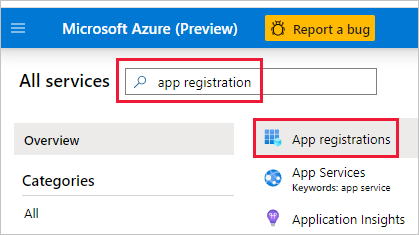
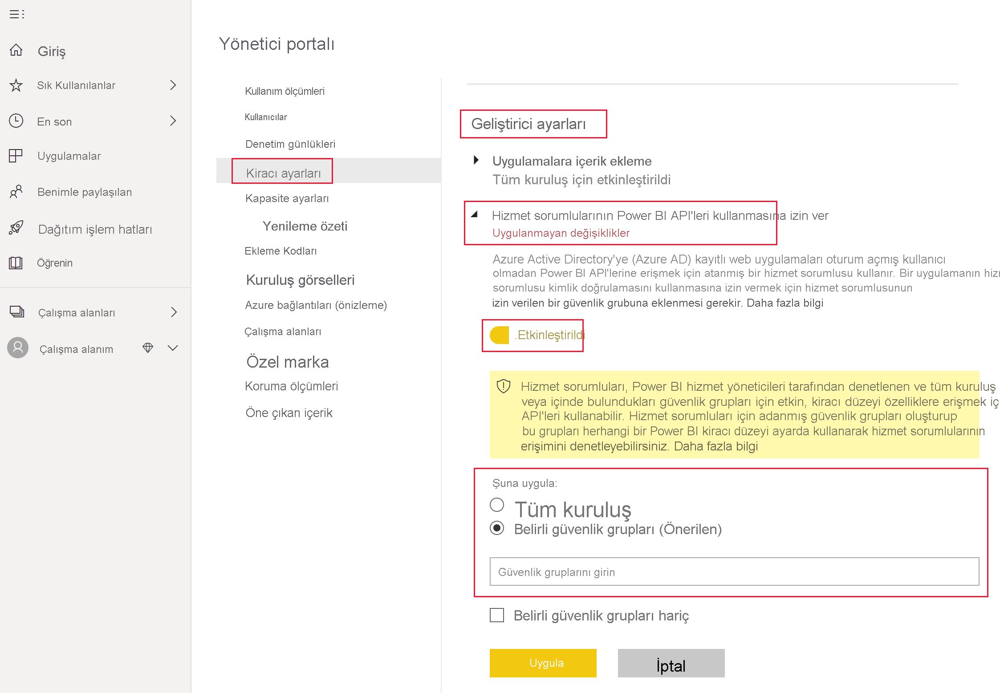

# <a name="embedding-power-bi-content-with-service-principal-and-application-secret"></a>Hizmet sorumlusu ve uygulama gizli dizisiyle Power BI içeriği ekleme

[!INCLUDE[service principal overview](../../includes/service-principal-overview.md)]

Bu makalede, *Uygulama Kimliği* ve *Uygulama gizli dizisi* kullanılarak hizmet sorumlusu kimlik doğrulaması açıklanmaktadır.

## <a name="method"></a>Yöntem

Ekli analizlerle hizmet sorumlusunu ve uygulama kimliğini kullanmak için şu adımları izleyin:

1. [Azure AD uygulaması](https://docs.microsoft.com/azure/active-directory/manage-apps/what-is-application-management) oluşturun.

    1. Azure AD uygulamasının gizli dizisini oluşturun.
    
    2. Uygulamanın *Uygulama Kimliğini* ve *Uygulama gizli dizisini* alın.

    >[!NOTE]
    >Bu adımlar, **1. Adım**’da açıklanmaktadır. Azure AD uygulaması oluşturma hakkında daha fazla bilgi için [Azure AD uygulaması oluşturma](https://docs.microsoft.com/azure/active-directory/develop/howto-create-service-principal-portal) makalesine göz atın.

2. Bir Azure AD güvenlik grubu oluşturun.

3. Power BI hizmeti yönetici ayarlarını etkinleştirin.

4. Hizmet sorumlusunu çalışma alanınıza ekleyin.

5. İçeriğinizi ekleyin.

> [!IMPORTANT]
> Hizmet sorumlusunun Power BI ile kullanımını etkinleştirdikten sonra, uygulamanın AD izinleri artık geçerli olmaz. Bundan sonra uygulamanın izinleri Power BI yönetim portalı üzerinden yönetilir.

## <a name="step-1---create-an-azure-ad-app"></a>1\. Adım: Azure AD uygulaması oluşturma

Bu yöntemlerden birini kullanarak Azure AD uygulaması oluşturun:
* Uygulamayı [Microsoft Azure portalında](https://portal.azure.com/#allservices) oluşturma.
* Uygulamayı [PowerShell](https://docs.microsoft.com/powershell/azure/create-azure-service-principal-azureps?view=azps-3.6.1) kullanarak oluşturma.

### <a name="creating-an-azure-ad-app-in-the-microsoft-azure-portal"></a>Microsoft Azure portalında Azure AD uygulaması oluşturma

1. [Microsoft Azure](https://portal.azure.com/#allservices)’da oturum açın.

2. **Uygulama kayıtlarını** arayın ve **Uygulama kayıtları** bağlantısına tıklayın.

    

3. **Yeni kayıt**’a tıklayın.

    

4. Gereken bilgileri doldurun:
    * **Ad**: Uygulamanız için bir ad girin
    * **Desteklenen hesap türleri** - İhtiyacınız olan Azure AD hesabını seçin
    * (İsteğe bağlı) **Yeniden Yönlendirme URI’si**: Gerekirse bir URI girin

5. **Kaydet**’e tıklayın.

6. Kaydolduktan sonra, *Uygulama Kimliğini* **Genel Bakış** sekmesinde bulabilirsiniz. Daha sonra kullanmak için *Uygulama Kimliğini* kopyalayıp kaydedin.

    

7. **Sertifikalar ve gizli diziler** sekmesine tıklayın.

     

8. **Yeni istemci gizli dizisine** tıklayın.

    

9. *İstemci gizli dizisi ekle* penceresinde açıklama girin, istemci gizli dizisinin süresinin ne zaman dolmasını istediğinizi belirleyin ve **Ekle**’ye tıklayın.

10. *İstemci gizli dizisi* değerini kopyalayıp kaydedin.

    

    >[!NOTE]
    >Siz bu pencereden çıktıktan sonra gizli dizi değeri gizlendiğinden, yeniden görüntüleyip kopyalayamazsınız.

### <a name="creating-an-azure-ad-app-using-powershell"></a>PowerShell kullanarak Azure AD uygulaması oluşturma

Bu bölüm, [PowerShell](https://docs.microsoft.com/powershell/azure/create-azure-service-principal-azureps?view=azps-1.1.0) kullanarak yeni bir Azure AD uygulaması oluşturmaya yönelik örnek betik içerir.

```powershell
# The app ID - $app.appid
# The service principal object ID - $sp.objectId
# The app key - $key.value

# Sign in as a user that's allowed to create an app
Connect-AzureAD

# Create a new Azure AD web application
$app = New-AzureADApplication -DisplayName "testApp1" -Homepage "https://localhost:44322" -ReplyUrls "https://localhost:44322"

# Creates a service principal
$sp = New-AzureADServicePrincipal -AppId $app.AppId

# Get the service principal key
$key = New-AzureADServicePrincipalPasswordCredential -ObjectId $sp.ObjectId
```

## <a name="step-2---create-an-azure-ad-security-group"></a>2\. Adım: Azure AD güvenlik grubu oluşturma

Hizmet sorumlunuz Power BI içeriklerinize ve API’lerinize erişemez. Hizmet sorumlusuna erişim vermek için Azure AD’de bir güvenlik grubu oluşturun ve oluşturduğunuz hizmet sorumlusunu bu güvenlik grubuna ekleyin.

Azure AD güvenlik grubu oluşturmanın iki yolu vardır:
* El ile (Azure’da)
* PowerShell'i kullanma

### <a name="create-a-security-group-manually"></a>El ile güvenlik grubu oluşturma

El ile Azure güvenlik grubu oluşturmak için [Temel grup oluşturma ve Azure Active Directory kullanarak üye ekleme](https://docs.microsoft.com/azure/active-directory/fundamentals/active-directory-groups-create-azure-portal) makalesindeki yönergeleri izleyin. 

### <a name="create-a-security-group-using-powershell"></a>PowerShell kullanarak güvenlik grubu oluşturma

Güvenlik grubu oluşturmak ve bu güvenlik grubuna uygulama eklemek için örnek betik aşağıda verilmiştir.

>[!NOTE]
>Hizmet sorumlusu erişimini kuruluşun tamamı için etkinleştirmek istiyorsanız bu adımı atlayın.

```powershell
# Required to sign in as a tenant admin
Connect-AzureAD

# Create an Azure AD security group
$group = New-AzureADGroup -DisplayName <Group display name> -SecurityEnabled $true -MailEnabled $false -MailNickName notSet

# Add the service principal to the group
Add-AzureADGroupMember -ObjectId $($group.ObjectId) -RefObjectId $($sp.ObjectId)
```

## <a name="step-3---enable-the-power-bi-service-admin-settings"></a>3\. Adım: Power BI hizmeti yönetici ayarlarını etkinleştirme

Bir Azure AD uygulamasının Power BI içeriğine ve API’lerine erişebilmesi için, bir Power BI yöneticisinin Power BI yönetici portalında hizmet sorumlusu erişimini etkinleştirmesi gerekir.

Azure AD’de oluşturduğunuz güvenlik grubunu **Geliştirici ayarlarının** belirli bir güvenlik grubu bölümüne ekleyin.

>[!IMPORTANT]
>Hizmet sorumluları, etkinleştirilmiş oldukları tüm kiracı ayarlarına erişebilir. Yönetici ayarlarınıza bağlı olarak bu, belirli güvenlik gruplarını veya kuruluşun tamamını içerir.
>
>Hizmet sorumlusu erişimini belirli kiracı ayarlarıyla sınırlamak için yalnızca belirli güvenlik gruplarına erişim izni verin. Dilerseniz hizmet sorumluları için ayrılmış bir güvenlik grubu oluşturabilir ev bu grubu istediğiniz kiracı ayarlarından dışlayabilirsiniz.



## <a name="step-4---add-the-service-principal-as-an-admin-to-your-workspace"></a>4\. Adım: Hizmet sorumlusunu çalışma alanınıza yönetici olarak ekleme

Power BI hizmetindeki raporlar, panolar ve veri kümeleri gibi Azure AD uygulama erişim yapıtlarınızı etkinleştirmek için, hizmet sorumlusu varlığını çalışma alanınıza üye veya yönetici olarak ekleyin.

>[!NOTE]
>Bu bölümde, kullanıcı arabirimi yönergeleri sağlanır. Ayrıca, [Gruplar - grup kullanıcı API’si eklemeyi](https://docs.microsoft.com/rest/api/power-bi/groups/addgroupuser) kullanarak çalışma alanına bir hizmet sorumlusu ekleyebilirsiniz.

1. Erişimini etkinleştirmek istediğiniz çalışma alanına gidin ve **Daha fazla** menüsünden **Çalışma alanı erişimini** seçin.

    

2. Hizmet sorumlusunu çalışma alanına **Yönetici** veya **Üye** olarak ekleyin.

    

## <a name="step-5---embed-your-content"></a>5\. Adım: İçeriğinizi ekleme

İçeriğinizi örnek bir uygulamanın veya kendi uygulamanızın içine ekleyebilirsiniz.

* [Örnek uygulamayı kullanarak içeriği ekleme](embed-sample-for-customers.md#embed-content-using-the-sample-application)
* [İçeriği uygulamanızın içine ekleme](embed-sample-for-customers.md#embed-content-within-your-application)

İçeriğinizi ekledikten sonra [üretime taşımaya](embed-sample-for-customers.md#move-to-production) hazırsınızdır.

## <a name="considerations-and-limitations"></a>Önemli noktalar ve sınırlamalar

* Hizmet sorumlusu yalnızca [yeni çalışma alanlarıyla](../../service-create-the-new-workspaces.md) çalışır.
* Hizmet sorumlusu kullanırken **Çalışma Alanım** desteklenmez.
* Üretime geçilirken adanmış kapasite gerekir.
* Hizmet sorumlusunu kullanarak Power BI portalında oturum açamazsınız.
* Power BI yönetim portalındaki geliştirici ayarlarında hizmet sorumlusunu etkinleştirmek için Power BI yönetici hakları gereklidir.
* Hizmet sorumlusunu kullanarak şirket içi veri ağ geçidini yükleyemez veya yönetemezsiniz.
* [Kuruluşunuz için eklenen](embed-sample-for-your-organization.md) uygulamalar hizmet sorumlusunu kullanamaz.
* [Veri akışları](../../service-dataflows-overview.md) yönetimi desteklenmez.
* Hizmet sorumlusu şu anda yönetici API'lerini desteklemiyor.
* [Azure Analysis Services](https://docs.microsoft.com/azure/analysis-services/analysis-services-overview) veri kaynağıyla hizmet sorumlusu kullanırken, hizmet sorumlusunun kendisinin Azure Analysis Services örneği izinleri olmalıdır. Bu amaçla hizmet sorumlusu içeren bir güvenlik grubu kullanmak işe yaramaz.

## <a name="next-steps"></a>Sonraki adımlar

* [Müşterileriniz için Power BI Embedded](embed-sample-for-customers.md)

* [Hizmet sorumlusuyla şirket içi veri ağ geçidinde satır düzeyi güvenlik kullanma](embedded-row-level-security.md#on-premises-data-gateway-with-service-principal)