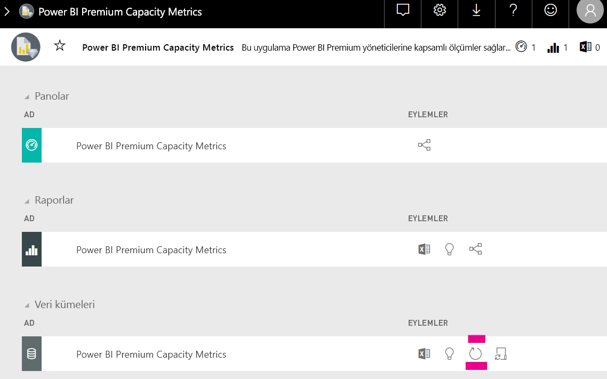

# Power BI tümleşik analizinde kapasite planlaması

Power BI tümleşik analizinde gereken kapasite türünün hesaplanması karmaşık olabilir. Çünkü bu hesaplamada birden çok parametre temel alınır ve bunlardan bazılarını tahmin etmek zordur.

Kapasitenizi planlarken dikkate alınacak noktalardan bazıları şunlardır:

* Kullandığınız veri modelleri
* Gereken sorguların sayısı ve karmaşıklığı
* Uygulamanızın kullanımının saatlik dağılımı
* Veri yenileme hızları
* Tahmin edilmesi zor olan ek kullanım desenleri.

Bu makale Power BI tümleşik analizi kapasitelerinde ([A](https://github.com/microsoft/PowerBI-Tools-For-Capacities/tree/master/LoadTestingPowerShellTool/), *EM* veya *P* SKU’ları) otomatik yük testi yapmak için oluşturulan *Power BI Ayrılmış Kapasite Yük Değerlendirmesi Aracı*’nı kullanarak Power BI tümleşik analizi kapasite planlamasını kolaylaştırmak için tasarlanmıştır.

## Planlama aracı

 [Power BI Ayrılmış Kapasite Yük Değerlendirmesi Aracı](https://github.com/microsoft/PowerBI-Tools-For-Capacities/tree/master/LoadTestingPowerShellTool/), kapasitenizin ne kadar kullanıcı yükünü kaldırabileceğini anlamanıza yardımcı olabilir. Bu araç PowerShell kullanarak kapasiteleriniz için otomatik yük testleri oluşturur, ayrıca hangi raporların test edileceğini ve kaç eş zamanlı kullanıcının benzetiminin yapılacağını seçmenizi sağlar.

Araç her raporu yeni filtre değerleriyle (rapor önbelleğinden dolayı gerçekçi olmayan iyi performans sonuçları almayı önlemek için) sürekli işleyerek kapasitede yük oluşturur ve hizmette aracın kimliğini doğrulamak için gereken belirtecin süresi dolana kadar buna devam eder.

### Planlama aracını kullanma

Aracı çalıştırırken kapasitelerinizdeki mevcut yükü göz önünde bulundurun ve yük testlerini yoğun kullanım zamanlarında çalıştırmamaya dikkat edin.

Burada planlama aracını nasıl kullanabileceğinizi gösteren bazı örnekler verilmiştir.

* Kapasite yöneticileri belirli bir zaman çerçevesinde kapasitelerinin kaç kullanıcıyı kaldırabileceğini daha iyi anlayabilir.
* Rapor yazarları Power BI Desktop’ın [Performans Çözümleyicisi](https://docs.microsoft.com/power-bi/desktop-performance-analyzer) ile ölçülen kullanıcı yükünün etkisini anlayabilir.
* İşlemelerin tarayıcınızda gerçek zamanlı olarak yapıldığını görebilirsiniz.
* SQL Server Profiler’ı kullanarak, ölçülen kapasitelerin [XMLA uç noktalarına bağlanabilir](https://powerbi.microsoft.com/blog/power-bi-open-platform-connectivity-with-xmla-endpoints-public-preview/) ve yürütülen sorguları görebilirsiniz.
* Yük testinin etkileri premium kapasite ölçümler uygulamasının Veri Kümeleri sayfasında görülebilir. Kapasite yöneticileri bu aracı kullanarak yük oluşturabilir ve bu yükün nasıl göründüğüne bakabilir.

### Test sonuçlarını gözden geçirme

Test çalıştırıldıktan sonra ölçümler uygulamasında yük testinin etkilerini görmek için aşağıdaki yönergeleri izleyin. Testin yük oluşturmaya başlamasıyla bu yükün ölçümlerde görünür duruma gelmesi arasında 15 dakika kadar bir bekleme süresi olmasını bekleyebilirsiniz.

1. **Ölçümler uygulaması** giriş sayfanızın [Veri Kümeleri](../../admin/service-admin-premium-monitor-capacity.md) sekmesini genişletin.
2. **Şimdi yenile**’ye tıklayarak isteğe bağlı bir yenileme başlatın. Yöneticiler bunu yapabilmelidir.

    

## Power BI kapasite araçları GitHub deposu

[Power BI kapasite araçları GitHub deposu](https://github.com/microsoft/PowerBI-Tools-For-Capacities), kapasite planlama aracını ve gelecekte sağlanacak diğer araçlarla yardımcı programları barındırmak için oluşturulmuştur.

Depo açık kaynaktır ve kullanıcıların katkıda bulunması, Power BI Premium ve Embedded kapasitelerle ilgili başka araçlar eklemesi ve mevcut araçları geliştirmesi teşvik edilir.

## Sonraki adımlar

> [!div class="nextstepaction"]
>[Power BI tümleşik analizinde kapasite ve SKU’lar](embedded-capacity.md)

> [!div class="nextstepaction"]
>[Power BI Embedded performansı için en iyi yöntemler](embedded-performance-best-practices.md)