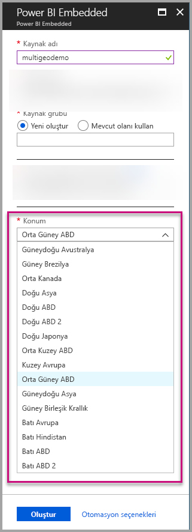
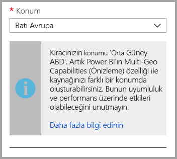

# Power BI Embedded için Multi-Geo desteği

**Power BI Embedded için Multi-Geo desteği**, uygulamalarına analiz özelliklerini ekleme amacıyla Power BI Embedded hizmetini kullanarak uygulama derleyen ISV'lerin ve kuruluşların artık verilerini dünya üzerindeki farklı bölgelere dağıtabileceği anlamına gelir.

Artık **Power BI Embedded** kullanan müşteriler [Power BI Premium'un Multi-Geo kullanımı konusunda](../../service-admin-premium-Multi-Geo.md) desteklediği özelliklerden ve sınırlamalara tabi olarak **Multi-Geo** seçeneklerini kullanan bir **A kapasite** ayarlayabilir.

## Multi-Geo ile yeni Power BI Embedded Kapasitesi kaynağı oluşturma

**Kaynak oluştur** ekranında kapasitenizin konumunu seçmeniz gerekir. Şimdiye kadar yalnızca Power BI kiracınızın bulunduğu konumu seçebiliyordunuz. Multi-Geo ile kapasitenizi dağıtmak için farklı bölgelerden seçim yapabilirsiniz.

Konum açılan menüsüne tıkladığınızda ana kiracınızın varsayılan olarak seçildiğini göreceksiniz.
  

Farklı bir konumu seçtiğinizde sizi bu konuda uyaran bir ileti göreceksiniz.

## Kapasite konumunu görüntüleme

Azure portaldaki ana Power BI Embedded yönetim sayfasına giderek kapasitenizin konumunu kolayca görebilirsiniz.

Bu bilgilere Powerbi.com adresindeki Yönetici Portalı’ndan da ulaşabilirsiniz. Yönetici portalında ‘Kapasite ayarları’nı seçip ‘Power BI Embedded’ sekmesine gidin.

[Power BI Embedded ile kapasite oluşturma hakkında daha fazla bilgi edinin.](azure-pbie-create-capacity.md)

## Var olan kapasitelerin konumunu yönetme

Yeni bir kapasite oluşturduktan sonra Power BI Embedded kaynağının konumunu değiştiremezsiniz.

Power BI içeriğinizi farklı bir bölgeye taşımak için şu adımları izleyin:

1. Farklı bir bölgede [yeni bir kapasite oluşturun](azure-pbie-create-capacity.md).

2. Var olan kapasitedeki tüm çalışma alanlarını yeni kapasiteye atayın.

3. Eski kapasiteyi silin veya duraklatın.

Bir kapasiteyi içeriğini yeniden atamadan silmeye karar vermeniz halinde kapasite içindeki tüm içeriğin ana bölgenizde bulunan paylaşılan kapasiteye taşınacağını unutmayın.

## Multi-Geo için API desteği

Multi-Geo kapasite yönetimi özelliklerini API aracılığıyla sunmak için var olan API'lerde bazı değişiklikler yaptık:

1. **[Kapasiteleri Alma](https://docs.microsoft.com/rest/api/power-bi/capacities/getcapacities)** - API, kullanıcının erişimi olan kapasitelerin bir listesini döndürür. Yanıta kapasitenin konumunu belirten ‘region’ (bölge) özelliği eklenmiştir.

2. **[Kapasiteye Atama](https://docs.microsoft.com/rest/api/power-bi/capacities)** - API, belirli bir çalışma alanının bir kapasiteye atanmasına izin verir. Bu işlem çalışma alanlarını ana bölgenizin dışındaki bir kapasiteye atamanıza veya farklı bölgelerde bulunan kapasiteler arasında çalışma alanı taşıması gerçekleştirmenize izin vermez. Bu işlemi gerçekleştirmek için kullanıcının veya [hizmet sorumlusunun](embed-service-principal.md) yine çalışma alanında yönetici izinlerine ve hedef kapasitede yönetici veya atama izinlerine ihtiyacı vardır.

3. **[Azure Resource Manager API](https://docs.microsoft.com/rest/api/power-bi-embedded/capacities)** - *Create* ve *Delete* dahil olmak üzere tüm Azure Resource Manager API işlemleri Multi-Geo'yu destekler.

## Sınırlamalar ve önemli noktalar

* Veri aktarımını başlatmadan önce bölgeler arasında başlattığınız her taşıma işleminin tüm kurumsal ve resmi uyumluluk gereksinimlerini karşıladığını onaylayın.

* Uzak bölgede depolanan ve önbelleğe alınan bir sorgu, o bölgede bekletilir. Öte yandan, taşınan diğer veriler farklı coğrafi bölgeler arasında ileri ve geri gidebilir.

* Verileri Multi-Geo ortamında bir bölgeden diğerine taşındığında, kaynak veriler bu verilerin taşındığı kaynak bölgede en çok 30 gün kalabilir. Bu süre boyunca kullanıcıların bunlara erişimi olmaz. Veriler 30 gün boyunca bu bölgeden kaldırılır ve yok edilir.

* Multi-Geo genel olarak daha iyi bir performans sonucu vermez. Raporları ve panoları yükleme işlemi yine de meta veriler için ana bölgeye istekler göndermeyi içerir.

## Sonraki adımlar

Aşağıdaki bağlantıları kullanarak Power BI Embedded kapasiteleri ve tüm kapasiteler için Multi-Geo seçenekleri hakkında daha fazla bilgi edinebilirsiniz.

* [Power BI Embedded nedir?](azure-pbie-what-is-power-bi-embedded.md)

* [Power BI Embedded kapasitesi oluşturma](azure-pbie-create-capacity.md)

* [Power BI Premium kapasitelerinde Multi-Geo](../../service-admin-premium-multi-geo.md)

Başka bir sorunuz mu var? [Power BI Topluluğu'na sorun](https://community.powerbi.com/)